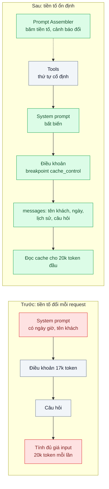
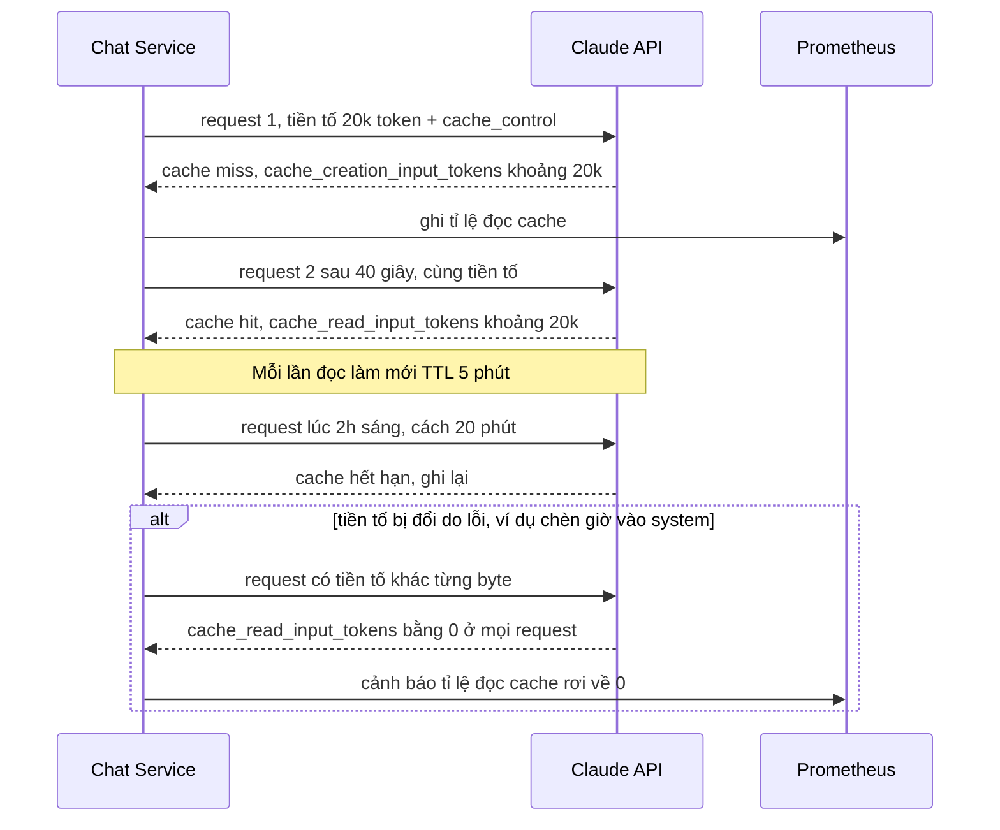

# Prompt Caching — System prompt và tài liệu 20k token trả tiền đầy đủ cho mọi request

| Scope | Mức độ | Trạng thái | Pattern gốc | Cập nhật |
|---|---|---|---|---|
| 22 · backend / AI optimizer | 🟢 Cơ bản | 📋 Kế hoạch | Prompt Caching — Anthropic docs "Prompt caching" (`cache_control`) | 2026-10-06 |

> **Một câu tóm tắt:** Sắp xếp request để phần đầu (tool, system prompt, tài liệu) giống hệt nhau giữa các lần gọi, đánh dấu `cache_control` ở cuối phần đó, để API đọc lại từ cache với giá thấp hơn nhiều thay vì tính đủ giá input cho 20k token mỗi lần.

## 1. Bài toán thực tế (What)

**Bối cảnh** *(doanh nghiệp giả định, số liệu minh họa)*
Công ty bảo hiểm nhân thọ có chatbot tư vấn sản phẩm trên website và app, khoảng 40.000 request/ngày. Mỗi request gửi: 10 định nghĩa tool, system prompt 3.000 token (giọng văn, quy tắc tuân thủ), bộ điều khoản sản phẩm 17.000 token, rồi lịch sử hội thoại và câu hỏi mới. Model là `claude-opus-5-5`.

**Triệu chứng người kinh doanh nhìn thấy**
- Hóa đơn API khoảng 3.200 USD/ngày chỉ riêng phần 20k token lặp lại (20.000 × 40.000 = 800 triệu token × $4/triệu, giá tại thời điểm viết, kiểm tra lại trang Pricing).
- Ban giám đốc muốn mở chatbot cho kênh đại lý (gấp đôi lưu lượng) nhưng ngân sách không cho phép.
- Câu trả lời đầu tiên của mỗi lượt mất 3–4 giây mới bắt đầu hiện, một phần do model phải xử lý lại 20k token.

**Nguyên nhân kỹ thuật**
Messages API không có trạng thái: mỗi request được tính và xử lý lại toàn bộ input. 20k token đầu gần như không đổi giữa các request, nhưng không ai báo cho API biết điều đó. Ngoài ra, code hiện tại chèn ngày giờ hiện tại và tên khách vào đầu system prompt, nên ngay cả khi bật cache, phần đầu cũng khác nhau ở mỗi request.

**Ràng buộc**
- Không đổi nội dung tư vấn và quy tắc tuân thủ; chất lượng câu trả lời phải giữ nguyên.
- Điều khoản sản phẩm cập nhật vài lần mỗi tháng; sau cập nhật, câu trả lời phải dùng bản mới ngay.
- Lưu lượng ban đêm thưa (vài request mỗi 10–20 phút).

## 2. Vì sao dùng pattern này (Why)

**Nguyên nhân gốc mà pattern nhắm vào:** Trả giá đầy đủ cho cùng một tiền tố (prefix) lặp lại ở hàng chục nghìn request.

**Pattern giải quyết thế nào:** Prompt caching là *khớp tiền tố*: API dựng cache cho phần request từ đầu tới điểm đánh dấu `cache_control`, theo thứ tự `tools` → `system` → `messages`. Request sau có tiền tố giống hệt đến từng byte sẽ đọc từ cache: tính theo giá đọc cache (rẻ hơn nhiều so với input thường) và thường nhanh hơn; lần ghi cache đầu có phụ phí so với input thường. Tỉ lệ giá cụ thể xem trang Pricing tại thời điểm làm. Thiết kế:
1. Đưa mọi thứ ổn định lên đầu: tool (thứ tự cố định), system prompt (bỏ ngày giờ, tên khách), điều khoản sản phẩm. Phần thay đổi (tên khách, ngày, câu hỏi) chuyển xuống `messages`.
2. Đặt một breakpoint `cache_control: {type: "ephemeral"}` ở khối cuối của phần điều khoản; bật automatic caching (`cache_control` cấp request) cho phần hội thoại tăng dần.
3. TTL mặc định 5 phút, mỗi lần đọc làm mới thời hạn; ban đêm thưa thì dùng `ttl: "1h"` cho breakpoint tĩnh nếu số đo cho thấy đáng.
4. Kiểm bằng `usage.cache_read_input_tokens` và `usage.cache_creation_input_tokens` ở mọi response.

**Lựa chọn khác đã cân nhắc**

| Lựa chọn | Giải quyết được gì | Vì sao không chọn (ở bài này) |
|---|---|---|
| Giữ nguyên + tối ưu nhỏ (rút gọn system prompt, bỏ tool ít dùng) | Bớt vài nghìn token | Phần lớn là điều khoản bắt buộc; vẫn trả giá đầy đủ cho phần còn lại |
| Chỉ gửi đoạn điều khoản liên quan bằng RAG (scope 10) | Giảm mạnh token input | Thêm hệ truy hồi; dễ thiếu điều khoản loại trừ nằm ở chỗ khác; có thể làm *sau* khi cache |
| Semantic cache câu trả lời (bài 05) | Không gọi model với câu lặp | Chỉ trúng phần nhỏ câu hỏi lặp; không giảm chi phí cho câu hỏi mới |
| Chuyển sang model rẻ hơn (bài 03) | Giảm đơn giá | Đánh đổi chất lượng, cần eval; caching không đổi chất lượng nên làm trước |
| **Prompt caching với tiền tố ổn định (chọn)** | Giảm chi phí phần lặp lại, không đổi đầu ra | Phải kỷ luật thứ tự prompt; phụ phí ghi khi cache nguội |

## 3. Thiết kế hệ thống (How)

### 3.1 Kiến trúc trước và sau



### 3.2 Luồng chính



### 3.3 Thành phần và trách nhiệm

| Thành phần | Trách nhiệm | Quyết định thiết kế đáng chú ý |
|---|---|---|
| Prompt Assembler | Dựng request theo thứ tự cố định: tools → system → điều khoản → messages | Một hàm duy nhất dựng prompt; JSON schema tool được tuần tự hóa với thứ tự khóa cố định |
| Breakpoint tĩnh | `cache_control` trên khối cuối của điều khoản | Tối đa 4 breakpoint mỗi request; tiền tố phải vượt ngưỡng độ dài tối thiểu (tùy model) mới được cache |
| Automatic caching | `cache_control` cấp request cho phần hội thoại tăng dần | Hội thoại nhiều lượt đọc lại lịch sử từ cache |
| Phiên bản điều khoản | Khi điều khoản đổi, tiền tố đổi, cache tự làm mới | Gắn mã phiên bản vào nội dung; không cần xóa cache thủ công |
| Đo lường | Ghi `cache_read_input_tokens`, `cache_creation_input_tokens`, `input_tokens` mỗi response | Prometheus counter theo tính năng; cảnh báo khi tỉ lệ đọc cache tụt |
| Test băm tiền tố | So hash phần tools + system + điều khoản giữa hai khách khác nhau | Bắt lỗi "kẻ phá cache âm thầm" trước khi deploy |

### 3.4 Điểm dễ sai khi triển khai
- Chèn thứ thay đổi vào system prompt (ngày giờ, tên khách, mã request): tiền tố khác từng byte, cache không bao giờ trúng mà không có lỗi nào báo.
- Danh sách tool thay đổi theo vai trò người dùng hoặc thứ tự khóa JSON không cố định: mỗi biến thể là một cache riêng.
- Tiền tố ngắn hơn ngưỡng tối thiểu của model: có `cache_control` nhưng `cache_creation_input_tokens` bằng 0; kiểm trong docs theo model đang dùng.
- Chạy A/B nhiều phiên bản system prompt: mỗi biến thể chia nhỏ lưu lượng, tỉ lệ trúng cache giảm.
- Đổi model giữa hội thoại (routing, fallback): cache gắn với model, phải ghi lại từ đầu.
- Dùng TTL 1 giờ cho mọi thứ: phụ phí ghi cao hơn; chỉ đáng khi khoảng cách giữa các request vượt 5 phút thường xuyên.

## 4. Tech stack và tác động (Impact techstack)

| Lớp | Công nghệ chọn | Vì sao chọn | Thay thế tương đương |
|---|---|---|---|
| Ngôn ngữ / runtime | TypeScript strict, Node 20+ | Kiểu hóa cấu trúc request, hàm dựng prompt thuần | Python |
| HTTP app | NestJS | Service dựng prompt dùng chung cho mọi luồng chat | Fastify |
| Model & SDK | `@anthropic-ai/sdk`, `claude-opus-5-5`, `cache_control` (breakpoint + automatic caching), `ttl` | Tính năng có sẵn trong Messages API, không thêm hạ tầng | — |
| Đo lường | Prometheus (counter token theo loại), Grafana | Thấy ngay tỉ lệ đọc cache theo tính năng | OpenTelemetry metrics, Langfuse |
| Test | Vitest: test băm tiền tố, test thứ tự tool | Phát hiện thay đổi phá cache từ CI | — |

Giá tại thời điểm viết (kiểm tra lại trang Pricing): `claude-opus-5-5` $4/$20 mỗi triệu token vào/ra; giá ghi và đọc cache theo bảng trên trang Pricing.

**Thay đổi so với hệ thống hiện tại:** Gom việc dựng prompt về một chỗ, chuyển dữ liệu thay đổi xuống `messages`, thêm `cache_control`, thêm metric và cảnh báo. Đội phát triển học quy tắc "không chèn gì thay đổi vào tiền tố".

## 5. Kết quả đầu ra và cách đo (Output impact)

| Chỉ số | Trước (minh họa) | Mục tiêu khi thực hành | Cách đo |
|---|---|---|---|
| Tỉ lệ token input đọc từ cache | 0% | ≥ 80% vào giờ hành chính | `cache_read_input_tokens` / (`cache_read_input_tokens` + `cache_creation_input_tokens` + `input_tokens`) |
| Chi phí input / ngày | ~3.200 USD | ghi số thật | Cộng ba loại token nhân đơn giá tương ứng trên trang Pricing |
| Số request có `cache_read_input_tokens` = 0 sau khi ấm | 100% | < 5% (chủ yếu sau khi hết TTL) | Counter Prometheus |
| TTFT p50 cho lượt đầu của hội thoại | 3,5 giây | ghi số thật, kỳ vọng giảm | Script streaming đo thời điểm nhận text delta đầu tiên |
| Chất lượng câu trả lời | điểm eval hiện tại | không đổi | Bộ eval 100 câu chạy trước/sau (scope 20 bài 06) |

> Số "trước" là minh họa để hình dung bài toán. Số "mục tiêu" chỉ được coi là đạt khi có số đo thật
> ở mục 8 kèm môi trường đo.

**Tác động nghiệp vụ mong đợi:** Cùng ngân sách phục vụ được nhiều lưu lượng hơn (mở kênh đại lý) mà không đổi nội dung tư vấn.

## 6. Đánh đổi và khi KHÔNG nên dùng

**Đánh đổi**
- Kỷ luật cấu trúc prompt trở thành ràng buộc kiến trúc; ai đó chèn một dòng vào system prompt có thể xóa toàn bộ lợi ích.
- Lần ghi cache có phụ phí; lưu lượng quá thưa thì tổng chi phí có thể tăng.
- Cache gắn với model và với tiền tố; routing nhiều model làm loãng cache.

**Không nên dùng khi**
- Tiền tố ngắn hơn ngưỡng tối thiểu của model hoặc mỗi request có nội dung gần như duy nhất: không có gì để dùng lại.
- Lưu lượng cực thấp (vài request mỗi giờ) với tiền tố đổi thường xuyên: phụ phí ghi lớn hơn phần đọc lại.

**Liên quan**
- [03 — Model Routing / Cascade](../03-model-routing-cascade-80-phan-tram-cau-don-gian-vao-model-dat/) — cache gắn với model.
- [05 — Semantic Cache](../05-semantic-cache-10-phan-tram-cau-hoi-lap-lai-nguyen-van/) — cache câu trả lời, khác cache tiền tố.
- [06 — Context Pruning](../06-context-pruning-lich-su-hoi-thoai-100-luot-gui-lai-moi-lan/) — cắt ngữ cảnh làm ghi lại cache.
- [Prefix / KV Caching at Serving Layer (scope 21)](../../21-backend-ai-infrastructure/07-inference-cache-kv-prefix-caching-system-prompt-5k-token-moi-request/) — cùng ý tưởng khi tự host.
- [Token & Cost Attribution (scope 24)](../../24-backend-ai-monitoring/02-token-cost-per-feature-tenant-hoa-don-tang-3-lan-khong-biet-vi-sao/) — đo chi phí trước/sau.

## 7. Cơ sở tham khảo

- Anthropic docs, "Prompt caching" — https://platform.claude.com/docs/en/build-with-claude/prompt-caching — cơ chế khớp tiền tố, `cache_control`, automatic caching, TTL 5 phút và `ttl: "1h"`, giới hạn breakpoint, ngưỡng tối thiểu theo model, các trường `usage` để kiểm tra.
- Anthropic docs, "Pricing" — https://platform.claude.com/docs/en/about-claude/pricing — giá input/output và giá ghi/đọc cache theo model; nguồn duy nhất để tính chi phí ở mục 5.
- Anthropic docs, "Optimizing for cost and intelligence" — https://platform.claude.com/docs/en/about-claude/models/optimizing-for-cost-and-intelligence — xếp caching vào nhóm tối ưu nên làm trước khi đánh đổi chất lượng.

## 8. Kế hoạch thực hành

- [ ] Bước 1: Dựng chatbot "cũ" với system prompt có ngày giờ và tên khách, điều khoản 17k token mẫu, script phát 500 request giống phân bố thật (có giai đoạn thưa).
- [ ] Bước 2: Đo "trước": ba loại token, chi phí tính theo Pricing, TTFT p50.
- [ ] Bước 3: Áp dụng pattern: Prompt Assembler, chuyển dữ liệu thay đổi xuống `messages`, breakpoint tĩnh + automatic caching, metric và cảnh báo.
- [ ] Bước 4: Đo "sau" cùng script, thử thêm `ttl: "1h"` cho giai đoạn thưa; ghi vào mục 5 kèm model, ngày.
- [ ] Bước 5: Test Vitest chứng minh: hai khách khác nhau có cùng hash tiền tố; thứ tự tool ổn định; đổi phiên bản điều khoản làm đổi hash.

**Cấu trúc code dự kiến**
```text
src/
  prompt/prompt-assembler.ts     # thứ tự cố định, breakpoint
  prompt/prefix-hash.ts
  chat/chat.service.ts
  metrics/cache-metrics.ts       # ba loại token
bench/
  replay-traffic.ts              # 500 request, có giai đoạn thưa
test/
  prompt-assembler.test.ts
docker-compose.yml               # Prometheus, Grafana
```

**Cách chạy** *(điền khi bắt đầu code)*
```bash
docker compose up -d
pnpm install && pnpm test
pnpm bench:replay
```
