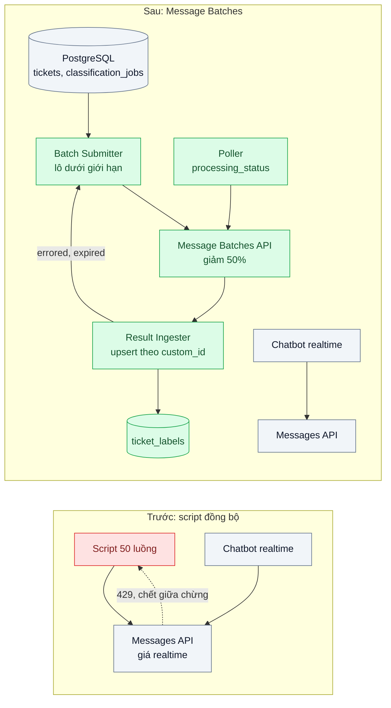
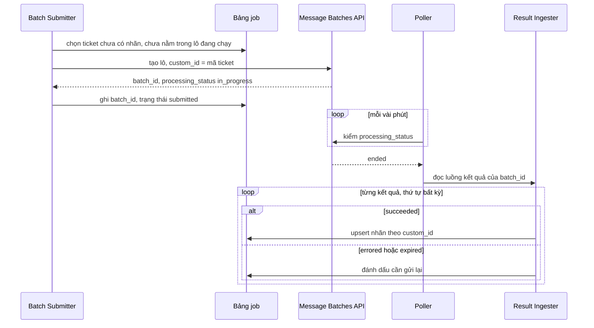

# Batch Processing (Message Batches) — Phân loại 1 triệu ticket cũ, không cần realtime nhưng đang trả giá realtime

| Scope | Mức độ | Trạng thái | Pattern gốc | Cập nhật |
|---|---|---|---|---|
| 22 · backend / AI optimizer | 🟢 Cơ bản | 📋 Kế hoạch | Batch Processing — Anthropic docs "Batch processing" (Message Batches, giảm 50% chi phí, xử lý bất đồng bộ) | 2026-10-06 |

> **Một câu tóm tắt:** Gom các request không cần trả lời ngay thành lô gửi qua Message Batches để trả một nửa giá, không tranh hạn mức với tính năng realtime, và ghi kết quả idempotent theo `custom_id`.

## 1. Bài toán thực tế (What)

**Bối cảnh** *(doanh nghiệp giả định, số liệu minh họa)*
Nền tảng helpdesk SaaS B2B vừa đổi bộ phân loại ticket từ 12 nhóm sang 40 nhãn chi tiết để làm báo cáo nguyên nhân khiếu nại. Đội dữ liệu cần phân loại lại khoảng 1 triệu ticket của 18 tháng qua. Họ viết script gọi `messages.create` song song 50 luồng, dùng chung API key với chatbot hỗ trợ đang chạy thật.

**Triệu chứng người kinh doanh nhìn thấy**
- Script chạy 2 ngày mới được 30%; ước tính còn gần 5 ngày, báo cáo quý trễ hạn.
- Trong giờ cao điểm, chatbot của khách hàng trả lỗi nhiều hơn vì script và chatbot cùng chạm hạn mức (429).
- Script chết giữa chừng hai lần, chạy lại từ đầu; một phần ticket bị phân loại hai lần, tốn tiền gấp đôi cho phần đó.

**Nguyên nhân kỹ thuật**
Dùng API đồng bộ cho một công việc bản chất là xử lý theo lô: trả giá cho độ trễ thấp không cần đến, tự gánh việc điều tiết tốc độ, retry và theo dõi tiến độ, và tranh tài nguyên với luồng realtime. Script không có trạng thái bền nên mỗi lần chết là làm lại.

**Ràng buộc**
- Kết quả cần trong 2 ngày, không cần từng ticket xong ngay.
- Nhãn đầu ra phải thuộc đúng danh sách 40 nhãn để nạp vào kho dữ liệu.
- Chatbot realtime không được bị ảnh hưởng.

## 2. Vì sao dùng pattern này (Why)

**Nguyên nhân gốc mà pattern nhắm vào:** Đường gọi đồng bộ được tối ưu cho độ trễ; công việc này chỉ cần thông lượng và giá thấp.

**Pattern giải quyết thế nào:** Message Batches nhận một lô request (mỗi request có `custom_id` và `params` như một lời gọi Messages bình thường), xử lý bất đồng bộ và tính giá thấp hơn 50% so với gọi thường. Theo docs tại thời điểm viết: mỗi lô tối đa 100.000 request hoặc 256 MB, phần lớn lô xong trong vòng 1 giờ và tối đa 24 giờ, kết quả lưu 29 ngày. Kết quả trả về *không theo thứ tự*, mỗi kết quả mang `custom_id` và loại `succeeded` / `errored` / `canceled` / `expired`. Thiết kế:
1. **Batch Submitter** chia 1 triệu ticket thành các lô dưới giới hạn, `custom_id` = mã ticket, ghi `batch_id` vào bảng job.
2. Mỗi request dùng structured outputs (`output_config.format`) với enum 40 nhãn; system prompt và bảng mô tả nhãn đặt ở đầu kèm `cache_control` (trong lô, trúng cache là best-effort).
3. **Poller** định kỳ kiểm `processing_status` tới khi `ended`, rồi **Result Ingester** đọc luồng kết quả và upsert theo mã ticket.
4. Request `errored` (lỗi tạm thời) và `expired` được gom gửi lại ở lô sau; lỗi do request sai được ghi để sửa.
5. Trước khi chạy cả triệu, chạy thử 1.000 ticket đã gán nhãn tay qua batch với từng model ứng viên để chọn model rẻ nhất đạt ngưỡng chính xác.

**Lựa chọn khác đã cân nhắc**

| Lựa chọn | Giải quyết được gì | Vì sao không chọn (ở bài này) |
|---|---|---|
| Giữ nguyên + tối ưu nhỏ (giảm luồng, chạy ban đêm, thêm retry) | Bớt ảnh hưởng chatbot | Vẫn giá realtime, vẫn chậm, vẫn tự quản lý retry và tiến độ |
| Work queue + worker gọi API đồng bộ (scope 14 bài 01) | Có trạng thái bền, chạy lại được | Vẫn giá realtime và vẫn tranh hạn mức; hợp cho việc cần kết quả trong phút |
| Fine-tune model nhỏ tự host (bài 08) | Rẻ khi chạy lặp lại hằng ngày | Việc này chạy một lần; chi phí xây dựng lớn hơn phần tiết kiệm |
| **Message Batches + bảng job + ingest idempotent (chọn)** | Giảm 50% giá, không tranh hạn mức realtime, chạy lại an toàn | Kết quả không tức thì (tới 24 giờ); không làm vòng lặp tool nhiều lượt trong lô |

## 3. Thiết kế hệ thống (How)

### 3.1 Kiến trúc trước và sau



### 3.2 Luồng chính



### 3.3 Thành phần và trách nhiệm

| Thành phần | Trách nhiệm | Quyết định thiết kế đáng chú ý |
|---|---|---|
| Batch Submitter | Chọn ticket chưa xử lý, dựng request, tạo lô | `custom_id` = mã ticket; không bao giờ đưa ticket đang nằm trong lô chưa kết thúc vào lô mới |
| Request params | System prompt + mô tả 40 nhãn + nội dung ticket | Structured outputs với enum nhãn; không ép tool bằng `tool_choice` vì `claude-opus-5-5`/`claude-sonnet-5-5` trả lỗi 400 với kiểu này (kiểm bảng model hỗ trợ structured outputs trong docs) |
| Bảng `classification_jobs` | Lưu `batch_id`, trạng thái, số lượng từng loại kết quả | Nguồn sự thật cho tiến độ; script chết không mất trạng thái |
| Poller | Kiểm trạng thái lô định kỳ | Cron nhẹ; lô hết 24 giờ thì kết quả chưa xong thành `expired` |
| Result Ingester | Đọc kết quả, upsert `ticket_labels`, ghi `usage` | Khóa theo mã ticket nên đọc lại cùng lô nhiều lần vẫn đúng |
| Bộ chọn model | Chạy 1.000 ticket gán nhãn tay qua batch với từng model | Chọn theo chi phí trên mỗi nhãn đúng, không theo đơn giá |

### 3.4 Điểm dễ sai khi triển khai
- Ghép kết quả theo vị trí trong danh sách: kết quả trả về không theo thứ tự. Luôn ghép theo `custom_id`.
- Dồn 1 triệu request vào một lô: vượt giới hạn số request/dung lượng mỗi lô; chia lô từ đầu.
- Bỏ qua `expired` và `errored`: thiếu nhãn mà không ai biết. Đếm từng loại và gửi lại phần cần thiết.
- Dùng Batches cho tính năng có người chờ: kết quả có thể mất tới 24 giờ.
- Định thiết kế luồng tool use nhiều lượt trong lô: mỗi request trong lô là một lượt; nếu cần dữ liệu thêm, lấy trước và đưa vào prompt.

## 4. Tech stack và tác động (Impact techstack)

| Lớp | Công nghệ chọn | Vì sao chọn | Thay thế tương đương |
|---|---|---|---|
| Ngôn ngữ / runtime | TypeScript strict, Node 20+ | Script và worker cùng code base | Python |
| Model & SDK | `@anthropic-ai/sdk`: `messages.batches.create`, `retrieve`, `results`; structured outputs; ứng viên `claude-opus-5-5`, `claude-sonnet-5-5`, `claude-haiku-4-5` | API lô chính thức; chọn model bằng số đo | — |
| Dữ liệu | PostgreSQL 16 (`tickets`, `classification_jobs`, `ticket_labels`) | Upsert idempotent, truy vấn tiến độ | — |
| Lập lịch | Cron (node-cron hoặc cron hạ tầng) cho Poller | Đủ cho vài chục lô | BullMQ repeatable job |
| Test | Vitest với mock kết quả lô (thứ tự xáo trộn, có `errored`/`expired`) | Chứng minh ingest đúng mà không tốn tiền | — |

Giá tại thời điểm viết (kiểm tra lại trang Pricing): `claude-opus-5-5` $4/$20, `claude-sonnet-5-5` $2/$10, `claude-haiku-4-5` $1/$5 mỗi triệu token vào/ra; Message Batches giảm 50% so với giá này.

**Thay đổi so với hệ thống hiện tại:** Thay script đồng bộ bằng Submitter, Poller, Ingester và bảng job. Đội dữ liệu học đọc trạng thái lô và quy trình gửi lại phần lỗi.

## 5. Kết quả đầu ra và cách đo (Output impact)

| Chỉ số | Trước (minh họa) | Mục tiêu khi thực hành | Cách đo |
|---|---|---|---|
| Chi phí phân loại toàn bộ | giá realtime | ghi số thật, kỳ vọng khoảng một nửa với cùng model | Cộng `usage` trong kết quả lô nhân đơn giá batch; đối chiếu báo cáo usage/cost của Console |
| Thời gian hoàn thành toàn bộ | ~7 ngày | < 2 ngày | Timestamp lô đầu tạo đến lô cuối `ended` |
| Lỗi 429 của chatbot realtime trong thời gian chạy | tăng rõ | không tăng so với nền | Đếm lỗi 429 ở gateway chatbot, so tuần trước |
| Ticket bị phân loại trùng hoặc bị bỏ sót | có | 0 | So số dòng `ticket_labels` với số ticket; test chạy lại Submitter |
| Tỉ lệ `errored` + `expired` | không áp dụng | < 1% sau một vòng gửi lại | Đếm theo loại kết quả trong `classification_jobs` |
| Độ chính xác trên 1.000 ticket gán nhãn tay | không đo | ≥ ngưỡng đội dữ liệu đặt | Script so nhãn dự đoán với nhãn tay, theo từng model ứng viên |

> Số "trước" là minh họa để hình dung bài toán. Số "mục tiêu" chỉ được coi là đạt khi có số đo thật
> ở mục 8 kèm môi trường đo.

**Tác động nghiệp vụ mong đợi:** Báo cáo nguyên nhân khiếu nại kịp hạn với chi phí thấp hơn, chatbot của khách không bị ảnh hưởng.

## 6. Đánh đổi và khi KHÔNG nên dùng

**Đánh đổi**
- Kết quả không tức thì; phải thiết kế quy trình chờ và theo dõi lô.
- Mỗi request là một lượt, không có vòng lặp tool trong lô.
- Thêm thành phần (Submitter, Poller, Ingester) so với một script.

**Không nên dùng khi**
- Người dùng đang chờ kết quả: dùng gọi thường, kèm streaming (bài 07).
- Số lượng nhỏ (vài trăm request) chạy một lần: script đơn giản rẻ công hơn.

**Liên quan**
- [01 — Prompt Caching](../01-prompt-caching-system-prompt-20k-token-tra-tien-moi-request/) — kết hợp với batch cho phần prompt chung.
- [08 — Distillation](../08-distillation-fine-tune-model-nho-phan-loai-50-nhan/) — khi việc phân loại chạy hằng ngày, batch là cách rẻ để tạo nhãn huấn luyện.
- [Work Queue / Competing Consumers (scope 14)](../../14-backend-queueing/01-work-queue-gui-100k-email-lam-treo-api/) — lựa chọn khi cần kết quả trong phút.
- [Resilience for LLM Calls (scope 20)](../../20-backend-ai-framework-system-design/05-fallback-retry-circuit-breaker-cho-llm-api-429-529/) — vì sao tách việc nền khỏi luồng realtime.

## 7. Cơ sở tham khảo

- Anthropic docs, "Batch processing" — https://platform.claude.com/docs/en/build-with-claude/batch-processing — cách tạo lô, giới hạn mỗi lô, thời gian xử lý, `processing_status`, các loại kết quả và thời hạn lưu kết quả; giảm 50% chi phí.
- Anthropic docs, "Pricing" — https://platform.claude.com/docs/en/about-claude/pricing — đơn giá model và mức giảm của batch tại thời điểm làm.
- Anthropic docs, "Structured outputs" — https://platform.claude.com/docs/en/build-with-claude/structured-outputs — `output_config.format` để nhãn luôn đúng schema.

## 8. Kế hoạch thực hành

- [ ] Bước 1: Seed PostgreSQL 20.000 ticket mẫu (thay cho 1 triệu) và 1.000 ticket gán nhãn tay; dựng script đồng bộ "cũ".
- [ ] Bước 2: Đo "trước" trên 20.000 ticket: thời gian, chi phí theo `usage`, lỗi 429, số ticket trùng khi giết script giữa chừng.
- [ ] Bước 3: Áp dụng pattern: Submitter chia lô, structured outputs, Poller, Ingester upsert theo `custom_id`, gửi lại `errored`/`expired`.
- [ ] Bước 4: Đo "sau" cùng tập; chạy bộ chọn model trên 1.000 mẫu; ghi vào mục 5 kèm model, ngày.
- [ ] Bước 5: Test Vitest chứng minh: kết quả xáo trộn thứ tự vẫn ghép đúng; chạy lại Submitter không tạo request trùng; `expired` được gửi lại.

**Cấu trúc code dự kiến**
```text
src/
  batch/batch-submitter.ts
  batch/batch-poller.ts
  batch/result-ingester.ts
  batch/classification-request.ts   # system prompt, enum 40 nhãn
  eval/compare-models.ts            # 1.000 mẫu gán nhãn tay
  legacy/sync-classify-script.ts    # phiên bản "trước"
test/
  result-ingester.test.ts
  batch-submitter.test.ts
docker-compose.yml
```

**Cách chạy** *(điền khi bắt đầu code)*
```bash
docker compose up -d
pnpm install && pnpm test
```
