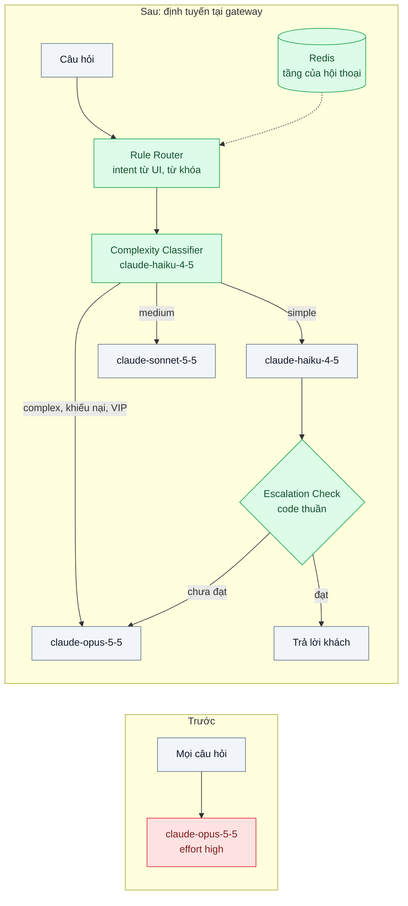
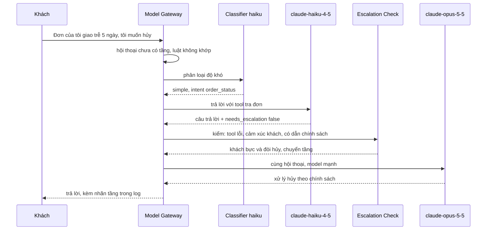

# Model Routing / Cascade — 80% câu hỏi đơn giản nhưng gửi hết vào model đắt nhất

| Scope | Mức độ | Trạng thái | Pattern gốc | Cập nhật |
|---|---|---|---|---|
| 22 · backend / AI optimizer | 🟡 Trung bình | 📋 Kế hoạch | Model Routing / LLM Cascade — Chen, Zaharia, Zou, "FrugalGPT" (2023); Ong et al., "RouteLLM" (2024); Anthropic docs "Optimizing for cost and intelligence" | 2026-10-06 |

> **Một câu tóm tắt:** Đặt một bộ định tuyến trước lời gọi model để câu hỏi đơn giản đi vào model rẻ, câu khó đi vào model mạnh, và một bước kiểm tra đẩy câu trả lời chưa đạt lên tầng trên — chỉ sau khi đã đo rằng hạ effort trên một model không đủ.

## 1. Bài toán thực tế (What)

**Bối cảnh** *(doanh nghiệp giả định, số liệu minh họa)*
Sàn TMĐT có chatbot chăm sóc khách hàng khoảng 600.000 lượt/tháng, toàn bộ chạy `claude-opus-5-5` với effort `high` vì lần ra mắt đầu tiên gặp lỗi ở các ca khiếu nại phức tạp. Phân tích một tuần log cho thấy khoảng 80% lượt là câu đơn giản: phí ship, thời gian giao, cách đổi mật khẩu, tra trạng thái đơn.

**Triệu chứng người kinh doanh nhìn thấy**
- Chi phí AI trên mỗi đơn hàng cao gấp đôi mục tiêu tài chính đặt ra cho năm.
- Câu "phí ship đi Đà Nẵng bao nhiêu?" mất 4–6 giây, ngang câu khiếu nại phức tạp.

**Nguyên nhân kỹ thuật**
Mọi câu hỏi được phục vụ ở mức năng lực và mức "suy nghĩ" cao nhất, bất kể độ khó. Không có tín hiệu nào phân biệt câu dễ và câu khó trước khi gọi model, cũng không có cơ chế nâng cấp khi model rẻ trả lời chưa đạt.

**Ràng buộc**
- Chất lượng ca khiếu nại, hoàn tiền, khách VIP không được giảm.
- Tỉ lệ trả lời đúng tổng thể không thấp hơn hiện tại trên bộ eval.
- p95 độ trễ không tăng; bước định tuyến phải nhanh.

## 2. Vì sao dùng pattern này (Why)

**Nguyên nhân gốc mà pattern nhắm vào:** Năng lực và chi phí được chọn một lần cho mọi request, trong khi độ khó của request phân bố rất lệch.

**Pattern giải quyết thế nào:** FrugalGPT mô tả *LLM cascade*: hỏi model rẻ trước, một hàm chấm điểm quyết định chấp nhận câu trả lời hay chuyển lên model đắt hơn. RouteLLM học một *router* quyết định trước khi gọi, cân bằng chi phí và chất lượng bằng ngưỡng. Bài này kết hợp cả hai, theo thứ tự:
0. **Đo phương án đơn giản trước:** cùng `claude-opus-5-5` nhưng effort `low` cho nhóm câu đơn giản (bài 04). Một model nghĩa là một vùng prompt cache và ít thành phần hơn; chỉ khi số đo cho thấy chưa đủ mới làm tiếp.
1. **Router hai tầng:** tầng luật (intent đã biết từ nút bấm trên UI, từ khóa giao dịch tài chính) rồi tầng phân loại `claude-haiku-4-5` với structured outputs trả `{complexity, intent}`.
2. **Bảng định tuyến:** `simple` → `claude-haiku-4-5`; `medium` → `claude-sonnet-5-5`; `complex`, khiếu nại, hoàn tiền, khách VIP → `claude-opus-5-5`.
3. **Cascade cho tầng rẻ:** câu trả lời của tầng rẻ đi kèm cờ `needs_escalation`; bộ kiểm bằng code (tool lỗi, khách bực, câu trả lời không dẫn chính sách) chuyển lượt đó lên tầng trên.
4. **Bám theo hội thoại:** đã lên tầng trên thì giữ ở đó cho tới hết hội thoại, tránh đổi model qua lại làm mất cache.

**Lựa chọn khác đã cân nhắc**

| Lựa chọn | Giải quyết được gì | Vì sao không chọn (ở bài này) |
|---|---|---|
| Giữ nguyên + tối ưu nhỏ: một model, hạ effort theo route (bài 04) | Giảm chi phí, giữ một vùng cache, ít thành phần | Là bước 0 bắt buộc; chỉ chuyển sang routing khi số đo cho thấy chưa đủ |
| Semantic cache (bài 05) | Bỏ hẳn lời gọi cho câu lặp | Chỉ trúng phần câu lặp gần nguyên văn; không xử lý câu đơn giản nhưng mới |
| Router học từ dữ liệu ưu tiên kiểu RouteLLM | Router tốt hơn luật | Cần dữ liệu so sánh cặp; để giai đoạn sau khi đã có log định tuyến |
| **Router luật + classifier + cascade có kiểm tra (chọn)** | Giảm chi phí cho phần lớn lưu lượng, giữ chất lượng ca khó | Thêm độ trễ phân loại, thêm thành phần phải eval; mất dùng chung cache giữa các model |

## 3. Thiết kế hệ thống (How)

### 3.1 Kiến trúc trước và sau



### 3.2 Luồng chính



### 3.3 Thành phần và trách nhiệm

| Thành phần | Trách nhiệm | Quyết định thiết kế đáng chú ý |
|---|---|---|
| Rule Router | Định tuyến chắc chắn theo intent từ UI và từ khóa nhạy cảm | Luật rẻ và giải thích được; chạy trước classifier |
| Complexity Classifier | `claude-haiku-4-5` + `output_config.format` trả độ khó và intent | Prompt ngắn, có ví dụ; đo độ chính xác trên 500 câu gán nhãn tay |
| Bảng định tuyến | Ánh xạ độ khó/intent → model và effort | Cấu hình, không hard-code; thay đổi qua review |
| Escalation Check | Quyết định chuyển tầng sau khi tầng rẻ trả lời | Code thuần dựa trên tín hiệu quan sát được; không hỏi lại model "bạn có chắc không" |
| Bám theo hội thoại | Lưu tầng hiện tại trong Redis theo mã hội thoại | Chỉ đi lên, không đi xuống trong cùng hội thoại |
| Đo lường | Ghi tầng, model, `usage`, kết quả eval mẫu | Tính chi phí trên mỗi hội thoại được giải quyết, không phải trên mỗi request |

### 3.4 Điểm dễ sai khi triển khai
- Bỏ qua bước 0: xây cascade ba model trong khi một model effort thấp đã đủ; trả giá bằng độ phức tạp và mất cache.
- So chi phí theo request: tầng rẻ cần thêm lượt hoặc phải chuyển tầng thì chi phí mỗi hội thoại có thể không giảm. Đo theo hội thoại hoàn thành.
- Đổi model qua lại giữa các lượt: cache gắn với model nên mỗi lần đổi là ghi lại; khối thinking cũng gắn với model sinh ra nó.
- Classifier đắt hoặc chậm ngang model chính: dùng model nhỏ nhất đạt độ chính xác cần thiết, prompt ngắn, có thể cache phần ví dụ.
- Escalation dựa trên "độ tự tin" model tự khai: dễ lệch; ưu tiên tín hiệu quan sát được (tool lỗi, khách lặp lại câu hỏi, khách bực).
- Không theo dõi chất lượng từng tầng sau khi chạy thật: tầng rẻ xuống cấp âm thầm (scope 24 bài 03).

## 4. Tech stack và tác động (Impact techstack)

| Lớp | Công nghệ chọn | Vì sao chọn | Thay thế tương đương |
|---|---|---|---|
| Ngôn ngữ / runtime | TypeScript strict, Node 20+ | Router là module trong gateway hiện có | Python |
| Gateway | Model Gateway nội bộ (scope 20 bài 01) trên NestJS | Một chỗ cài routing cho mọi luồng | LiteLLM router |
| Model & SDK | `@anthropic-ai/sdk`; `claude-haiku-4-5` (classifier, tầng rẻ), `claude-sonnet-5-5`, `claude-opus-5-5`; structured outputs | Ba mức giá/năng lực cùng một API | — |
| Trạng thái | Redis 7 lưu tầng theo hội thoại | Đọc nhanh mỗi lượt, có TTL | PostgreSQL |
| Eval | Bộ 300 câu có đáp án + rubric, chạy qua Vitest runner; chấm mẫu tay | So từng tầng với baseline | promptfoo |
| Quan sát | Prometheus: lưu lượng theo tầng, tỉ lệ chuyển tầng, chi phí | Thấy phân bổ và xu hướng | Langfuse |

Giá tại thời điểm viết (kiểm tra lại trang Pricing): `claude-opus-5-5` $4/$20, `claude-sonnet-5-5` $2/$10, `claude-haiku-4-5` $1/$5 mỗi triệu token vào/ra.

**Thay đổi so với hệ thống hiện tại:** Thêm router, classifier, escalation check và bảng định tuyến vào gateway; luồng chat không đổi. Đội vận hành học đọc dashboard theo tầng và quy trình đổi bảng định tuyến có eval đi kèm.

## 5. Kết quả đầu ra và cách đo (Output impact)

| Chỉ số | Trước (minh họa) | Mục tiêu khi thực hành | Cách đo |
|---|---|---|---|
| Chi phí trên mỗi hội thoại được giải quyết | baseline 100% | ghi số thật; so với cả phương án bước 0 | Cộng `usage` mọi lời gọi (classifier + các tầng) theo hội thoại nhân đơn giá từng model |
| Phân bổ lưu lượng theo tầng | 100% opus | ghi số thật | Counter theo tầng ở gateway |
| Điểm chất lượng trên bộ 300 câu | điểm hiện tại | không thấp hơn baseline quá ngưỡng đặt trước | Runner eval, rubric + chấm tay 50 câu mỗi tầng |
| Độ chính xác của classifier | không có | ≥ 90% trên 500 câu gán nhãn tay | So nhãn classifier với nhãn tay |
| Tỉ lệ chuyển tầng từ tầng rẻ | không có | ghi số thật, theo dõi xu hướng | Đếm sự kiện escalation / lượt tầng rẻ |
| p95 độ trễ toàn lượt | 5 giây | không tăng | Histogram ở gateway, gồm thời gian classifier |

> Số "trước" là minh họa để hình dung bài toán. Số "mục tiêu" chỉ được coi là đạt khi có số đo thật
> ở mục 8 kèm môi trường đo.

**Tác động nghiệp vụ mong đợi:** Chi phí AI trên mỗi đơn về gần mục tiêu tài chính, câu đơn giản trả lời nhanh hơn, có ngân sách để mở chatbot cho người bán.

## 6. Đánh đổi và khi KHÔNG nên dùng

**Đánh đổi**
- Nhiều model là nhiều thứ phải eval, theo dõi và cập nhật khi model mới ra.
- Router sai làm câu khó vào tầng rẻ; cascade bù lại bằng độ trễ và chi phí của lượt chuyển tầng.
- Mất dùng chung prompt cache giữa các model.

**Không nên dùng khi**
- Hạ effort trên một model đã đạt mục tiêu chi phí và chất lượng (bước 0).
- Lưu lượng nhỏ: tiết kiệm không bù được công xây và eval.
- Chưa có bộ eval: không có cách biết tầng rẻ có làm hỏng chất lượng hay không.

**Liên quan**
- [04 — Effort / Thinking Tuning](../04-effort-thinking-tuning-tra-tien-suy-nghi-cho-cau-hoi-don-gian/) — bước 0 phải đo trước.
- [01 — Prompt Caching](../01-prompt-caching-system-prompt-20k-token-tra-tien-moi-request/) — cache gắn với model.
- [Model Gateway (scope 20)](../../20-backend-ai-framework-system-design/01-llm-gateway-abstraction-doi-model-phai-sua-30-file/) — nơi cài router.
- [Online Quality Monitoring (scope 24)](../../24-backend-ai-monitoring/03-quality-monitoring-llm-judge-sampling-chat-luong-tut-dan-khong-ai-thay/) — theo dõi chất lượng từng tầng.

## 7. Cơ sở tham khảo

- Chen, Zaharia, Zou, "FrugalGPT: How to Use LLMs While Reducing Cost and Improving Performance", 2023 — chiến lược LLM cascade với hàm chấm điểm quyết định chấp nhận hay chuyển lên model đắt hơn.
- Ong et al., "RouteLLM: Learning to Route LLMs with Preference Data", 2024 — router học từ dữ liệu ưu tiên, điều chỉnh cân bằng chi phí/chất lượng bằng ngưỡng.
- Anthropic docs, "Optimizing for cost and intelligence" — https://platform.claude.com/docs/en/about-claude/models/optimizing-for-cost-and-intelligence — thứ tự các đòn bẩy chi phí, khuyến nghị đo một model ở effort thấp trước khi xây cascade nhiều model, đánh giá theo chi phí mỗi tác vụ hoàn thành.

## 8. Kế hoạch thực hành

- [ ] Bước 1: Lấy mẫu 300 câu có đáp án (80% đơn giản, 20% phức tạp, minh họa) và 500 câu gán nhãn độ khó; gateway "cũ" gửi mọi câu vào `claude-opus-5-5` effort `high`.
- [ ] Bước 2: Đo "trước" và đo bước 0 (`claude-opus-5-5` effort `low` cho câu đơn giản): chất lượng, chi phí theo hội thoại, p95.
- [ ] Bước 3: Áp dụng pattern nếu bước 0 chưa đủ: rule router, classifier, bảng định tuyến, escalation check, bám theo hội thoại.
- [ ] Bước 4: Đo "sau" cùng bộ câu; so ba phương án (trước, bước 0, routing); ghi vào mục 5 kèm model, ngày.
- [ ] Bước 5: Test Vitest chứng minh: câu chứa từ khóa hoàn tiền luôn vào tầng mạnh; hội thoại đã lên tầng không đi xuống; tool lỗi ở tầng rẻ kích hoạt chuyển tầng.

**Cấu trúc code dự kiến**
```text
src/
  gateway/rule-router.ts
  gateway/complexity-classifier.ts   # haiku + structured outputs
  gateway/routing-table.ts
  gateway/escalation-check.ts
  gateway/conversation-tier.store.ts # Redis
eval/
  run-eval.ts                        # 300 câu, theo tầng
test/
  rule-router.test.ts
  escalation-check.test.ts
docker-compose.yml                   # Redis
```

**Cách chạy** *(điền khi bắt đầu code)*
```bash
docker compose up -d
pnpm install && pnpm test
pnpm eval
```
