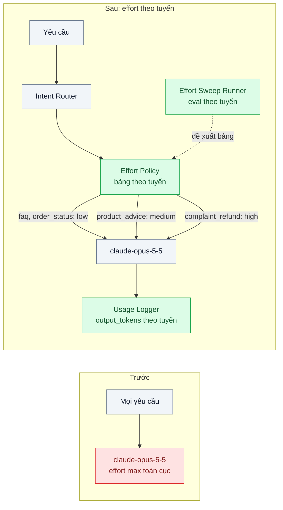
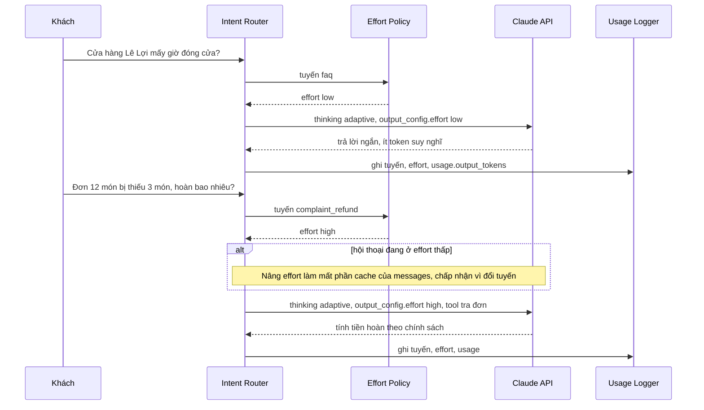

# Effort / Thinking Tuning — Trả tiền "suy nghĩ sâu" cho câu hỏi "giờ mở cửa?"

| Scope | Mức độ | Trạng thái | Pattern gốc | Cập nhật |
|---|---|---|---|---|
| 22 · backend / AI optimizer | 🟡 Trung bình | 📋 Kế hoạch | Effort / Thinking Tuning — Anthropic docs "Effort", "Adaptive thinking" | 2026-10-06 |

> **Một câu tóm tắt:** Giữ adaptive thinking nhưng đặt `output_config.effort` theo từng loại yêu cầu, chọn bằng một vòng quét có eval, để câu hỏi đơn giản không phải trả tiền cho lượng suy nghĩ chỉ cần ở ca khó.

## 1. Bài toán thực tế (What)

**Bối cảnh** *(doanh nghiệp giả định, số liệu minh họa)*
Chuỗi siêu thị và cửa hàng tiện lợi có trợ lý trong app, khoảng 250.000 lượt/tháng: hỏi giờ mở cửa, khuyến mãi, tra đơn giao hàng, tư vấn chọn sản phẩm, khiếu nại đổi trả. Sau một sự cố trợ lý tính sai tiền hoàn cho đơn nhiều món, đội kỹ thuật đặt `effort: "max"` cho mọi request trên `claude-opus-5-5` để "an toàn".

**Triệu chứng người kinh doanh nhìn thấy**
- Câu "Cửa hàng Lê Lợi mấy giờ đóng cửa?" mất 7–9 giây mới có câu trả lời một dòng.
- Hóa đơn tháng tăng khoảng 2,5 lần sau thay đổi; phần lớn là token đầu ra dù câu trả lời khách nhìn thấy rất ngắn.
- Đội vận hành không biết bao nhiêu tiền đi vào phần suy nghĩ vì nội dung suy nghĩ không hiển thị.

**Nguyên nhân kỹ thuật**
Với adaptive thinking, model tự quyết khi nào và nghĩ bao nhiêu; `effort` điều chỉnh độ sâu suy nghĩ và tổng lượng token model bỏ ra (kể cả số lượt gọi tool và độ dài phần mở đầu). Token suy nghĩ được tính như token đầu ra, kể cả khi phần suy nghĩ không được hiển thị. Đặt `max` cho mọi thứ nghĩa là trả giá cho mức nỗ lực chỉ cần ở một phần nhỏ yêu cầu.

**Ràng buộc**
- Ca khiếu nại và tính tiền hoàn không được giảm độ chính xác.
- Không thay model (chưa có ngân sách eval cho nhiều model); chỉ chỉnh cấu hình.
- Mỗi tuyến phải có quyết định effort dựa trên số đo, ghi lại trong cấu hình có review.

## 2. Vì sao dùng pattern này (Why)

**Nguyên nhân gốc mà pattern nhắm vào:** Một tham số chi phí–chất lượng được đặt toàn cục ở mức cao nhất, trong khi độ khó phân bố rất lệch giữa các loại yêu cầu.

**Pattern giải quyết thế nào:** Tách theo tuyến (route) rồi đo:
1. **Phân tuyến** theo intent (dùng bộ định tuyến ở scope 11 bài 03): `faq`, `order_status`, `product_advice`, `complaint_refund`.
2. **Quét effort có eval:** với mỗi tuyến, chạy cùng tập câu hỏi có đáp án ở `low`, `medium`, `high`, `xhigh`; ghi chất lượng, `usage.output_tokens`, độ trễ. Chọn mức *thấp nhất* giữ được chất lượng theo ngưỡng của tuyến.
3. **Bảng effort theo tuyến** trong cấu hình, ví dụ (minh họa, chờ số đo): `faq` → `low`, `order_status` → `low`, `product_advice` → `medium`, `complaint_refund` → `high`; `max` chỉ dùng cho tác vụ kiểm toán ngoại tuyến.
4. **Đặt effort tường minh:** trên `claude-opus-5-5` thinking luôn bật và effort mặc định là `medium`, nên mọi request phải ghi rõ mức effort thay vì dựa vào mặc định.
5. **Giữ effort ổn định trong hội thoại:** đổi effort cấp request giữa chừng làm mất phần cache của `messages`; chỉ nâng khi hội thoại chuyển hẳn sang tuyến khó.

**Lựa chọn khác đã cân nhắc**

| Lựa chọn | Giải quyết được gì | Vì sao không chọn (ở bài này) |
|---|---|---|
| Giữ nguyên + tối ưu nhỏ (hạ `max_tokens` để cắt chi phí) | Có trần chi phí mỗi request | `max_tokens` không điều chỉnh độ sâu suy nghĩ; chạm trần thì câu trả lời bị cắt ngang (`stop_reason: "max_tokens"`) |
| Prompt "hãy trả lời ngắn gọn" | Câu trả lời hiển thị ngắn hơn | Không giảm phần suy nghĩ; xử lý phần đầu ra nhìn thấy (bài 10) |
| Định tuyến sang model rẻ hơn (bài 03) | Giảm đơn giá | Nhiều model phải eval và mất dùng chung cache; scope này khuyến nghị thử effort thấp trước |
| Hạ effort toàn cục xuống `low` | Đơn giản | Ca khiếu nại phức tạp giảm chất lượng; chính là sự cố ban đầu |
| **Effort theo tuyến, chọn bằng vòng quét có eval (chọn)** | Giảm chi phí và độ trễ cho tuyến dễ, giữ chất lượng tuyến khó | Cần bộ eval theo tuyến; bảng effort phải đo lại khi đổi model |

## 3. Thiết kế hệ thống (How)

### 3.1 Kiến trúc trước và sau



### 3.2 Luồng chính



### 3.3 Thành phần và trách nhiệm

| Thành phần | Trách nhiệm | Quyết định thiết kế đáng chú ý |
|---|---|---|
| Intent Router | Gán tuyến cho yêu cầu | Dùng lại bộ định tuyến sẵn có; tuyến không rõ dùng mức mặc định an toàn (`medium`) |
| Effort Policy | Tra bảng tuyến → effort, gắn vào `output_config.effort` | Cấu hình có version; mọi thay đổi kèm kết quả quét |
| Effort Sweep Runner | Chạy eval mỗi tuyến ở nhiều mức effort | Báo bảng chất lượng × chi phí × độ trễ; chạy lại khi đổi model hoặc prompt |
| `max_tokens` | Trần an toàn, không phải công cụ điều chỉnh độ dài | Đặt đủ rộng; theo dõi tỉ lệ `stop_reason: "max_tokens"` |
| Usage Logger | Ghi `output_tokens`, `input_tokens`, độ trễ theo tuyến và effort | Nguồn số đo cho dashboard chi phí (scope 24 bài 02) |

### 3.4 Điểm dễ sai khi triển khai
- Dựa vào mặc định: mặc định effort khác nhau giữa các model (`claude-opus-5-5` mặc định `medium`); luôn ghi rõ trong request.
- Tưởng ẩn phần suy nghĩ là không tốn tiền: hiển thị hay không, suy nghĩ vẫn được tính phí.
- Cố tắt thinking trên `claude-opus-5-5`: không được hỗ trợ; công cụ điều chỉnh là effort.
- Đổi effort mỗi lượt theo cảm tính: mất cache của lịch sử hội thoại; chỉ đổi khi đổi tuyến.
- Chọn effort bằng vài câu thử tay: chênh lệch nằm trong nhiễu; dùng tập eval đủ lớn mỗi tuyến.
- Gửi `effort` cho `claude-haiku-4-5`: model này không hỗ trợ tham số effort theo docs tại thời điểm viết; kiểm bảng hỗ trợ trước khi dùng chung cấu hình.

## 4. Tech stack và tác động (Impact techstack)

| Lớp | Công nghệ chọn | Vì sao chọn | Thay thế tương đương |
|---|---|---|---|
| Ngôn ngữ / runtime | TypeScript strict, Node 20+ | Bảng effort kiểu hóa theo tuyến | Python |
| HTTP app | NestJS (gateway hiện có) | Chèn Effort Policy một chỗ | Fastify |
| Model & SDK | `@anthropic-ai/sdk`, `claude-opus-5-5`, `thinking: {type: "adaptive"}`, `output_config.effort` (low/medium/high/xhigh/max) | Tham số chính thức điều chỉnh độ sâu suy nghĩ và tổng token | — |
| Eval | Bộ 80 câu mỗi tuyến có đáp án + rubric; runner Vitest | Quét effort lặp lại được | promptfoo |
| Quan sát | Prometheus histogram `output_tokens` và độ trễ theo tuyến/effort | Thấy ngay tuyến nào tốn | Langfuse |

Giá tại thời điểm viết (kiểm tra lại trang Pricing): `claude-opus-5-5` $4/$20 mỗi triệu token vào/ra; token suy nghĩ tính theo giá token ra.

**Thay đổi so với hệ thống hiện tại:** Thêm Effort Policy và Sweep Runner, bỏ cấu hình `max` toàn cục. Đội sản phẩm sở hữu ngưỡng chất lượng mỗi tuyến; đội kỹ thuật chạy lại quét khi đổi model.

## 5. Kết quả đầu ra và cách đo (Output impact)

| Chỉ số | Trước (minh họa) | Mục tiêu khi thực hành | Cách đo |
|---|---|---|---|
| `output_tokens` p50 tuyến `faq` | ~1.500 | ghi số thật, kỳ vọng giảm mạnh | `usage.output_tokens` theo tuyến |
| Chi phí / 1.000 lượt theo tuyến | baseline | ghi số thật | Cộng `usage` nhân đơn giá, nhóm theo tuyến |
| Độ trễ p50 / p95 tuyến `faq` | 8 / 11 giây | < 3 / 5 giây | Histogram ở gateway |
| TTFT p50 tuyến `faq` | 7 giây | ghi số thật | Script streaming đo thời điểm nhận text delta đầu tiên |
| Điểm chất lượng tuyến `complaint_refund` | điểm ở `max` | không thấp hơn ngưỡng đặt trước | Sweep Runner, rubric + chấm tay 30 câu |
| Tỉ lệ `stop_reason: "max_tokens"` | không đo | < 0,5% | Đếm theo tuyến |

> Số "trước" là minh họa để hình dung bài toán. Số "mục tiêu" chỉ được coi là đạt khi có số đo thật
> ở mục 8 kèm môi trường đo.

**Tác động nghiệp vụ mong đợi:** Câu hỏi thường ngày trả lời gần như tức thì với chi phí thấp, ca khiếu nại vẫn được xử lý cẩn thận; hóa đơn phản ánh đúng độ khó của công việc.

## 6. Đánh đổi và khi KHÔNG nên dùng

**Đánh đổi**
- Bảng effort là cấu hình phải bảo trì và đo lại mỗi khi đổi model hoặc prompt.
- Router gán sai tuyến làm câu khó chạy ở effort thấp; cần tuyến mặc định an toàn.
- Nâng effort giữa hội thoại có chi phí cache.

**Không nên dùng khi**
- Khối lượng nhỏ và mọi yêu cầu đều khó (phân tích hợp đồng): đặt một mức cao là đủ.
- Chưa có tập eval theo tuyến: hạ effort mù quáng sẽ lặp lại sự cố ban đầu.

**Liên quan**
- [03 — Model Routing / Cascade](../03-model-routing-cascade-80-phan-tram-cau-don-gian-vao-model-dat/) — bước tiếp theo nếu effort thấp chưa đủ.
- [10 — Output Token Discipline](../10-token-budget-output-limits-model-tra-loi-dai-gap-3-can-thiet/) — kiểm soát phần đầu ra nhìn thấy.
- [Prompt Chaining & Routing (scope 11)](../../11-backend-ai-agent/03-routing-prompt-chaining-mot-prompt-khong-lo-duoc-5-loai-yeu-cau/) — bộ định tuyến intent dùng lại.
- [LLM Latency Breakdown (scope 24)](../../24-backend-ai-monitoring/07-latency-ttft-tokens-per-second-chat-cham-nhung-p50-binh-thuong/) — đo TTFT và độ trễ.

## 7. Cơ sở tham khảo

- Anthropic docs, "Effort" — https://platform.claude.com/docs/en/build-with-claude/effort — các mức effort, ảnh hưởng tới độ sâu suy nghĩ và tổng token, model nào hỗ trợ, mức mặc định.
- Anthropic docs, "Adaptive thinking" — https://platform.claude.com/docs/en/build-with-claude/adaptive-thinking — `thinking: {type: "adaptive"}`, quan hệ với effort, cách tính phí phần suy nghĩ.
- Anthropic docs, "Optimizing for cost and intelligence" — https://platform.claude.com/docs/en/about-claude/models/optimizing-for-cost-and-intelligence — effort là đòn bẩy đánh đổi chất lượng nên đo theo từng tuyến trước khi đổi model.
- Anthropic docs, "Prompt caching" — https://platform.claude.com/docs/en/build-with-claude/prompt-caching — vì sao đổi effort giữa hội thoại ảnh hưởng cache.

## 8. Kế hoạch thực hành

- [ ] Bước 1: Soạn 80 câu có đáp án cho mỗi tuyến (4 tuyến); cấu hình "cũ" `effort: "max"` toàn cục.
- [ ] Bước 2: Đo "trước": `output_tokens`, chi phí, độ trễ, TTFT, chất lượng theo tuyến.
- [ ] Bước 3: Chạy Effort Sweep Runner ở `low`/`medium`/`high`/`xhigh`; lập bảng effort theo tuyến; cài Effort Policy.
- [ ] Bước 4: Đo "sau" cùng bộ câu; ghi vào mục 5 kèm model, ngày, phiên bản prompt.
- [ ] Bước 5: Test Vitest chứng minh: mọi request có effort tường minh; tuyến không rõ dùng mức mặc định an toàn; đổi bảng effort không hợp lệ bị từ chối khi khởi động.

**Cấu trúc code dự kiến**
```text
src/
  gateway/effort-policy.ts       # bảng tuyến -> effort
  gateway/usage-logger.ts
  eval/effort-sweep.ts           # quét mức effort theo tuyến
  eval/routes/*.json             # 80 câu mỗi tuyến
test/
  effort-policy.test.ts
docker-compose.yml               # Prometheus, Grafana
```

**Cách chạy** *(điền khi bắt đầu code)*
```bash
docker compose up -d
pnpm install && pnpm test
pnpm eval:effort-sweep
```
