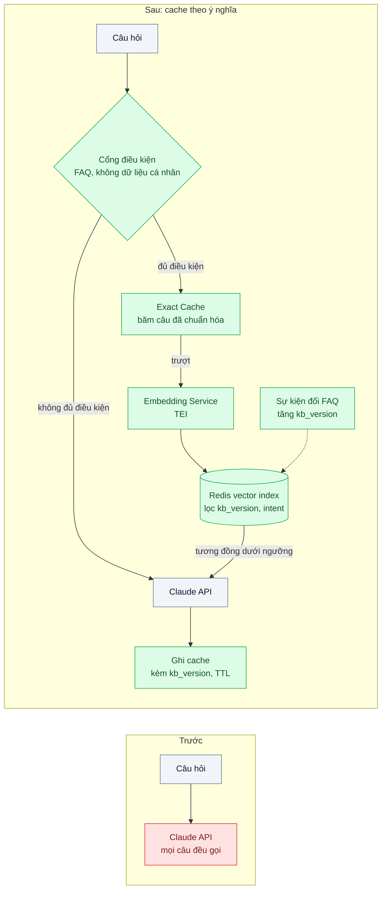
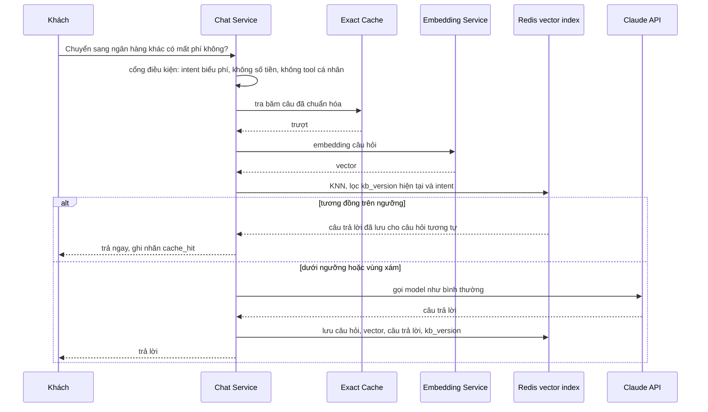

# Semantic Cache — 10% câu hỏi lặp lại gần nguyên văn vẫn gọi model

| Scope | Mức độ | Trạng thái | Pattern gốc | Cập nhật |
|---|---|---|---|---|
| 22 · backend / AI optimizer | 🟡 Trung bình | 📋 Kế hoạch | Semantic Cache — Bang, "GPTCache" (2023); Redis docs (vector similarity search) | 2026-10-06 |

> **Một câu tóm tắt:** Với nhóm câu hỏi không cá nhân hóa, lưu câu trả lời theo embedding của câu hỏi và trả lại khi câu hỏi mới đủ giống, có cổng chặn điều kiện, ngưỡng tương đồng chỉnh bằng dữ liệu và vô hiệu hóa theo phiên bản nội dung.

## 1. Bài toán thực tế (What)

**Bối cảnh** *(doanh nghiệp giả định, số liệu minh họa)*
Ví điện tử có trợ lý hỏi đáp trong app, khoảng 1,2 triệu câu hỏi/tháng. Nội dung trả lời dựa trên bộ FAQ và biểu phí khoảng 300 mục, cập nhật vài lần mỗi tháng. Phân tích log cho thấy khoảng 10% câu hỏi gần như trùng nguyên văn nhau ("phí chuyển tiền liên ngân hàng bao nhiêu", "chuyển tiền sang ngân hàng khác mất phí không"), tập trung vào khoảng 40 chủ đề.

**Triệu chứng người kinh doanh nhìn thấy**
- Mỗi câu lặp lại vẫn tốn một lượt gọi model đầy đủ và 3–4 giây chờ.
- Ngày có chiến dịch ("hoàn tiền 50% khi nạp điện thoại"), cùng một câu được hỏi hàng chục nghìn lần, đẩy hạn mức API lên đỉnh.
- Hai khách hỏi cùng một câu có thể nhận hai cách diễn đạt khác nhau; đội tuân thủ muốn câu trả lời về phí phải thống nhất.

**Nguyên nhân kỹ thuật**
Không có tầng cache nào phía trước model. Cache theo chuỗi chính xác gần như không trúng vì người dùng diễn đạt khác nhau từng chữ. Prompt caching (bài 01) chỉ làm rẻ phần tiền tố, model vẫn phải sinh câu trả lời.

**Ràng buộc**
- Tuyệt đối không trả câu trả lời của khách này cho khách khác nếu có dữ liệu cá nhân (số dư, giao dịch).
- Trả nhầm câu trả lời (ví dụ phí rút tiền cho câu hỏi phí nạp tiền) nguy hiểm hơn chậm 3 giây.
- Biểu phí đổi thì câu trả lời cũ phải biến mất ngay.

## 2. Vì sao dùng pattern này (Why)

**Nguyên nhân gốc mà pattern nhắm vào:** Cùng một ý hỏi được trả lời lại từ đầu vì khóa cache là chuỗi ký tự thay vì ý nghĩa.

**Pattern giải quyết thế nào:** GPTCache mô tả kiến trúc: sinh embedding cho câu hỏi, tìm câu hỏi đã lưu gần nhất trong vector store, một bộ đánh giá tương đồng quyết định có dùng câu trả lời đã lưu không, kèm chính sách loại bỏ. Áp vào đây theo thứ tự:
1. **Cổng điều kiện:** chỉ câu hỏi thuộc intent FAQ/biểu phí, không gọi tool dữ liệu cá nhân, không chứa số tiền cụ thể mới được đọc/ghi cache.
2. **Tầng chính xác:** chuẩn hóa (chữ thường, khoảng trắng, dấu câu; giữ dấu tiếng Việt) rồi băm; trúng thì trả ngay.
3. **Tầng ngữ nghĩa:** embedding câu hỏi, tìm KNN trong Redis có lọc theo `kb_version`, ngôn ngữ, intent; độ tương đồng ≥ ngưỡng thì trả câu trả lời đã lưu.
4. **Vùng xám** (gần ngưỡng): không đoán; gọi model như bình thường và ghi lại cặp để chỉnh ngưỡng.
5. **Vô hiệu hóa:** mỗi mục lưu kèm `kb_version`; khi FAQ/biểu phí đổi, tăng phiên bản, mục cũ không còn khớp bộ lọc và hết hạn theo TTL.

**Lựa chọn khác đã cân nhắc**

| Lựa chọn | Giải quyết được gì | Vì sao không chọn (ở bài này) |
|---|---|---|
| Giữ nguyên + tối ưu nhỏ (prompt caching, model rẻ hơn cho FAQ) | Giảm đơn giá mỗi lượt | Vẫn gọi model và vẫn chờ cho câu đã trả lời hàng nghìn lần |
| Cache theo chuỗi chính xác | Không có rủi ro trả nhầm | Tỉ lệ trúng rất thấp với ngôn ngữ tự nhiên |
| Bộ câu trả lời soạn sẵn + phân loại intent | Câu trả lời thống nhất, đã duyệt | Phải soạn tay và bảo trì; là hướng tốt cho 40 chủ đề nóng nhất, có thể dùng kèm |
| **Semantic cache có cổng, ngưỡng đo được, theo phiên bản (chọn)** | Trúng được câu diễn đạt khác, tự cập nhật khi nội dung đổi | Rủi ro trả nhầm phải đo và kiểm soát; thêm hạ tầng embedding và vector search |

## 3. Thiết kế hệ thống (How)

### 3.1 Kiến trúc trước và sau



### 3.2 Luồng chính



### 3.3 Thành phần và trách nhiệm

| Thành phần | Trách nhiệm | Quyết định thiết kế đáng chú ý |
|---|---|---|
| Cổng điều kiện | Quyết định câu nào được dùng cache | Danh sách intent cho phép; loại câu có số tiền, mã giao dịch, đại từ sở hữu ("tài khoản của tôi") |
| Exact Cache | Băm câu đã chuẩn hóa → câu trả lời | Rẻ nhất, chạy trước; không bỏ dấu tiếng Việt vì "phí" và "phi" khác nghĩa |
| Embedding Service | Sinh vector cho câu hỏi tiếng Việt | Model embedding đa ngôn ngữ tự host qua TEI (chọn model bằng đo trên cặp câu thật) |
| Redis vector index | KNN có lọc theo tag `kb_version`, `intent`, `lang` | Lọc trước khi so tương đồng để không bao giờ trả câu trả lời của phiên bản cũ |
| Ngưỡng tương đồng | Quyết định trúng/trượt | Chỉnh trên tập cặp gán nhãn "cùng câu trả lời / khác câu trả lời"; chọn ngưỡng theo tỉ lệ trả nhầm chấp nhận được |
| Vô hiệu hóa | Tăng `kb_version` khi FAQ/biểu phí đổi; TTL cho mọi mục | Hướng sự kiện như bài invalidation ở scope 03 |

### 3.4 Điểm dễ sai khi triển khai
- Cache câu trả lời có dữ liệu cá nhân: khách B thấy số dư của khách A. Cổng điều kiện là bắt buộc, không phải tùy chọn.
- Câu gần giống nhưng khác nghĩa: "phí nạp tiền" và "phí rút tiền", "chuyển 5 triệu" và "chuyển 50 triệu" có embedding rất gần. Loại câu có số, đo tỉ lệ trả nhầm trên cặp khó.
- Chọn ngưỡng bằng cảm giác: phải đo trên tập cặp có nhãn và theo dõi mẫu sau khi chạy thật.
- Quên vô hiệu hóa khi biểu phí đổi: cache trả biểu phí cũ, rủi ro tuân thủ.
- So tương đồng trước rồi mới lọc phiên bản: top-k toàn mục cũ, lọc xong thành rỗng hoặc trả nhầm (xem bài lọc vector ở scope 12).

## 4. Tech stack và tác động (Impact techstack)

| Lớp | Công nghệ chọn | Vì sao chọn | Thay thế tương đương |
|---|---|---|---|
| Ngôn ngữ / runtime | TypeScript strict, Node 20+ | Cổng điều kiện và cache nằm trong Chat Service | Python |
| Vector search | Redis có Query Engine (Redis Stack hoặc Redis 8, cần xác minh phiên bản/image), index HNSW, `FT.SEARCH` KNN có lọc tag | Đã có Redis trong stack; độ trễ thấp; lọc tag cùng truy vấn | PostgreSQL + pgvector |
| Embedding | Hugging Face TEI tự host với model embedding đa ngôn ngữ (tên model cần xác minh bằng đo) | Không gửi câu hỏi ra ngoài; độ trễ ổn định | API embedding của nhà cung cấp |
| Model trả lời | `@anthropic-ai/sdk`, `claude-opus-5-5` | Như hiện tại | — |
| Đo lường | Prometheus: hit rate theo tầng; bảng mẫu hit để duyệt tay | Theo dõi tỉ lệ trúng và trả nhầm | Langfuse |
| Test | Vitest + tập cặp câu gán nhãn | Chỉnh ngưỡng và chống hồi quy | — |

Giá tại thời điểm viết (kiểm tra lại trang Pricing): `claude-opus-5-5` $4/$20 mỗi triệu token vào/ra.

**Thay đổi so với hệ thống hiện tại:** Thêm cổng điều kiện, hai tầng cache, dịch vụ embedding, index vector và luồng vô hiệu hóa theo sự kiện đổi FAQ. Đội nội dung phải phát sự kiện mỗi lần cập nhật biểu phí; đội vận hành duyệt mẫu câu trả lời từ cache hằng tuần.

## 5. Kết quả đầu ra và cách đo (Output impact)

| Chỉ số | Trước (minh họa) | Mục tiêu khi thực hành | Cách đo |
|---|---|---|---|
| Tỉ lệ trúng cache (exact + ngữ nghĩa) trên câu đủ điều kiện | 0% | ghi số thật, kỳ vọng gần tỉ lệ câu lặp | Counter theo tầng / số câu qua cổng |
| Tỉ lệ trả nhầm trong các lần trúng | không áp dụng | < 0,5% | Duyệt tay 300 lần trúng ngẫu nhiên mỗi tuần theo rubric "cùng câu trả lời" |
| Độ trễ p50 khi trúng | 3,5 giây | < 150 ms | Histogram ở Chat Service |
| Độ trễ thêm khi trượt p95 | 0 | < 50 ms | Thời gian cổng + exact + embedding + KNN |
| Chi phí model tiết kiệm / tháng | 0 | ghi số thật | Số lần trúng × chi phí trung bình một lượt (từ `usage`) |
| Câu trả lời theo biểu phí cũ sau cập nhật | không đo | 0 | Test đổi `kb_version` rồi hỏi lại cùng câu |

> Số "trước" là minh họa để hình dung bài toán. Số "mục tiêu" chỉ được coi là đạt khi có số đo thật
> ở mục 8 kèm môi trường đo.

**Tác động nghiệp vụ mong đợi:** Câu hỏi phổ biến được trả lời tức thì và thống nhất, đỉnh tải ngày chiến dịch giảm, với rủi ro trả nhầm được đo chứ không đoán.

## 6. Đánh đổi và khi KHÔNG nên dùng

**Đánh đổi**
- Rủi ro trả nhầm không bao giờ bằng 0; phải chọn ngưỡng theo mức rủi ro chấp nhận được và duyệt mẫu liên tục.
- Thêm hạ tầng (embedding, vector index) và luồng vô hiệu hóa phải vận hành.

**Không nên dùng khi**
- Câu trả lời phụ thuộc người hỏi (số dư, đơn hàng, quyền) hoặc phụ thuộc lịch sử hội thoại.
- Tỉ lệ câu lặp thấp: chi phí embedding và vận hành lớn hơn phần tiết kiệm.

**Liên quan**
- [Cache-Aside (scope 03)](../../03-backend-cache/01-cache-aside-trang-san-pham-doc-10k-lan-phut/) — semantic cache là cache-aside với khóa mờ.
- [Cache Invalidation (scope 03)](../../03-backend-cache/02-ttl-va-invalidation-gia-doi-roi-khach-van-thay-gia-cu/) — vô hiệu hóa theo sự kiện.
- [Filtered Vector Search (scope 12)](../../12-backend-database-vector/03-metadata-filtering-tim-tuong-tu-nhung-chi-trong-tenant-x/) — lọc trước khi tìm tương đồng.

## 7. Cơ sở tham khảo

- Bang, "GPTCache: An Open-Source Semantic Cache for LLM Applications", 2023 — kiến trúc semantic cache: embedding, vector store, bộ đánh giá tương đồng, chính sách loại bỏ.
- Redis docs, "Vector search" — https://redis.io/docs/ — tạo index vector (HNSW/FLAT), truy vấn KNN kết hợp lọc tag.
- Hugging Face, "Text Embeddings Inference" — https://huggingface.co/docs/text-embeddings-inference — tự host model embedding phục vụ qua HTTP.

## 8. Kế hoạch thực hành

- [ ] Bước 1: Lấy 20.000 câu hỏi mẫu (có câu lặp diễn đạt khác), 300 mục FAQ/biểu phí, và 1.000 cặp câu gán nhãn "cùng / khác câu trả lời" (có cặp khó như nạp/rút).
- [ ] Bước 2: Đo "trước": số lượt gọi model, độ trễ, chi phí trên 20.000 câu.
- [ ] Bước 3: Áp dụng pattern: cổng điều kiện, exact cache, TEI + Redis vector index có lọc, ngưỡng chỉnh trên 1.000 cặp, vô hiệu hóa theo `kb_version`.
- [ ] Bước 4: Đo "sau" cùng 20.000 câu; duyệt tay 300 lần trúng; ghi vào mục 5 kèm model embedding, ngưỡng, ngày.
- [ ] Bước 5: Test Vitest chứng minh: câu có đại từ sở hữu không vào cache; tăng `kb_version` làm câu cũ trượt; cặp "nạp/rút" không trúng nhau ở ngưỡng đã chọn.

**Cấu trúc code dự kiến**
```text
src/
  cache/eligibility-gate.ts
  cache/exact-cache.ts
  cache/semantic-cache.ts        # embedding + KNN có lọc
  cache/embedding-client.ts      # TEI
  cache/kb-version.ts            # vô hiệu hóa theo sự kiện
eval/
  tune-threshold.ts              # 1.000 cặp có nhãn
test/
  eligibility-gate.test.ts
  semantic-cache.test.ts
docker-compose.yml               # Redis có vector search, TEI
```

**Cách chạy** *(điền khi bắt đầu code)*
```bash
docker compose up -d
pnpm install && pnpm test
```
