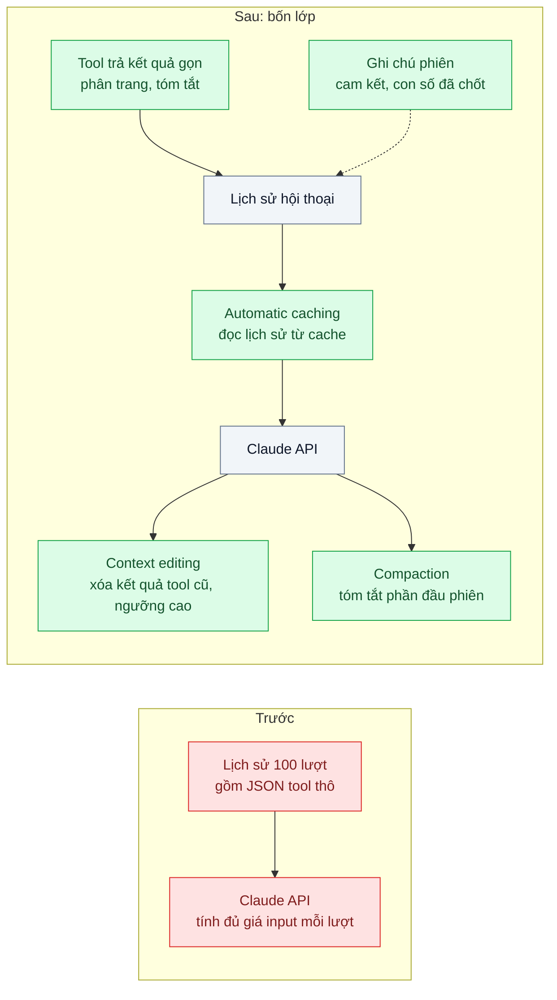
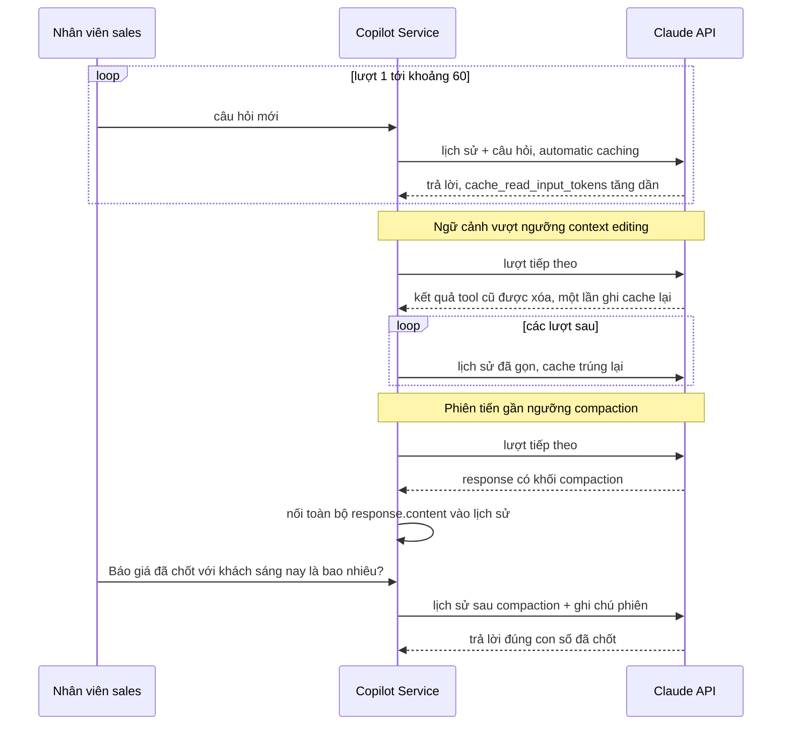

# Context Pruning & Summarization — Gửi lại 100 lượt hội thoại mỗi request, chi phí tăng tuyến tính

| Scope | Mức độ | Trạng thái | Pattern gốc | Cập nhật |
|---|---|---|---|---|
| 22 · backend / AI optimizer | 🟡 Trung bình | 📋 Kế hoạch | Context Pruning & Summarization — Anthropic docs "Compaction", "Context editing"; Jiang et al., "LLMLingua" (2023) | 2026-10-06 |

> **Một câu tóm tắt:** Kiểm soát chi phí phiên dài theo thứ tự: cache lịch sử trước, cắt gọn kết quả tool tại nguồn, rồi mới dùng context editing và compaction phía server với ngưỡng cao — vì mỗi lần cắt ngữ cảnh cũng làm phần đã cache phải ghi lại.

## 1. Bài toán thực tế (What)

**Bối cảnh** *(doanh nghiệp giả định, số liệu minh họa)*
Phần mềm CRM SaaS B2B có "trợ lý bán hàng" trong giao diện: nhân viên sales mở một phiên đầu ngày và hỏi liên tục — tra khách, xem lịch sử giao dịch, so sánh báo giá, soạn email. Phiên trung bình khoảng 100 lượt. Tool `get_account_history` trả JSON thô 3.000–8.000 token mỗi lần. Mỗi request gửi lại toàn bộ lịch sử, gồm cả mọi kết quả tool cũ.

**Triệu chứng người kinh doanh nhìn thấy**
- Chi phí một phiên dài gấp khoảng 30 lần phiên ngắn, trong khi giá gói thuê bao cố định theo người dùng; nhóm khách dùng nhiều đang bán lỗ.
- Cuối ngày, câu trả lời chậm dần (8–10 giây) và đôi khi lẫn số liệu của khách hàng tra từ buổi sáng.
- Vài phiên rất dài gặp lỗi vượt giới hạn ngữ cảnh, nhân viên phải mở phiên mới và mất mạch làm việc.

**Nguyên nhân kỹ thuật**
API không có trạng thái nên lượt thứ n gửi lại n−1 lượt trước: token đầu vào mỗi lượt tăng tuyến tính, tổng token của phiên tăng xấp xỉ theo bình phương số lượt. Phần lớn khối lượng là kết quả tool cũ đã hết giá trị. Hệ thống chưa bật prompt caching nên toàn bộ lịch sử bị tính giá input đầy đủ mỗi lượt.

**Ràng buộc**
- Không làm mất thông tin nhân viên còn cần (cam kết với khách, con số đã chốt trong phiên).
- Không đổi model và không giảm chất lượng trên bộ eval phiên dài.
- Giữ trải nghiệm một phiên liên tục, không bắt nhân viên mở phiên mới.

## 2. Vì sao dùng pattern này (Why)

**Nguyên nhân gốc mà pattern nhắm vào:** Lịch sử được gửi lại nguyên trạng và tính giá đầy đủ, dù phần lớn không đổi (có thể cache) hoặc không còn cần (có thể bỏ).

**Pattern giải quyết thế nào:** Bốn lớp theo thứ tự từ "miễn phí" tới "có đánh đổi":
1. **Cache lịch sử:** bật automatic caching (`cache_control` cấp request) để phần lịch sử đã gửi được đọc từ cache với giá thấp; kiểm bằng `usage.cache_read_input_tokens`. Lớp này không mất thông tin và thường giải quyết phần lớn chi phí tuyến tính.
2. **Gọn kết quả tool tại nguồn:** tool trả đúng trường cần, có phân trang và tóm tắt số liệu thay vì JSON thô.
3. **Context editing (beta):** khi ngữ cảnh vượt ngưỡng, API tự xóa kết quả tool cũ (giữ chỗ đánh dấu đã xóa). Đặt ngưỡng cao và xóa theo đợt lớn, vì mỗi lần xóa viết lại phần hội thoại đã cache.
4. **Compaction (beta):** khi phiên tiến gần ngưỡng kích hoạt, API tóm tắt phần đầu hội thoại thành khối compaction; ứng dụng phải nối toàn bộ `response.content` vào lịch sử để giữ khối này.
Trước khi xóa, thông tin cần giữ lâu (cam kết, con số đã chốt) được agent ghi vào ghi chú phiên (memory tool hoặc bảng ghi chú, xem scope 11 bài 07). LLMLingua (nén prompt bằng model nhỏ) được cân nhắc nhưng không chọn.

**Lựa chọn khác đã cân nhắc**

| Lựa chọn | Giải quyết được gì | Vì sao không chọn (ở bài này) |
|---|---|---|
| Giữ nguyên + tối ưu nhỏ: cửa sổ trượt, chỉ gửi 20 lượt gần nhất | Trần token mỗi lượt | Mất thông tin đầu phiên; viết lại lịch sử phía client mỗi lượt làm cache không bao giờ trúng |
| Tóm tắt bằng một lượt gọi model riêng mỗi 20 lượt | Kiểm soát nội dung tóm tắt | Tự làm điều compaction phía server đã có; thêm chi phí và độ trễ cho lượt tóm tắt |
| Nén prompt kiểu LLMLingua | Giảm token đầu vào | Cần tự host model nén (Python); nội dung nén khác nhau mỗi lần làm hỏng cache; rủi ro mất chi tiết số liệu |
| **Cache trước, gọn tool, rồi context editing + compaction ngưỡng cao (chọn)** | Giảm chi phí mà giữ thông tin; phiên dài không vượt giới hạn | Cấu hình ngưỡng sai có thể làm chi phí tăng; phải đo từng lớp |

## 3. Thiết kế hệ thống (How)

### 3.1 Kiến trúc trước và sau



### 3.2 Luồng chính



### 3.3 Thành phần và trách nhiệm

| Thành phần | Trách nhiệm | Quyết định thiết kế đáng chú ý |
|---|---|---|
| Tool gọn | Trả trường cần thiết, phân trang, tóm tắt | Thay đổi rẻ nhất, giảm token ở mọi lượt sau |
| Automatic caching | Cache phần lịch sử tăng dần | Tiền tố (tool, system) cố định như bài 01 |
| Context editing | Xóa kết quả tool cũ khi vượt ngưỡng | Ngưỡng cao, xóa nhiều mỗi lần để số lần ghi lại cache ít |
| Compaction | Tóm tắt phía server cho phiên rất dài | Luôn nối `response.content`, không chỉ phần text |
| Ghi chú phiên | Giữ cam kết và con số đã chốt ngoài phần bị xóa/tóm tắt | Agent ghi qua tool; đưa lại vào ngữ cảnh khi cần |
| Đo lường theo lượt | Ghi `input_tokens`, `cache_read_input_tokens`, `cache_creation_input_tokens` | Vẽ đường token theo số lượt cho từng cấu hình |

### 3.4 Điểm dễ sai khi triển khai
- Tưởng context editing luôn tiết kiệm tiền: mỗi lần xóa viết lại phần đã cache; xóa mỗi lượt có thể đắt hơn không xóa. Đo với caching bật.
- Cắt lịch sử phía client mỗi lượt (cửa sổ trượt): tiền tố đổi liên tục, cache không trúng; trên các model mới còn có thể bị coi là sửa lịch sử làm mất giá trị khối thinking cũ — kiểm trang Migration guide của model đang dùng.
- Chỉ nối phần text khi dùng compaction: mất trạng thái compaction ở lượt sau.
- Xóa mất thông tin còn cần: con số đã chốt nằm trong kết quả tool cũ. Ghi chú phiên trước khi xóa và có eval hỏi lại thông tin đầu phiên.
- Bỏ qua lớp 2: tool trả JSON thô thì mọi lớp sau chỉ đang dọn rác do chính mình tạo.

## 4. Tech stack và tác động (Impact techstack)

| Lớp | Công nghệ chọn | Vì sao chọn | Thay thế tương đương |
|---|---|---|---|
| Ngôn ngữ / runtime | TypeScript strict, Node 20+ | — | Python |
| HTTP app | NestJS | Service copilot hiện có | Fastify |
| Model & SDK | `@anthropic-ai/sdk`, `claude-opus-5-5`; automatic caching (`cache_control`), context editing và compaction (beta, qua `client.beta.messages`) | Cơ chế phía server, không phải tự viết logic tóm tắt | Tự tóm tắt bằng lượt gọi riêng |
| Lưu phiên | PostgreSQL 16 (lịch sử dạng `content` block nguyên vẹn, ghi chú phiên) | Lưu đúng khối compaction để gửi lại | Redis cho phiên ngắn |
| Đo lường | Prometheus + script vẽ token theo lượt | So sánh cấu hình trực quan | Langfuse |
| Eval | 30 phiên dài kịch bản sẵn, có câu hỏi lại thông tin đầu phiên | Bảo đảm cắt không làm mất thông tin | promptfoo |

Giá tại thời điểm viết (kiểm tra lại trang Pricing): `claude-opus-5-5` $4/$20 mỗi triệu token vào/ra; giá ghi/đọc cache xem trang Pricing.

**Thay đổi so với hệ thống hiện tại:** Sửa tool trả kết quả gọn, bật caching, chuyển lời gọi sang endpoint beta cho context editing/compaction, lưu lịch sử dạng block nguyên vẹn, thêm ghi chú phiên. Đội phát triển học đọc ba loại token theo lượt.

## 5. Kết quả đầu ra và cách đo (Output impact)

| Chỉ số | Trước (minh họa) | Mục tiêu khi thực hành | Cách đo |
|---|---|---|---|
| Token input tính giá đầy đủ ở lượt 100 | ~180k | ghi số thật, kỳ vọng giảm mạnh | `usage.input_tokens` theo lượt trên 30 phiên kịch bản |
| Tỉ lệ token đọc từ cache trong phiên | 0% | ghi số thật | `cache_read_input_tokens` / tổng token input |
| Chi phí một phiên 100 lượt | baseline | ghi số thật cho từng lớp (1, 1+2, 1+2+3, 1+2+3+4) | Cộng ba loại token nhân đơn giá Pricing |
| Lỗi vượt giới hạn ngữ cảnh | có | 0 | Log lỗi API |
| Điểm nhớ thông tin đầu phiên | điểm hiện tại | không giảm | Eval 30 phiên, câu hỏi lại con số đã chốt |
| Độ trễ p95 ở lượt 80–100 | 9 giây | ghi số thật | Histogram theo khoảng lượt |

> Số "trước" là minh họa để hình dung bài toán. Số "mục tiêu" chỉ được coi là đạt khi có số đo thật
> ở mục 8 kèm môi trường đo.

**Tác động nghiệp vụ mong đợi:** Phiên dài không còn bán lỗ, nhân viên làm việc cả ngày trong một phiên mà câu trả lời vẫn nhanh và đúng.

## 6. Đánh đổi và khi KHÔNG nên dùng

**Đánh đổi**
- Context editing và compaction là tính năng beta; hành vi và tham số có thể đổi.
- Tóm tắt luôn có rủi ro mất chi tiết; cần ghi chú phiên và eval để bù.
- Nhiều lớp tương tác nhau (cache và xóa ngữ cảnh), cấu hình sai có thể làm chi phí tăng.

**Không nên dùng khi**
- Phiên ngắn (dưới vài chục lượt, ngữ cảnh nhỏ): caching là đủ, xóa/tóm tắt là thừa.
- Mọi chi tiết trong lịch sử đều có giá trị pháp lý phải giữ nguyên trong ngữ cảnh: dùng truy hồi theo yêu cầu thay vì tóm tắt.

**Liên quan**
- [01 — Prompt Caching](../01-prompt-caching-system-prompt-20k-token-tra-tien-moi-request/) — lớp 1, làm trước.
- [Context Engineering (scope 20)](../../20-backend-ai-framework-system-design/07-context-engineering-context-window-tran-sau-20-luot/) — cùng cơ chế ở góc độ chất lượng.
- [Agent Memory (scope 11)](../../11-backend-ai-agent/07-agent-memory-khach-quay-lai-agent-quen-het/) — ghi chú giữ thông tin trước khi xóa.
- [Token & Cost Attribution (scope 24)](../../24-backend-ai-monitoring/02-token-cost-per-feature-tenant-hoa-don-tang-3-lan-khong-biet-vi-sao/) — tìm phiên nào tốn.

## 7. Cơ sở tham khảo

- Anthropic docs, "Compaction" — https://platform.claude.com/docs/en/build-with-claude/compaction — tóm tắt phía server, ngưỡng kích hoạt, yêu cầu nối `response.content` để giữ khối compaction.
- Anthropic docs, "Context editing" — https://platform.claude.com/docs/en/build-with-claude/context-editing — chiến lược xóa kết quả tool/khối thinking cũ, ngưỡng và cấu hình.
- Anthropic docs, "Prompt caching" — https://platform.claude.com/docs/en/build-with-claude/prompt-caching — automatic caching cho hội thoại tăng dần, vì sao viết lại tiền tố làm mất cache.
- Jiang et al., "LLMLingua: Compressing Prompts for Accelerated Inference of Large Language Models", 2023 — nén prompt bằng model nhỏ; phương án đã cân nhắc.

## 8. Kế hoạch thực hành

- [ ] Bước 1: Dựng copilot "cũ" với tool trả JSON thô; soạn 30 phiên kịch bản 100 lượt, có câu hỏi lại thông tin đầu phiên.
- [ ] Bước 2: Đo "trước": ba loại token theo lượt, chi phí phiên, độ trễ, điểm nhớ.
- [ ] Bước 3: Áp dụng từng lớp và đo sau mỗi lớp: caching → tool gọn → context editing → compaction + ghi chú phiên.
- [ ] Bước 4: Ghi bảng chi phí theo từng tổ hợp lớp vào mục 5 kèm ngưỡng cấu hình, model, ngày.
- [ ] Bước 5: Test Vitest chứng minh: lịch sử lưu và gửi lại khối compaction nguyên vẹn; tool trả không quá N bản ghi mỗi trang; con số đã chốt còn trả lời đúng sau compaction (với mock).

**Cấu trúc code dự kiến**
```text
src/
  copilot/copilot.service.ts      # caching, context editing, compaction
  copilot/session-store.ts        # lưu content block nguyên vẹn
  copilot/session-notes.ts
  tools/get-account-history.ts    # kết quả gọn, phân trang
bench/
  token-curve.ts                  # token theo lượt cho từng cấu hình
test/
  session-store.test.ts
  get-account-history.test.ts
docker-compose.yml
```

**Cách chạy** *(điền khi bắt đầu code)*
```bash
docker compose up -d
pnpm install && pnpm test
pnpm bench:token-curve
```
