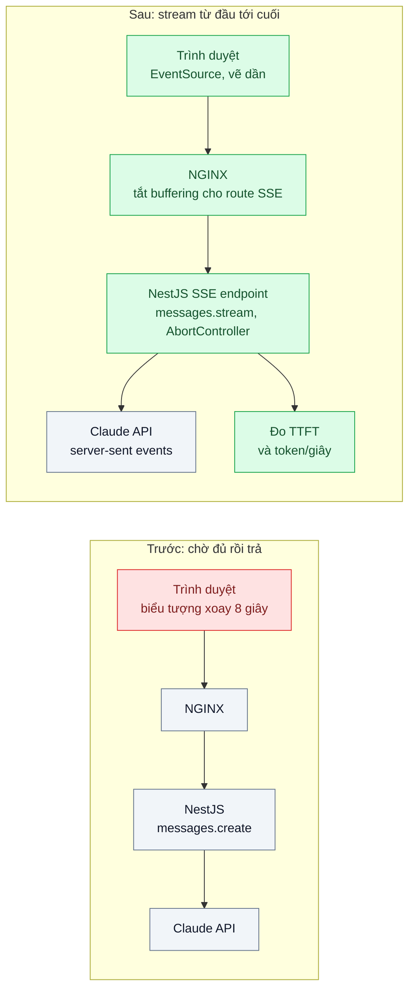
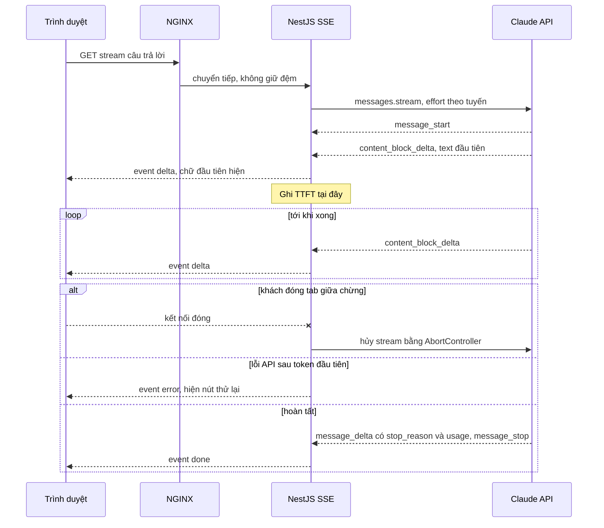

# Streaming for Perceived Latency — Khách nhìn màn hình trắng 8 giây chờ câu trả lời dài

| Scope | Mức độ | Trạng thái | Pattern gốc | Cập nhật |
|---|---|---|---|---|
| 22 · backend / AI optimizer | 🟢 Cơ bản | 📋 Kế hoạch | Streaming for Perceived Latency — Anthropic docs "Streaming Messages"; Nielsen, "Response Times: The 3 Important Limits" (1993) | 2026-10-06 |

> **Một câu tóm tắt:** Stream câu trả lời từ API qua backend tới trình duyệt bằng SSE để chữ đầu tiên hiện sau khoảng một giây thay vì chờ cả câu trả lời, xử lý đúng việc khách đóng tab, proxy giữ đệm và lỗi giữa chừng.

## 1. Bài toán thực tế (What)

**Bối cảnh** *(doanh nghiệp giả định, số liệu minh họa)*
Công ty bảo hiểm có trợ lý giải thích quyền lợi hợp đồng trong cổng khách hàng, khoảng 80.000 lượt/tháng. Câu trả lời thường dài 500–800 chữ (liệt kê quyền lợi, điều kiện loại trừ). Backend NestJS gọi `messages.create` không stream, chờ đủ câu trả lời rồi trả JSON; giao diện hiện biểu tượng xoay trong lúc chờ.

**Triệu chứng người kinh doanh nhìn thấy**
- Khách nhìn biểu tượng xoay trung bình 8 giây (p95 14 giây); khoảng 25% rời trang hoặc bấm hỏi lại trước khi có câu trả lời.
- Khách bấm hỏi lại tạo request trùng, tốn tiền gấp đôi cho cùng câu hỏi.

**Nguyên nhân kỹ thuật**
Thời gian sinh câu trả lời tỉ lệ với số token đầu ra; câu trả lời dài cần nhiều giây là bình thường. Vấn đề là khách không thấy gì cho tới token cuối cùng. Nielsen chỉ ra các mốc 0,1 giây (cảm giác tức thì), 1 giây (giữ mạch suy nghĩ), 10 giây (giới hạn giữ sự chú ý); trợ lý đang vượt mốc 1 giây ở mọi câu và vượt mốc 10 giây ở câu dài. Ngoài ra, với thinking bật, có một khoảng model suy nghĩ trước khi viết chữ đầu tiên.

**Ràng buộc**
- Không đổi nội dung câu trả lời; tổng thời gian có thể giữ nguyên, nhưng chữ đầu tiên phải hiện nhanh.
- Hạ tầng hiện có NGINX làm reverse proxy và middleware nén response.
- Khách đóng tab thì phải dừng sinh tiếp để không trả tiền cho token không ai đọc.

## 2. Vì sao dùng pattern này (Why)

**Nguyên nhân gốc mà pattern nhắm vào:** Độ trễ *cảm nhận* bằng toàn bộ thời gian sinh, vì giao diện chỉ nhận dữ liệu khi đã xong hết.

**Pattern giải quyết thế nào:** Messages API hỗ trợ streaming bằng server-sent events: `message_start`, rồi các cặp `content_block_start` / `content_block_delta` / `content_block_stop`, `message_delta` (chứa `stop_reason` và `usage` cuối), `message_stop`. Backend dùng `client.messages.stream()` của SDK, chuyển từng text delta thành sự kiện SSE gửi tới trình duyệt; giao diện vẽ dần. Chỉ số quan trọng chuyển từ "tổng thời gian" sang **TTFT** (time to first token). Các điểm phải xử lý:
1. **Khoảng lặng do thinking:** trên `claude-opus-5-5`, phần suy nghĩ mặc định không hiển thị nên có khoảng chờ trước chữ đầu tiên. Hai cách: hạ effort cho tuyến này (bài 04), hoặc bật `display: "summarized"` để hiện tóm tắt tiến trình.
2. **Proxy và nén giữ đệm:** tắt buffering cho route SSE ở NGINX và bỏ nén cho `text/event-stream`, nếu không chữ vẫn đến cùng một lúc ở cuối.
3. **Khách đóng tab:** backend bắt sự kiện đóng kết nối và hủy stream phía API bằng `AbortController`.
4. **Lỗi giữa chừng:** HTTP 200 đã gửi nên không đổi được mã trạng thái; gửi sự kiện SSE `error`, giao diện hiện thông báo và nút thử lại. Chỉ retry tự động trước khi có token đầu tiên.

**Lựa chọn khác đã cân nhắc**

| Lựa chọn | Giải quyết được gì | Vì sao không chọn (ở bài này) |
|---|---|---|
| Giữ nguyên + tối ưu nhỏ (skeleton, thông báo "đang soạn câu trả lời") | Bớt cảm giác treo | Khách vẫn chờ 8 giây mới đọc được chữ nào |
| Rút ngắn câu trả lời (bài 10) | Giảm tổng thời gian và chi phí | Nên làm song song; nội dung quyền lợi vốn dài, không thể rút về vài câu |
| Model nhanh hơn hoặc effort thấp hơn | Giảm tổng thời gian | Đánh đổi chất lượng cần eval; không thay được việc hiện chữ sớm |
| WebSocket hai chiều | Đẩy dữ liệu realtime | Luồng một chiều server → client; SSE đơn giản hơn, đi qua HTTP thường (scope 06 bài 01) |
| **Streaming end-to-end bằng SSE (chọn)** | TTFT khoảng một giây, khách đọc ngay khi model viết | Phải xử lý proxy, hủy kết nối, lỗi giữa chừng; kiểm tra đầu ra khó hơn |

## 3. Thiết kế hệ thống (How)

### 3.1 Kiến trúc trước và sau



### 3.2 Luồng chính



### 3.3 Thành phần và trách nhiệm

| Thành phần | Trách nhiệm | Quyết định thiết kế đáng chú ý |
|---|---|---|
| SSE endpoint (NestJS) | Gọi `messages.stream()`, chuyển text delta thành sự kiện SSE | Header `Content-Type: text/event-stream`, `Cache-Control: no-cache`; gửi `usage` cuối vào log |
| Hủy khi khách rời | Bắt sự kiện đóng kết nối, gọi `abort()` | Dừng sinh thêm token; ghi số lượt bị hủy |
| NGINX | Chuyển tiếp không giữ đệm cho route SSE | `proxy_buffering off` cho location SSE hoặc header `X-Accel-Buffering: no` từ backend; timeout đọc đủ dài |
| Middleware nén | Bỏ qua `text/event-stream` | Nén làm gom dữ liệu, mất tác dụng stream |
| Giao diện | Vẽ dần markdown, nút dừng, nút thử lại | Khóa nút gửi trong lúc stream để tránh request trùng |
| Đo lường | TTFT tại backend và tại trình duyệt, token/giây, tỉ lệ hủy | TTFT trình duyệt phản ánh đúng trải nghiệm, gồm cả mạng và proxy |

### 3.4 Điểm dễ sai khi triển khai
- Stream ở backend nhưng NGINX hoặc middleware nén giữ đệm: trình duyệt vẫn nhận tất cả ở cuối. Đo TTFT tại trình duyệt, không chỉ tại server.
- Không hủy stream khi khách đóng tab: model tiếp tục sinh và tính tiền cho câu trả lời không ai đọc.
- Retry sau khi đã gửi một phần câu trả lời: khách thấy nội dung lặp hoặc chắp vá. Chỉ retry trước token đầu tiên.
- Quên khoảng lặng do thinking: stream đã bật nhưng chữ đầu tiên vẫn chậm; đo TTFT theo tuyến và chỉnh effort hoặc hiển thị tóm tắt suy nghĩ.
- Kiểm tra đầu ra (guardrail) chỉ sau khi stream xong: nội dung đã hiện cho khách. Với tuyến rủi ro cao, kiểm theo từng câu trước khi đẩy ra, chấp nhận TTFT cao hơn.
- Bỏ qua `message_delta`: mất `stop_reason` và `usage` cuối, không biết câu trả lời có bị cắt do `max_tokens` không.

## 4. Tech stack và tác động (Impact techstack)

| Lớp | Công nghệ chọn | Vì sao chọn | Thay thế tương đương |
|---|---|---|---|
| Ngôn ngữ / runtime | TypeScript strict, Node 20+ | Stream và `AbortController` có sẵn | — |
| HTTP app | NestJS (`@Sse()` hoặc ghi trực tiếp response) | Đang dùng; hỗ trợ SSE | Fastify raw reply |
| Model & SDK | `@anthropic-ai/sdk`: `messages.stream()`, `finalMessage()` cho log; `claude-opus-5-5` với effort theo tuyến | Stream chính thức, typed event | — |
| Giao thức tới trình duyệt | Server-sent events (HTML Living Standard), `EventSource` hoặc `fetch` đọc stream | Một chiều, qua HTTP thường, tự kết nối lại | WebSocket |
| Proxy | NGINX cấu hình route SSE | Hạ tầng hiện có | Envoy, Traefik |
| Đo lường | Script Node đo TTFT/token-giây; RUM ở trình duyệt; Prometheus | TTFT thật theo trải nghiệm | Langfuse, OpenTelemetry |

Giá tại thời điểm viết (kiểm tra lại trang Pricing): `claude-opus-5-5` $4/$20 mỗi triệu token vào/ra; streaming không đổi giá token.

**Thay đổi so với hệ thống hiện tại:** Endpoint trả JSON chuyển thành SSE; cấu hình NGINX và middleware nén cho route mới; giao diện chuyển sang vẽ dần. Đội vận hành theo dõi TTFT thay vì chỉ thời gian tổng.

## 5. Kết quả đầu ra và cách đo (Output impact)

| Chỉ số | Trước (minh họa) | Mục tiêu khi thực hành | Cách đo |
|---|---|---|---|
| TTFT p50 / p95 tại trình duyệt | 8 / 14 giây (bằng tổng thời gian) | < 1,5 / 3 giây | RUM: thời điểm vẽ chữ đầu tiên trừ thời điểm bấm gửi |
| TTFT tại backend | không đo | ghi số thật | Script streaming đo thời điểm nhận text delta đầu tiên |
| Tỉ lệ khách rời trước khi có chữ đầu tiên | 25% | < 5% | Sự kiện frontend: rời trang/hỏi lại trước khi nhận delta |
| Request trùng do bấm hỏi lại | có | gần 0 | Đếm request cùng phiên, cùng nội dung trong 30 giây |
| Tỉ lệ stream lỗi giữa chừng | không đo | < 0,5% | Đếm sự kiện `error` đã gửi / tổng stream |

> Số "trước" là minh họa để hình dung bài toán. Số "mục tiêu" chỉ được coi là đạt khi có số đo thật
> ở mục 8 kèm môi trường đo.

**Tác động nghiệp vụ mong đợi:** Khách bắt đầu đọc sau khoảng một giây, ít rời trang và ít hỏi lại; chi phí trùng lặp giảm theo.

## 6. Đánh đổi và khi KHÔNG nên dùng

**Đánh đổi**
- Kiểm tra nội dung trước khi hiển thị khó hơn; tuyến rủi ro cao phải chấp nhận đệm theo câu.
- Kết nối dài chiếm tài nguyên proxy và server; cần cấu hình timeout và giới hạn đồng thời.

**Không nên dùng khi**
- Đầu ra là JSON phải parse trọn vẹn trước khi dùng (phân loại, trích xuất): không có gì để hiển thị dần.
- Tác vụ nền không có người chờ: dùng Message Batches (bài 02).

**Liên quan**
- [04 — Effort / Thinking Tuning](../04-effort-thinking-tuning-tra-tien-suy-nghi-cho-cau-hoi-don-gian/) — giảm khoảng lặng trước chữ đầu tiên.
- [SSE vs WebSocket vs Polling (scope 06)](../../06-frontend-backend-realtime/01-sse-vs-websocket-vs-polling-theo-doi-trang-thai-don/) — chọn giao thức đẩy dữ liệu.
- [LLM Latency Breakdown (scope 24)](../../24-backend-ai-monitoring/07-latency-ttft-tokens-per-second-chat-cham-nhung-p50-binh-thuong/) — giám sát TTFT và token/giây.

## 7. Cơ sở tham khảo

- Anthropic docs, "Streaming Messages" — https://platform.claude.com/docs/en/build-with-claude/streaming — các loại sự kiện, cách SDK gom stream, xử lý lỗi trong stream.
- Jakob Nielsen, "Response Times: The 3 Important Limits", 1993 — https://www.nngroup.com/articles/response-times-3-important-limits/ — các mốc 0,1 / 1 / 10 giây giải thích vì sao TTFT quan trọng hơn tổng thời gian.
- HTML Living Standard, "Server-sent events" — https://html.spec.whatwg.org/multipage/server-sent-events.html — định dạng sự kiện và `EventSource` phía trình duyệt.
- NGINX docs, module `ngx_http_proxy_module` — https://nginx.org/en/docs/ — `proxy_buffering` và header `X-Accel-Buffering` cho response stream.

## 8. Kế hoạch thực hành

- [ ] Bước 1: Dựng endpoint "cũ" trả JSON và trang chat đơn giản sau NGINX có nén; 50 câu hỏi quyền lợi có câu trả lời dài.
- [ ] Bước 2: Đo "trước": tổng thời gian, TTFT tại trình duyệt (bằng tổng thời gian), tỉ lệ request trùng trong phiên thử.
- [ ] Bước 3: Áp dụng pattern: SSE endpoint với `messages.stream()`, hủy bằng `AbortController`, cấu hình NGINX/nén, giao diện vẽ dần, sự kiện lỗi.
- [ ] Bước 4: Đo "sau" cùng 50 câu ở hai mức effort; ghi vào mục 5 kèm model, cấu hình proxy, ngày.
- [ ] Bước 5: Test Vitest chứng minh: đóng kết nối client gọi `abort()`; lỗi sau token đầu không retry; header SSE đúng và không bị nén.

**Cấu trúc code dự kiến**
```text
src/
  answer/answer-stream.controller.ts   # SSE endpoint
  answer/answer-stream.service.ts      # messages.stream, abort
  answer/sse-format.ts
web/
  chat.html                            # EventSource, vẽ dần
bench/
  ttft.ts                              # đo TTFT và token/giây
deploy/
  nginx.conf                           # route SSE không buffering
test/
  answer-stream.test.ts
docker-compose.yml                     # NGINX + app
```

**Cách chạy** *(điền khi bắt đầu code)*
```bash
docker compose up -d
pnpm install && pnpm test
pnpm bench:ttft
```
