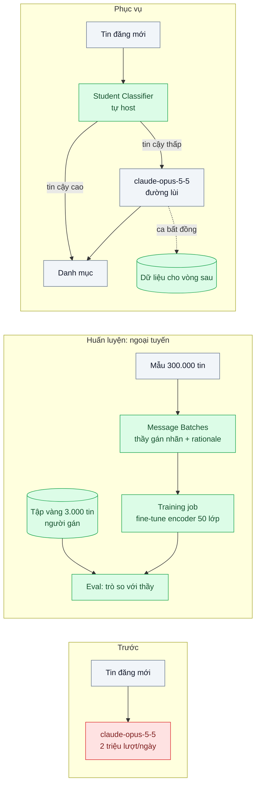
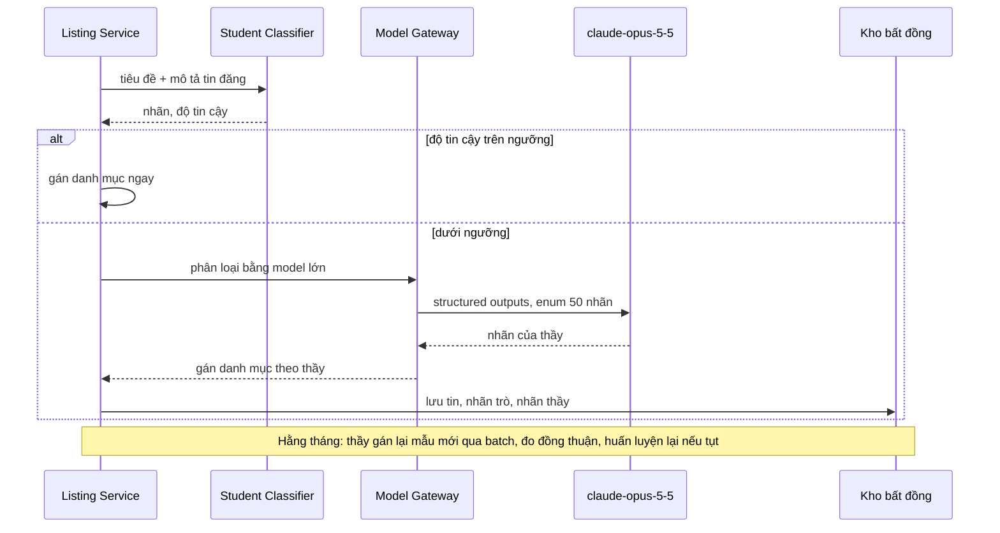

# Distillation to a Small Model — Phân loại 50 nhãn chạy 2 triệu lần/ngày trên model lớn

| Scope | Mức độ | Trạng thái | Pattern gốc | Cập nhật |
|---|---|---|---|---|
| 22 · backend / AI optimizer | 🔴 Nâng cao | 📋 Kế hoạch | Knowledge Distillation — Hinton, Vinyals, Dean, "Distilling the Knowledge in a Neural Network" (2015); Hsieh et al., "Distilling Step-by-Step" (2023) | 2026-10-06 |

> **Một câu tóm tắt:** Dùng model lớn làm "thầy" gán nhãn một mẫu lớn (qua Message Batches), huấn luyện một model nhỏ tự host làm "trò" cho tác vụ phân loại hẹp, và giữ model lớn làm đường lùi cho ca trò không chắc.

## 1. Bài toán thực tế (What)

**Bối cảnh** *(doanh nghiệp giả định, số liệu minh họa)*
Sàn TMĐT phân loại mỗi tin đăng sản phẩm của người bán vào 1 trong 50 danh mục để hiển thị, tính phí và kiểm duyệt. Khoảng 2 triệu lượt/ngày (tin mới và tin sửa). Hiện mỗi tin gửi `claude-opus-5-5` với prompt khoảng 600 token và nhận về khoảng 20 token nhãn. Độ chính xác đội vận hành chấp nhận được.

**Triệu chứng người kinh doanh nhìn thấy**
- Chi phí khoảng 5.600 USD/ngày cho một tác vụ "chỉ là gán nhãn": 1,2 tỷ token vào × $4/triệu + 40 triệu token ra × $20/triệu (giá tại thời điểm viết, kiểm tra lại trang Pricing).
- Người bán chờ 1–2 giây sau khi bấm "Đăng tin" để có danh mục; đợt khuyến mãi lớn, hàng đợi phân loại dồn hàng giờ vì chạm hạn mức API.

**Nguyên nhân kỹ thuật**
Tác vụ hẹp, đầu vào ngắn, nhãn cố định, khối lượng rất lớn và lặp lại mỗi ngày: đúng loại việc mà một model nhỏ chuyên biệt làm được với chi phí và độ trễ thấp hơn nhiều. Model lớn đang được dùng vì nó "biết sẵn" mà không cần dữ liệu huấn luyện; nhưng chính model lớn có thể tạo ra dữ liệu huấn luyện đó.

**Ràng buộc**
- Độ chính xác (macro-F1 trên tập vàng do người gán) không thấp hơn model lớn quá ngưỡng đội vận hành đặt.
- p95 độ trễ phân loại dưới 100 ms.
- Việc dùng đầu ra của model nhà cung cấp để huấn luyện model khác phải phù hợp điều khoản sử dụng của nhà cung cấp (cần xác minh với điều khoản hiện hành trước khi làm).

## 2. Vì sao dùng pattern này (Why)

**Nguyên nhân gốc mà pattern nhắm vào:** Trả giá của năng lực tổng quát cho một tác vụ hẹp chạy hàng triệu lần.

**Pattern giải quyết thế nào:** Hinton, Vinyals, Dean đề xuất chưng cất: huấn luyện model nhỏ bắt chước model lớn. Bản gốc dùng phân phối xác suất mềm của model thầy; qua API ta chỉ có nhãn cứng và lời giải thích, nên đây là chưng cất "hộp đen". Hsieh et al. ("Distilling Step-by-Step") cho thấy dùng thêm lời giải thích của model lớn làm tín hiệu huấn luyện phụ giúp model nhỏ cần ít dữ liệu hơn. Quy trình:
1. **Thầy gán nhãn:** lấy mẫu phân tầng khoảng 300.000 tin, gửi `claude-opus-5-5` qua Message Batches (giảm 50%) với structured outputs `{category, rationale}`.
2. **Tập vàng:** 3.000 tin do người gán, chỉ dùng để đánh giá, không dùng để huấn luyện.
3. **Trò:** fine-tune một encoder đa ngôn ngữ cỡ nhỏ làm bộ phân loại 50 lớp trên nhãn của thầy; biến thể thử nghiệm dùng thêm `rationale` theo kiểu Distilling Step-by-Step.
4. **Cascade khi phục vụ:** trò trả nhãn và độ tin cậy; dưới ngưỡng thì chuyển sang model lớn (bài 03). Ca bất đồng được lưu lại làm dữ liệu cho vòng huấn luyện sau.
5. **Giám sát trôi dữ liệu:** theo dõi phân phối nhãn và độ tin cậy; định kỳ cho thầy gán lại một mẫu mới để đo độ đồng thuận.

**Lựa chọn khác đã cân nhắc**

| Lựa chọn | Giải quyết được gì | Vì sao không chọn (ở bài này) |
|---|---|---|
| Giữ nguyên + tối ưu nhỏ (prompt caching, effort thấp, rút gọn prompt) | Giảm đáng kể phần input lặp lại | Vẫn trả giá model lớn cho 2 triệu lượt và vẫn phụ thuộc hạn mức API; nên làm ngay trong lúc chờ |
| Chuyển sang `claude-haiku-4-5` | Rẻ hơn nhiều, không cần huấn luyện | Cần eval; vẫn là chi phí theo token và độ trễ mạng ở mức hàng trăm ms |
| Message Batches cho toàn bộ | Giảm 50% | Người bán cần danh mục ngay khi đăng tin, không chờ được tới 24 giờ |
| Gán nhãn tay để huấn luyện | Nhãn chất lượng cao | Chậm và đắt cho 300.000 mẫu; dùng người cho tập vàng là đủ |
| **Chưng cất: thầy gán nhãn qua batch, trò tự host, cascade về thầy (chọn)** | Chi phí và độ trễ thấp ở quy mô lớn, giữ chất lượng nhờ đường lùi | Đầu tư huấn luyện và vận hành model; phải giám sát trôi dữ liệu |

## 3. Thiết kế hệ thống (How)

### 3.1 Kiến trúc trước và sau



### 3.2 Luồng chính



### 3.3 Thành phần và trách nhiệm

| Thành phần | Trách nhiệm | Quyết định thiết kế đáng chú ý |
|---|---|---|
| Bộ lấy mẫu | Chọn 300.000 tin phân tầng theo danh mục và người bán | Bù danh mục hiếm để trò không bỏ qua lớp nhỏ |
| Teacher labeling | Gửi mẫu qua Message Batches, structured outputs | Ghép kết quả theo `custom_id`; lưu `rationale` cho biến thể step-by-step |
| Tập vàng | 3.000 tin người gán, khóa không cho huấn luyện | Là thước đo duy nhất để so trò, thầy và các phiên bản |
| Training job | Fine-tune encoder đa ngôn ngữ cỡ nhỏ | Python + Hugging Face; ghi phiên bản dữ liệu, siêu tham số, kết quả eval |
| Student Classifier | Phục vụ nhãn và độ tin cậy, p95 < 100 ms | Tự host trên CPU/GPU nhỏ; ngưỡng tin cậy chọn trên tập vàng theo tỉ lệ lỗi chấp nhận |
| Đường lùi + kho bất đồng | Chuyển ca không chắc sang thầy, lưu bất đồng | Tỉ lệ đường lùi là chỉ số chi phí và chỉ báo trôi dữ liệu |

### 3.4 Điểm dễ sai khi triển khai
- Đánh giá trò bằng nhãn của thầy: trò học cả lỗi của thầy và đạt điểm cao giả. Luôn đo trên tập vàng do người gán.
- Bỏ quên danh mục hiếm: accuracy cao nhưng macro-F1 thấp; lấy mẫu phân tầng và báo cáo theo lớp.
- Ngưỡng tin cậy đặt theo cảm tính: chọn trên tập vàng theo đường cong "tỉ lệ đường lùi – độ chính xác".
- Không giám sát trôi dữ liệu: mùa vụ mới, sản phẩm mới, trò sai dần mà không ai biết.
- Quên điều khoản sử dụng: kiểm điều khoản nhà cung cấp về việc dùng đầu ra để huấn luyện model trước khi bắt đầu.

## 4. Tech stack và tác động (Impact techstack)

| Lớp | Công nghệ chọn | Vì sao chọn | Thay thế tương đương |
|---|---|---|---|
| Gán nhãn | `@anthropic-ai/sdk`, Message Batches, structured outputs, `claude-opus-5-5` | Rẻ một nửa, nhãn đúng schema | `claude-sonnet-5-5` nếu eval cho thấy đủ chính xác |
| Huấn luyện | Python + Hugging Face Transformers (cần xác minh phiên bản), encoder đa ngôn ngữ cỡ nhỏ | Hệ sinh thái huấn luyện chuẩn; lệch stack TypeScript vì công cụ huấn luyện chủ yếu ở Python | — |
| Phục vụ trò | Hugging Face TEI cho model phân loại (cần xác minh hỗ trợ sequence classification) | Server HTTP sẵn có, chạy CPU/GPU | ONNX Runtime trong service riêng |
| Gateway và đường lùi | NestJS (Model Gateway hiện có) | Cài cascade một chỗ | — |
| Dữ liệu | PostgreSQL 16: mẫu, nhãn thầy, tập vàng, kho bất đồng | Truy vấn để lấy mẫu và đo | Object storage cho tập lớn |
| Đo và giám sát | Script eval Python; Prometheus cho độ trễ, tỉ lệ đường lùi, phân phối nhãn | Thấy trôi dữ liệu sớm | Evidently (cần xác minh) |

Giá tại thời điểm viết (kiểm tra lại trang Pricing): `claude-opus-5-5` $4/$20, `claude-sonnet-5-5` $2/$10, `claude-haiku-4-5` $1/$5 mỗi triệu token vào/ra; batch giảm 50%.

**Thay đổi so với hệ thống hiện tại:** Thêm pipeline gán nhãn và huấn luyện, dịch vụ phục vụ model nhỏ, cascade ở gateway, giám sát trôi dữ liệu. Đội cần người vận hành model (huấn luyện lại, theo dõi chất lượng) — chi phí con người phải tính vào phương án.

## 5. Kết quả đầu ra và cách đo (Output impact)

| Chỉ số | Trước (minh họa) | Mục tiêu khi thực hành | Cách đo |
|---|---|---|---|
| Macro-F1 trên tập vàng 3.000 tin | của thầy (đo trước) | trò + đường lùi không thấp hơn thầy quá ngưỡng đặt trước | Script eval, báo theo từng danh mục |
| Chi phí phân loại / ngày | ~5.600 USD | ghi số thật | Hạ tầng phục vụ trò + `usage` đường lùi × đơn giá |
| p95 độ trễ phân loại | 1,5 giây | < 100 ms cho ca trò xử lý | Histogram ở Listing Service |
| Tỉ lệ chuyển sang đường lùi | 100% | ghi số thật, theo dõi xu hướng | Counter ở gateway |
| Độ đồng thuận trò–thầy trên mẫu hằng tháng | không có | ổn định, cảnh báo khi tụt | Batch gán lại 5.000 tin mới, so nhãn |

> Số "trước" là minh họa để hình dung bài toán. Số "mục tiêu" chỉ được coi là đạt khi có số đo thật
> ở mục 8 kèm môi trường đo.

**Tác động nghiệp vụ mong đợi:** Chi phí tác vụ gán danh mục giảm về mức chấp nhận được, người bán có danh mục gần như tức thì, đợt khuyến mãi không còn dồn hàng đợi vì hạn mức API.

## 6. Đánh đổi và khi KHÔNG nên dùng

**Đánh đổi**
- Đầu tư ban đầu (gán nhãn, huấn luyện, hạ tầng) và chi phí vận hành model lâu dài.
- Thêm một nguồn lỗi mới (trôi dữ liệu) phải giám sát.
- Đổi danh mục phải huấn luyện lại; model lớn chỉ cần sửa prompt.

**Không nên dùng khi**
- Khối lượng chưa đủ lớn để hoàn vốn so với model nhỏ qua API hoặc caching.
- Chưa có tập vàng do người gán: không có cách chứng minh trò đủ tốt.

**Liên quan**
- [02 — Batch Processing](../02-batch-api-phan-loai-1-trieu-ticket-cu/) — cách rẻ để thầy gán nhãn.
- [03 — Model Routing / Cascade](../03-model-routing-cascade-80-phan-tram-cau-don-gian-vao-model-dat/) — cascade trò → thầy.
- [Input Drift Detection (scope 24)](../../24-backend-ai-monitoring/08-drift-detection-phan-phoi-cau-hoi-doi-sau-chien-dich-marketing/) — giám sát trôi dữ liệu.

## 7. Cơ sở tham khảo

- Hinton, Vinyals, Dean, "Distilling the Knowledge in a Neural Network", 2015 — định nghĩa chưng cất thầy–trò bằng nhãn mềm; nền tảng của pattern.
- Hsieh et al., "Distilling Step-by-Step! Outperforming Larger Language Models with Less Training Data and Smaller Model Sizes", 2023 — dùng lời giải thích của model lớn làm tín hiệu huấn luyện phụ cho model nhỏ.
- Anthropic docs, "Batch processing" — https://platform.claude.com/docs/en/build-with-claude/batch-processing — gán nhãn số lượng lớn với chi phí giảm 50%.
- Chip Huyen, *AI Engineering*, O'Reilly, 2025 — chương về tối ưu suy luận và fine-tuning: khi nào model nhỏ chuyên biệt đáng đầu tư.

## 8. Kế hoạch thực hành

- [ ] Bước 1: Thu tập 50.000 tin mẫu công khai hoặc tổng hợp (thay 300.000), 50 danh mục, 1.000 tin người gán làm tập vàng; kiểm điều khoản sử dụng.
- [ ] Bước 2: Đo "trước": macro-F1 của `claude-opus-5-5` trên tập vàng, chi phí theo `usage`, p95 độ trễ.
- [ ] Bước 3: Áp dụng pattern: gán nhãn qua batch, fine-tune encoder, phục vụ qua TEI, cascade theo ngưỡng tin cậy, kho bất đồng.
- [ ] Bước 4: Đo "sau": macro-F1 theo lớp, tỉ lệ đường lùi, độ trễ, chi phí; thử biến thể có `rationale`; ghi vào mục 5 kèm phần cứng và phiên bản model.
- [ ] Bước 5: Test chứng minh: ca dưới ngưỡng luôn đi đường lùi; tập vàng không lọt vào dữ liệu huấn luyện; nhãn trả về luôn thuộc 50 danh mục.

**Cấu trúc code dự kiến**
```text
labeling/
  sample-listings.ts         # lấy mẫu phân tầng
  teacher-batch.ts           # Message Batches, structured outputs
training/
  train-classifier.py        # fine-tune encoder 50 lớp
  evaluate.py                # macro-F1 theo lớp trên tập vàng
src/
  gateway/student-cascade.ts # ngưỡng tin cậy, đường lùi
test/
  student-cascade.test.ts
docker-compose.yml           # TEI phục vụ model trò, PostgreSQL
```

**Cách chạy** *(điền khi bắt đầu code)*
```bash
docker compose up -d
pnpm install && pnpm test
python training/train-classifier.py && python training/evaluate.py
```
