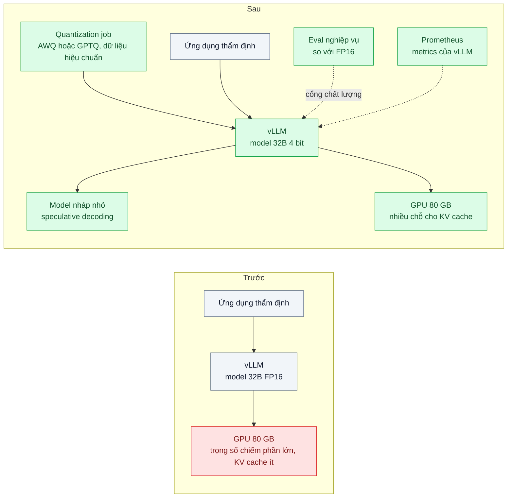
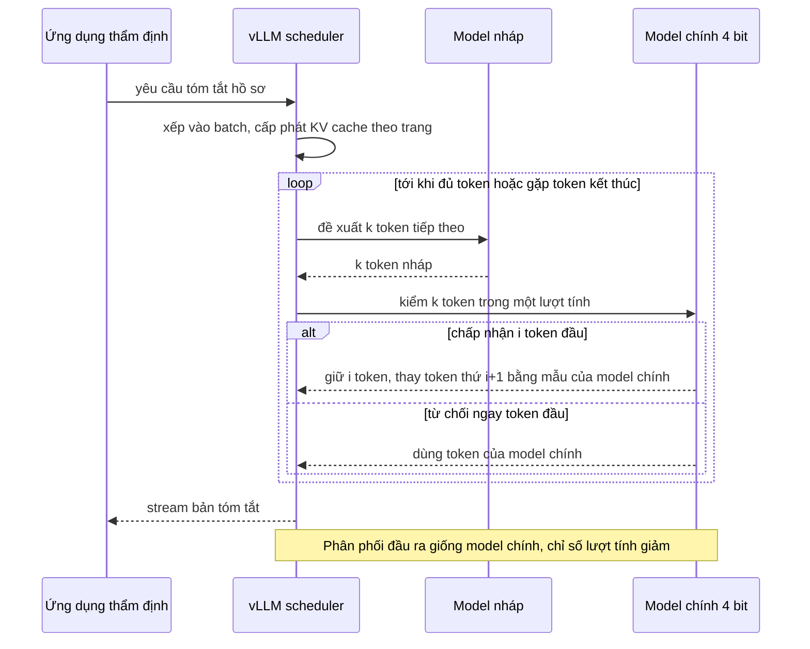

# Quantization & Speculative Decoding (self-host) — Mô hình tự host chậm 20 token/s và tốn 80 GB VRAM

| Scope | Mức độ | Trạng thái | Pattern gốc | Cập nhật |
|---|---|---|---|---|
| 22 · backend / AI optimizer | 🔴 Nâng cao | 📋 Kế hoạch | Quantization — Frantar et al., "GPTQ" (2022); Lin et al., "AWQ" (2023); Speculative Decoding — Leviathan, Kalman, Matias (ICML 2023) | 2026-10-06 |

> **Một câu tóm tắt:** Lượng tử hóa trọng số xuống 4 bit để giải phóng VRAM cho KV cache và batch lớn hơn, cộng speculative decoding (model nháp đề xuất, model chính kiểm) để tăng token/giây mỗi luồng, rồi đo lại chất lượng trên bộ eval nghiệp vụ trước khi đổi.

## 1. Bài toán thực tế (What)

**Bối cảnh** *(doanh nghiệp giả định, số liệu minh họa)*
Công ty bảo hiểm sức khỏe tự host một mô hình mở khoảng 32B tham số vì hồ sơ y tế không được rời hạ tầng của công ty theo yêu cầu tuân thủ nội bộ. Mô hình chạy bằng vLLM ở FP16 trên một GPU 80 GB, phục vụ hai tác vụ cho khoảng 40 nhân viên thẩm định: tóm tắt hồ sơ bồi thường và trích xuất trường từ giấy ra viện.

**Triệu chứng người kinh doanh nhìn thấy**
- Một bản tóm tắt 600 token mất khoảng 30 giây (khoảng 20 token/giây mỗi luồng); giờ cao điểm nhân viên xếp hàng chờ.
- Trọng số FP16 chiếm phần lớn VRAM (khoảng 64 GB, ước lượng từ 32B × 2 byte); phần còn lại cho KV cache ít nên chỉ phục vụ được vài request đồng thời.
- Đề xuất mua GPU thứ hai bị hoãn vì ngân sách; đội thẩm định muốn mở thêm tác vụ mới.

**Nguyên nhân kỹ thuật**
Sinh token là quá trình tuần tự, mỗi token cần đọc toàn bộ trọng số từ bộ nhớ GPU; ở batch nhỏ, tốc độ bị giới hạn bởi băng thông bộ nhớ chứ không phải năng lực tính toán. Trọng số 16 bit vừa tốn VRAM (ít chỗ cho KV cache, batch nhỏ) vừa tốn băng thông mỗi token. Không có cơ chế nào tận dụng phần năng lực tính toán đang rảnh khi batch nhỏ.

**Ràng buộc**
- Dữ liệu không rời hạ tầng nội bộ; không chuyển sang API bên ngoài.
- Chất lượng tóm tắt và độ chính xác trích xuất không giảm quá ngưỡng đội thẩm định đặt.
- Giữ trên một GPU hiện có trong ít nhất 6 tháng.

## 2. Vì sao dùng pattern này (Why)

**Nguyên nhân gốc mà pattern nhắm vào:** Suy luận ở batch nhỏ bị giới hạn bởi bộ nhớ (dung lượng và băng thông), không bởi tính toán.

**Pattern giải quyết thế nào:** Hai kỹ thuật bổ sung nhau:
1. **Lượng tử hóa trọng số (weight-only, 4 bit) bằng AWQ hoặc GPTQ.** GPTQ lượng tử hóa sau huấn luyện dựa trên thông tin bậc hai, AWQ bảo vệ các kênh trọng số quan trọng dựa trên phân phối activation; cả hai cần một tập dữ liệu hiệu chuẩn nhỏ. Về lý thuyết, trọng số 4 bit chiếm khoảng một phần tư dung lượng FP16 (cộng phần phụ trội cho hệ số scale). VRAM giải phóng dành cho KV cache nên vLLM gom được batch lớn hơn (continuous batching, PagedAttention ở scope 21 bài 03); mỗi token cũng đọc ít byte hơn.
2. **Speculative decoding.** Một model nháp nhỏ (cùng tokenizer) đề xuất k token, model chính kiểm cả k token trong một lượt tính; token được chấp nhận giữ nguyên, token đầu tiên bị từ chối được thay bằng mẫu từ model chính. Leviathan et al. chứng minh phân phối đầu ra giống hệt model chính. Lợi ích lớn nhất ở batch nhỏ (khi tính toán đang rảnh); ở batch lớn có thể không còn lợi.
Thứ tự làm: lượng tử hóa → đo chất lượng → nếu đạt, thêm speculative decoding → đo token/giây ở nhiều mức đồng thời.

**Lựa chọn khác đã cân nhắc**

| Lựa chọn | Giải quyết được gì | Vì sao không chọn (ở bài này) |
|---|---|---|
| Giữ nguyên + tối ưu nhỏ (giới hạn độ dài đầu ra, chỉnh tham số batch của vLLM) | Bớt một phần hàng đợi | Không thay đổi giới hạn bộ nhớ gốc |
| Mua thêm GPU | Gấp đôi năng lực | Ngân sách bị hoãn; chi phí cố định cao |
| Dùng API bên ngoài (scope 21 bài 01) | Không cần vận hành GPU | Vi phạm yêu cầu dữ liệu không rời hạ tầng |
| Chuyển sang model nhỏ hơn hoặc chưng cất (bài 08) | Nhanh và rẻ hơn hẳn | Tóm tắt hồ sơ cần năng lực của model lớn; cần dữ liệu huấn luyện |
| Lượng tử hóa FP8 | Ít mất chất lượng hơn 4 bit | Phụ thuộc thế hệ GPU hỗ trợ; tiết kiệm VRAM ít hơn — là phương án dự phòng nếu 4 bit mất chất lượng |
| **AWQ/GPTQ 4 bit + speculative decoding trên vLLM (chọn)** | Giải phóng VRAM, tăng batch, tăng token/giây trên GPU hiện có | Rủi ro mất chất lượng (đặc biệt tiếng Việt chuyên ngành); thêm model nháp phải quản lý |

## 3. Thiết kế hệ thống (How)

### 3.1 Kiến trúc trước và sau



### 3.2 Luồng chính



### 3.3 Thành phần và trách nhiệm

| Thành phần | Trách nhiệm | Quyết định thiết kế đáng chú ý |
|---|---|---|
| Quantization job | Tạo checkpoint 4 bit bằng AWQ hoặc GPTQ | Dữ liệu hiệu chuẩn lấy từ văn bản nghiệp vụ tiếng Việt (đã ẩn danh), không chỉ văn bản tiếng Anh mặc định |
| vLLM | Nạp checkpoint lượng tử hóa, continuous batching, speculative decoding | Cấu hình cụ thể theo phiên bản vLLM đang dùng (cần xác minh tham số); ghim phiên bản image |
| Model nháp | Đề xuất token | Cùng họ và cùng tokenizer với model chính; nhỏ hơn nhiều lần |
| Eval nghiệp vụ | 300 mẫu tóm tắt và trích xuất có đáp án | Cổng chặn: không đạt ngưỡng thì không đổi cấu hình production |
| Benchmark | Đo token/giây mỗi luồng, tổng token/giây, TTFT ở nhiều mức đồng thời | Cùng bộ prompt, cùng độ dài đầu ra, có warm-up |
| Giám sát | Scrape endpoint metrics của vLLM; `nvidia-smi` cho VRAM | Theo dõi tỉ lệ chấp nhận token nháp (tên metric cần xác minh) |

### 3.4 Điểm dễ sai khi triển khai
- Chỉ đo perplexity hoặc benchmark tiếng Anh: lượng tử hóa có thể làm giảm chất lượng tiếng Việt chuyên ngành mà benchmark chung không thấy. Đo trên eval nghiệp vụ.
- Đo token/giây ở một mức đồng thời rồi kết luận: speculative decoding có lợi ở batch nhỏ, có thể bất lợi ở batch lớn. Đo cả hai chế độ.
- Model nháp khác tokenizer hoặc lệch phân phối quá nhiều: tỉ lệ chấp nhận thấp, chậm hơn không dùng.
- Nhầm lượng tử hóa trọng số với lượng tử hóa vector embedding (scope 12 bài 04): cùng tên, khác bài toán.
- Benchmark không warm-up hoặc mỗi lần một bộ prompt khác: số không so được.
- Nâng phiên bản vLLM mà không chạy lại eval và benchmark: hành vi kernel lượng tử hóa có thể đổi.

## 4. Tech stack và tác động (Impact techstack)

| Lớp | Công nghệ chọn | Vì sao chọn | Thay thế tương đương |
|---|---|---|---|
| Serving | vLLM (endpoint HTTP tương thích OpenAI) | Hỗ trợ checkpoint AWQ/GPTQ, continuous batching, speculative decoding, có metrics | SGLang, TensorRT-LLM (cần xác minh tính năng tương ứng) |
| Lượng tử hóa | Công cụ AWQ/GPTQ trong hệ sinh thái Python (ví dụ llm-compressor hoặc AutoAWQ, cần xác minh) | Sinh checkpoint vLLM nạp được | Checkpoint 4 bit có sẵn của nhà phát hành model |
| Hạ tầng | Docker Compose + NVIDIA Container Toolkit trên máy GPU | Tái hiện được cấu hình trước/sau | Kubernetes với device plugin (scope 21 bài 04) |
| Client & eval | TypeScript strict, Node 20+, gọi endpoint vLLM bằng `fetch`; Vitest cho eval runner | Cùng stack với ứng dụng thẩm định | Python |
| Benchmark | k6 hoặc script benchmark đi kèm vLLM (cần xác minh tên script) | Đo ở nhiều mức đồng thời, có percentiles | — |
| Giám sát | Prometheus + Grafana scrape metrics của vLLM | Thấy hàng đợi, KV cache, token/giây | — |

**Thay đổi so với hệ thống hiện tại:** Thêm job lượng tử hóa và model nháp, đổi cấu hình vLLM, thêm cổng eval và benchmark vào quy trình nâng cấp model. Đội hạ tầng học đọc metrics KV cache và tỉ lệ chấp nhận token nháp.

## 5. Kết quả đầu ra và cách đo (Output impact)

| Chỉ số | Trước (minh họa) | Mục tiêu khi thực hành | Cách đo |
|---|---|---|---|
| VRAM cho trọng số | ~64 GB | ghi số thật, kỳ vọng khoảng một phần tư | Log khởi động vLLM và `nvidia-smi` |
| Token/giây mỗi luồng ở 1 request đồng thời | 20 | ghi số thật cho từng cấu hình (4 bit, 4 bit + speculative) | Benchmark, cùng bộ 100 prompt, có warm-up |
| Tổng token/giây ở 16 request đồng thời | ghi số thật | ghi số thật, kỳ vọng tăng nhờ batch lớn hơn | Benchmark mức đồng thời 16; metrics vLLM |
| TTFT p50 / p95 giờ cao điểm | 6 / 20 giây | ghi số thật | k6 mô phỏng 40 người dùng |
| Điểm chất lượng tóm tắt và trích xuất | điểm FP16 | không thấp hơn FP16 quá ngưỡng đặt trước | Eval 300 mẫu, rubric + so trường trích xuất |
| Tỉ lệ chấp nhận token nháp | không có | ghi số thật | Metrics speculative decoding của vLLM |
| Chi phí GPU trên 1 triệu token | ghi số thật | ghi số thật | Giá GPU theo giờ ÷ token sinh ra mỗi giờ ở tải thực tế |

> Số "trước" là minh họa để hình dung bài toán. Số "mục tiêu" chỉ được coi là đạt khi có số đo thật
> ở mục 8 kèm môi trường đo.

**Tác động nghiệp vụ mong đợi:** Nhân viên thẩm định chờ ít hơn trên cùng một GPU, đủ dư địa mở thêm tác vụ mới mà vẫn giữ dữ liệu trong hạ tầng nội bộ.

## 6. Đánh đổi và khi KHÔNG nên dùng

**Đánh đổi**
- Rủi ro giảm chất lượng, đôi khi chỉ lộ ra ở một nhóm tác vụ hoặc ngôn ngữ cụ thể.
- Thêm thành phần (checkpoint lượng tử hóa, model nháp) phải quản lý phiên bản và đo lại mỗi lần nâng cấp.
- Lợi ích phụ thuộc phần cứng, phiên bản vLLM và mức đồng thời; không có con số chung.

**Không nên dùng khi**
- Đang dùng API của nhà cung cấp: các tối ưu này nằm ở phía nhà cung cấp; dùng caching, batch, effort thay thế.
- GPU đã chạy batch lớn và bị giới hạn bởi tính toán: speculative decoding ít hoặc không có lợi.
- Tác vụ cực nhạy với sai số nhỏ mà chưa có eval nghiệp vụ: chưa có cách chứng minh an toàn.

**Liên quan**
- [08 — Distillation](../08-distillation-fine-tune-model-nho-phan-loai-50-nhan/) — thu nhỏ model bằng huấn luyện thay vì nén.
- [Model Serving với vLLM (scope 21)](../../21-backend-ai-infrastructure/03-vllm-serving-continuous-batching-tu-host-50-req-s/) — continuous batching và PagedAttention.
- [Prefix / KV Caching at Serving Layer (scope 21)](../../21-backend-ai-infrastructure/07-inference-cache-kv-prefix-caching-system-prompt-5k-token-moi-request/) — tối ưu khác ở tầng phục vụ.
- [Vector Quantization (scope 12)](../../12-backend-database-vector/04-quantization-100-trieu-vector-600gb-ram/) — cùng tên, khác đối tượng.

## 7. Cơ sở tham khảo

- Frantar et al., "GPTQ: Accurate Post-Training Quantization for Generative Pre-trained Transformers", 2022 — lượng tử hóa sau huấn luyện xuống 3–4 bit bằng thông tin bậc hai.
- Lin et al., "AWQ: Activation-aware Weight Quantization for LLM Compression and Acceleration", 2023 — bảo vệ kênh trọng số quan trọng dựa trên activation.
- Leviathan, Kalman, Matias, "Fast Inference from Transformers via Speculative Decoding", ICML 2023 — cơ chế nháp–kiểm và chứng minh phân phối đầu ra không đổi.
- vLLM docs — https://docs.vllm.ai/ — nạp model lượng tử hóa, speculative decoding, metrics (trang con và tham số cụ thể cần xác minh theo phiên bản).
- Kwon et al., "Efficient Memory Management for Large Language Model Serving with PagedAttention", SOSP 2023 — vì sao VRAM giải phóng chuyển thành batch lớn hơn.

## 8. Kế hoạch thực hành

- [ ] Bước 1: Máy có 1 GPU, vLLM ghim phiên bản; model mở FP16 cỡ phù hợp GPU sẵn có (thu nhỏ nếu cần); 100 prompt benchmark và 300 mẫu eval nghiệp vụ đã ẩn danh.
- [ ] Bước 2: Đo "trước": VRAM, token/giây ở 1 và 16 đồng thời, TTFT, điểm eval.
- [ ] Bước 3: Áp dụng pattern: lượng tử hóa AWQ (và GPTQ để so), chạy eval làm cổng; sau đó bật speculative decoding với model nháp cùng họ.
- [ ] Bước 4: Đo "sau" từng cấu hình; ghi vào mục 5 kèm GPU, driver, phiên bản vLLM, model, ngày.
- [ ] Bước 5: Test Vitest cho eval runner: cổng chất lượng chặn cấu hình dưới ngưỡng; trích xuất trường so khớp đúng định dạng; benchmark bỏ qua giai đoạn warm-up.

**Cấu trúc code dự kiến**
```text
quantize/
  quantize-awq.py              # sinh checkpoint 4 bit
src/
  client/vllm-client.ts        # fetch tới endpoint vLLM
  eval/quality-gate.ts         # 300 mẫu, so với FP16
bench/
  throughput.k6.js             # 1 và 16 đồng thời
deploy/
  docker-compose.gpu.yml       # vLLM, Prometheus, Grafana
test/
  quality-gate.test.ts
```

**Cách chạy** *(điền khi bắt đầu code)*
```bash
docker compose -f deploy/docker-compose.gpu.yml up -d
pnpm install && pnpm test
k6 run bench/throughput.k6.js
```
