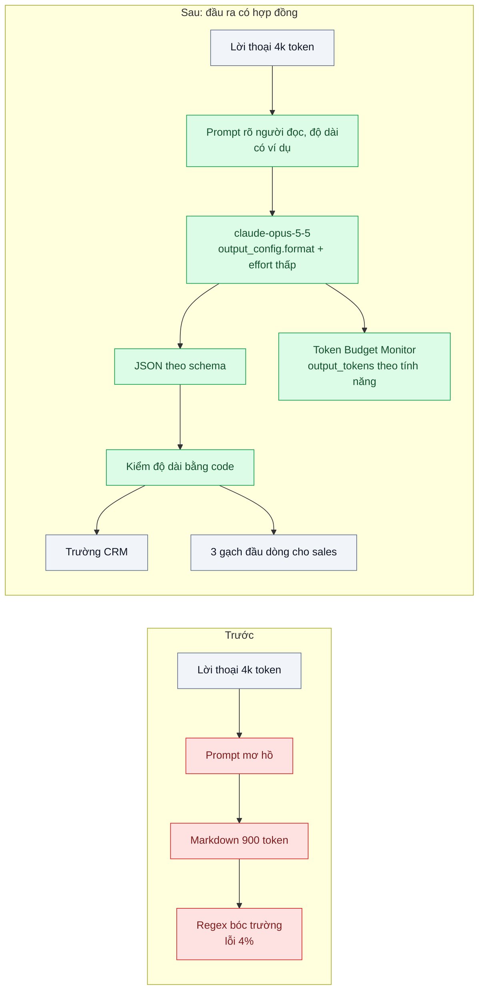
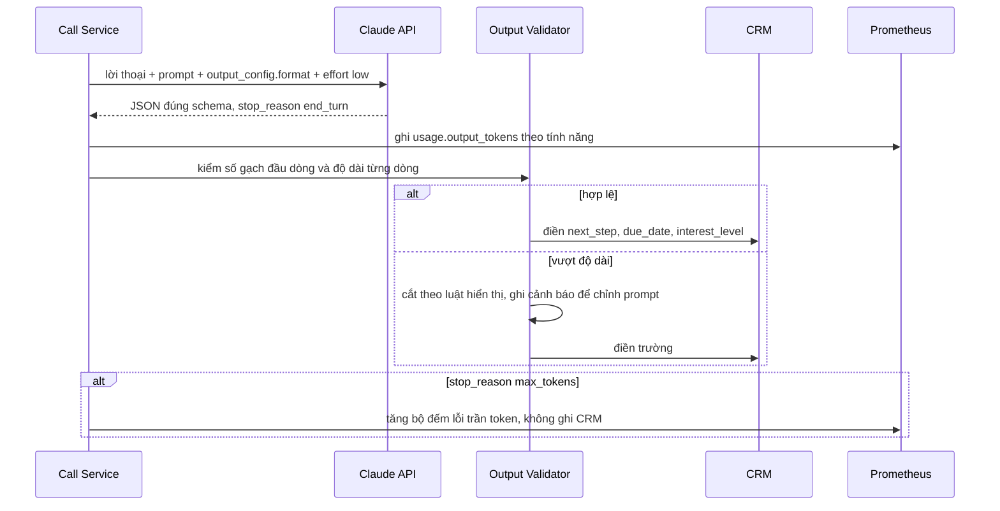

# Output Token Discipline — Model trả lời dài gấp 3 cần thiết; token đầu ra đắt gấp 5 lần token đầu vào

| Scope | Mức độ | Trạng thái | Pattern gốc | Cập nhật |
|---|---|---|---|---|
| 22 · backend / AI optimizer | 🟢 Cơ bản | 📋 Kế hoạch | Output Token Discipline — Anthropic docs "Pricing" (giá output so với input), "Structured outputs", prompt engineering docs | 2026-10-06 |

> **Một câu tóm tắt:** Định nghĩa đầu ra theo đúng thứ người dùng và hệ thống cần (schema có trường cụ thể, độ dài nêu rõ), ép bằng structured outputs và prompt, dùng `max_tokens` chỉ làm trần an toàn, và đo `output_tokens` theo từng tính năng.

## 1. Bài toán thực tế (What)

**Bối cảnh** *(doanh nghiệp giả định, số liệu minh họa)*
Phần mềm CRM SaaS có tính năng "tóm tắt cuộc gọi": sau mỗi cuộc gọi bán hàng, bản ghi lời thoại (khoảng 4.000 token) được gửi `claude-opus-5-5` để tạo bản tóm tắt và gợi ý bước tiếp theo, rồi điền vào các trường của cơ hội bán hàng. Khoảng 150.000 cuộc gọi/tháng.

**Triệu chứng người kinh doanh nhìn thấy**
- Bản tóm tắt trung bình khoảng 900 token: câu mở đầu "Dưới đây là bản tóm tắt chi tiết...", nhắc lại lời thoại, tiêu đề markdown, 8 gợi ý chung chung. Nhân viên sales nói chỉ đọc 3 dòng đầu.
- Chi phí đầu ra (khoảng 135 triệu token × $20/triệu ≈ 2.700 USD/tháng) vượt chi phí đầu vào (600 triệu token × $4/triệu ≈ 2.400 USD/tháng) dù số token ra ít hơn nhiều (giá tại thời điểm viết, kiểm tra lại trang Pricing).
- Khoảng 4% lần điền trường CRM thất bại vì code dùng regex bóc "Bước tiếp theo:" từ markdown, mỗi lần model viết khác một chút.

**Nguyên nhân kỹ thuật**
Prompt chỉ nói "tóm tắt cuộc gọi và đề xuất bước tiếp theo", không nói cho ai đọc, dài bao nhiêu, định dạng gì; model mặc định trả lời đầy đủ và lịch sự. Với giá token ra gấp 5 lần token vào (cả ba model trong bảng giá hiện tại đều theo tỉ lệ này), mỗi token thừa ở đầu ra đắt gấp 5 lần một token ở đầu vào. Đầu ra dạng văn bản tự do lại bị máy đọc bằng regex.

**Ràng buộc**
- Không mất thông tin quan trọng: cam kết với khách, hạn chót, phản đối của khách.
- Trường CRM (bước tiếp theo, hạn, mức độ quan tâm) phải luôn parse được.
- Sales vẫn có bản tóm tắt người đọc được trên màn hình.

## 2. Vì sao dùng pattern này (Why)

**Nguyên nhân gốc mà pattern nhắm vào:** Đầu ra không có hợp đồng: không ai định nghĩa người tiêu thụ cần gì, nên model sinh nhiều hơn mức cần và theo hình dạng không ổn định.

**Pattern giải quyết thế nào:**
1. **Hợp đồng đầu ra theo người tiêu thụ:** CRM cần trường có cấu trúc; sales cần tối đa 3 gạch đầu dòng, mỗi dòng một ý. Viết thành JSON Schema: `summary_bullets`, `commitments`, `next_step`, `due_date`, `interest_level` (enum).
2. **Structured outputs** (`output_config.format` với JSON Schema): đầu ra luôn đúng schema, bỏ regex. Giới hạn độ dài nêu trong mô tả trường và kiểm lại bằng code; từ khóa JSON Schema nào được hỗ trợ xem trang Structured outputs.
3. **Prompt nói rõ người đọc, độ dài, điều không viết:** không mở đầu, không nhắc lại lời thoại, không gợi ý chung chung; kèm một ví dụ đầu ra mẫu. Prompt quản lý như code (scope 20 bài 02).
4. **Effort phù hợp:** tóm tắt là tác vụ đơn giản; effort thấp giảm phần suy nghĩ và phần mở đầu (bài 04).
5. **`max_tokens` là trần an toàn:** đặt rộng hơn mức cần để không cắt ngang JSON; theo dõi `stop_reason: "max_tokens"` như một lỗi.
6. **Ngân sách token theo tính năng:** đo phân phối `usage.output_tokens`, cảnh báo khi vượt ngân sách.

**Lựa chọn khác đã cân nhắc**

| Lựa chọn | Giải quyết được gì | Vì sao không chọn (ở bài này) |
|---|---|---|
| Giữ nguyên + tối ưu nhỏ: hạ `max_tokens` xuống 200 | Có trần chi phí | Model không biết trần, câu trả lời bị cắt ngang, JSON hỏng (`stop_reason: "max_tokens"`) |
| Cắt bớt văn bản sau khi nhận | Màn hình gọn hơn | Token đã sinh vẫn bị tính tiền |
| Chuyển sang model rẻ hơn | Giảm đơn giá | Vẫn dài dòng; nên làm *sau* khi đầu ra đã gọn (bài 03) |
| **Hợp đồng đầu ra + structured outputs + prompt rõ + đo theo tính năng (chọn)** | Ít token ra hơn, trường CRM luôn đúng, không đổi model | Phải thống nhất hợp đồng với người dùng; schema cần bảo trì |

## 3. Thiết kế hệ thống (How)

### 3.1 Kiến trúc trước và sau



### 3.2 Luồng chính



### 3.3 Thành phần và trách nhiệm

| Thành phần | Trách nhiệm | Quyết định thiết kế đáng chú ý |
|---|---|---|
| Hợp đồng đầu ra (JSON Schema) | Định nghĩa trường và giới hạn theo người tiêu thụ | Viết cùng đội sales và đội CRM; có version |
| Prompt | Người đọc, độ dài, điều không viết, ví dụ mẫu | Quản lý như code, đổi phải qua eval |
| Structured outputs | Ép đầu ra đúng schema | Thay regex; không ép tool bằng `tool_choice` kiểu `any`/`tool` vì `claude-opus-5-5` trả lỗi 400 với kiểu này |
| Output Validator | Kiểm độ dài, số phần tử, ngày hợp lệ | Lỗi độ dài ghi cảnh báo để chỉnh prompt, không làm hỏng luồng |
| `max_tokens` | Trần an toàn | Rộng hơn p99 thực tế; chạm trần là sự cố cần điều tra |
| Token Budget Monitor | Phân phối `output_tokens` theo tính năng, cảnh báo vượt ngân sách | Dữ liệu cho scope 24 bài 02 |

### 3.4 Điểm dễ sai khi triển khai
- Dùng `max_tokens` để "ép ngắn": model không biết trần, bị cắt giữa chừng, JSON hỏng.
- Chỉ viết "hãy ngắn gọn": mơ hồ; nêu cụ thể số dòng, số chữ, người đọc và điều không viết.
- Rút gọn quá tay làm mất cam kết với khách: eval phải kiểm sự có mặt của cam kết và hạn chót, không chỉ độ dài.
- Quên phần suy nghĩ: với thinking bật, token suy nghĩ cũng là token ra; chỉnh effort cùng lúc với prompt.
- Tin rằng mọi từ khóa JSON Schema đều được ép: kiểm danh sách hỗ trợ trong docs và kiểm lại bằng code.
- Không đo theo tính năng: tổng hóa đơn giảm nhưng không biết tính năng nào còn dài dòng.

## 4. Tech stack và tác động (Impact techstack)

| Lớp | Công nghệ chọn | Vì sao chọn | Thay thế tương đương |
|---|---|---|---|
| Ngôn ngữ / runtime | TypeScript strict, Node 20+ | Zod định nghĩa schema, sinh JSON Schema và kiểm lại | Python + Pydantic |
| HTTP app / worker | NestJS worker xử lý sau cuộc gọi | Đang dùng | Fastify |
| Model & SDK | `@anthropic-ai/sdk`, `claude-opus-5-5`, structured outputs (`output_config.format`, helper `messages.parse`), `output_config.effort` | Đầu ra đúng schema, kiểm soát phần suy nghĩ | — |
| Đo lường | Prometheus histogram `output_tokens` theo tính năng | Thấy ngay tính năng nào vượt ngân sách | Langfuse |
| Eval | 200 cuộc gọi mẫu có danh sách cam kết tham chiếu; runner Vitest | Bảo đảm gọn mà không mất ý | promptfoo |

Giá tại thời điểm viết (kiểm tra lại trang Pricing): `claude-opus-5-5` $4/$20, `claude-sonnet-5-5` $2/$10, `claude-haiku-4-5` $1/$5 mỗi triệu token vào/ra — token ra đắt gấp 5 lần token vào ở cả ba.

**Thay đổi so với hệ thống hiện tại:** Thêm schema đầu ra, viết lại prompt, bỏ regex, thêm validator và metric theo tính năng. Đội sản phẩm sở hữu hợp đồng đầu ra; mọi tính năng LLM mới phải khai báo ngân sách token ra.

## 5. Kết quả đầu ra và cách đo (Output impact)

| Chỉ số | Trước (minh họa) | Mục tiêu khi thực hành | Cách đo |
|---|---|---|---|
| `output_tokens` p50 / p95 mỗi bản tóm tắt | 900 / 1.400 | ghi số thật, kỳ vọng khoảng một phần ba | `usage.output_tokens`, histogram theo tính năng |
| Chi phí đầu ra / tháng | ~2.700 USD | ghi số thật | Tổng `output_tokens` × đơn giá token ra |
| Tỉ lệ điền trường CRM thất bại | 4% | 0% | Đếm lỗi parse/validate ở worker |
| Tỉ lệ `stop_reason: "max_tokens"` | không đo | 0% | Counter theo tính năng |
| Tỉ lệ bản tóm tắt giữ đủ cam kết và hạn chót | không đo | ≥ 98% | Eval 200 cuộc gọi, so với danh sách cam kết tham chiếu |
| Đánh giá hữu ích của sales | không đo | không thấp hơn trước | Nút đánh giá trên màn hình tóm tắt, so hai tuần trước/sau |

> Số "trước" là minh họa để hình dung bài toán. Số "mục tiêu" chỉ được coi là đạt khi có số đo thật
> ở mục 8 kèm môi trường đo.

**Tác động nghiệp vụ mong đợi:** Sales đọc bản tóm tắt trong vài giây, CRM luôn có bước tiếp theo đúng hạn, chi phí đầu ra giảm mà không đổi model.

## 6. Đánh đổi và khi KHÔNG nên dùng

**Đánh đổi**
- Hợp đồng đầu ra phải bảo trì; nhu cầu người dùng đổi thì schema và prompt đổi theo.
- Rút gọn có rủi ro mất ý nếu không có eval kiểm nội dung.

**Không nên dùng khi**
- Đầu ra dài là chính sản phẩm (báo cáo, bản nháp hợp đồng): tối ưu cảm nhận bằng streaming (bài 07) thay vì cắt ngắn.
- Khối lượng rất nhỏ: công thống nhất hợp đồng lớn hơn tiền tiết kiệm.

**Liên quan**
- [04 — Effort / Thinking Tuning](../04-effort-thinking-tuning-tra-tien-suy-nghi-cho-cau-hoi-don-gian/) — phần suy nghĩ cũng là token ra.
- [07 — Streaming](../07-streaming-ttft-khach-nhin-man-hinh-trang-8-giay/) — khi đầu ra dài là cần thiết.
- [Structured Output (scope 20)](../../20-backend-ai-framework-system-design/03-structured-output-parse-json-tu-text-fail-5-phan-tram/) — nền tảng ép schema.
- [Token & Cost Attribution (scope 24)](../../24-backend-ai-monitoring/02-token-cost-per-feature-tenant-hoa-don-tang-3-lan-khong-biet-vi-sao/) — đo chi phí theo tính năng.

## 7. Cơ sở tham khảo

- Anthropic docs, "Pricing" — https://platform.claude.com/docs/en/about-claude/pricing — giá token vào/ra theo model; cơ sở cho nhận định token ra đắt gấp 5 lần token vào ở bảng giá hiện tại.
- Anthropic docs, "Structured outputs" — https://platform.claude.com/docs/en/build-with-claude/structured-outputs — `output_config.format`, các từ khóa JSON Schema được hỗ trợ, giới hạn.
- Anthropic docs, hướng dẫn prompt engineering (phần viết chỉ dẫn rõ ràng và kiểm soát định dạng đầu ra) — https://platform.claude.com/docs/en/ — nêu rõ người đọc, định dạng và độ dài mong muốn (tên mục và đường dẫn trang con cần xác minh).
- Anthropic docs, "Effort" — https://platform.claude.com/docs/en/build-with-claude/effort — effort thấp giảm phần mở đầu và tổng token.

## 8. Kế hoạch thực hành

- [ ] Bước 1: Lấy 200 lời thoại cuộc gọi mẫu (tổng hợp, không dữ liệu thật) kèm danh sách cam kết tham chiếu; chạy prompt "cũ" và parser regex.
- [ ] Bước 2: Đo "trước": phân phối `output_tokens`, chi phí đầu ra, tỉ lệ lỗi parse, tỉ lệ giữ cam kết.
- [ ] Bước 3: Áp dụng pattern: schema Zod → JSON Schema, structured outputs, prompt mới có ví dụ, effort thấp, validator, metric theo tính năng.
- [ ] Bước 4: Đo "sau" cùng 200 lời thoại; ghi vào mục 5 kèm model, phiên bản prompt, ngày.
- [ ] Bước 5: Test Vitest chứng minh: đầu ra luôn parse được theo schema; `stop_reason: "max_tokens"` không ghi CRM; validator bắt dòng vượt độ dài.

**Cấu trúc code dự kiến**
```text
src/
  call-summary/summary-schema.ts     # Zod -> JSON Schema
  call-summary/summary-prompt.ts     # người đọc, độ dài, ví dụ
  call-summary/summarize-call.ts     # output_config.format, effort
  call-summary/output-validator.ts
  metrics/token-budget.ts
eval/
  commitments-eval.ts                # 200 cuộc gọi
test/
  output-validator.test.ts
  summarize-call.test.ts
docker-compose.yml                   # Prometheus
```

**Cách chạy** *(điền khi bắt đầu code)*
```bash
docker compose up -d
pnpm install && pnpm test
pnpm eval
```
