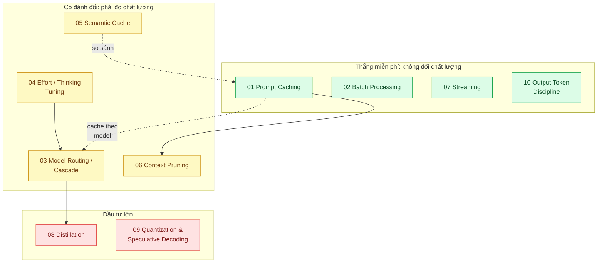

# 22 · Tối ưu AI: chi phí, độ trễ, chất lượng (`backend / AI optimizer`)

> **Phạm vi:** Giảm chi phí và độ trễ của tính năng LLM mà chất lượng không tụt: cache prompt, xử lý
> theo lô, định tuyến model, điều chỉnh effort, cache ngữ nghĩa, cắt gọn ngữ cảnh, streaming, kỷ
> luật token đầu ra, chưng cất, lượng tử hóa. Nguyên tắc chung: **đo trước, tối ưu sau** (scope 24
> cung cấp số đo).
>
> **Câu hỏi trung tâm:** Giảm chi phí và độ trễ của tính năng AI mà chất lượng không tụt, đo bằng gì?

## Bản đồ pattern trong scope

## Danh sách bài toán

| # | Bài toán (pattern — triệu chứng) | Mức | Pattern gốc / nguồn | Trạng thái |
|---|---|---|---|---|
| 01 | [Prompt Caching — System prompt và tài liệu 20k token trả tiền đầy đủ cho mọi request](./01-prompt-caching-system-prompt-20k-token-tra-tien-moi-request/) | 🟢 | Anthropic docs "Prompt caching" (`cache_control`, giá cache read thấp hơn input thường) | 📋 |
| 02 | [Batch Processing (Message Batches) — Phân loại 1 triệu ticket cũ, không cần realtime nhưng đang trả giá realtime](./02-batch-api-phan-loai-1-trieu-ticket-cu/) | 🟢 | Anthropic docs "Batch processing" (giảm 50% chi phí, xử lý bất đồng bộ) | 📋 |
| 03 | [Model Routing / Cascade — 80% câu hỏi đơn giản nhưng gửi hết vào model đắt nhất](./03-model-routing-cascade-80-phan-tram-cau-don-gian-vao-model-dat/) | 🟡 | Chen, Zaharia, Zou, "FrugalGPT" (2023); Ong et al., "RouteLLM" (2024); Anthropic docs "Optimizing for cost and intelligence" | 📋 |
| 04 | [Effort / Thinking Tuning — Trả tiền "suy nghĩ sâu" cho câu hỏi "giờ mở cửa?"](./04-effort-thinking-tuning-tra-tien-suy-nghi-cho-cau-hoi-don-gian/) | 🟡 | Anthropic docs "Effort", "Adaptive thinking" | 📋 |
| 05 | [Semantic Cache — 10% câu hỏi lặp lại gần nguyên văn vẫn gọi model](./05-semantic-cache-10-phan-tram-cau-hoi-lap-lai-nguyen-van/) | 🟡 | Bang, "GPTCache" (2023); Redis docs (vector similarity search) | 📋 |
| 06 | [Context Pruning & Summarization — Gửi lại 100 lượt hội thoại mỗi request, chi phí tăng tuyến tính](./06-context-pruning-lich-su-hoi-thoai-100-luot-gui-lai-moi-lan/) | 🟡 | Anthropic docs "Compaction", "Context editing"; Jiang et al., "LLMLingua" (2023) | 📋 |
| 07 | [Streaming for Perceived Latency — Khách nhìn màn hình trắng 8 giây chờ câu trả lời dài](./07-streaming-ttft-khach-nhin-man-hinh-trang-8-giay/) | 🟢 | Anthropic docs "Streaming Messages"; Nielsen, "Response Times: The 3 Important Limits" (1993) | 📋 |
| 08 | [Distillation to a Small Model — Phân loại 50 nhãn chạy 2 triệu lần/ngày trên model lớn](./08-distillation-fine-tune-model-nho-phan-loai-50-nhan/) | 🔴 | Hinton, Vinyals, Dean, "Distilling the Knowledge in a Neural Network" (2015); Hsieh et al., "Distilling Step-by-Step" (2023) | 📋 |
| 09 | [Quantization & Speculative Decoding (self-host) — Mô hình tự host chậm 20 token/s và tốn 80 GB VRAM](./09-quantization-speculative-decoding-self-host-cham-va-ton-vram/) | 🔴 | Frantar et al., "GPTQ" (2022); Lin et al., "AWQ" (2023); Leviathan et al., "Speculative Decoding" (ICML 2023) | 📋 |
| 10 | [Output Token Discipline — Model trả lời dài gấp 3 cần thiết; token đầu ra đắt gấp 5 lần token đầu vào](./10-token-budget-output-limits-model-tra-loi-dai-gap-3-can-thiet/) | 🟢 | Anthropic docs "Pricing" (giá output so với input), "Structured outputs", prompt engineering docs | 📋 |

## Lộ trình đề xuất trong scope

1. **Nhóm "thắng miễn phí"** (01, 02, 07, 10) — không đổi chất lượng, chỉ cần đo chi phí/độ trễ.
2. **Nhóm "có đánh đổi"** (04 → 03 → 05 → 06) — mỗi bài bắt buộc có bộ eval (scope 20 bài 06) chạy
   trước/sau; thứ tự: thử effort thấp trên model mạnh *trước* khi xây cascade nhiều model.
3. **Nhóm "đầu tư lớn"** (08, 09) — chỉ khi khối lượng đủ lớn để hoàn vốn.

## Kiến thức nền cần có trước

- Cấu trúc giá của API: token vào/ra, cache read/write, batch (đọc trang Pricing chính thức tại thời điểm làm).
- Eval pipeline (scope 20 bài 06) — điều kiện của nhóm "có đánh đổi".
- Cost attribution (scope 24 bài 02) để biết tối ưu cái gì trước.

## Liên kết với scope khác

- `24-backend-ai-monitoring` — số đo chi phí/độ trễ trước và sau tối ưu.
- `20-backend-ai-framework-system-design` — gateway (nơi cài routing), eval.
- `21-backend-ai-infrastructure` — nhánh tự host cho bài 09.
- `03-backend-cache` — semantic cache là cache-aside với key mờ.

## Nguồn tổng quan cho scope

- Anthropic docs: Prompt caching, Batch processing, Effort, Pricing — https://platform.claude.com/docs/en/
- Chen, Zaharia, Zou, "FrugalGPT" (2023).
- Chip Huyen, *AI Engineering* (2025), chương về inference optimization.
