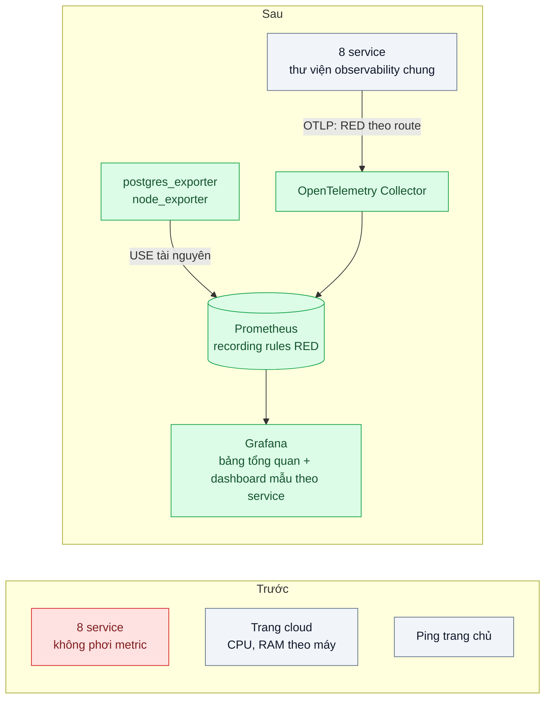
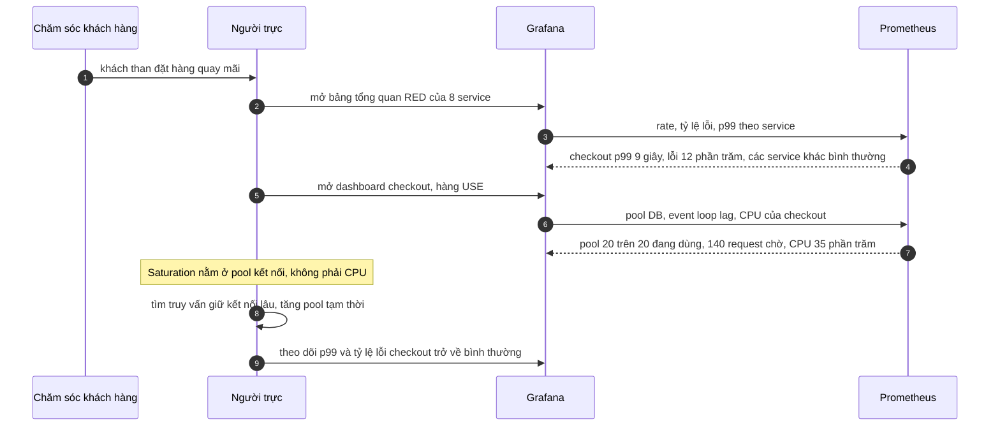

# Four Golden Signals / RED / USE — Khách than chậm, không biết service nào chậm

| Scope | Mức độ | Trạng thái | Pattern gốc | Cập nhật |
|---|---|---|---|---|
| 23 · backend / monitoring benchmark | 🟢 Cơ bản | 📋 Kế hoạch | Four Golden Signals — Google SRE Book ch.6 (2016); RED — Tom Wilkie (2018); USE — Brendan Gregg | 2026-10-06 |

> **Một câu tóm tắt:** Cho mọi service phơi cùng một bộ chỉ số theo request (Rate, Errors, Duration) và cho mọi tài nguyên quan trọng một bộ chỉ số USE (Utilization, Saturation, Errors), để khi khách than chậm, người trực nhìn một bảng là biết service nào đang làm khách khổ và tài nguyên nào bên trong nó đang nghẽn.

## 1. Bài toán thực tế (What)

**Bối cảnh** *(doanh nghiệp giả định, số liệu minh họa)*
Sàn thương mại điện tử chạy 8 service Node.js: gateway, catalog, search, cart, checkout, payment, promotion, notification. Giám sát hiện có là biểu đồ CPU/RAM từng máy trên trang quản trị của nhà cung cấp cloud và một công cụ ping trang chủ mỗi phút.

**Triệu chứng người kinh doanh nhìn thấy**
- Tối thứ Sáu, chăm sóc khách hàng báo "đặt hàng quay mãi". Mất khoảng 2 giờ họp khẩn mới tìm ra nguyên nhân: pool kết nối DB của checkout cạn.
- Trong 2 giờ đó, mọi biểu đồ CPU đều xanh và trang chủ vẫn "up" — đội kỹ thuật không có bằng chứng nào cho thấy hệ thống có vấn đề.
- Các đội lần lượt khẳng định "service của tôi bình thường" vì mỗi đội nhìn một loại log khác nhau.

**Nguyên nhân kỹ thuật**
Hệ thống chỉ đo *tài nguyên máy*, không đo *trải nghiệm của request*. Không service nào phơi số request, tỷ lệ lỗi và độ trễ theo cùng một quy ước, nên không có cách so sánh 8 service trên một màn hình. Tài nguyên thật sự nghẽn — pool kết nối, event loop của Node — lại không được đo; CPU thấp không có nghĩa là service khỏe.

**Ràng buộc**
- Đội vận hành 3 người; không có thời gian làm dashboard riêng cho từng service.
- Không dùng dịch vụ giám sát trả phí theo host trong giai đoạn này.
- Instrumentation không được làm chậm request đáng kể.

## 2. Vì sao dùng pattern này (Why)

**Nguyên nhân gốc mà pattern nhắm vào:** không có một bộ chỉ số tối thiểu, thống nhất, gắn với trải nghiệm người dùng cho từng service và từng tài nguyên.

**Pattern giải quyết thế nào:** SRE Book ch.6 đề xuất bốn tín hiệu vàng cho hệ thống phục vụ người dùng: *latency* (tách độ trễ request thành công và request lỗi, vì lỗi nhanh làm số đẹp giả), *traffic*, *errors* (gồm cả lỗi ngầm như trả 200 nhưng sai nội dung) và *saturation* (hệ thống "đầy" tới đâu). Tom Wilkie rút gọn thành *RED* — Rate, Errors, Duration — cho mọi service xử lý request, để mọi service có cùng một dashboard. Brendan Gregg đưa ra *USE* — Utilization, Saturation, Errors — áp cho từng *tài nguyên*: CPU, bộ nhớ, pool kết nối, event loop, hàng đợi. Hai phương pháp bổ sung nhau: RED trả lời "service nào làm khách khổ", USE trả lời "bên trong service đó, tài nguyên nào là nguyên nhân".

**Lựa chọn khác đã cân nhắc**

| Lựa chọn | Giải quyết được gì | Vì sao không chọn (ở bài này) |
|---|---|---|
| Giữ nguyên + tối ưu nhỏ (thêm ngưỡng cảnh báo CPU, RAM) | Biết khi máy quá tải | Sự cố vừa rồi CPU chỉ 35%; tài nguyên nghẽn không phải CPU |
| Đọc log để đếm lỗi khi có sự cố | Không cần thêm hạ tầng | Chậm, mỗi service một định dạng; không có số độ trễ theo thời gian |
| Distributed tracing trước tiên (bài 03) | Thấy chi tiết từng request | Cần nền metrics để biết *khi nào* và *service nào* cần xem trace; chi phí cao hơn |
| APM thương mại | Có sẵn dashboard | Trái ràng buộc chi phí; vẫn cần quy ước label như nhau |
| RED cho mọi service + USE cho tài nguyên (chọn) | Một bảng so sánh 8 service; khoanh vùng tài nguyên | Cần quy ước tên metric và label chung, kỷ luật về cardinality |

## 3. Thiết kế hệ thống (How)

### 3.1 Kiến trúc trước và sau



Truy vấn RED dùng chung cho mọi service (tên metric và label sau khi chuyển từ OpenTelemetry sang Prometheus cần xác minh):

```text
Rate     sum by (service) (rate(http_server_request_duration_seconds_count[5m]))
Errors   sum by (service) (rate(http_server_request_duration_seconds_count{http_response_status_code=~"5.."}[5m]))
         / sum by (service) (rate(http_server_request_duration_seconds_count[5m]))
Duration histogram_quantile(0.99, sum by (le, service) (rate(http_server_request_duration_seconds_bucket[5m])))
```

### 3.2 Luồng chính



### 3.3 Thành phần và trách nhiệm

| Thành phần | Trách nhiệm | Quyết định thiết kế đáng chú ý |
|---|---|---|
| Thư viện observability chung | Khởi tạo OpenTelemetry SDK, metric HTTP theo semantic conventions, metric pool DB và event loop | Một gói dùng chung cho 8 service để tên metric và label giống hệt nhau |
| Quy ước label | `service`, route template, method, status code | Cấm label chứa user id, URL thô, mã đơn |
| OpenTelemetry Collector | Nhận OTLP, chuyển cho Prometheus | Một điểm để đổi backend sau này mà không sửa service |
| Exporter tài nguyên | `postgres_exporter`, `node_exporter` | USE cho DB và máy, không cần sửa code |
| Recording rules | Tính sẵn RED theo service mỗi phút | Dashboard nhanh, truy vấn cảnh báo (bài 06) dùng lại |
| Dashboard | Bảng tổng quan 8 service + một dashboard mẫu có biến `service` | Thêm service mới không phải vẽ dashboard mới |

### 3.4 Điểm dễ sai khi triển khai
- **Label cardinality cao**: dùng URL thô `/orders/123` làm label tạo hàng triệu time series và làm Prometheus hết bộ nhớ. Luôn dùng route template.
- **Chỉ xem trung bình**: dùng histogram và phân vị (bài 04).
- **Chỉ đếm 5xx là lỗi**: request trả 200 kèm thông báo lỗi trong body, hoặc timeout phía client, không được tính.
- **Trộn độ trễ request lỗi với request thành công**: lỗi trả nhanh kéo p99 xuống, che sự cố.
- **Saturation chỉ là CPU**: với Node.js, event loop lag và pool kết nối thường nghẽn trước.
- **Mỗi đội tự đặt tên metric**: không gộp được vào một bảng — bắt buộc dùng thư viện chung.

## 4. Tech stack và tác động (Impact techstack)

| Lớp | Công nghệ chọn | Vì sao chọn | Thay thế tương đương |
|---|---|---|---|
| Instrumentation | OpenTelemetry SDK cho Node (`@opentelemetry/sdk-node`, auto-instrumentation HTTP) | Theo semantic conventions chung; cùng SDK dùng cho tracing ở bài 03 | `prom-client` phơi `/metrics` trực tiếp |
| Thu thập | OpenTelemetry Collector | Tách service khỏi backend lưu trữ | Prometheus scrape trực tiếp |
| Lưu trữ, truy vấn | Prometheus | Mô hình counter/histogram, PromQL, recording rules | VictoriaMetrics, Grafana Mimir |
| Hiển thị | Grafana | Dashboard có biến, dùng chung với log và trace | — |
| Tài nguyên | `postgres_exporter`, `node_exporter` | USE cho DB và máy không cần sửa code | cAdvisor cho container |
| Tạo tải, tiêm lỗi | k6, Toxiproxy | Tái hiện sự cố pool DB có kiểm soát | `pg_sleep` trong truy vấn thử |

**Thay đổi so với hệ thống hiện tại:** thêm Collector, Prometheus, Grafana, hai exporter; mỗi service thêm một dòng khởi tạo thư viện chung. Đội vận hành học đọc RED/USE, PromQL cơ bản và quy tắc label.

## 5. Kết quả đầu ra và cách đo (Output impact)

| Chỉ số | Trước (minh họa) | Mục tiêu khi thực hành | Cách đo |
|---|---|---|---|
| Thời gian khoanh vùng service và tài nguyên gây chậm | ~2 giờ | ≤ 10 phút | Game day: Toxiproxy làm chậm DB của checkout, bấm giờ từ lúc báo tới lúc chỉ đúng service và tài nguyên |
| Service có dashboard RED chuẩn | 0 / 8 | 8 / 8 | PromQL `count by (service) (rate(http_server_request_duration_seconds_count[5m]))` trả đủ 8 service |
| Tài nguyên có số đo USE | CPU, RAM máy | Thêm pool DB, event loop lag, kết nối Postgres | Đối chiếu checklist USE cho từng service |
| Số time series mỗi service | Chưa đo | ≤ 5.000 | Trang TSDB Status của Prometheus |
| Overhead instrumentation trên p99 | — | ≤ 3% | k6 cùng kịch bản 300 request/giây, bật và tắt SDK |

> Số "trước" là minh họa để hình dung bài toán. Số "mục tiêu" chỉ được coi là đạt khi có số đo thật
> ở mục 8 kèm môi trường đo.

**Tác động nghiệp vụ mong đợi:** sự cố giờ cao điểm được khoanh vùng trong vài phút thay vì vài giờ; tranh luận giữa các đội được thay bằng một bảng số chung.

## 6. Đánh đổi và khi KHÔNG nên dùng

**Đánh đổi**
- Thêm ba thành phần hạ tầng phải vận hành và lưu trữ.
- Kỷ luật label là việc liên tục; một label sai có thể làm sập Prometheus.
- RED/USE cho biết *ở đâu*, không cho biết *vì sao* ở mức dòng code — cần trace (bài 03) và profiling (bài 08).

**Không nên dùng khi**
- Hệ thống là một ứng dụng nhỏ, một tiến trình, ít người dùng: log có cấu trúc và một health check (bài 09) có thể đủ.
- Tác vụ xử lý theo lô, không theo request: RED không khớp; dùng chỉ số thời gian hoàn thành job, độ tươi dữ liệu, và USE cho tài nguyên.

**Liên quan**
- [Bài 04 — Percentiles & Histograms](../04-percentiles-p99-trung-binh-200ms-nhung-khach-than-cham/) — cách đo "Duration" cho đúng.
- [Bài 06 — Alerting on Symptoms](../06-alerting-symptom-not-cause-50-alert-moi-dem-khong-ai-doc/) — cảnh báo dựa trên RED thay vì CPU.
- [Bài 03 — Distributed Tracing](../03-distributed-tracing-otel-request-qua-6-service-cham-o-dau/) — bước tiếp theo khi đã biết service nào chậm.
- [Scope 18 bài 07 — Capacity Planning](../../18-backend-scale/07-capacity-planning-use-method-mua-may-bao-nhieu-cho-tet/) — dùng USE để tính số máy.
- [Scope 02 bài 03 — Connection Pooling](../../02-backend-database/03-connection-pool-200-pod-dap-postgres/) — tài nguyên nghẽn trong ví dụ.

## 7. Cơ sở tham khảo

- Google, *Site Reliability Engineering* (2016), ch.6 "Monitoring Distributed Systems" — https://sre.google/sre-book/monitoring-distributed-systems/ — bốn tín hiệu vàng, tách độ trễ lỗi và thành công, black-box và white-box.
- Tom Wilkie, "The RED Method: key metrics for microservices architecture", 2018 (bài nói và bài viết trên blog Grafana Labs; cần xác minh URL) — ba chỉ số Rate, Errors, Duration cho mọi service.
- Brendan Gregg, "The USE Method" — https://www.brendangregg.com/usemethod.html — Utilization, Saturation, Errors cho từng tài nguyên và checklist áp dụng.
- OpenTelemetry docs, "Semantic conventions for HTTP metrics" — https://opentelemetry.io/docs/specs/semconv/http/http-metrics/ — tên và thuộc tính chuẩn của metric độ trễ HTTP.
- Prometheus docs, "Metric and label naming" — https://prometheus.io/docs/practices/naming/ — quy ước đặt tên và cảnh báo về label cardinality.

## 8. Kế hoạch thực hành

- [ ] Bước 1: dựng 3 service mẫu (gateway, checkout, promotion) + PostgreSQL + Toxiproxy bằng Docker Compose; phiên bản `truoc/` không có metric.
- [ ] Bước 2: đo "trước": game day làm chậm DB của checkout, bấm giờ khoanh vùng chỉ với log và CPU.
- [ ] Bước 3: áp dụng pattern: thư viện observability chung, Collector, Prometheus, recording rules RED, exporter, dashboard tổng quan và dashboard mẫu.
- [ ] Bước 4: đo "sau" cùng kịch bản game day; đo overhead bằng k6; ghi số và môi trường vào mục 5.
- [ ] Bước 5: test: mọi service phơi đủ ba metric RED với cùng label; route có tham số dùng template, không dùng URL thô; recording rule cho kết quả khớp truy vấn gốc.

**Cấu trúc code dự kiến**
```text
packages/observability/
  src/init-telemetry.ts          # [PATTERN] SDK, metric HTTP, pool DB, event loop
services/
  gateway/ checkout/ promotion/
infra/
  otel-collector.yaml
  prometheus.yml
  rules/red.rules.yml            # recording rules RED
  grafana/dashboards/            # tổng quan + mẫu theo service
test/
  red-metrics-exposed.test.ts
  route-template-label.test.ts
bench/game-day-slow-db.k6.js
docker-compose.yml
```

**Cách chạy** *(điền khi bắt đầu code)*
```bash
docker compose up -d
pnpm install && pnpm test
```
