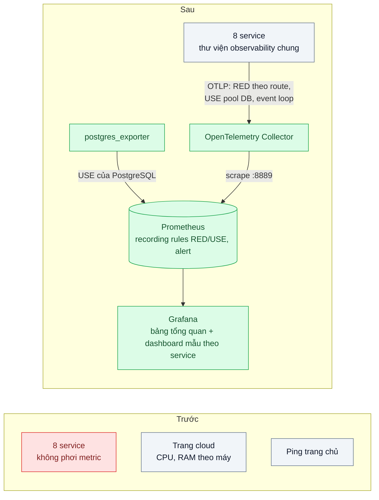
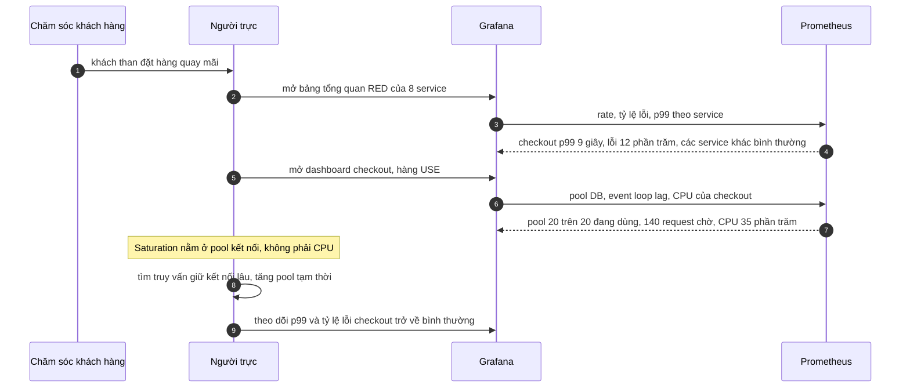
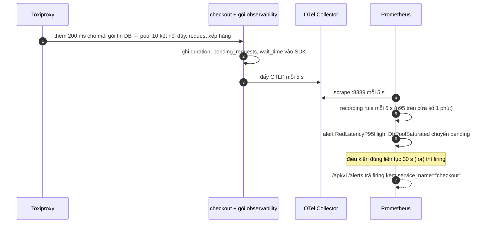

# Four Golden Signals / RED / USE — Khách than chậm, không biết service nào chậm

| Scope | Mức độ | Trạng thái | Pattern gốc | Cập nhật |
|---|---|---|---|---|
| 23 · backend / monitoring benchmark | 🟢 Cơ bản | ✅ Hoàn thành | Four Golden Signals — Google SRE Book ch.6 (2016); RED — Tom Wilkie (2018); USE — Brendan Gregg | 2026-10-09 |

> **Một câu tóm tắt:** Cho mọi service phơi cùng một bộ chỉ số theo request (Rate, Errors, Duration) và cho mọi tài nguyên quan trọng một bộ chỉ số USE (Utilization, Saturation, Errors), để khi khách than chậm, người trực nhìn một bảng là biết service nào đang làm khách khổ và tài nguyên nào bên trong nó đang nghẽn.

## 1. Bài toán thực tế (What)

**Bối cảnh** *(doanh nghiệp giả định, số liệu minh họa)*
Sàn thương mại điện tử chạy 8 service Node.js: gateway, catalog, search, cart, checkout, payment, promotion, notification. Giám sát hiện có là biểu đồ CPU/RAM từng máy trên trang quản trị của nhà cung cấp cloud và một công cụ ping trang chủ mỗi phút.

**Triệu chứng người kinh doanh nhìn thấy**
- Tối thứ Sáu, chăm sóc khách hàng báo "đặt hàng quay mãi". Mất khoảng 2 giờ họp khẩn mới tìm ra nguyên nhân: pool kết nối DB của checkout cạn.
- Trong 2 giờ đó, mọi biểu đồ CPU đều xanh và trang chủ vẫn "up" — đội kỹ thuật không có bằng chứng nào cho thấy hệ thống có vấn đề.
- Các đội lần lượt khẳng định "service của tôi bình thường" vì mỗi đội nhìn một loại log khác nhau.

**Nguyên nhân kỹ thuật**
Hệ thống chỉ đo *tài nguyên máy*, không đo *trải nghiệm của request*. Không service nào phơi số request, tỷ lệ lỗi và độ trễ theo cùng một quy ước, nên không có cách so sánh 8 service trên một màn hình. Tài nguyên thật sự nghẽn — pool kết nối, event loop của Node — lại không được đo; CPU thấp không có nghĩa là service khỏe.

**Ràng buộc**
- Đội vận hành 3 người; không có thời gian làm dashboard riêng cho từng service.
- Không dùng dịch vụ giám sát trả phí theo host trong giai đoạn này.
- Instrumentation không được làm chậm request đáng kể.

## 2. Vì sao dùng pattern này (Why)

**Nguyên nhân gốc mà pattern nhắm vào:** không có một bộ chỉ số tối thiểu, thống nhất, gắn với trải nghiệm người dùng cho từng service và từng tài nguyên.

**Pattern giải quyết thế nào:** SRE Book ch.6 đề xuất bốn tín hiệu vàng cho hệ thống phục vụ người dùng: *latency* (tách độ trễ request thành công và request lỗi, vì lỗi nhanh làm số đẹp giả), *traffic*, *errors* (gồm cả lỗi ngầm như trả 200 nhưng sai nội dung) và *saturation* (hệ thống "đầy" tới đâu). Tom Wilkie rút gọn thành *RED* — Rate, Errors, Duration — cho mọi service xử lý request, để mọi service có cùng một dashboard. Brendan Gregg đưa ra *USE* — Utilization, Saturation, Errors — áp cho từng *tài nguyên*: CPU, bộ nhớ, pool kết nối, event loop, hàng đợi. Hai phương pháp bổ sung nhau: RED trả lời "service nào làm khách khổ", USE trả lời "bên trong service đó, tài nguyên nào là nguyên nhân".

**Lựa chọn khác đã cân nhắc**

| Lựa chọn | Giải quyết được gì | Vì sao không chọn (ở bài này) |
|---|---|---|
| Giữ nguyên + tối ưu nhỏ (thêm ngưỡng cảnh báo CPU, RAM) | Biết khi máy quá tải | Sự cố vừa rồi CPU chỉ 35%; tài nguyên nghẽn không phải CPU |
| Đọc log để đếm lỗi khi có sự cố | Không cần thêm hạ tầng | Chậm, mỗi service một định dạng; không có số độ trễ theo thời gian |
| Distributed tracing trước tiên (bài 03) | Thấy chi tiết từng request | Cần nền metrics để biết *khi nào* và *service nào* cần xem trace; chi phí cao hơn |
| APM thương mại | Có sẵn dashboard | Trái ràng buộc chi phí; vẫn cần quy ước label như nhau |
| RED cho mọi service + USE cho tài nguyên (chọn) | Một bảng so sánh 8 service; khoanh vùng tài nguyên | Cần quy ước tên metric và label chung, kỷ luật về cardinality |

## 3. Thiết kế hệ thống (How)

### 3.1 Kiến trúc trước và sau



Truy vấn RED dùng chung cho mọi service. Tên metric và label **đã kiểm trên Prometheus thật** của lab (OTel SDK JS 2.11.0
→ Collector contrib 0.161.0, exporter `prometheus` với `translation_strategy: UnderscoreEscapingWithSuffixes` →
Prometheus 3.14.0). Label `service_name` đến từ resource attribute `service.name`; `error_type` có mặt khi request lỗi
(5xx hoặc bị client bỏ ngang). Lab dùng cửa sổ `[1m]` cho game day ngắn; production thường `[5m]`.

```text
Rate     sum by (service_name) (rate(http_server_request_duration_seconds_count[1m]))
Errors   sum by (service_name) (rate(http_server_request_duration_seconds_count{error_type!=""}[1m]))
         / sum by (service_name) (rate(http_server_request_duration_seconds_count[1m]))
Duration histogram_quantile(0.95, sum by (le, service_name) (rate(http_server_request_duration_seconds_bucket[1m])))
```

Ba truy vấn trên được tính sẵn thành recording rule `service_name:http_server_requests:rate1m`,
`service_name:http_server_errors:ratio_rate1m`, `service_name:http_server_request_duration_seconds:p95_1m` (file
`infra/rules/red.rules.yml`). Truy vấn **khoanh vùng** dùng thêm RED phía client (`http_client_request_duration_seconds`,
label `server_address`): service chậm mà lời gọi ra ngoài của nó không chậm thì nguyên nhân nằm trong chính nó.

```text
service_name:http_server_request_duration_seconds:p95_1m > 0.5
  unless on (service_name)
(max by (service_name) (service_name_server_address:http_client_request_duration_seconds:p95_1m) > 0.5)
```

### 3.2 Luồng chính



Luồng phát hiện tự động trong lab (game day, mục 5.1): mỗi chặng có chu kỳ riêng, nên alert không thể tức thời.



### 3.3 Thành phần và trách nhiệm

| Thành phần | Trách nhiệm | Quyết định thiết kế đáng chú ý |
|---|---|---|
| Thư viện observability chung (`packages/observability`) | Khởi tạo OpenTelemetry SDK (metric), hook Fastify ghi `http.server.request.duration`, client HTTP ghi `http.client.request.duration`, metric pool `pg` và event loop, CPU, RSS | Một gói dùng chung cho mọi service để tên metric, đơn vị, bucket và label giống hệt nhau |
| Quy ước label | `service_name` (resource `service.name`), `http_route` (template), `http_request_method`, `http_response_status_code`, `error_type`; client thêm `server_address`, `server_port` | Cấm label chứa user id, URL thô, mã đơn; method lạ ghi `_OTHER` |
| OpenTelemetry Collector | Nhận OTLP, phơi dạng Prometheus ở `:8889` | Một điểm để đổi backend sau này mà không sửa service; chỉ `service.name` thành label |
| Exporter tài nguyên | `postgres_exporter` (role `pg_monitor`) | USE của PostgreSQL không cần sửa code. Không có `node_exporter`: trên Docker Desktop nó chỉ thấy máy ảo Linux, không thấy máy thật |
| Recording rules | Tính sẵn RED theo service, theo route, theo phụ thuộc, và USE của pool, event loop, CPU, PostgreSQL mỗi 5 s | Dashboard nhanh, alert (bài 06) dùng lại |
| Alert rules | `RedLatencyP95High`, `RedErrorRatioHigh` (triệu chứng), `DbPoolSaturated` (tài nguyên) | Alert mang label `service_name`, nên alert đã chỉ ra service |
| Dashboard | Bảng tổng quan mọi service + dashboard mẫu có biến `service` (JSON provisioning) | Thêm service mới không phải vẽ dashboard mới |

### 3.4 Điểm dễ sai khi triển khai
- **Label cardinality cao**: dùng URL thô `/orders/123` làm label tạo hàng triệu time series và làm Prometheus hết bộ nhớ. Luôn dùng route template.
- **Chỉ xem trung bình**: dùng histogram và phân vị (bài 04).
- **Chỉ đếm 5xx là lỗi**: request trả 200 kèm thông báo lỗi trong body, hoặc timeout phía client, không được tính.
- **Trộn độ trễ request lỗi với request thành công**: lỗi trả nhanh kéo p99 xuống, che sự cố.
- **Saturation chỉ là CPU**: với Node.js, event loop lag và pool kết nối thường nghẽn trước.
- **Mỗi đội tự đặt tên metric**: không gộp được vào một bảng — bắt buộc dùng thư viện chung.

Gặp thật khi làm lab (đã kiểm):
- **Request bị client bỏ ngang biến mất khỏi histogram của service chậm.** Gateway hết timeout 5 s và đóng kết nối;
  checkout xử lý xong sau 7 s nhưng Node không phát `finish` trên socket đã đóng, nên hook `onResponse` của Fastify
  không chạy: số đếm `GET /orders/:id` của checkout đứng yên ở 31 sau một request như vậy. Đúng những request chậm nhất
  không được ghi. Gói chung ghi thêm ở hook `onRequestAbort` (không có status, `error_type="request_aborted"`) và
  Errors tính theo `error_type`, không chỉ 5xx.
- **Bucket mặc định của SDK dành cho mili giây** (`[0, 5, 10, 25, …, 10000]`). Metric đơn vị giây phải khai bucket
  của semantic conventions (`advice.explicitBucketBoundaries`, 0,005 … 10 s), nếu không mọi request rơi vào một bucket.
- **Phân vị bị chặn ở bucket hữu hạn cao nhất.** Lúc pool cạn, p95 thời gian chờ kết nối hiện đúng `10` (biên 10 s)
  dù chờ thật lâu hơn. Đọc nó là "≥ 10 s", không phải số chính xác.
- **Series mới không có "bước nhảy đầu tiên".** Lần đầu một tổ hợp label xuất hiện (route mới, mã lỗi mới) nó đã mang
  giá trị, và `rate()`/`increase()` không thấy phần từ 0 lên giá trị đó. Test đầu tiên dùng `increase() > 0` đỏ giả
  với promotion (15 request đầu nằm gọn trong một chu kỳ đẩy). Test so "sau − trước" của counter.
- **Series cũ còn sống vài phút.** Service tắt instrumentation hay đổi tên thì Collector vẫn phơi giá trị cuối tới hết
  `metric_expiration` (lab đặt 2 phút, mặc định 5 phút) và Prometheus còn trả mẫu trong 5 phút lookback. Kiểm "service
  có metric" phải kiểm counter có **tăng**, không chỉ "có series".
- **API metric của OpenTelemetry JS không có proxy** như tracing: instrument tạo trước `setGlobalMeterProvider` là no-op
  mãi mãi. Gói chung tạo instrument sau `initTelemetry()` (client HTTP tạo lười ở lần gọi đầu).
- **Pool `pg` mặc định chờ kết nối vô hạn** (`connectionTimeoutMillis: 0`): pool cạn không sinh dòng log lỗi nào ở
  checkout, chỉ gateway ghi "timeout". Đây là lý do runbook chỉ có log không chỉ ra được tài nguyên (mục 5.1).
- **`resource_to_telemetry_conversion` đã deprecated** ở exporter `prometheus` của Collector 0.161.0 (log cảnh báo
  lúc khởi động), thay bằng `resource_constant_labels: { included: ["service.name"] }` — và chỉ lấy đúng attribute
  cần, không kéo `telemetry.sdk.*` thành label.
- **Image Collector không có shell**, không viết được healthcheck trong container; healthcheck của Prometheus hỏi hộ
  `otel-collector:13133` (extension `health_check`), nên `docker compose up --wait` vẫn chỉ trả về khi Collector sống.

## 4. Tech stack và tác động (Impact techstack)

| Lớp | Công nghệ chọn | Vì sao chọn | Thay thế tương đương |
|---|---|---|---|
| Service mẫu | 3 service **Fastify 5.12.5** (gateway → checkout → promotion), TypeScript strict, Node 20, gói bằng esbuild 0.28.2 thành một file chạy trên `node:20-alpine` | Mỗi service chỉ 2–3 route; pattern nằm ở gói dùng chung, không ở DI. Fastify trả route template sẵn (`request.routeOptions.url`) và có hook `onResponse`/`onRequestAbort` | NestJS 10 (chạy trên adapter Fastify thì gói chung dùng lại nguyên) |
| Instrumentation | **OpenTelemetry SDK JS** — `@opentelemetry/api` 1.9.1, `sdk-metrics` 2.11.0, `resources` 2.11.0, `exporter-metrics-otlp-http` 0.222.0, `semantic-conventions` 1.43.0 (một bộ phát hành cùng ngày 2026-08-31) — ghi metric bằng tay theo semantic conventions | Gói chung quyết định tên, bucket, label; route template lấy từ router. Auto-instrumentation HTTP không biết route khi không có instrumentation của framework, và không ghi request bị bỏ ngang (mục 3.4) | `@opentelemetry/auto-instrumentations-node`; `prom-client` phơi `/metrics` trực tiếp |
| Thu thập | **OTel Collector contrib 0.161.0**, exporter `prometheus` (pull ở `:8889`) | Tách service khỏi backend; bản contrib có sẵn thành phần cho log/trace của bài 23/02–23/04 | Bản core (33 MB nén, đủ cho bài này); Prometheus nhận OTLP trực tiếp (`--web.enable-otlp-receiver`) |
| Lưu trữ, truy vấn | **Prometheus 3.14.0**, scrape và rule mỗi 5 s, `--web.enable-lifecycle` (nạp lại rule cho phép thử âm) | Counter/histogram, PromQL, recording rules, alert rules, API đọc trạng thái alert | VictoriaMetrics, Grafana Mimir |
| Hiển thị | **Grafana 12.4.12**, datasource + 2 dashboard provisioning từ file, ẩn danh tắt, admin từ `.env` | Dashboard có biến `service` | — |
| Tài nguyên | **postgres_exporter v0.20.1** (role `pg_monitor`) + USE trong gói chung (pool `pg`, event loop, CPU, RSS) | USE của DB không sửa code; USE của tiến trình Node đo từ bên trong | cAdvisor cho CPU/RAM container (không dùng: số CPU/RAM tiến trình đã có từ SDK, và cần mount `docker.sock`) |
| DB, tiêm lỗi, tải | PostgreSQL 16.15 (ghim digest, nhật ký 17/05), Toxiproxy 2.12.0 (toxic `latency` giữa checkout và DB), k6 1.4.2 trong container cùng mạng Compose | Tái hiện "chậm DB của checkout" có kiểm soát, bật tắt bằng API | `pg_sleep` trong truy vấn thử |

**Lệch so với kế hoạch ban đầu (đã ghi lý do):**
- **Không có `node_exporter`, không có cAdvisor.** Docker Desktop trên macOS chạy container trong một máy ảo Linux;
  `node_exporter` chỉ đo được máy ảo đó, không phải máy thật, nên lab **không có USE của host** và không giả vờ có.
  CPU/RAM của từng service lấy từ chính tiến trình (`process.cpu.time`, `process.memory.usage`); bản "trước" và phép đo
  overhead dùng `docker stats`.
- **Bản "trước" không tách thư mục `src/truoc/`**: đề bài đo overhead yêu cầu "cùng code, tắt bằng env", nên bản trước
  là chính 3 service với `OTEL_SDK_DISABLED=true` (biến chuẩn của OpenTelemetry; gói chung không khởi tạo SDK, không gắn
  hook) và **không chạy** Collector/Prometheus/Grafana/exporter. Log text giữ nguyên ở cả hai bản.
- **`url.scheme`** (thuộc tính Required của `http.server.request.duration` theo semantic conventions) không ghi: mọi
  service chỉ nghe HTTP nên là hằng số, không giúp phân biệt; ghi rõ ở đây để không ai tưởng gói chung đủ chuẩn 100 %.
- Ba service thay cho tám: đủ để có một chuỗi gọi (gateway → checkout → promotion) và một service "khỏe" để so.

**Thay đổi so với hệ thống hiện tại:** thêm Collector, Prometheus, Grafana, postgres_exporter; mỗi service thêm một dòng
`initTelemetry()`, một dòng `registerHttpServerMetrics(app)`, gọi service khác qua `requestJson`, bọc pool bằng
`observePgPool`. Đội vận hành học đọc RED/USE, PromQL cơ bản và quy tắc label.

## 5. Kết quả đầu ra và cách đo (Output impact)

| Chỉ số | Trước (minh họa) | Mục tiêu khi thực hành | Cách đo |
|---|---|---|---|
| Thời gian khoanh vùng service và tài nguyên gây chậm | ~2 giờ | ≤ 10 phút | Game day: Toxiproxy làm chậm DB của checkout. Không bấm giờ người thật: bản trước đếm số bước của runbook cố định (log + `docker stats`) và có khoanh được không; bản sau đo từ lúc bật toxic tới khi rule/alert chuyển trạng thái (API Prometheus) |
| Service có dashboard RED chuẩn | 0 / 8 | 8 / 8 | Lab có 3 service: test (a) kiểm cả 3 có counter tăng, đủ label, đủ bucket, đủ 3 recording rule; dashboard mẫu chạy được với từng `$service` |
| Tài nguyên có số đo USE | CPU, RAM máy | Thêm pool DB, event loop lag, kết nối Postgres | Đối chiếu checklist USE cho từng service |
| Số time series mỗi service | Chưa đo | ≤ 5.000 | `/api/v1/series` của Prometheus trong 45 phút đo (gồm mọi tổ hợp status/lỗi của game day) |
| Overhead instrumentation trên p99 | — | ≤ 3% | k6 300 request/giây và 1 VU nối tiếp, bật và tắt SDK (`OTEL_SDK_DISABLED`), 3 vòng đảo thứ tự |

> Số "trước" là minh họa để hình dung bài toán. Số "mục tiêu" chỉ được coi là đạt khi có số đo thật
> ở mục 8 kèm môi trường đo.

**Tác động nghiệp vụ mong đợi:** sự cố giờ cao điểm được khoanh vùng trong vài phút thay vì vài giờ; tranh luận giữa các đội được thay bằng một bảng số chung.

### 5.1 Số đã đo

**Môi trường** *(đã đo, 2026-10-09, 10:47 – 11:38 giờ Việt Nam)*: MacBook Apple M1 Pro (8 nhân, 16 GB), macOS 26.6.2,
**cắm sạc** (`AC Power`, ghi trước và sau mỗi vòng), nắp mở, `caffeinate -ims`; bộ phát hiện máy ngủ của script đo không
thấy khoảng ngủ nào. Load 1 phút của macOS **4,6 – 13,5** suốt các lượt (Chrome, Word, ứng dụng của người dùng; container
MySQL/RabbitMQ của dự án khác). Docker Desktop, Engine 28.5.1, máy ảo 8 CPU / 7,65 GiB. Node 20.19.6 trên host, 20.20.2 trong
`node:20-alpine`; k6 1.4.2 chạy trong container cùng mạng Compose. Image và phiên bản: mục 4 và `compose.yaml`. File thô
(không commit): `bench/results/main/` (`game-day-{sau,truoc}-r{1,2,3}/` gồm `result.json`, `k6.json`, output từng bước
runbook `step-*.txt`; `game-day-*-summary.json`; `overhead/`, `overhead-serial/`, `series-count.json`),
`bench/results/negative/summary.json`.

**Kịch bản game day** (`bench/game-day.ts`, 3 vòng mỗi bản): k6 đặt hàng 20/s + xem đơn 10/s qua gateway (mô hình mở);
sau phần nền (60 s bản sau, 30 s bản trước) bật toxic `latency` 200 ms (chiều downstream) trên proxy checkout → DB trong
90 s, rồi tắt. Mỗi câu SQL chậm thêm khoảng 200 ms (trung bình đo qua `_sum/_count` trên 30 s giữa lúc có toxic: 0,203 s ở
vòng 1 và 2), transaction đặt hàng 4 câu lệnh giữ kết nối khoảng 0,8 s, nên 10 kết nối của pool không theo kịp tải: request xếp
hàng chờ kết nối (442 – 460 lúc đo), gateway hết timeout 5 s. Phía khách (k6 cả vòng): 38 – 39 % request lỗi ở bản sau
(vòng 210 s), 53 – 54 % ở bản trước (vòng 150 s), p95 khoảng 5,0 s, `dropped_iterations` = 0.

**Bản trước — runbook cố định chỉ có log và `docker stats`** (lệnh và luật phân tích viết sẵn trong script, chạy 60 s sau
khi bật toxic, lúc "khách than"; Toxiproxy là công cụ tiêm lỗi nên không có trong runbook):

| Bước | Lệnh | Thấy gì (vòng 1; 3 vòng giống nhau) | Kết luận theo luật |
|---|---|---|---|
| 1 | `docker stats --no-stream` | CPU gateway 8 – 10 %, checkout 8 – 11 %, postgres 5 – 6 %, promotion 1 – 2 % | không container nào > 80 % CPU: không chỉ ra tài nguyên |
| 2 | `docker compose logs --since 90s gateway` | 1.565 – 1.592 dòng `ERROR gateway: gọi checkout thất bại (POST /orders): The operation was aborted due to timeout` | **nghi checkout** |
| 3 | `… logs checkout` | 1.216 – 1.235 dòng, **0 dòng ERROR** (chỉ `INFO checkout: tạo đơn #…`) | checkout "bình thường"; không lỗi nào nhắc DB/pool |
| 4 | `… logs promotion` | 0 dòng | — |
| 5 | `… logs postgres` | 0 – 2 dòng, không ERROR/FATAL | — |

**Kết quả trước** *(đã đo)*: 3/3 vòng khoanh được **service ở bước 2** (checkout, qua lỗi timeout trong log của gateway);
**tài nguyên không khoanh được** sau đủ 5/5 bước — log checkout không có lỗi vì pool `pg` mặc định chờ vô hạn, CPU mọi
container thấp. Máy chạy 5 lệnh mất 3,2 – 3,3 s; thời gian người đọc 3.000 dòng log thì không đo.

**Bản sau — thời gian từ lúc bật toxic tới khi rule/alert chuyển trạng thái** (`activeAt` lấy từ `/api/v1/alerts` =
lần đánh giá rule đầu tiên thấy điều kiện đúng; "thấy" = lần hỏi API mỗi khoảng 1 s đầu tiên trả trạng thái đó):

| Tín hiệu | Vòng 1 | Vòng 2 | Vòng 3 | Trung vị *(đã đo)* |
|---|---|---|---|---|
| `DbPoolSaturated{checkout}` pending (`activeAt`) | 11,9 s | 11,6 s | 12,7 s | **11,9 s** |
| Recording rule p95 của checkout > 0,5 s (thấy qua `/api/v1/query`) | 14,2 s | 14,2 s | 15,2 s | **14,2 s** |
| `RedLatencyP95High{checkout}` pending (`activeAt`) | 13,6 s | 13,4 s | 14,4 s | **13,6 s** |
| `RedErrorRatioHigh{checkout}` pending (`activeAt`) | 23,6 s | 23,4 s | 24,4 s | 23,6 s |
| `DbPoolSaturated{checkout}` firing (thấy) | 42,5 s | 42,6 s | 43,4 s | **42,6 s** |
| `RedLatencyP95High{checkout}` firing (thấy) | 44,5 s | 43,6 s | 45,4 s | **44,5 s** |
| `RedErrorRatioHigh{checkout}` firing (thấy) | 54,6 s | 53,7 s | 54,5 s | 54,5 s |
| `RedLatencyP95High{gateway}` firing (thấy) | 44,5 s | 43,6 s | (20,2 s)\* | 44,1 s (2 vòng) |

\* Vòng 3: máy ảo Docker khựng khoảng 2 – 3 s lúc 10:54:45 – 50, 16 s trước khi bật toxic (event loop delay lớn nhất 2,8 s ở
gateway, 1,8 s ở checkout, 0,2 s ở promotion **cùng lúc**; scrape mất 0,6 – 3,6 s ở cả ba target). Đủ request chậm để p95 của
gateway vượt 0,5 s và alert của gateway pending từ trước sự cố, nên không tính vòng này cho gateway. Checkout không bị ảnh
hưởng (p95 theo route 0,32 – 0,39 s). Nguyên nhân khựng chưa tách riêng được (máy đang bận, load 6 – 7).

Firing = pending + `for: 30s` + tối đa một chu kỳ đánh giá 5 s. Phần trước pending (khoảng 12 – 14 s) là tổng chu kỳ đẩy
của SDK (5 s), scrape (5 s), đánh giá rule (5 s) và thời gian để > 5 % request trong cửa sổ 1 phút là request chậm.

**Truy vấn chỉ ra đúng checkout + pool DB** (runbook PromQL cố định, chạy tự động khi cả hai alert của checkout firing;
3/3 vòng cho cùng kết luận, số của vòng 1):

| Truy vấn | Kết quả lúc đo | Đọc ra |
|---|---|---|
| `service_name:http_server_request_duration_seconds:p95_1m > 0.5` (triệu chứng) | gateway 7,28 s, checkout 6,92 s; promotion không có | khách khổ ở gateway và checkout |
| khoanh vùng (mục 3.1: chậm mà lời gọi ra ngoài không chậm) | **chỉ `checkout`** | gateway chậm vì chờ checkout; checkout gọi promotion vẫn nhanh |
| `service_name:db_client_connection_utilization:ratio` / `…pending_requests:max` | checkout 1,0 / **442** (vòng 2: 444, vòng 3: 460) | pool dùng hết, hàng trăm request chờ kết nối |
| `…wait_time_seconds:p95_1m` / `…operation_duration_seconds:p95_1m` | 10 s (biên bucket cao nhất, nghĩa là ≥ 10 s) / 0,45 s (nội suy trong bucket 0,1 – 0,5 s) | chờ pool rất lâu; từng câu SQL chậm |
| `…nodejs_eventloop_delay_p99_seconds:max`, `…process_cpu_time_seconds:rate1m` | checkout 0,016 s, 0,09 nhân | event loop và CPU không nghẽn |
| `pg_stat_activity_count{datname="shop"}` (postgres_exporter) | active 0, idle in transaction 7, idle 4 | PostgreSQL rảnh: kết nối bị giữ trong lúc chờ mạng, không phải DB quá tải |

Với alert, người trực có sẵn `service_name="checkout"` trên `RedLatencyP95High` và tên tài nguyên trên `DbPoolSaturated`;
một truy vấn khoanh vùng xác nhận gateway chỉ là nạn nhân. Thời gian người đọc dashboard sau khi nhận alert: **không đo**
(nếu khoảng 1 – 2 phút thì tổng dưới 3 phút kể từ sự cố — *minh họa*).

**Overhead của instrumentation** (`bench/run-overhead.ts`, `bench/run-overhead-serial.ts`; GET `/orders/:id` qua
gateway → checkout → DB; bật/tắt bằng `OTEL_SDK_DISABLED` cho cả 3 service, cùng code; 3 vòng đảo thứ tự; tag `name` cố định;
không request lỗi nào):

| Đo | Tắt SDK — trung vị (thấp – cao) | Bật SDK — trung vị (thấp – cao) | Chênh theo vòng (bật − tắt) |
|---|---|---|---|
| 300 req/s × 30 s, p95 | 5,90 ms (5,85 – 8,85) | 3,59 ms (3,06 – 6,05) | −2,79 / +0,15 / −5,27 ms |
| 300 req/s × 30 s, p99 | 46,2 ms (27,3 – 59,1) | 79,7 ms (10,2 – 193,1) | −17,2 / +146,9 / +20,6 ms |
| 1 VU nối tiếp × 20 s, p50 | 0,742 ms (0,734 – 0,757) | 0,798 ms (0,795 – 0,978) | +0,221 / +0,053 / +0,065 ms |
| 1 VU nối tiếp × 20 s, p95 | 1,458 ms (1,433 – 1,540) | 1,694 ms (1,648 – 2,990) | +1,532 / +0,260 / +0,108 ms |
| 32 VU × 20 s, thông lượng tối đa | 4.385 req/s (4.313 – 4.595) | 3.785 req/s (3.785 – 4.102) | −811 / −600 / −211 req/s |

CPU/RAM lúc 300 req/s (`docker stats` mỗi khoảng 3 s, trung vị 3 vòng; 100 % = một nhân): gateway 23,0 → 25,2 %,
checkout 11,2 → 12,2 %, promotion 0,0 → 1,2 %, **Collector 0,1 → 0,4 %, RAM khoảng 40 MiB** cả hai bản, Prometheus 1,5 %
(53 – 57 MiB). RAM của service dao động 72 – 99 MiB (gateway) giữa các vòng, không thấy khác biệt rõ.

- Ở 300 req/s, p95/p99 dao động giữa các vòng lớn hơn chênh lệch: **không thấy vượt mức nhiễu** (vòng "bật" thứ 2 có 11
  iteration bị k6 bỏ do một lần khựng, p99 193 ms).
- Đo 1 VU (nhật ký 01/03 điểm 5): instrumentation thêm khoảng **0,05 – 0,07 ms mỗi request** (2 vòng ổn định; vòng 1
  +0,22 ms) cho 2 chặng HTTP + 1 câu SQL, tức khoảng +7 % p50 trên một service gần như không làm gì.
- Khi CPU là giới hạn (32 VU), thông lượng tối đa giảm **5 – 18 % (trung vị −14 %)**: mỗi request của lab chỉ tốn khoảng
  0,2 ms CPU nên vài phép `histogram.record()` có attribute là phần đáng kể. Service thật làm nhiều việc hơn thì tỉ lệ nhỏ
  hơn — chưa đo.

**Số time series** (`bench/series-count.ts`, `/api/v1/series` trong 45 phút gồm game day, overhead): checkout 186, gateway
199, promotion 40 (kể cả vài series `ALERTS`); lúc rảnh còn 73 / 57 / 23. Phép thử âm "URL thô": riêng `GET /orders/:id`
với 50 id đã là 750 series bucket ở mỗi service (50 × 15), tăng tuyến tính theo số id.

**Test và phép thử âm** *(đã chạy)*: 26 test Vitest xanh trên stack thật (1 – 3 phút; lượt `kiem-chung-lab.mjs` từ volume sạch: 62 s). `bench/negative-drills.ts`, 4/4
phép thử làm test đỏ rồi khôi phục xanh, mã nguồn khớp từng byte (so băm) sau khi khôi phục:

| Gỡ phần nào của pattern | File test | Kết quả khi gỡ | Sau khi khôi phục |
|---|---|---|---|
| Label route là URL thô (`request.url` thay `request.routeOptions.url`) | (b) | 4/4 đỏ: 50 giá trị `http_route` `/orders/101…`, 750 series bucket > 300 | 0/4 đỏ |
| promotion không đặt `OTEL_SERVICE_NAME` (thành `unknown_service:node`) | (a) | 4/10 đỏ: không có series RED nào của `promotion` tăng | 0/10 đỏ |
| Recording rule p95 bỏ `le` khỏi `sum by` | (c) | 1/6 đỏ: rule không còn series nào (`thiếu service gateway`) | 0/6 đỏ |
| Tắt instrumentation riêng promotion (`OTEL_SDK_DISABLED=true`) | (a) | 4/10 đỏ: như trên, dù series cũ của promotion còn trong Collector | 0/10 đỏ |

**Đối chiếu mục tiêu**

| Chỉ số | Mục tiêu | Đã đo | Đánh giá |
|---|---|---|---|
| Thời gian khoanh vùng | ≤ 10 phút | trước: service ở bước 2/5, **tài nguyên không khoanh được**; sau: alert pending 12 – 14 s, firing 43 – 45 s, truy vấn chỉ đúng checkout + pool 3/3 vòng | đạt (phần tự động); thời gian người chưa đo |
| Service có RED chuẩn | 8/8 | 3/3 service của lab (test (a)) | đạt ở quy mô lab |
| Tài nguyên có USE | pool DB, event loop, Postgres | pool (U/S/E), event loop, CPU, RSS từng tiến trình; PostgreSQL qua exporter; **không có USE của host** | đạt, trừ host |
| Series mỗi service | ≤ 5.000 | ≤ 199 | đạt |
| Overhead p99 | ≤ 3 % | 300 req/s: không thấy vượt nhiễu; 1 VU: +0,05 – 0,07 ms (≈ +7 % p50 của service rỗng); thông lượng tối đa −14 % | **không đạt theo %** trên service gần như rỗng; tuyệt đối nhỏ |

**Hạn chế**: 3 service thay cho 8; một kiểu sự cố (latency DB); máy đo bận (load tới 13); Docker Desktop là một máy ảo nên
CPU% của `docker stats` là của máy ảo; overhead đo trên handler gần như rỗng; thời gian người không đo.

## 6. Đánh đổi và khi KHÔNG nên dùng

**Đánh đổi**
- Thêm ba thành phần hạ tầng phải vận hành và lưu trữ.
- Kỷ luật label là việc liên tục; một label sai có thể làm sập Prometheus.
- RED/USE cho biết *ở đâu*, không cho biết *vì sao* ở mức dòng code — cần trace (bài 03) và profiling (bài 08).
- Phát hiện không tức thời: chu kỳ đẩy, scrape, rule và `for` cộng lại khoảng 43 – 45 s tới firing trong lab (chu kỳ
  5 s); production với chu kỳ 15 – 60 s và cửa sổ 5 phút sẽ chậm hơn nhiều (mục 5.1).
- Instrumentation tốn CPU thật: lab đo +0,05 – 0,07 ms mỗi request và −14 % thông lượng tối đa trên service gần như rỗng
  (mục 5.1). Mỗi attribute thêm vào là thêm chi phí và thêm series.
- Phân vị từ histogram chỉ chính xác tới độ rộng bucket (p95 câu SQL 0,45 s là nội suy trong bucket 0,1 – 0,5 s, trung
  bình đo qua `_sum/_count` là 0,203 s) và bị chặn ở bucket cao nhất (10 s).

**Không nên dùng khi**
- Hệ thống là một ứng dụng nhỏ, một tiến trình, ít người dùng: log có cấu trúc và một health check (bài 09) có thể đủ.
- Tác vụ xử lý theo lô, không theo request: RED không khớp; dùng chỉ số thời gian hoàn thành job, độ tươi dữ liệu, và USE cho tài nguyên.

**Liên quan**
- [Bài 04 — Percentiles & Histograms](../04-percentiles-p99-trung-binh-200ms-nhung-khach-than-cham/) — cách đo "Duration" cho đúng.
- [Bài 06 — Alerting on Symptoms](../06-alerting-symptom-not-cause-50-alert-moi-dem-khong-ai-doc/) — cảnh báo dựa trên RED thay vì CPU.
- [Bài 03 — Distributed Tracing](../03-distributed-tracing-otel-request-qua-6-service-cham-o-dau/) — bước tiếp theo khi đã biết service nào chậm.
- [Scope 18 bài 07 — Capacity Planning](../../18-backend-scale/07-capacity-planning-use-method-mua-may-bao-nhieu-cho-tet/) — dùng USE để tính số máy.
- [Scope 02 bài 03 — Connection Pooling](../../02-backend-database/03-connection-pool-200-pod-dap-postgres/) — tài nguyên nghẽn trong ví dụ.

## 7. Cơ sở tham khảo

- Google, *Site Reliability Engineering* (2016), ch.6 "Monitoring Distributed Systems" — https://sre.google/sre-book/monitoring-distributed-systems/ — bốn tín hiệu vàng, tách độ trễ lỗi và thành công, black-box và white-box.
- Tom Wilkie, "The RED Method" — bài viết thuật lại trên blog Grafana Labs, "The RED Method: How to Instrument Your Services" (2018-08-03) — https://grafana.com/blog/2018/08/02/the-red-method-how-to-instrument-your-services/ — ba chỉ số Rate, Errors, Duration cho mọi service; bài ghi Tom Wilkie đưa ra phương pháp năm 2015 và đặt nó cạnh USE, Four Golden Signals (URL kiểm 2026-10-09).
- Brendan Gregg, "The USE Method" — https://www.brendangregg.com/usemethod.html — Utilization, Saturation, Errors cho từng tài nguyên; trang có tài nguyên phần mềm (mutex, thread pool). Áp cho pool kết nối DB và event loop là suy rộng của lab theo cùng định nghĩa.
- OpenTelemetry semantic conventions — "HTTP metrics" https://opentelemetry.io/docs/specs/semconv/http/http-metrics/ (tên, đơn vị giây, thuộc tính, bucket khuyến nghị, `_OTHER`), "Database metrics" https://opentelemetry.io/docs/specs/semconv/database/database-metrics/ (`db.client.operation.duration`, `db.client.connection.*`), "Node.js runtime metrics" https://opentelemetry.io/docs/specs/semconv/runtime/nodejs-metrics/ (event loop).
- OpenTelemetry Collector contrib, README của exporter `prometheus` — https://github.com/open-telemetry/opentelemetry-collector-contrib/blob/main/exporter/prometheusexporter/README.md — `resource_constant_labels`, `translation_strategy`, `metric_expiration`.
- Prometheus docs — "Metric and label naming" https://prometheus.io/docs/practices/naming/ (cardinality), "Histograms and summaries" https://prometheus.io/docs/practices/histograms/ (`histogram_quantile` cần `le`), "Recording rules" https://prometheus.io/docs/practices/rules/ (quy ước `level:metric:operations`), "Alerting rules" https://prometheus.io/docs/prometheus/latest/configuration/alerting_rules/ (`for`, pending → firing), HTTP API https://prometheus.io/docs/prometheus/latest/querying/api/.
- postgres_exporter — https://github.com/prometheus-community/postgres_exporter — cấu hình kết nối, role `pg_monitor`.
- Grafana docs, "Provision Grafana" — https://grafana.com/docs/grafana/latest/administration/provisioning/ — datasource và dashboard từ file.
- Fastify docs, "Hooks" — https://fastify.dev/docs/latest/Reference/Hooks/ — `onResponse`, `onRequestAbort`.
- Toxiproxy — https://github.com/Shopify/toxiproxy — toxic `latency`, bật/tắt proxy qua HTTP API.

## 8. Kế hoạch thực hành

- [x] Bước 1: dựng 3 service mẫu (gateway, checkout, promotion) + PostgreSQL + Toxiproxy bằng Docker Compose; phiên bản "trước" không có metric (cùng code, `OTEL_SDK_DISABLED=true`, chỉ log text).
- [x] Bước 2: đo "trước": game day làm chậm DB của checkout, chạy runbook cố định chỉ với log và `docker stats`, đếm số bước tới khi khoanh đúng service và tài nguyên (không bấm giờ người thật — mục 5.1).
- [x] Bước 3: áp dụng pattern: thư viện observability chung, Collector, Prometheus, recording rules RED/USE, alert, postgres_exporter, dashboard tổng quan và dashboard mẫu.
- [x] Bước 4: đo "sau" cùng kịch bản game day (thời gian tới khi rule/alert chuyển trạng thái, đọc từ API Prometheus); đo overhead bằng k6; ghi số và môi trường vào mục 5.1.
- [x] Bước 5: test: (a) mọi service phơi đủ ba tín hiệu RED với cùng label; (b) route có tham số dùng template, không dùng URL thô; (c) recording rule cho kết quả khớp truy vấn gốc — kiểm trên dữ liệu thật trong Prometheus; kèm 4 phép thử âm.

**Cấu trúc code thật**
```text
compose.yaml                         # [PATTERN] 3 service + PostgreSQL + Toxiproxy + Collector + Prometheus + Grafana +
                                     #   postgres_exporter; image ghim tag + digest, healthcheck, nhãn lab.id=23-01, 127.0.0.1
packages/observability/              # gói dùng chung cho mọi service
  init-telemetry.ts                  # [PATTERN] MeterProvider, service.name, OTLP 5 s; USE tiến trình: event loop, CPU, RSS
  http-server.ts                     # [PATTERN] hook Fastify: http.server.request.duration, route template, request bị bỏ ngang
  http-client.ts                     # [PATTERN] requestJson: http.client.request.duration theo server.address
  db-pool.ts                         # [PATTERN] USE pool pg: count{used,idle}, max, pending_requests, wait_time, operation.duration
services/
  gateway/main.ts                    # POST /checkout, GET /orders/:id → checkout (timeout 5 s)
  checkout/main.ts                   # POST /orders (hỏi promotion, transaction 4 câu lệnh), GET /orders/:id; pool max 10 qua Toxiproxy
  promotion/main.ts                  # GET /promotions/:code (trong bộ nhớ)
  shared/text-log.ts                 # log text tự do (giống nhau ở bản trước và sau)
scripts/build-services.mjs           # esbuild → dist/<service>.mjs (chạy sau `pnpm install`)
infra/
  postgres-init/01-init.sql          # role shop_app, exporter (pg_monitor), bảng orders, 1.000 đơn mẫu
  toxiproxy.json                     # proxy checkout_db: toxiproxy:15432 → postgres:5432
  otel-collector.yaml                # [PATTERN] OTLP → exporter prometheus, chỉ service.name thành label
  prometheus.yml                     # scrape Collector (honor_labels) + postgres_exporter, mỗi 5 s
  rules/red.rules.yml                # [PATTERN] recording rules RED theo service, route, phụ thuộc
  rules/use.rules.yml                # [PATTERN] recording rules USE: pool DB, event loop, CPU, PostgreSQL
  rules/alerts.yml                   # RedLatencyP95High, RedErrorRatioHigh, DbPoolSaturated (for 30 s)
  grafana/provisioning/              # datasource Prometheus (uid prometheus), provider dashboard từ file
  grafana/dashboards/                # red-overview.json (tổng quan), red-service.json (biến $service, RED + USE)
test/
  red-metrics-exposed.test.ts        # (a) đủ RED + cùng label ở 3 service; lỗi DB của checkout tách đúng service
  route-template-label.test.ts       # (b) 50 id → một http_route, số series bucket ≤ 300
  recording-rules-match.test.ts      # (c) rule = truy vấn gốc tại đúng thời điểm rule ghi; mọi rule/alert khỏe
  grafana-dashboards.test.ts         # ẩn danh 401, datasource OK, mọi truy vấn của dashboard chạy được
  support/stack.ts                   # gọi service, Prometheus (query, alerts, rules), Toxiproxy; ảnh chụp counter
bench/
  game-day.ts                        # game day truoc (runbook log + docker stats) / sau (rule, alert, runbook PromQL)
  game-day-load.k6.js                # 20 đặt hàng/s + 10 xem đơn/s, mô hình mở
  run-overhead.ts, overhead.k6.js    # bật/tắt SDK: 300 req/s × 30 s (p95/p99) + 32 VU × 20 s (thông lượng), 3 vòng đảo thứ tự
  run-overhead-serial.ts             # bật/tắt SDK, 1 VU nối tiếp × 20 s (overhead mỗi request khi máy bận), 3 vòng
  negative-drills.ts                 # 4 phép thử âm, khôi phục và so băm mã nguồn
  series-count.ts                    # số series mỗi service, TSDB status
  lib/                               # chạy lệnh không chặn, docker stats, máy thức/ngủ, k6 trong Compose
```

**Cách chạy** *(đã chạy lại từ đầu, volume sạch, 2026-10-09)*
```bash
cp .env.example .env                 # mật khẩu mẫu (Postgres, role app/exporter, Grafana admin)
pnpm install                         # cài gói và tự build dist/<service>.mjs (postinstall); sửa mã nguồn thì `pnpm build`
docker compose up -d --wait          # 10 container, chờ healthcheck (lần đầu kéo image: xem mục 5.1)
pnpm typecheck && pnpm test          # 26 test tích hợp, 1 – 3 phút (chờ dữ liệu đi hết SDK → Collector → Prometheus)

# Xem: Grafana http://127.0.0.1:53000 (admin / GRAFANA_ADMIN_PASSWORD trong .env), Prometheus http://127.0.0.1:59090

# Đo (mỗi lần chỉ chạy một lab; cắm sạc, mở nắp, `caffeinate -ims -t 3600 &`)
pnpm bench:game-day --mode sau --rounds 3     # khoảng 15 phút
pnpm bench:game-day --mode truoc --rounds 3 --baseline 30 --toxic 90 --recovery 30   # khoảng 8 phút
pnpm bench:overhead --rounds 3                # khoảng 8 phút
pnpm bench:overhead-serial --rounds 3         # 1 VU nối tiếp, khoảng 4 phút
pnpm bench:series
pnpm bench:negative                              # 4 phép thử âm, khoảng 8 phút

docker compose --profile bench down -v           # dọn: container, mạng, volume của project lab-23-01
```

## Bài học sau khi làm

- **RED chỉ ra service, USE chỉ ra tài nguyên — cần cả hai và cần RED phía client.** Alert latency nổ ở cả gateway và
  checkout; chỉ khi so p95 phía server với p95 của lời gọi ra ngoài (`http.client.request.duration` theo
  `server.address`) mới thấy gateway là nạn nhân. Bên trong checkout, CPU 0,09 nhân và event loop 16 ms "xanh", còn pool
  10/10 với hơn 440 request chờ; PostgreSQL thì rảnh (0 phiên active, 7 phiên "idle in transaction"). Đúng câu chuyện ở
  mục 1: CPU không nói gì về sự cố.
- **Log text tìm được service nhưng không tìm được tài nguyên.** Runbook "trước" khoanh đúng checkout ở bước 2 nhờ
  1.500+ dòng timeout của gateway, nhưng checkout không ghi một dòng lỗi nào: pool `pg` mặc định chờ vô hạn. Một service
  "khỏe theo log" vẫn có thể là nguồn sự cố.
- **Đo ở tầng server bỏ sót đúng request tệ nhất.** Request mà client bỏ ngang không tới `onResponse`; không ghi ở
  `onRequestAbort` thì p95 của service chậm bị đẹp giả. Errors nên tính theo `error.type` (gồm bị bỏ ngang), không chỉ 5xx.
- **Kiểm "có metric" bằng "counter có tăng".** Series mới không có bước nhảy đầu cho `increase()`; series cũ sống thêm
  vài phút sau khi service tắt instrumentation. Hai điều này làm test đầu tiên đỏ giả và có thể làm phép thử âm xanh giả.
- **Phép thử âm phát hiện test yếu.** Lượt đầu của phép thử "rule thiếu `le`" báo 0 test đỏ: hook `beforeAll` (chờ chính
  rule) hết giờ nên các test bị "skipped". Sửa: chờ trên truy vấn gốc, đếm cả suite lỗi; thêm 35 s để mẫu được so nằm sau
  lúc có tải (lượt đầu sau 35 s rảnh có mẫu NaN).
- **Event loop delay của mọi service tăng cùng lúc là dấu hiệu của máy, không phải của service.** Vòng 3 có một lần máy ảo
  khựng 2 – 3 s trước sự cố; alert của gateway pending sớm, nhưng dashboard USE thấy ngay ba service cùng khựng.
- **Phát hiện tự động có trễ cấu trúc**: khoảng 12 – 14 s tới pending, 43 – 45 s tới firing với mọi chu kỳ 5 s và `for: 30s`.
  Muốn nhanh hơn phải rút chu kỳ (tốn tài nguyên) hoặc giảm `for` (alert ồn hơn) — chủ đề của bài 05, 06.
- **Overhead nhỏ nhưng có thật.** Ở tải vừa thì không thấy vượt nhiễu; ở 1 VU thấy khoảng +0,06 ms/request, ở 32 VU thông
  lượng tối đa −14 % trên service rỗng. Không nên ghi "overhead không đáng kể" khi chưa đo trên service thật.
- **Hạn chế số đo**: máy đo bận (load 4,6 – 13,5), 3 vòng mỗi phép, một kiểu sự cố, Docker Desktop là máy ảo (không có
  USE của host).
