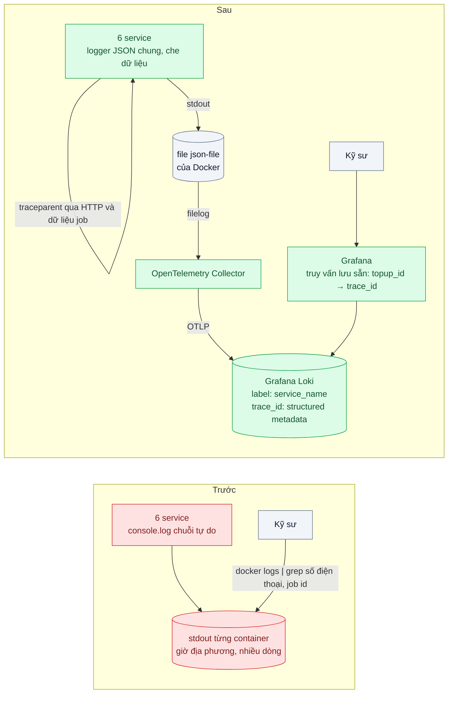

# Structured Logging & Correlation ID — Grep log của 6 service để tìm một request của khách

| Scope | Mức độ | Trạng thái | Pattern gốc | Cập nhật |
|---|---|---|---|---|
| 23 · backend / monitoring benchmark | 🟢 Cơ bản | ✅ Hoàn thành | Structured Logging & Correlation Identifier — OpenTelemetry "Logs"; 12factor "Logs"; W3C Trace Context; Hohpe & Woolf, *EIP* (2003) | 2026-10-09 |

> **Một câu tóm tắt:** Mỗi dòng log là một sự kiện JSON theo schema chung và mang cùng một `trace_id` được truyền qua mọi service và mọi hàng đợi, đổ về một kho tập trung — để từ mã giao dịch khách đưa, kỹ sư thấy toàn bộ hành trình của request trong một truy vấn thay vì SSH vào 6 nơi.

## 1. Bài toán thực tế (What)

**Bối cảnh** *(doanh nghiệp giả định, số liệu minh họa)*
Ví điện tử có luồng nạp tiền đi qua 6 service: gateway, wallet, topup, bank-adapter (sau một hàng đợi), ledger và notification. Mỗi service log bằng `console.log` theo kiểu riêng: chuỗi tự do, giờ địa phương, có nơi ghi file trên máy, có nơi chỉ ra stdout của container.

**Triệu chứng người kinh doanh nhìn thấy**
- Khiếu nại "ngân hàng đã trừ 2 triệu nhưng ví chưa cộng" mất 1–2 ngày mới có câu trả lời; khách gọi lại nhiều lần và đăng bài phàn nàn.
- Mỗi ticket tốn khoảng 3 giờ của một kỹ sư: tìm số điện thoại trong log 6 nơi, ghép theo giờ "xấp xỉ", đoán dòng nào thuộc cùng một lần nạp. Khoảng 40 ticket mỗi tuần.
- Kiểm tra tuân thủ phát hiện log chứa số điện thoại và một phần số thẻ dạng rõ.

**Nguyên nhân kỹ thuật**
Log là văn bản tự do nên không truy vấn theo trường được. Không có định danh chung nào đi theo request qua các service, và khi request đi qua hàng đợi thì mọi liên kết thời gian cũng mất. Log nằm rải rác, giờ không thống nhất, nên "ghép" là việc thủ công và dễ sai. Không có quy tắc che dữ liệu nhạy cảm.

**Ràng buộc**
- Không đổi kiến trúc luồng nạp tiền; chỉ thay cách log và thêm hạ tầng thu thập.
- Chăm sóc khách hàng chỉ có mã giao dịch nạp tiền (`topup_id`) và số điện thoại.
- Log không được chứa dữ liệu thẻ hay số điện thoại dạng rõ.

## 2. Vì sao dùng pattern này (Why)

**Nguyên nhân gốc mà pattern nhắm vào:** log không có cấu trúc và không có sợi chỉ chung nối các dòng của cùng một request.

**Pattern giải quyết thế nào:** *Structured logging*: mỗi dòng là một sự kiện JSON với các trường cố định — `timestamp` UTC ISO-8601, `level`, `service`, `message`, `trace_id`, `span_id` và khóa nghiệp vụ như `topup_id` — ghi ra stdout; theo 12factor, ứng dụng coi log là luồng sự kiện và để môi trường thu gom. *Correlation Identifier* (EIP) gắn một định danh vào mọi message thuộc cùng một cuộc trao đổi. Thay vì tự chế header, dùng `traceparent` của W3C Trace Context làm định danh: gateway tạo, mọi lời gọi HTTP và mọi message trong hàng đợi mang theo, nên log và trace (bài 03) dùng chung một id. Trong một tiến trình Node, context được giữ qua `AsyncLocalStorage` (OpenTelemetry làm sẵn) để lập trình viên không phải truyền tay; OpenTelemetry docs mô tả việc gắn trace context vào log để tương quan. Log được đẩy về một kho tập trung có truy vấn theo trường.

**Lựa chọn khác đã cân nhắc**

| Lựa chọn | Giải quyết được gì | Vì sao không chọn (ở bài này) |
|---|---|---|
| Giữ nguyên + tối ưu nhỏ (gom log về một máy, thống nhất giờ UTC) | Không phải SSH 6 nơi | Vẫn là chuỗi tự do, vẫn ghép theo giờ; mất liên kết qua hàng đợi |
| Tự chế header `X-Request-Id` | Có định danh chung | Phải tự truyền ở mọi thư viện, mọi hàng đợi; không khớp với tracing sau này |
| Chỉ dùng distributed tracing | Thấy hành trình request | Trace thường bị lấy mẫu và không chứa chi tiết nghiệp vụ; log vẫn cần cho điều tra |
| Kho log full-text (Elasticsearch) | Tìm kiếm mạnh | Chi phí lưu trữ và vận hành cao hơn với đội nhỏ; Loki cùng hệ Grafana với metrics và trace |
| JSON log + `traceparent` + Loki (chọn) | Truy vấn theo trường, nối qua hàng đợi, khớp với trace | Phải sửa mọi chỗ log; cần quy tắc label và che dữ liệu |

## 3. Thiết kế hệ thống (How)

### 3.1 Kiến trúc trước và sau



### 3.2 Luồng chính

Luồng của lab (4 service; bối cảnh mục 1 có 6). Bank-adapter chỉ biết job (job_id, số thẻ, số tiền), không log `topup_id`:
dòng của nó chỉ nối được nhờ `trace_id` đi qua hàng đợi.

```mermaid
sequenceDiagram
  autonumber
  participant App as App ví
  participant GW as gateway
  participant TP as topup
  participant LG as ledger
  participant Q as BullMQ (Redis)
  participant BA as bank-adapter
  participant KS as Kỹ sư
  participant LK as Loki
  App->>GW: POST /topups 2 triệu (header x-msisdn)
  GW->>GW: span SERVER mới (hoặc nối traceparent của app), log topup.received đã che
  GW->>TP: POST /topups + traceparent
  TP->>LG: POST /entries + traceparent (bút toán chờ)
  TP->>Q: job charge, dữ liệu có _trace.traceparent của span PRODUCER
  TP-->>GW: 202 topup_id
  Q->>BA: worker nhận job, khôi phục context, span CONSUMER
  BA->>BA: log bank.charge_failed (err.message đã che), cùng trace_id
  BA->>LG: POST /entries/:id/reverse + traceparent
  Note over GW,BA: Mọi service chỉ ghi stdout; Collector đọc file log của Docker, đẩy Loki
  KS->>LK: |= "tp_..." | json | topup_id="tp_..."
  LK-->>KS: 5 dòng (gateway, topup, ledger), cùng một trace_id
  KS->>LK: | trace_id="..."
  LK-->>KS: 8 dòng theo thời gian, có 2 dòng của bank-adapter: timeout ngân hàng
```

### 3.3 Thành phần và trách nhiệm

| Thành phần | Trách nhiệm | Quyết định thiết kế đáng chú ý |
|---|---|---|
| Logger chung (`packages/logging/create-logger.ts`, pino) | Ghi JSON theo schema cố định ra stdout: `timestamp` (UTC ISO-8601), `level`, `service`, `event`, `message`, `trace_id`, `span_id` + khóa nghiệp vụ (`topup_id`, `job_id`) | API bắt buộc `event` + `message` (không để pino tự lấy `err.message` làm `message`); trường bắt buộc kiểm bằng test trên log thật |
| Che dữ liệu | `redact` theo đường dẫn (số điện thoại giữ 3 số cuối, số thẻ giữ 4 số cuối, `authorization`/`cvv` thành `[REDACTED]`) + serializer của `err` quét regex trong `message`/`stack` | Redact chỉ che đúng đường đã liệt kê; chuỗi tự do (lỗi của SDK ngân hàng có số thuê bao) cần serializer — cả hai đều có phép thử âm |
| Truyền context trong tiến trình | `AsyncLocalStorage` qua `@opentelemetry/context-async-hooks`; `mixin()` của pino đọc span hiện tại | Lập trình viên không truyền id bằng tay: dòng lỗi của bank-adapter có `trace_id` dù code không đưa trường nào |
| Truyền context qua HTTP | `W3CTraceContextPropagator`: `withServerSpan` đọc `traceparent` vào, `postJson` ghi `traceparent` ra | Nhận id từ upstream (kể cả của app khách), không tự tạo mới ở mỗi service |
| Truyền context qua hàng đợi (`queue-context.ts`) | `publishWithContext` ghi `traceparent` của span PRODUCER vào `job.data._trace`; `processWithContext` đọc lại, chạy handler trong span CONSUMER | Consumer là span con của producer (span_id khác, trace_id giữ nguyên); carrier chỉ chứa header W3C |
| Collector (`infra/otel-collector.yaml`) | `filelog` đọc `/var/lib/docker/containers/*/*-json.log`, lọc nhãn `lab.id=23-02`, lấy `service.name` từ nhãn Compose, đọc `level`/`trace_id`/`span_id` của dòng JSON vào trường chuẩn OTel, đẩy OTLP tới Loki | Dòng giữ nguyên nội dung; dòng text tự do (bản trước) vẫn đi qua, chỉ không có trace |
| Loki (`infra/loki-config.yaml`) | Lưu log, label duy nhất `service_name`; `trace_id`, `span_id`, `severity_text` là structured metadata | `topup_id` ở trong nội dung dòng; không id nào thành label |
| Truy vấn | Grafana dashboard "Nạp tiền — tìm hành trình" (biến `topup_id`, `trace_id`) + derived field `trace_id` mở thẳng hành trình | Bước 1 `{service_name=~"gateway\|topup\|bank-adapter\|ledger"} \|= "$topup_id" \| json \| topup_id="$topup_id"`; bước 2 `{…} \| trace_id="$trace_id"` (đã chạy trên Loki 3.7.8) |

### 3.4 Điểm dễ sai khi triển khai
- **Đưa `trace_id` hay `user_id` thành label của Loki**: mỗi giá trị một stream, chỉ mục phình và truy vấn chậm. Label phải ít giá trị.
- **Mất context ở ranh giới bất đồng bộ**: hàng đợi, `setTimeout`, callback của thư viện cũ. Viết test riêng cho đường qua hàng đợi.
- **Mỗi service tự tạo id mới** thay vì nhận từ upstream: chuỗi đứt ở ngay service thứ hai.
- **Log nguyên object request/response**: kéo theo dữ liệu nhạy cảm và làm log nặng; che theo đường dẫn không bắt được dữ liệu nằm trong chuỗi tự do.
- **Ghi log đồng bộ khối lượng lớn**: chặn event loop; dùng logger ghi bất đồng bộ và giới hạn mức `debug` ở production.
- **Log lỗi không kèm stack và nguyên nhân gốc**: có trace_id nhưng vẫn không biết vì sao.

Gặp thật khi làm lab (đã kiểm):
- **pino tự lấy `err.message` làm `message`** khi gọi `logger.error(err)` hoặc `logger.error({ err })` không kèm chuỗi
  (pino 10.3.1, đã chạy thử): chuỗi đó **không đi qua serializer**, nên số thuê bao trong lỗi của SDK ngân hàng lọt vào
  trường `message` dù serializer của `err` đã che. Logger chung bắt buộc truyền `event` và `message`.
- **`redact` không với tới chuỗi tự do.** Bỏ bước quét của serializer (phép thử âm `no-err-scrub`): 3/3 test của (c) đỏ —
  `err.message` và `stack` còn nguyên số thuê bao và số thẻ dù mọi đường redact vẫn đủ.
- **Hàm `censor` được gọi cả khi trường không có**: header `x-msisdn` không gửi thì lượt đầu ghi `"[REDACTED]"` (người đọc
  tưởng có dữ liệu). `censor` trả lại `undefined`/`null` nguyên vẹn.
- **Regex số điện thoại phải lấy ranh giới "không phải chữ/số"**, không chỉ "không phải số": `trace_id`/`span_id` là hex
  và có chuỗi chữ số liền nhau; `topup_id` đặt dạng `tp_<hex>` để `_` chặn khớp nhầm.
- **`console.log(obj)` của Node chỉ in tới độ sâu 2 và tự xuống dòng**: bản trước in `body: { customer: [Object], … }`
  (mất số điện thoại lồng — nhưng cũng mất dữ liệu cần tra), object dài tự xuống dòng; khối lỗi của bank-adapter là 8
  dòng (message, 4 dòng stack, `job_id` ở gần cuối khối, xa dòng có nguyên nhân). Cùng lượng nạp, bản trước sinh 4.830 dòng, bản sau 1.120 dòng.
- **Docker Desktop: đọc được file log container** khi mount `/var/lib/docker/containers` (đường trong máy ảo Linux, không
  phải macOS) chỉ đọc. File là `root:root 0640` nên Collector (image chạy user 10001) phải chạy `user: "0:0"`. Thư mục có cả
  log của project khác: lọc theo nhãn `lab.id` ngay trong receiver và `start_at: end` để không đọc lại lịch sử của chúng.
- **Driver `json-file` chỉ chép nhãn container vào mỗi dòng khi khai `logging.options.labels`** (`attrs` trong file); không
  có nó Collector không biết dòng của service nào nếu không gọi `docker.sock`.
- **Collector contrib 0.161.0 báo deprecated alias** `filelog` → `file_log`, `otlphttp` → `otlp_http`; exporter `loki` cũ đã
  bị gỡ, Loki 3 nhận OTLP gốc ở `/otlp` (resource `service.name` → label `service_name`).
- **Loki mặc định `max_entries_limit_per_query: 5000`**: bench đếm dữ liệu cá nhân trên toàn bộ dòng của một lượt bị trả
  lỗi; lab nâng lên 100.000.
- **Loki tự thêm label nội bộ `__stream_shard__`** khi một stream ghi quá nhanh (tự chia stream, gặp sau lượt đo 150 req/s):
  test "chỉ có label `service_name`" đỏ giả. Test bỏ qua label bắt đầu bằng `__`; label do mình đặt vẫn chỉ có một.
- **pino ghi đồng bộ theo mặc định** (`pino.destination({ sync: true })`), còn `console.log` ra pipe là bất đồng bộ trên
  POSIX (Node docs). Đo: ghi bất đồng bộ chỉ có lợi rõ khi bão hòa (mục 5.1); lab giữ đồng bộ, bật `LOG_SYNC=false` khi cần.
- **Sửa mã nguồn phải `pnpm build` rồi `docker compose restart <service>`**: `dist/` mount chỉ đọc, tiến trình đã nạp bản cũ;
  `up -d` không tạo lại container khi chỉ file đổi.

## 4. Tech stack và tác động (Impact techstack)

| Lớp | Công nghệ chọn | Vì sao chọn | Thay thế tương đương |
|---|---|---|---|
| Service mẫu | 4 service **Fastify 5.12.5** (gateway, topup, bank-adapter, ledger), TypeScript strict, Node 20, gói bằng esbuild 0.28.2 thành một file chạy trên `node:20-alpine` (cùng digest 23/01) | Mỗi service 1–2 route; pattern nằm ở gói dùng chung | NestJS 10 |
| Logger | **pino 10.3.1** (`redact`, `mixin`, `serializers`, `formatters`) | JSON mặc định, `redact` theo đường dẫn biên dịch sẵn | `winston` |
| Gắn trace context vào log | **OpenTelemetry API 1.9.1 + `sdk-trace-base`/`core`/`context-async-hooks` 2.11.0** (cùng bộ 23/01); `mixin()` của pino đọc span hiện tại | Không cần exporter trace (bài 23/03): chỉ cần id và quan hệ cha–con | `@opentelemetry/instrumentation-pino` (không dùng: vá module lúc `require`, không chạy với code đã gói esbuild) |
| Hàng đợi | **BullMQ 6.3.8** + **ioredis 5.11.1** trên **Redis 7.4.6** (`noeviction`, không lưu đĩa; image đã có trên máy, ghim digest) | Có sẵn trong stack repo; `traceparent` trong dữ liệu job | Tùy chọn `telemetry` của BullMQ + `bullmq-otel`; RabbitMQ/Kafka header |
| Thu thập | **OTel Collector contrib 0.161.0** (cùng digest 23/01): receiver `filelog` + `json_parser`/`filter`/`move`/`severity_parser`/`trace_parser`, processor `transform`, exporter `otlp_http` | Service chỉ ghi stdout (12factor); cùng collector với metric và trace | Grafana Alloy, Fluent Bit; driver `fluentd` của Docker + receiver `fluentforward` |
| Lưu trữ log | **Grafana Loki 3.7.8** (monolithic, filesystem, TSDB v13; image MỚI duy nhất của bài) | Label nhỏ, structured metadata, nhận OTLP gốc, cùng Grafana | Elasticsearch / OpenSearch |
| Hiển thị | **Grafana 12.4.12** (cùng digest 23/01), datasource + dashboard provisioning, ẩn danh tắt, admin từ `.env` | Truy vấn lưu sẵn, derived field `trace_id` | — |
| Đo | k6 1.4.2 trong mạng Compose, Vitest 5.0.3, script `bench/*.ts` (tsx) | Overhead; test schema, trace qua hàng đợi, che dữ liệu trên log thật | — |

**Lệch so với kế hoạch ban đầu (đã ghi lý do):**
- **Collector đọc stdout qua file `json-file` (filelog), không dùng OTLP logs từ ứng dụng.** Đã thử trên Docker Desktop:
  mount `/var/lib/docker/containers` chỉ đọc được (thư mục của máy ảo), nên chọn cách giống DaemonSet trên Kubernetes
  (đọc `/var/log/pods`): ứng dụng không phụ thuộc Collector (Collector chết thì log vẫn nằm trong file và `docker logs`),
  stdout là nguồn sự thật duy nhất nên test (a)/(c) so được Loki với stdout. Đổi lại: Collector chạy root (chỉ đọc), thấy
  file log của project khác (lọc bỏ ngay), và không có checkpoint (`file_storage`) nên dòng ghi lúc Collector khởi động lại
  bị bỏ qua — chấp nhận ở lab. OTLP logs từ SDK cần thêm Logs SDK trong mọi service và một đường log thứ hai cần đồng bộ.
- **Không dùng `@opentelemetry/instrumentation-pino`** (bảng ban đầu ghi "instrumentation cho pino"): instrumentation vá
  module lúc nạp, còn service được gói esbuild thành một file nên không có `require('pino')` để vá. Dùng phương án "tự đọc
  context trong mixin" đã ghi ở cột thay thế.
- **Không có exporter trace**: `BasicTracerProvider` không span processor; span chỉ để sinh id W3C và quan hệ cha–con.
  Xem trace (thời gian từng chặng) là bài 23/03.
- **Bản "trước" không tách thư mục `src/truoc/`**: cùng mã nghiệp vụ, `LOG_MODE=truoc` thay logger chung bằng
  `legacy-log.ts` (console.log/console.error, mỗi service một kiểu giờ) và không khởi tạo tracing (không có `traceparent`).
  `LOG_MODE=off` giữ tracing nhưng không ghi dòng nào (đo overhead). `LOG_SYNC=false` cho pino ghi bất đồng bộ (đo ở 5.1).
- **4 service thay cho 6** (mục 8 đã chốt 4): đủ có HTTP nhiều chặng, một hàng đợi và một service được gọi cả trước lẫn
  sau hàng đợi (ledger).

**Thay đổi so với hệ thống hiện tại:** thay `console.log` bằng logger chung ở mọi service (một dòng `setupLogging`), bọc
handler bằng `withServerSpan`, gọi service khác qua `postJson`, đẩy/nhận job qua `publishWithContext`/`processWithContext`;
thêm Collector, Loki, Grafana; khai `logging.options.labels` cho container. Chăm sóc khách hàng gửi `topup_id`; kỹ sư học
LogQL cơ bản (line filter → `json` → lọc trường; lọc structured metadata).

## 5. Kết quả đầu ra và cách đo (Output impact)

| Chỉ số | Trước (minh họa) | Mục tiêu khi thực hành | Cách đo |
|---|---|---|---|
| Thời gian tìm đủ log của một lần nạp qua 6 service | ~3 giờ | ≤ 2 phút | 10 lần nạp lỗi ở bank-adapter (sau hàng đợi) giữa tải nền. Không bấm giờ người thật (nhật ký 23/01 điểm 8): bản trước chạy runbook grep cố định, đếm lệnh, số dòng phải đọc, số service ghép được và có thấy đúng dòng lỗi không; bản sau đo thời gian Loki trả lời 2 truy vấn và độ đầy đủ (service / 4) |
| Dòng log parse được JSON | ~30% | 100% | Đếm trên toàn bộ dòng của lượt diễn tập (Loki và stdout); test (a) thêm LogQL `\| json \| __error__!=""` = 0 |
| Dòng log có `trace_id` | 0% | ≥ 99% | Đếm trên toàn bộ dòng của lượt diễn tập; test (a) bắt buộc với mọi dòng trong request/job |
| Request giữ nguyên `trace_id` khi qua hàng đợi | 0% | 100% | Test (b) và 10/10 lần nạp của diễn tập: một truy vấn theo `trace_id` ra đủ 4 service, có dòng của consumer |
| Số điện thoại, số thẻ dạng rõ trong log | Có | 0 | Regex số di động VN + số thẻ qua Luhn trên log THẬT (Loki và `docker compose logs`) của lượt diễn tập và của test (c) |
| Overhead logging trên p99 | — | ≤ 2% | k6 trong mạng Compose, `POST /topups` qua gateway, 150 request/giây (mô hình mở) và 32 VU (thông lượng), 4 cách log, 3 vòng xoay thứ tự |

> Số "trước" là minh họa để hình dung bài toán. Số "mục tiêu" chỉ được coi là đạt khi có số đo thật
> ở mục 8 kèm môi trường đo.

**Tác động nghiệp vụ mong đợi:** khiếu nại nạp tiền được trả lời trong ngày; kỹ sư lấy lại thời gian tra log; log không còn là rủi ro tuân thủ.

### 5.1 Số đã đo

**Môi trường** *(đã đo, 2026-10-09, 12:21 – 12:53 giờ Việt Nam)*: MacBook Apple M1 Pro (8 nhân, 16 GB), macOS (Darwin
25.6), **cắm sạc** (`AC Power`, ghi trước và sau mỗi lượt), nắp mở, `caffeinate -ims`; bộ phát hiện máy ngủ của script đo
không thấy khoảng ngủ nào. **Máy rất bận**: load 1 phút của macOS **8 – 31** suốt các lượt (Word, Zalo, Chrome,
`kernel_task` khoảng 70 % CPU; container của dự án khác). Docker Desktop, Engine 28.5.1, máy ảo 8 CPU / 7,65 GiB. Node
20.19.6 trên host, 20.20.2 trong `node:20-alpine`; k6 1.4.2 trong container cùng mạng Compose. Phiên bản: mục 4 và
`compose.yaml`. File thô (không commit): `bench/results/main/` — `incident-{truoc,sau}.json` (từng lần nạp, từng lệnh),
`ingest-latency.json`, `overhead/` và `overhead-serial/` (mỗi vòng một file + `summary.json` + tóm tắt k6),
`negative/summary.json` (+ `bench/results/main-rerun/negative/`); log của từng lượt ở `bench/results/main-*.log`.

**Diễn tập sự cố** (`bench/incident-drill.ts`): tải nền 5 lần nạp/s thành công (20 số tổng hợp `09000000xx`, header
`x-msisdn`, số thẻ thử nghiệm công khai) trong khoảng 40 s; giữa đó 10 lần nạp vào ngân hàng giả lập `SIMBANK_TIMEOUT`,
cách nhau 2 s, mỗi lần một số tiền riêng (chỉ bộ chấm điểm dùng để biết dòng lỗi nào đúng). Lỗi của "SDK ngân hàng" có số
thuê bao, số thẻ, số tiền trong `message`. Chăm sóc khách hàng đưa `topup_id` + số điện thoại. Mỗi bản: 10 sự cố + 130 lần
nạp nền.

Runbook **bản trước** (cố định, viết trong script trước khi chạy; 5 lệnh `docker compose logs <svc> | grep …`):
`topup | grep -A6 <topup_id>` (lấy `job_id`) → `ledger | grep <topup_id>` → `bank-adapter | grep -B12 -A6 "job_id: '<N>'"`
→ `gateway | grep <topup_id>` → `gateway | grep -B3 -A10 <msisdn>` (khối "nhận yêu cầu", chọn theo giờ).

| Chỉ số *(đã đo, 10 sự cố mỗi bản)* | Trước: grep `docker compose logs` | Sau: LogQL trên Loki |
|---|---|---|
| Lệnh / truy vấn mỗi sự cố | 5 lệnh (2 bước nối tay: `topup_id` → `job_id` → khối của bank-adapter; số điện thoại → khối của gateway) | 2 truy vấn (`topup_id` → `trace_id` → hành trình) |
| Dòng phải đọc mỗi sự cố (trung vị, thấp – cao) | **164** (149 – 170) | **13** (13 – 13): 5 dòng có `topup_id` + 8 dòng của trace |
| Service ghép được / 4 | 4/4 ở 10/10 sự cố | 4/4 ở 10/10 sự cố |
| Thấy ĐÚNG dòng lỗi ngân hàng của lần nạp đó | 10/10 (qua `job_id` mà topup tình cờ có log) | 10/10 (dòng `bank.charge_failed` cùng `trace_id`) |
| Khối "nhận yêu cầu" của gateway không phân biệt được (≥ 2 ứng viên cùng số trong ±3 s) | 10/10 sự cố (2 – 3 ứng viên) | 0 — dòng gateway mang `trace_id` |
| Dòng có số điện thoại/số thẻ hiện ra cho người tra (trung vị) | 14 – 15 dòng mỗi sự cố | 0 |
| Thời gian máy trả lời | 5 lệnh `docker compose logs` (không đo riêng) | truy vấn `topup_id`: trung vị **12,8 ms** (8,9 – 29,4); truy vấn `trace_id` (structured metadata): **10,8 ms** (7,9 – 44,2); cùng hành trình bằng line filter `\|= "<trace_id>"`: 11,5 ms (7,4 – 17,6) |

Toàn bộ log của lượt diễn tập *(đã đo; Loki và stdout cho cùng số)*:

| | Trước | Sau |
|---|---|---|
| Số dòng (4 service) | 4.830 | 1.120 (= 140 lần nạp × 8 dòng) |
| Dung lượng | 162 KB | 358 KB (×2,2: JSON có tên trường, request đã che) |
| Dòng parse được JSON | 0 % (0/4.830) | **100 %** (1.120/1.120) |
| Dòng có `trace_id` | 0 % | **100 %** (1.120/1.120; dòng `service.started` lúc khởi động nằm ngoài cửa sổ và không có trace theo thiết kế) |
| Dòng chứa số điện thoại VN / số thẻ (Luhn) | **430** dòng (290 có số điện thoại, 150 có số thẻ) | **0** |

Đọc kết quả cho đúng:
- **Bản trước của lab vẫn ghép đủ 4 service** — vì topup tình cờ log `job_id` và bank-adapter in `job_id` trong khối lỗi.
  Cái giá là 5 lệnh, khoảng 160 dòng phải đọc (gồm khối của job khác lọt vào ngữ cảnh `-B12`), luôn phải đoán khối
  "nhận yêu cầu" của gateway theo giờ, và người tra nhìn thấy dữ liệu cá nhân. Không có `job_id` ở log của topup thì không
  có đường nào từ `topup_id` sang dòng lỗi ngoài số điện thoại + giờ — "đứt mạch" ở hàng đợi đúng như mục 1, nhưng lab không
  dựng kịch bản đó cho bản trước; phép thử âm `no-queue-context` cho thấy điều tương tự ở bản sau.
- **Thời gian người đọc 164 dòng so với 13 dòng không đo** (không bấm giờ người thật). Mục tiêu "≤ 2 phút" chỉ kiểm được
  phần máy: hai truy vấn dưới 50 ms mỗi truy vấn trên khoảng 1.100 dòng; ở quy mô log production thời gian Loki sẽ khác.

**Độ trễ ingest** (`bench/ingest-latency.ts`, 30 lần nạp nối tiếp, hỏi Loki mỗi 50 ms tới khi thấy dòng
`ledger.entry_confirmed` — dòng CUỐI, ghi sau hàng đợi): từ `timestamp` trong dòng tới lúc truy vấn được *(đã đo)*:
trung vị **289 ms**, p95 **488 ms**, lớn nhất 491 ms, nhỏ nhất 172 ms (gồm tới 50 ms độ phân giải + thời gian một truy
vấn). Riêng chặng ghi → Collector đọc (`observed_timestamp`): trung vị 75 ms, p95 167 ms (poll 200 ms). Phần còn lại là
batch 200 ms + OTLP + Loki. Người trực truy vấn ngay sau khi khách báo thì dòng của nửa giây trước đã có.

**Overhead của logging** (`bench/run-overhead-serial.ts`, `bench/run-overhead.ts`): cùng code, đổi cách log cho cả 4 service —
`truoc` (console.log, không trace context), `sau` (pino ghi đồng bộ — mặc định của pino —, redact, trace), `sau-async`
(như `sau`, `LOG_SYNC=false`), `off` (trace context bật, không ghi dòng nào). k6 trong mạng Compose, `POST /topups` qua
gateway (gateway → topup → ledger + BullMQ; bank-adapter → ledger chạy nền), ngân hàng OK. 3 vòng, xoay thứ tự, warm-up,
tạo lại container mỗi lượt. Số là trung vị (thấp nhất – cao nhất) của 3 vòng *(đã đo)*.

| 1 VU nối tiếp × 20 s | truoc | sau | sau-async | off |
|---|---|---|---|---|
| p50 (ms) | 2,35 (2,27 – 2,62) | 2,19 (2,18 – 2,30) | 2,24 (2,20 – 2,39) | **1,81** (1,77 – 1,86) |
| p95 (ms) | 6,68 (6,07 – 6,97) | 5,27 (5,11 – 5,72) | 5,83 (5,04 – 5,84) | 4,23 (3,61 – 4,71) |
| p99 (ms) | 13,9 (13,2 – 17,4) | 13,3 (12,1 – 17,1) | 15,3 (13,2 – 18,6) | 10,7 (8,1 – 17,1) |
| request/s | 305 (283 – 328) | 344 (315 – 350) | 322 (305 – 345) | 419 (373 – 433) |

Chênh p50 theo từng vòng: `sau − off` +0,49 / +0,41 / +0,32 ms; `sau-async − off` +0,58 / +0,43 / +0,38 ms; `truoc − off`
+0,81 / +0,50 / +0,49 ms. Chênh p99 `sau − off`: −0,05 / +1,31 / +5,23 ms (nhiễu).

| 150 req/s mở × 30 s, rồi 32 VU × 20 s | truoc | sau | sau-async | off |
|---|---|---|---|---|
| p50 (ms) | 3,72 (3,15 – 4,24) | 3,36 (2,82 – 8,55) | 3,19 (2,68 – 3,78) | 2,67 (2,24 – 4,10) |
| p95 (ms) | 98 (15 – 165) | 245 (13 – 551) | 599 (220 – 728) | 188 (11 – 397) |
| p99 (ms) | 469 (81 – 567) | 808 (74 – 3.665) | 1.064 (744 – 1.840) | 544 (135 – 1.345) |
| `dropped_iterations` theo vòng | 10 / 30 / 0 | 436 / 32 / 0 | 92 / 97 / 4 | 0 / 85 / 1 |
| Thông lượng 32 VU (req/s) | 673 (544 – 795) | 1.025 (822 – 1.037) | 1.158 (1.129 – 1.175) | 1.635 (1.055 – 1.802) |
| CPU (% một nhân, trung vị lượt mở): gateway / topup / bank-adapter / ledger | 35 / 33 / 55 / 13 | 35 / 39 / 43 / 13 | 27 / 28 / 34 / 11 | 24 / 25 / 31 / 8 |
| CPU Collector / Loki | 9,2 / 14,2 | 6,6 / 8,6 | 6,2 / 3,9 | 1,0 / 1,0 |

Đọc kết quả cho đúng (load macOS 10 – 31 suốt các lượt; không lượt nào có khoảng ngủ, 0 request lỗi):
- **Ở 150 req/s, p95/p99 dao động giữa các vòng (tới 50 lần) lớn hơn mọi chênh lệch giữa các cách log**: không kết luận
  được gì về p95/p99 dưới tải trên máy này; ghi "không thấy vượt mức nhiễu". Lượt thử 300 req/s (mục tiêu ban đầu) thì
  ngay bản `off` đã bỏ 98 lượt và p95 470 ms — máy đo không giữ được tải đó, nên lượt chính dùng 150 req/s.
- **Ở 1 VU, logging thêm khoảng 0,3 – 0,5 ms p50 mỗi request** so với không log, ổn định qua 3 vòng (đường đi có 3 service
  ghi 5 dòng trước khi trả lời). Request của lab gần như rỗng nghiệp vụ (1,8 ms) nên đó là +18 – 27 %; cùng 0,4 ms trên
  request 40 ms là khoảng 1 % (minh họa, chưa đo).
- **pino không chậm hơn `console.log`**: `sau` nhanh hơn `truoc` ở p50 cả 3 vòng (0,08 – 0,33 ms) và thông lượng 32 VU cao
  hơn cả 3 vòng (+149 / +482 / +242 req/s) — `console.log` in object bằng `util.inspect` nhiều dòng tốn hơn
  `JSON.stringify` + redact; bản trước cũng làm Collector/Loki bận hơn (gấp 4 số dòng).
- **Ghi bất đồng bộ (`LOG_SYNC=false`) chỉ thấy lợi khi bão hòa**: thông lượng 32 VU cao hơn ghi đồng bộ cả 3 vòng (+336 /
  +150 / +92 req/s), còn ở 1 VU không vượt nhiễu. Lab giữ mặc định đồng bộ (không mất dòng cuối khi tiến trình chết).
- Thông lượng tối đa giảm rõ khi có log (`off` 1.635 → `sau` 1.025, trung vị; vòng 2 `off` chỉ 1.055 nên chênh theo vòng là
  −813 / −30 / −765 req/s).

**Phép thử âm** (`bench/negative-drills.ts`, công tắc `LAB_DRILL`, dựng lại 4 service, chạy đúng file test, rồi khôi phục và
chạy lại file đó):

| Công tắc `LAB_DRILL` | File test | Khi gỡ *(đã đo)* | Khôi phục |
|---|---|---|---|
| `no-nested-redact` — bỏ đường `req.body.payment.card.number` | (c) `no-pii-in-logs` | **3/3 đỏ**: trường còn `4111111111111111`; Loki và stdout mỗi nơi 3 lần khớp regex thẻ (3 dòng `topup.received`) | 3/3 xanh |
| `no-err-scrub` — serializer `err` không quét chuỗi (redact giữ đủ đường) | (c) | **3/3 đỏ**: `err.message` còn "thuê bao 09…, thẻ 4111…"; 8 lần khớp trên Loki, 8 trên stdout (số thuê bao và số thẻ trong `message` và `stack` của 2 dòng lỗi) | 3/3 xanh |
| `no-queue-context` — producer không ghi `traceparent` vào job | (b) `trace-id-across-queue` | **3/3 đỏ**: dòng có `topup_id` mang 2 trace_id (ledger đảo bút toán, gọi từ consumer, thành trace mới); `trace_id` của client chỉ còn ở phía trước hàng đợi; 20 lần nạp đồng thời: dòng có `topup_id` của mỗi lần không còn chung một trace_id | 3/3 xanh |
| `console-log-ledger` — ledger ghi một dòng bằng `console.log` | (a) `log-schema` | **4/5 đỏ**: 6 dòng của ledger không phải JSON (Loki và stdout), LogQL đếm 6 dòng lỗi parse, các dòng đó không có `trace_id` | 5/5 xanh\* |

\* Lượt đầu (`bench/results/main/negative/`) bản khôi phục còn 1 test đỏ: Loki đã tự thêm label nội bộ `__stream_shard__`
sau lượt đo tải (mục 3.4); test được sửa để bỏ label bắt đầu bằng `__`, rồi chạy lại riêng phép thử này
(`bench/results/main-rerun/negative/`): gỡ → 4/5 đỏ, khôi phục → 5/5 xanh. Ba phép thử còn lại không đổi.

**Đối chiếu mục tiêu:**

| Mục tiêu | Kết quả |
|---|---|
| Tìm đủ log một lần nạp ≤ 2 phút | **Đạt phần đo được**: 2 truy vấn, 13 dòng, 4/4 service ở 10/10 sự cố, mỗi truy vấn ≤ 44 ms; thời gian người không đo (bản trước: 5 lệnh, 164 dòng) |
| Dòng parse được JSON 100 % | **Đạt**: 1.120/1.120 (trước 0/4.830) |
| Dòng có `trace_id` ≥ 99 % | **Đạt**: 1.120/1.120 dòng trong request/job; dòng khởi động không có trace (thiết kế) |
| Giữ `trace_id` qua hàng đợi 100 % | **Đạt**: 10/10 sự cố + test (b) 20 lần nạp đồng thời |
| Số điện thoại, số thẻ trong log = 0 | **Đạt**: 0 dòng trong Loki và stdout (trước 430/4.830); test (c) gồm header, body lồng, `err.message`, stack |
| Overhead p99 ≤ 2 % | **Chưa kết luận được ở p99**: dưới tải 150 req/s nhiễu của máy lớn hơn chênh lệch; ở 1 VU p99 chênh −0,05 … +5,2 ms (nhiễu). p50 đo được: +0,3 – 0,5 ms mỗi request (+18 – 27 % trên request 1,8 ms của lab) — **không đạt** nếu tính theo % trên service rỗng; thông lượng 32 VU giảm khoảng 37 % (trung vị) so với không log |

**Hạn chế:** máy đo rất bận (load 8 – 31), Docker Desktop là máy ảo; diễn tập một kiểu sự cố, 10 mẫu mỗi bản, 1.100 –
4.800 dòng (Loki rỗng, thời gian truy vấn ở quy mô production chưa đo); runbook "trước" là một runbook hợp lý chứ không
phải mọi cách người tra có thể làm; overhead đo ở 150 req/s (không phải 300 như mục 5 ban đầu — xem trên).

## 6. Đánh đổi và khi KHÔNG nên dùng

**Đánh đổi**
- Chi phí lưu trữ log tăng khi log có cấu trúc đầy đủ; cần chính sách giữ log theo mức và thời hạn. Lab đo: ít dòng hơn
  4,3 lần nhưng nặng hơn 2,2 lần (mục 5.1) vì tên trường lặp lại ở mọi dòng và request được log (đã che).
- Thêm một hệ thống (Loki) có thể đầy đĩa hoặc chậm đúng lúc sự cố; Collector đọc file log cần quyền đọc thư mục log của
  container runtime (lab: root, chỉ đọc).
- Kỷ luật schema phải giữ lâu dài; một service log sai schema là một lỗ trong bức tranh (phép thử âm `console-log-ledger`).
- Che theo đường dẫn phải cập nhật khi thêm trường; chuỗi tự do vẫn cần quét regex (tốn CPU, có thể sót định dạng lạ).

**Không nên dùng khi**
- Một tiến trình duy nhất, ít request: JSON log ra file và `jq` có thể đủ, chưa cần kho tập trung.
- Cần phân tích hành vi người dùng hay số liệu kinh doanh: đó là việc của kho sự kiện phân tích, không phải log vận hành.

**Liên quan**
- [Bài 03 — Distributed Tracing](../03-distributed-tracing-otel-request-qua-6-service-cham-o-dau/) — cùng `trace_id`, thêm thời gian từng chặng.
- [Bài 01 — Four Golden Signals / RED / USE](../01-four-golden-signals-red-method-khong-biet-service-nao-cham/) — metrics cho biết khi nào cần đọc log.
- [Scope 14 bài 05 — Dead Letter Queue](../../14-backend-queueing/05-dead-letter-queue-mot-message-loi-chan-ca-hang-doi/) — message lỗi cần `trace_id` để tra ngược.
- [Scope 24 bài 01 — LLM Tracing](../../24-backend-ai-monitoring/01-llm-tracing-chatbot-tra-loi-sai-khong-biet-prompt-nao/) — mở rộng cho tính năng AI.

## 7. Cơ sở tham khảo

- OpenTelemetry docs, "Logs" — https://opentelemetry.io/docs/concepts/signals/logs/ — mô hình log, tương quan log với trace qua trace context.
- OpenTelemetry, "Logs Data Model" — https://opentelemetry.io/docs/specs/otel/logs/data-model/ — trường `TraceId`, `SpanId`, `SeverityText`, `ObservedTimestamp` mà Collector điền từ dòng JSON.
- OpenTelemetry, "Trace Context in non-OTLP Log Formats" — https://opentelemetry.io/docs/specs/otel/compatibility/logging_trace_context/ — tên trường `trace_id`, `span_id` (hex chữ thường) dùng trong schema.
- OpenTelemetry Collector contrib, `filelog` receiver — https://github.com/open-telemetry/opentelemetry-collector-contrib/blob/main/receiver/filelogreceiver/README.md — đọc file log, operator parse/lọc/di chuyển trường.
- Adam Wiggins, *The Twelve-Factor App*, "XI. Logs" — https://12factor.net/logs — coi log là luồng sự kiện ghi ra stdout, môi trường lo thu gom.
- W3C, *Trace Context* — https://www.w3.org/TR/trace-context/ — định dạng header `traceparent` dùng làm định danh chung.
- Gregor Hohpe & Bobby Woolf, *Enterprise Integration Patterns* (2003), "Correlation Identifier" — https://www.enterpriseintegrationpatterns.com/patterns/messaging/CorrelationIdentifier.html — gắn định danh chung vào các message thuộc cùng một cuộc trao đổi.
- Grafana Loki docs — https://grafana.com/docs/loki/ — "Label best practices" https://grafana.com/docs/loki/latest/get-started/labels/bp-labels/, structured metadata https://grafana.com/docs/loki/latest/get-started/labels/structured-metadata/, nhận OTLP https://grafana.com/docs/loki/latest/send-data/otel/, LogQL https://grafana.com/docs/loki/latest/query/log_queries/.
- pino docs — https://getpino.io/ — redaction https://github.com/pinojs/pino/blob/main/docs/redaction.md, API (`mixin`, `serializers`, `pino.destination`) https://github.com/pinojs/pino/blob/main/docs/api.md.
- OWASP, *Logging Cheat Sheet* — https://cheatsheetseries.owasp.org/cheatsheets/Logging_Cheat_Sheet.html — mục "Data to exclude": token, dữ liệu cá nhân phải bỏ, che, băm hoặc mã hóa trước khi ghi log.
- BullMQ docs — https://docs.bullmq.io/ — hàng đợi; "Telemetry" https://docs.bullmq.io/guide/telemetry là cách có sẵn để truyền context qua job.
- Docker docs, logging driver `json-file` — https://docs.docker.com/engine/logging/drivers/json-file/ — tùy chọn `labels` đưa nhãn container vào từng dòng.
- Node.js docs, "A note on process I/O" — https://nodejs.org/api/process.html — stdout là pipe thì ghi bất đồng bộ trên POSIX (khác pino mặc định ghi đồng bộ).

## 8. Kế hoạch thực hành

- [x] Bước 1: dựng 4 service mẫu (gateway, topup, bank-adapter sau BullMQ, ledger) + Redis + Collector + Loki + Grafana bằng Compose; bản trước (`LOG_MODE=truoc`) dùng `console.log` tự do, có in số điện thoại (dải số tổng hợp).
- [x] Bước 2: đo "trước": 10 lần nạp lỗi ở bank-adapter, runbook grep cố định (không bấm giờ người thật — mục 5.1); đếm dòng chứa dữ liệu nhạy cảm trên log thật.
- [x] Bước 3: áp dụng pattern: logger chung với schema và che dữ liệu, OpenTelemetry context, truyền `traceparent` qua BullMQ, Collector đẩy về Loki, truy vấn lưu sẵn.
- [x] Bước 4: đo "sau" cùng kịch bản, độ trễ ingest và overhead bằng k6; ghi số và môi trường vào mục 5.1.
- [x] Bước 5: test trên log thật: (a) mọi dòng có đủ trường bắt buộc; (b) consumer có cùng `trace_id` với producer; (c) không dòng nào khớp regex số điện thoại hay số thẻ; kèm 4 phép thử âm.

**Cấu trúc code thật**
```text
compose.yaml                         # [PATTERN] 4 service + Redis + Collector + Loki + Grafana (+ k6 profile bench);
                                     #   logging.options.labels, nhãn lab.id=23-02, image ghim digest, 127.0.0.1
packages/logging/                    # gói dùng chung cho mọi service
  index.ts                           # setupLogging(service): LOG_MODE truoc/sau/off
  create-logger.ts                   # [PATTERN] pino: schema cố định, redact theo đường dẫn, serializer err, mixin trace_id/span_id
  trace-context.ts                   # [PATTERN] AsyncLocalStorage + W3C traceparent; withServerSpan, traceHeaders
  queue-context.ts                   # [PATTERN] publishWithContext / processWithContext: traceparent trong dữ liệu job BullMQ
  pii.ts                             # regex số di động VN, số thẻ (Luhn), che chuỗi tự do — dùng cho serializer và test
  legacy-log.ts                      # bản "trước": console.log tự do, mỗi service một kiểu giờ
  drill.ts                           # công tắc LAB_DRILL cho phép thử âm
services/
  gateway/main.ts                    # POST /topups → topup; log request (header chọn lọc + body) đã che
  topup/main.ts                      # tạo topup_id, ledger POST /entries, đẩy job "charge" vào hàng đợi bank-charge
  bank-adapter/main.ts               # worker BullMQ, ngân hàng giả lập (SIMBANK_TIMEOUT lỗi), báo ledger confirm/reverse
  ledger/main.ts                     # sổ cái trong bộ nhớ: PENDING → CONFIRMED / REVERSED
  shared/http.ts                     # postJson có traceparent
scripts/build-services.mjs           # esbuild → dist/<service>.mjs (chạy sau `pnpm install`)
infra/
  otel-collector.yaml                # [PATTERN] filelog (file json-file) → lọc lab.id → service.name, trace_id, level → OTLP Loki
  loki-config.yaml                   # monolithic, filesystem, label service_name, structured metadata
  grafana/provisioning/              # datasource Loki (uid loki, derived field trace_id), provider dashboard từ file
  grafana/dashboards/topup-journey.json  # truy vấn lưu sẵn: topup_id → trace_id → hành trình; dòng lỗi parse, thiếu trace_id
test/
  log-schema.test.ts                 # (a) schema trên Loki và stdout, 0 lỗi parse (LogQL), label chỉ service_name
  trace-id-across-queue.test.ts      # (b) một trace qua 4 service + hàng đợi; traceparent của client; 20 lần nạp đồng thời
  no-pii-in-logs.test.ts             # (c) header, body lồng, err.message, stack: 0 khớp regex; dạng đã che vẫn có
  grafana-saved-queries.test.ts      # ẩn danh 401, datasource OK, mọi truy vấn của dashboard chạy và ra đúng hành trình
  support/stack.ts                   # gọi gateway, Loki (query_range), stdout container, chờ hành trình
bench/
  incident-drill.ts                  # diễn tập 10 sự cố: runbook grep (trước) / LogQL (sau); đếm toàn bộ log của lượt
  ingest-latency.ts                  # ghi → truy vấn được trong Loki
  run-overhead.ts, logging-overhead.k6.js  # truoc / sau / sau-async / off: 150 req/s + 32 VU, 3 vòng xoay thứ tự
  run-overhead-serial.ts             # cùng 4 cách log, 1 VU nối tiếp
  negative-drills.ts                 # 4 phép thử âm, khôi phục, chạy lại
  lib/                               # chạy lệnh không chặn, docker stats, máy thức/ngủ, k6 trong Compose
```

**Cách chạy** *(đã chạy lại từ đầu, volume sạch, 2026-10-09)*
```bash
cp .env.example .env                 # mật khẩu mẫu Grafana admin, LOG_MODE=sau
pnpm install                         # cài gói và tự build dist/<service>.mjs (postinstall)
docker compose up -d --wait          # 8 container, chờ healthcheck (Grafana kiểm hộ Loki /ready và Collector :13133)
pnpm typecheck && pnpm test          # 14 test trên log thật, khoảng 5 – 20 s

# Sửa mã nguồn: pnpm build && docker compose restart gateway topup bank-adapter ledger
# Xem: Grafana http://127.0.0.1:53000 (admin / GRAFANA_ADMIN_PASSWORD trong .env), dashboard "Logging / Nạp tiền — tìm
#      hành trình"; Loki http://127.0.0.1:53100. Bản trước: LOG_MODE=truoc docker compose up -d --wait

# Đo (mỗi lần chỉ chạy một lab; cắm sạc, mở nắp, `caffeinate -ims -t 3600 &`)
pnpm bench:incident --mode truoc     # khoảng 1 phút
pnpm bench:incident --mode sau       # khoảng 1 phút
pnpm bench:ingest --samples 30       # khoảng 30 s
pnpm bench:overhead --rounds 3      # 150 req/s + 32 VU, 4 cách log, khoảng 18 phút
pnpm bench:overhead-serial --rounds 3   # 1 VU nối tiếp, 4 cách log, khoảng 9 phút
pnpm bench:negative                  # 4 phép thử âm (gỡ → đỏ, khôi phục → xanh), khoảng 3 phút

docker compose --profile bench down -v   # dọn: container, mạng, volume của project lab-23-02
```

## Bài học sau khi làm

- **Test PII không được dùng chung bộ nhận diện với bộ che dữ liệu** (người điều phối tìm ra khi kiểm chứng): bản đầu của `test/no-pii-in-logs.test.ts` quét log bằng `findPii` import từ `packages/logging`, cùng `VN_PHONE_RE` mà bộ che dùng. Làm yếu regex (bỏ dạng `0xxx`) thì SĐT thô lọt vào log nhưng hai test quét toàn bộ Loki/stdout vẫn xanh; chỉ phép kiểm "dạng đã che có mặt" đỏ. Đã đổi sang bộ nhận diện viết riêng trong test, cộng kiểm mọi giá trị đã gửi (dạng gốc và chỉ còn chữ số) không xuất hiện nguyên vẹn: cùng phép làm yếu đó giờ đỏ cả 3 test, khôi phục thì 14/14 xanh.

- **Giá trị lớn nhất của `trace_id` nằm ở dòng KHÔNG có khóa nghiệp vụ.** Worker sau hàng đợi chỉ biết job; dòng lỗi quan
  trọng nhất (timeout ngân hàng) không có `topup_id`. Truy vấn theo `topup_id` ra 5 dòng, theo `trace_id` ra đủ 8 dòng gồm
  dòng lỗi — mà code của worker không truyền tay trường nào: `mixin` đọc context mà `processWithContext` đã khôi phục.
- **Bản trước "ghép được" không có nghĩa là rẻ.** Runbook grep vẫn tìm đủ 4 service ở 10/10 sự cố nhờ `job_id` tình cờ được
  log, nhưng mất 5 lệnh, khoảng 160 dòng phải đọc, luôn phải đoán khối request ở gateway theo giờ, và người tra thấy 14 – 15
  dòng có dữ liệu cá nhân mỗi sự cố. Một đội chỉ cần quên log `job_id` là mạch đứt ở hàng đợi.
- **`redact` là danh sách trắng theo đường dẫn, không phải bộ lọc dữ liệu.** Nó không với tới chuỗi tự do; lỗi của thư viện
  bên ngoài (SDK ngân hàng) mang số thuê bao trong `message` và `stack`. Cần lớp thứ hai (serializer quét regex) và cần cấm
  để pino tự chép `err.message` vào `message`.
- **Test "không có PII" dễ xanh giả.** Nếu trường biến mất (đổi tên, quên log) thì regex cũng không thấy gì; test phải khẳng
  định thêm dạng đã che có mặt (`***012`, `****1111`, `[REDACTED]`).
- **Regex tìm PII cũng có thể bắt nhầm id của chính hệ thống quan sát**: trace_id hex chứa chuỗi chữ số dài; ranh giới phải
  là "không phải chữ/số".
- **Log có cấu trúc ít dòng hơn nhưng nặng hơn** (4.830 → 1.120 dòng, 162 → 358 KB cho cùng lượng nạp): đừng hứa "giảm chi
  phí lưu trữ" chỉ vì bỏ được log nhiều dòng; nặng là do log cả request (đã che) và tên trường lặp lại.
- **Docker Desktop đọc được file log container** (mount thư mục của máy ảo), nên cách thu log giống DaemonSet trên
  Kubernetes chạy được ở local; đổi lại Collector cần quyền root chỉ đọc và thấy log của project khác — lọc theo nhãn ngay ở
  receiver.
- **Độ trễ ingest dưới nửa giây** (p95 488 ms, đường stdout → file → Collector → Loki) — không phải nút thắt của việc điều tra;
  nút thắt là người đọc bao nhiêu dòng.
- **Overhead của log có thật và đo được ở 1 VU, không đo được ở tải cao trên máy bận.** Khoảng 0,3 – 0,5 ms mỗi request (5 dòng
  trên đường đi); pino nhanh hơn `console.log` in object. Mục tiêu "≤ 2 % p99" chưa kiểm được: p99 dưới tải dao động lớn hơn
  chênh lệch. Đừng ghi "overhead không đáng kể" khi chưa đo trên request có nghiệp vụ thật.
- **Hạn chế số đo**: máy đo rất bận (load 8 – 31); 10 sự cố mỗi bản, một kiểu sự cố; Loki gần rỗng nên thời gian truy vấn
  chưa nói gì về quy mô production; overhead đo ở 150 req/s thay cho 300 req/s.
