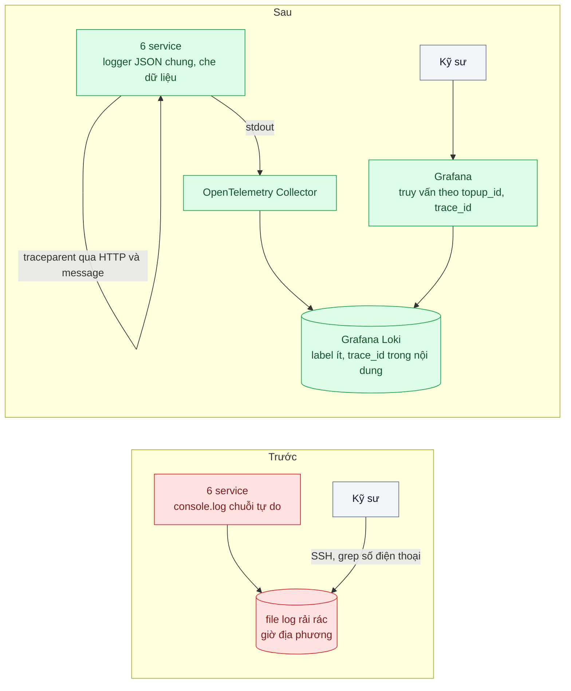
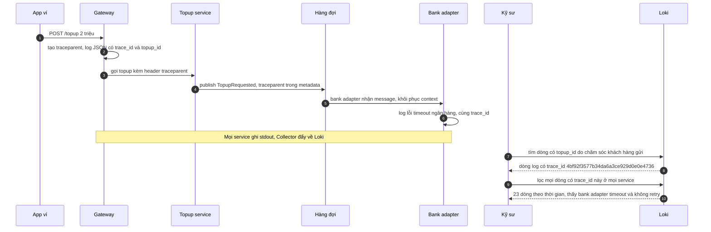

# Structured Logging & Correlation ID — Grep log của 6 service để tìm một request của khách

| Scope | Mức độ | Trạng thái | Pattern gốc | Cập nhật |
|---|---|---|---|---|
| 23 · backend / monitoring benchmark | 🟢 Cơ bản | 📋 Kế hoạch | Structured Logging & Correlation Identifier — OpenTelemetry "Logs"; 12factor "Logs"; W3C Trace Context; Hohpe & Woolf, *EIP* (2003) | 2026-10-06 |

> **Một câu tóm tắt:** Mỗi dòng log là một sự kiện JSON theo schema chung và mang cùng một `trace_id` được truyền qua mọi service và mọi hàng đợi, đổ về một kho tập trung — để từ mã giao dịch khách đưa, kỹ sư thấy toàn bộ hành trình của request trong một truy vấn thay vì SSH vào 6 nơi.

## 1. Bài toán thực tế (What)

**Bối cảnh** *(doanh nghiệp giả định, số liệu minh họa)*
Ví điện tử có luồng nạp tiền đi qua 6 service: gateway, wallet, topup, bank-adapter (sau một hàng đợi), ledger và notification. Mỗi service log bằng `console.log` theo kiểu riêng: chuỗi tự do, giờ địa phương, có nơi ghi file trên máy, có nơi chỉ ra stdout của container.

**Triệu chứng người kinh doanh nhìn thấy**
- Khiếu nại "ngân hàng đã trừ 2 triệu nhưng ví chưa cộng" mất 1–2 ngày mới có câu trả lời; khách gọi lại nhiều lần và đăng bài phàn nàn.
- Mỗi ticket tốn khoảng 3 giờ của một kỹ sư: tìm số điện thoại trong log 6 nơi, ghép theo giờ "xấp xỉ", đoán dòng nào thuộc cùng một lần nạp. Khoảng 40 ticket mỗi tuần.
- Kiểm tra tuân thủ phát hiện log chứa số điện thoại và một phần số thẻ dạng rõ.

**Nguyên nhân kỹ thuật**
Log là văn bản tự do nên không truy vấn theo trường được. Không có định danh chung nào đi theo request qua các service, và khi request đi qua hàng đợi thì mọi liên kết thời gian cũng mất. Log nằm rải rác, giờ không thống nhất, nên "ghép" là việc thủ công và dễ sai. Không có quy tắc che dữ liệu nhạy cảm.

**Ràng buộc**
- Không đổi kiến trúc luồng nạp tiền; chỉ thay cách log và thêm hạ tầng thu thập.
- Chăm sóc khách hàng chỉ có mã giao dịch nạp tiền (`topup_id`) và số điện thoại.
- Log không được chứa dữ liệu thẻ hay số điện thoại dạng rõ.

## 2. Vì sao dùng pattern này (Why)

**Nguyên nhân gốc mà pattern nhắm vào:** log không có cấu trúc và không có sợi chỉ chung nối các dòng của cùng một request.

**Pattern giải quyết thế nào:** *Structured logging*: mỗi dòng là một sự kiện JSON với các trường cố định — `timestamp` UTC ISO-8601, `level`, `service`, `message`, `trace_id`, `span_id` và khóa nghiệp vụ như `topup_id` — ghi ra stdout; theo 12factor, ứng dụng coi log là luồng sự kiện và để môi trường thu gom. *Correlation Identifier* (EIP) gắn một định danh vào mọi message thuộc cùng một cuộc trao đổi. Thay vì tự chế header, dùng `traceparent` của W3C Trace Context làm định danh: gateway tạo, mọi lời gọi HTTP và mọi message trong hàng đợi mang theo, nên log và trace (bài 03) dùng chung một id. Trong một tiến trình Node, context được giữ qua `AsyncLocalStorage` (OpenTelemetry làm sẵn) để lập trình viên không phải truyền tay; OpenTelemetry docs mô tả việc gắn trace context vào log để tương quan. Log được đẩy về một kho tập trung có truy vấn theo trường.

**Lựa chọn khác đã cân nhắc**

| Lựa chọn | Giải quyết được gì | Vì sao không chọn (ở bài này) |
|---|---|---|
| Giữ nguyên + tối ưu nhỏ (gom log về một máy, thống nhất giờ UTC) | Không phải SSH 6 nơi | Vẫn là chuỗi tự do, vẫn ghép theo giờ; mất liên kết qua hàng đợi |
| Tự chế header `X-Request-Id` | Có định danh chung | Phải tự truyền ở mọi thư viện, mọi hàng đợi; không khớp với tracing sau này |
| Chỉ dùng distributed tracing | Thấy hành trình request | Trace thường bị lấy mẫu và không chứa chi tiết nghiệp vụ; log vẫn cần cho điều tra |
| Kho log full-text (Elasticsearch) | Tìm kiếm mạnh | Chi phí lưu trữ và vận hành cao hơn với đội nhỏ; Loki cùng hệ Grafana với metrics và trace |
| JSON log + `traceparent` + Loki (chọn) | Truy vấn theo trường, nối qua hàng đợi, khớp với trace | Phải sửa mọi chỗ log; cần quy tắc label và che dữ liệu |

## 3. Thiết kế hệ thống (How)

### 3.1 Kiến trúc trước và sau



### 3.2 Luồng chính



### 3.3 Thành phần và trách nhiệm

| Thành phần | Trách nhiệm | Quyết định thiết kế đáng chú ý |
|---|---|---|
| Logger chung (pino) | Ghi JSON theo schema cố định ra stdout | Một gói dùng chung; trường bắt buộc kiểm bằng test |
| Che dữ liệu | Xóa hoặc che số điện thoại, số thẻ, token theo đường dẫn trường | Không log nguyên object request; chỉ log trường đã chọn |
| Truyền context trong tiến trình | `AsyncLocalStorage` qua OpenTelemetry context | Logger tự lấy `trace_id`, `span_id` từ context hiện tại |
| Truyền context qua hàng đợi | Ghi `traceparent` vào metadata message, đọc lại ở consumer | Consumer tạo span con, không tạo trace mới |
| Collector | Đọc stdout container, gắn label `service`, `env`, đẩy về Loki | Label ít và ổn định; `trace_id` nằm trong nội dung dòng |
| Truy vấn | Grafana Explore, ví dụ `{service=~".+"} \| json \| trace_id="..."` (cú pháp LogQL cần xác minh theo phiên bản) | Lưu sẵn truy vấn "tìm theo topup_id" cho người trực |

### 3.4 Điểm dễ sai khi triển khai
- **Đưa `trace_id` hay `user_id` thành label của Loki**: mỗi giá trị một stream, chỉ mục phình và truy vấn chậm. Label phải ít giá trị.
- **Mất context ở ranh giới bất đồng bộ**: hàng đợi, `setTimeout`, callback của thư viện cũ. Viết test riêng cho đường qua hàng đợi.
- **Mỗi service tự tạo id mới** thay vì nhận từ upstream: chuỗi đứt ở ngay service thứ hai.
- **Log nguyên object request/response**: kéo theo dữ liệu nhạy cảm và làm log nặng; che theo đường dẫn không bắt được dữ liệu nằm trong chuỗi tự do.
- **Ghi log đồng bộ khối lượng lớn**: chặn event loop; dùng logger ghi bất đồng bộ và giới hạn mức `debug` ở production.
- **Log lỗi không kèm stack và nguyên nhân gốc**: có trace_id nhưng vẫn không biết vì sao.

## 4. Tech stack và tác động (Impact techstack)

| Lớp | Công nghệ chọn | Vì sao chọn | Thay thế tương đương |
|---|---|---|---|
| Logger | `pino` | JSON mặc định, nhanh, có tùy chọn `redact` để che trường | `winston` |
| Gắn trace context vào log | OpenTelemetry SDK + instrumentation cho pino | Tự thêm `trace_id`, `span_id` vào mỗi dòng | Tự đọc context trong mixin của logger |
| Hàng đợi | BullMQ, `traceparent` trong dữ liệu job | Có sẵn trong stack repo; minh họa truyền context qua hàng đợi | RabbitMQ header, Kafka header |
| Thu thập | OpenTelemetry Collector | Cùng collector với metrics và trace | Grafana Alloy, Fluent Bit |
| Lưu trữ log | Grafana Loki | Chỉ mục theo label nhỏ, lưu rẻ, cùng Grafana với metrics và trace | Elasticsearch / OpenSearch |
| Hiển thị | Grafana | Nhảy từ log sang trace bằng `trace_id` | — |
| Đo | k6, Vitest | Overhead logging; test schema và che dữ liệu | — |

**Thay đổi so với hệ thống hiện tại:** thay `console.log` bằng logger chung ở 6 service; thêm Collector và Loki; thêm truyền `traceparent` qua hàng đợi. Chăm sóc khách hàng có quy trình gửi `topup_id`; kỹ sư học LogQL cơ bản.

## 5. Kết quả đầu ra và cách đo (Output impact)

| Chỉ số | Trước (minh họa) | Mục tiêu khi thực hành | Cách đo |
|---|---|---|---|
| Thời gian tìm đủ log của một lần nạp qua 6 service | ~3 giờ | ≤ 2 phút | Bấm giờ 10 ticket giả lập: từ `topup_id` tới danh sách log đầy đủ trong Grafana |
| Dòng log parse được JSON | ~30% | 100% | LogQL đếm dòng lỗi parse sau bộ lọc `json` so với tổng |
| Dòng log có `trace_id` | 0% | ≥ 99% | LogQL đếm dòng thiếu `trace_id` so với tổng |
| Request giữ nguyên `trace_id` khi qua hàng đợi | 0% | 100% | Test tích hợp: gửi request, kiểm log của consumer cùng `trace_id` |
| Số điện thoại, số thẻ dạng rõ trong log | Có | 0 | Test quét log sinh ra từ bộ test bằng regex số điện thoại và số thẻ |
| Overhead logging trên p99 | — | ≤ 2% | k6 300 request/giây, so sánh logger mới với không log |

> Số "trước" là minh họa để hình dung bài toán. Số "mục tiêu" chỉ được coi là đạt khi có số đo thật
> ở mục 8 kèm môi trường đo.

**Tác động nghiệp vụ mong đợi:** khiếu nại nạp tiền được trả lời trong ngày; kỹ sư lấy lại thời gian tra log; log không còn là rủi ro tuân thủ.

## 6. Đánh đổi và khi KHÔNG nên dùng

**Đánh đổi**
- Chi phí lưu trữ log tăng khi log có cấu trúc đầy đủ; cần chính sách giữ log theo mức và thời hạn.
- Thêm một hệ thống (Loki) có thể đầy đĩa hoặc chậm đúng lúc sự cố.
- Kỷ luật schema phải giữ lâu dài; một service log sai schema là một lỗ trong bức tranh.

**Không nên dùng khi**
- Một tiến trình duy nhất, ít request: JSON log ra file và `jq` có thể đủ, chưa cần kho tập trung.
- Cần phân tích hành vi người dùng hay số liệu kinh doanh: đó là việc của kho sự kiện phân tích, không phải log vận hành.

**Liên quan**
- [Bài 03 — Distributed Tracing](../03-distributed-tracing-otel-request-qua-6-service-cham-o-dau/) — cùng `trace_id`, thêm thời gian từng chặng.
- [Bài 01 — Four Golden Signals / RED / USE](../01-four-golden-signals-red-method-khong-biet-service-nao-cham/) — metrics cho biết khi nào cần đọc log.
- [Scope 14 bài 05 — Dead Letter Queue](../../14-backend-queueing/05-dead-letter-queue-mot-message-loi-chan-ca-hang-doi/) — message lỗi cần `trace_id` để tra ngược.
- [Scope 24 bài 01 — LLM Tracing](../../24-backend-ai-monitoring/01-llm-tracing-chatbot-tra-loi-sai-khong-biet-prompt-nao/) — mở rộng cho tính năng AI.

## 7. Cơ sở tham khảo

- OpenTelemetry docs, "Logs" — https://opentelemetry.io/docs/concepts/signals/logs/ — mô hình log, tương quan log với trace qua trace context.
- Adam Wiggins, *The Twelve-Factor App*, "XI. Logs" — https://12factor.net/logs — coi log là luồng sự kiện ghi ra stdout, môi trường lo thu gom.
- W3C, *Trace Context* — https://www.w3.org/TR/trace-context/ — định dạng header `traceparent` dùng làm định danh chung.
- Gregor Hohpe & Bobby Woolf, *Enterprise Integration Patterns* (2003), "Correlation Identifier" — https://www.enterpriseintegrationpatterns.com/patterns/messaging/CorrelationIdentifier.html — gắn định danh chung vào các message thuộc cùng một cuộc trao đổi.
- Grafana Loki docs — https://grafana.com/docs/loki/ — khuyến nghị label ít giá trị, LogQL và bộ phân tích `json`.
- pino docs — https://getpino.io/ — logger JSON và tùy chọn `redact` dùng ở mục 4.

## 8. Kế hoạch thực hành

- [ ] Bước 1: dựng 4 service mẫu (gateway, topup, bank-adapter sau BullMQ, ledger) + Redis + Collector + Loki + Grafana; phiên bản `truoc/` dùng `console.log` tự do, có in số điện thoại.
- [ ] Bước 2: đo "trước": bấm giờ tìm log của 10 lần nạp giả lập lỗi bằng grep; đếm dòng chứa dữ liệu nhạy cảm.
- [ ] Bước 3: áp dụng pattern: logger chung với schema và che dữ liệu, OpenTelemetry context, truyền `traceparent` qua BullMQ, Collector đẩy về Loki, truy vấn lưu sẵn.
- [ ] Bước 4: đo "sau" cùng kịch bản và overhead bằng k6; ghi số và môi trường vào mục 5.
- [ ] Bước 5: test: mọi dòng có đủ trường bắt buộc; consumer có cùng `trace_id` với producer; không dòng nào khớp regex số điện thoại hay số thẻ.

**Cấu trúc code dự kiến**
```text
packages/logging/
  src/create-logger.ts           # [PATTERN] schema chung, redact, trace context
  src/queue-context.ts           # [PATTERN] ghi và đọc traceparent trong job
services/
  gateway/ topup/ bank-adapter/ ledger/
infra/
  otel-collector.yaml            # đọc stdout, gắn label, đẩy Loki
  loki-config.yaml
test/
  log-schema.test.ts
  trace-id-across-queue.test.ts
  no-pii-in-logs.test.ts
bench/logging-overhead.k6.js
docker-compose.yml
```

**Cách chạy** *(điền khi bắt đầu code)*
```bash
docker compose up -d
pnpm install && pnpm test
```
