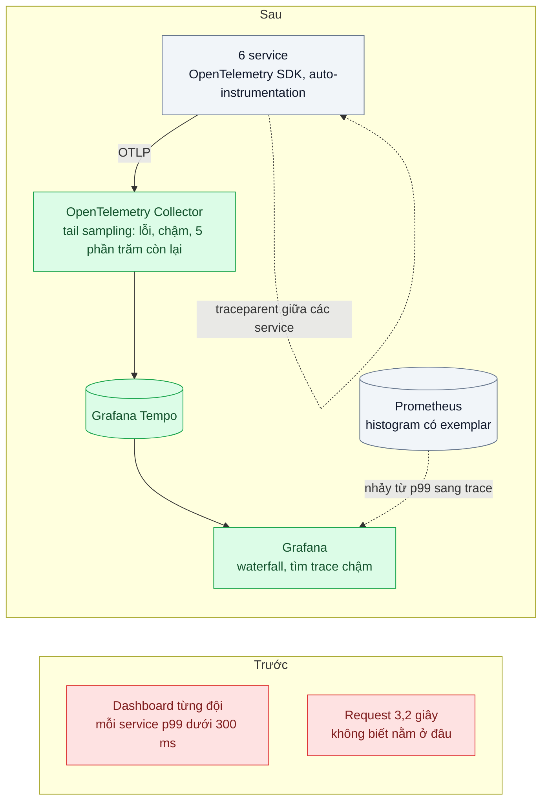
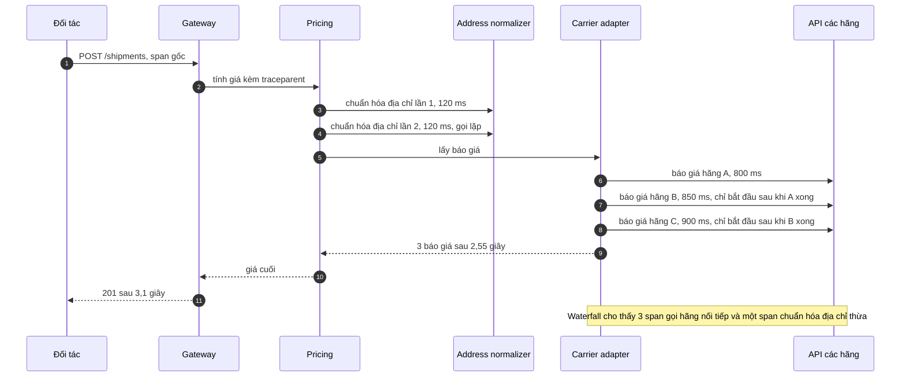

# Distributed Tracing (OpenTelemetry) — Request đi qua 6 service, chậm ở đâu?

| Scope | Mức độ | Trạng thái | Pattern gốc | Cập nhật |
|---|---|---|---|---|
| 23 · backend / monitoring benchmark | 🟡 Trung bình | 📋 Kế hoạch | Distributed Tracing — Sigelman et al., "Dapper" (Google, 2010); OpenTelemetry; W3C Trace Context | 2026-10-06 |

> **Một câu tóm tắt:** Ghi mỗi request thành một cây span có thời gian bắt đầu, kết thúc và quan hệ cha con, truyền context qua mọi service bằng `traceparent`, giữ lại toàn bộ trace lỗi và trace chậm — để biểu đồ waterfall chỉ thẳng chặng nào ăn thời gian thay vì mỗi đội tự chứng minh service mình nhanh.

## 1. Bài toán thực tế (What)

**Bối cảnh** *(doanh nghiệp giả định, số liệu minh họa)*
Công ty logistics có API "tạo vận đơn" cho đối tác. Một request đi qua gateway → order → pricing → address-normalizer → carrier-adapter (lấy báo giá từ 3 hãng vận chuyển) → notification (bất đồng bộ). p99 của API là 3,2 giây; nhiều đối tác đặt timeout 3 giây.

**Triệu chứng người kinh doanh nhìn thấy**
- Khoảng 2% vận đơn của đối tác lớn nhất bị timeout giờ cao điểm; họ đe dọa chuyển sang đơn vị khác.
- Hai ngày họp liên tục: dashboard của từng đội đều cho thấy service mình p99 dưới 300 ms.
- Không ai trả lời được "3,2 giây đó nằm ở đâu".

**Nguyên nhân kỹ thuật**
Metrics theo service (bài 01) cho biết *service nào* chậm, nhưng không cho thấy *cấu trúc* của một request: chặng nào gọi chặng nào, gọi nối tiếp hay song song, gọi lặp mấy lần. Mỗi đội đo thời gian xử lý của riêng mình, không ai đo chuỗi phụ thuộc. Trong trường hợp này, carrier-adapter gọi 3 hãng *lần lượt* và pricing gọi address-normalizer *hai lần* — không metric tổng hợp nào thấy được.

**Ràng buộc**
- Không đổi code nghiệp vụ nhiều; ưu tiên instrumentation tự động.
- Lưu trữ trace phải có chi phí kiểm soát được; không giữ 100% trace mãi mãi.
- Overhead của tracing trên p99 không quá vài phần trăm.

## 2. Vì sao dùng pattern này (Why)

**Nguyên nhân gốc mà pattern nhắm vào:** không có cách nhìn thấy một request cụ thể đi qua các service như thế nào và mất bao lâu ở mỗi chặng.

**Pattern giải quyết thế nào:** Dapper (Google, 2010) mô tả trace là một cây *span*: mỗi span có trace id, span id, parent id, thời điểm bắt đầu/kết thúc và thuộc tính. Context được truyền "trong băng" theo mỗi lời gọi RPC, nên service không cần phối hợp gì ngoài việc chuyển tiếp header; lấy mẫu giữ overhead thấp. OpenTelemetry chuẩn hóa API, SDK và giao thức OTLP; W3C Trace Context chuẩn hóa header `traceparent` để các thư viện khác nhau hiểu nhau. Instrumentation tự động tạo span cho HTTP, PostgreSQL, Redis; thêm vài span nghiệp vụ ("báo giá hãng A"). Collector làm *tail sampling*: đợi trace hoàn tất rồi quyết định giữ — giữ mọi trace lỗi và trace chậm, lấy mẫu phần còn lại. Waterfall của một trace chậm cho thấy ngay ba span gọi hãng nằm nối tiếp nhau.

**Lựa chọn khác đã cân nhắc**

| Lựa chọn | Giải quyết được gì | Vì sao không chọn (ở bài này) |
|---|---|---|
| Giữ nguyên + tối ưu nhỏ (thêm metric thời gian gọi downstream ở mỗi service) | Thấy thời gian từng phụ thuộc | Không thấy cấu trúc nối tiếp/song song và gọi lặp của một request cụ thể |
| Ghép log theo correlation id (bài 02) | Thấy chuỗi sự kiện | Phải tự tính khoảng thời gian; khó thấy chồng lấn và song song |
| Service mesh tự sinh span (scope 13 bài 07) | Không sửa code | Chỉ thấy chặng mạng giữa service, không thấy span bên trong (DB, nghiệp vụ); cần mesh sẵn |
| APM thương mại | Có sẵn giao diện | Chi phí theo host và khóa vào nhà cung cấp; OpenTelemetry vẫn là chuẩn đầu vào |
| OpenTelemetry + Collector tail sampling + Tempo (chọn) | Cây span đầy đủ, chuẩn mở, kiểm soát chi phí lưu trữ | Thêm Collector và Tempo phải vận hành; cần kỷ luật đặt tên span |

## 3. Thiết kế hệ thống (How)

### 3.1 Kiến trúc trước và sau



### 3.2 Luồng chính



### 3.3 Thành phần và trách nhiệm

| Thành phần | Trách nhiệm | Quyết định thiết kế đáng chú ý |
|---|---|---|
| Thư viện khởi tạo tracing | Nạp SDK trước mọi module khác, bật auto-instrumentation, đặt `service.name` | Nạp bằng cờ `--require`/`--import` của Node, nếu không HTTP không được instrument |
| Span nghiệp vụ | Bọc các bước có ý nghĩa: báo giá từng hãng, tính phí | Tên span ít giá trị (`carrier.quote`), id hãng để ở thuộc tính |
| Propagation | `traceparent` qua HTTP và hàng đợi | Dùng propagator W3C mặc định, không tự chế header |
| Collector | Batch, tail sampling, đẩy về Tempo | Mọi span của một trace phải tới cùng một instance Collector khi chạy nhiều bản (exporter cân bằng theo trace id, cần xác minh cấu hình) |
| Tempo + Grafana | Lưu trace, waterfall, tìm trace theo thời lượng và service | Tìm kiếm kiểu `{ duration > 2s }` bằng TraceQL (cú pháp cần xác minh) |
| Exemplar | Gắn trace id vào mẫu histogram | Từ panel p99 nhảy thẳng sang một trace chậm cụ thể |

### 3.4 Điểm dễ sai khi triển khai
- **Khởi tạo SDK sau khi đã `import` thư viện HTTP**: không có span tự động, trace đứt ngay từ service đầu.
- **Mất context ở ranh giới bất đồng bộ**: hàng đợi, pool tự viết, callback cũ — span con thành trace mới.
- **Head sampling 1% ở gateway**: trace lỗi hiếm và trace chậm — đúng thứ cần xem — bị bỏ trước khi biết nó chậm.
- **Tên span chứa id** (`GET /shipments/8812`): mất khả năng gom nhóm, chi phí chỉ mục tăng.
- **Ghi địa chỉ, số điện thoại vào thuộc tính span**: trace thành nơi lộ dữ liệu cá nhân.
- **Lệch đồng hồ giữa các máy**: span con có vẻ bắt đầu trước span cha; đồng bộ NTP.

## 4. Tech stack và tác động (Impact techstack)

| Lớp | Công nghệ chọn | Vì sao chọn | Thay thế tương đương |
|---|---|---|---|
| SDK | `@opentelemetry/sdk-node` + `@opentelemetry/auto-instrumentations-node` | Span tự động cho HTTP, PostgreSQL, Redis; chuẩn mở | — |
| Thu thập, lấy mẫu | OpenTelemetry Collector bản contrib (tail sampling processor) | Quyết định giữ trace sau khi trace hoàn tất | Lấy mẫu ở SDK (head sampling) |
| Lưu trace | Grafana Tempo | Lưu trên object storage, rẻ; cùng Grafana với metrics và log | Jaeger |
| Hiển thị | Grafana | Waterfall, nhảy từ log (bài 02) và metric (bài 01) sang trace | Jaeger UI |
| Giả lập hãng vận chuyển | Mock server có độ trễ cấu hình được | Tái hiện 800–900 ms mỗi hãng một cách lặp lại được | Toxiproxy |
| Đo | k6, Prometheus | p99 trước và sau; overhead tracing | — |

**Thay đổi so với hệ thống hiện tại:** mỗi service thêm cờ khởi động nạp thư viện tracing và vài span nghiệp vụ; thêm Collector và Tempo. Các đội học đọc waterfall và quy ước đặt tên span.

## 5. Kết quả đầu ra và cách đo (Output impact)

| Chỉ số | Trước (minh họa) | Mục tiêu khi thực hành | Cách đo |
|---|---|---|---|
| Thời gian chỉ ra chặng gây chậm | 2 ngày họp | ≤ 15 phút | Bấm giờ từ lúc mở Grafana tới lúc chỉ ra span gây chậm trong trace waterfall |
| Trace đầy đủ, không span mồ côi | Không có trace | ≥ 95% trace đủ 6 service | Tìm kiếm trong Tempo theo trace có đủ `service.name`; test tích hợp kiểm parent id qua hàng đợi |
| Trace lỗi được giữ lại | — | 100% | Mock tiêm lỗi 1%, đối chiếu số request lỗi k6 ghi nhận với số trace lỗi trong Tempo |
| Overhead tracing trên p99 | — | ≤ 5% | k6 open model 50 request/giây, bật và tắt SDK |
| Dung lượng lưu trace mỗi ngày | — | ≤ 10% so với giữ 100% trace | So dung lượng Tempo giữa hai cấu hình lấy mẫu |
| p99 tạo vận đơn sau khi gọi 3 hãng song song và bỏ lời gọi lặp | 3,2 giây | ≤ 1,2 giây | k6 open model, PromQL `histogram_quantile(0.99, ...)` trên histogram của gateway |

> Số "trước" là minh họa để hình dung bài toán. Số "mục tiêu" chỉ được coi là đạt khi có số đo thật
> ở mục 8 kèm môi trường đo.

**Tác động nghiệp vụ mong đợi:** đối tác hết timeout; tranh luận giữa các đội kết thúc bằng một hình waterfall; lần tối ưu sau bắt đầu từ dữ liệu thay vì phỏng đoán.

## 6. Đánh đổi và khi KHÔNG nên dùng

**Đánh đổi**
- Thêm Collector và Tempo phải vận hành; tail sampling cần bộ nhớ để giữ trace đang chờ hoàn tất.
- Instrumentation thêm một ít CPU và độ trễ ở mỗi service; phải đo, không đoán.
- Trace bị lấy mẫu: không phải request nào của khách cũng tra được trace — log (bài 02) vẫn cần.

**Không nên dùng khi**
- Hệ thống là một monolith một tiến trình: profiling (bài 08) và log có cấu trúc cho nhiều giá trị hơn với ít chi phí hơn.
- Chỉ cần biết service nào chậm, không cần biết cấu trúc request: RED (bài 01) là đủ.

**Liên quan**
- [Bài 02 — Structured Logging & Correlation ID](../02-structured-logging-correlation-id-grep-log-6-service-tim-mot-request/) — cùng `trace_id`.
- [Bài 08 — Continuous Profiling](../08-continuous-profiling-cpu-80-phan-tram-khong-biet-ham-nao/) — khi span chậm nhưng không gọi đi đâu, nguyên nhân nằm trong CPU.
- [Scope 07 bài 05 — API Composition](../../07-backend-microservices/05-api-composition-man-hinh-don-hang-can-du-lieu-4-service/) — gọi song song nhiều service đúng cách.
- [Scope 13 bài 07 — Service Mesh](../../13-backend-transporter/07-service-mesh-mtls-retry-tracing-khong-sua-code/) — span mạng từ sidecar.
- [Scope 24 bài 01 — LLM Tracing](../../24-backend-ai-monitoring/01-llm-tracing-chatbot-tra-loi-sai-khong-biet-prompt-nao/) — mở rộng span cho lời gọi LLM.

## 7. Cơ sở tham khảo

- Benjamin H. Sigelman et al., "Dapper, a Large-Scale Distributed Systems Tracing Infrastructure", Google Technical Report, 2010 — mô hình trace/span, truyền context trong băng, lấy mẫu để giữ overhead thấp.
- OpenTelemetry docs, "Traces" — https://opentelemetry.io/docs/concepts/signals/traces/ — span, context propagation, SDK và OTLP.
- W3C, *Trace Context* — https://www.w3.org/TR/trace-context/ — header `traceparent` và `tracestate`.
- OpenTelemetry Collector contrib, tail sampling processor — https://github.com/open-telemetry/opentelemetry-collector-contrib — chính sách giữ trace theo lỗi, thời lượng và tỷ lệ (tên tham số cần xác minh theo phiên bản).
- Grafana Tempo docs — https://grafana.com/docs/tempo/ — lưu trữ trace, TraceQL, liên kết với log và metric.

## 8. Kế hoạch thực hành

- [ ] Bước 1: dựng 5 service mẫu (gateway, pricing, address-normalizer, carrier-adapter, notification qua hàng đợi) + mock 3 hãng có độ trễ 800–900 ms; phiên bản `truoc/` gọi hãng lần lượt và chuẩn hóa địa chỉ hai lần.
- [ ] Bước 2: đo "trước": k6 open model 50 request/giây, ghi p99; bấm giờ tìm nguyên nhân chỉ với metrics.
- [ ] Bước 3: áp dụng pattern: thư viện khởi tạo tracing, span nghiệp vụ, Collector tail sampling, Tempo, exemplar; dùng waterfall tìm nguyên nhân rồi sửa sang gọi song song có timeout.
- [ ] Bước 4: đo "sau": p99, overhead tracing, dung lượng lưu trace; ghi số và môi trường vào mục 5.
- [ ] Bước 5: test: trace đi qua hàng đợi vẫn cùng trace id; span gọi 3 hãng chồng lấn thời gian sau khi sửa; trace có lỗi luôn được giữ.

**Cấu trúc code dự kiến**
```text
packages/tracing/src/register.ts     # [PATTERN] nạp SDK trước mọi module, auto-instrumentation
services/
  gateway/ pricing/ address-normalizer/ notification/
  carrier-adapter/src/quotes.ts      # truoc: tuần tự; sau: song song + timeout
mocks/carriers/                       # 3 hãng, độ trễ cấu hình được
infra/
  otel-collector.yaml                 # tail sampling: lỗi, chậm hơn 1 giây, 5 phần trăm
  tempo.yaml
test/
  trace-across-queue.test.ts
  carrier-spans-overlap.test.ts
bench/create-shipment.k6.js
docker-compose.yml
```

**Cách chạy** *(điền khi bắt đầu code)*
```bash
docker compose up -d
pnpm install && pnpm test
```
