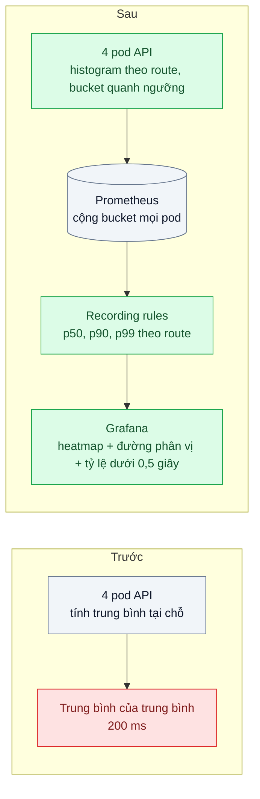
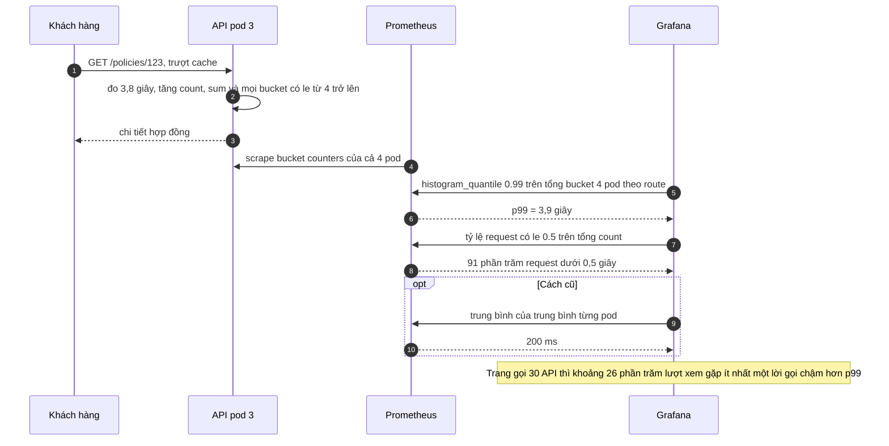

# Percentiles & Histograms — Trung bình 200 ms nhưng khách than chậm: p99 là 4 giây

| Scope | Mức độ | Trạng thái | Pattern gốc | Cập nhật |
|---|---|---|---|---|
| 23 · backend / monitoring benchmark | 🟢 Cơ bản | 📋 Kế hoạch | Percentiles & Histograms — Gil Tene, "How NOT to Measure Latency" (2015); Prometheus "Histograms and summaries"; SRE Book ch.6 | 2026-10-06 |

> **Một câu tóm tắt:** Ghi độ trễ thành histogram với bucket chọn quanh ngưỡng cam kết, tính phân vị lúc truy vấn sau khi cộng bucket của mọi instance, và báo cáo p50/p90/p99/max thay cho trung bình — để cái đuôi chậm mà khách thật sự gặp hiện lên dashboard.

## 1. Bài toán thực tế (What)

**Bối cảnh** *(doanh nghiệp giả định, số liệu minh họa)*
Công ty bảo hiểm có cổng khách hàng; trang "Hợp đồng của tôi" gọi khoảng 30 API (chi tiết hợp đồng, quyền lợi, lịch đóng phí, hồ sơ bồi thường...). API chạy 4 pod. Dashboard hiện "thời gian phản hồi trung bình: 200 ms", tính bằng cách lấy trung bình của trung bình từng pod.

**Triệu chứng người kinh doanh nhìn thấy**
- Chăm sóc khách hàng nhận phàn nàn "trang hợp đồng load mãi" đều đặn; khảo sát cho điểm hài lòng thấp ở mục tốc độ.
- Đội kỹ thuật trả lời "số liệu cho thấy 200 ms, rất nhanh" — hai bên không có ngôn ngữ chung.
- Ban điều hành không biết nên tin ai và có nên đầu tư tối ưu hay không.

**Nguyên nhân kỹ thuật**
Phân bố độ trễ có hai đỉnh: dữ liệu có trong cache trả về khoảng 20 ms, trượt cache phải gọi hệ thống lõi mất khoảng 4 giây. Trung bình che mất đuôi đó. Thêm nữa, một trang gọi 30 API: nếu mỗi API có 1% request chậm hơn p99, xác suất trang gặp ít nhất một lời gọi chậm là 1 − 0,99^30 ≈ 26% — gần một phần tư lượt xem trang chịu độ trễ p99. Lấy trung bình của trung bình từng pod còn sai thêm một lớp, vì các pod nhận lượng request khác nhau.

**Ràng buộc**
- Dùng Prometheus sẵn có; không thêm hệ thống lưu trữ mới.
- Số time series không được tăng vượt khả năng của Prometheus hiện tại.
- Con số báo cáo phải giải thích được cho người không làm kỹ thuật.

## 2. Vì sao dùng pattern này (Why)

**Nguyên nhân gốc mà pattern nhắm vào:** đo độ trễ bằng một con số trung bình, trong khi trải nghiệm của khách được quyết định bởi phần đuôi của phân bố.

**Pattern giải quyết thế nào:** Gil Tene chỉ ra rằng trung bình và cả p95 thường không phản ánh trải nghiệm thật, nhất là khi một hành động người dùng gồm nhiều request; cần nhìn phân vị cao và giá trị lớn nhất. SRE Book ch.6 khuyên dùng phân phối thay cho trung bình và đo theo bucket. Prometheus cung cấp *histogram*: mỗi bucket là một counter đếm số quan sát có giá trị nhỏ hơn hoặc bằng biên `le`. Vì bucket là counter, có thể cộng bucket của mọi pod rồi mới tính phân vị bằng `histogram_quantile` — điều *summary* không làm được vì phân vị tính sẵn ở từng instance không gộp được. Phân vị từ histogram là ước lượng nội suy trong bucket, sai số phụ thuộc độ rộng bucket; vì vậy đặt biên bucket trùng các ngưỡng quan trọng (ví dụ 0,5 giây), khi đó tỷ lệ request dưới ngưỡng là số chính xác.

**Lựa chọn khác đã cân nhắc**

| Lựa chọn | Giải quyết được gì | Vì sao không chọn (ở bài này) |
|---|---|---|
| Giữ nguyên + tối ưu nhỏ (thêm giá trị max bên cạnh trung bình) | Thấy có request rất chậm | Max là một điểm, không cho biết bao nhiêu khách bị ảnh hưởng |
| Summary của Prometheus | Phân vị chính xác ở từng pod | Không gộp được giữa các pod; không đổi được phân vị sau khi đã đo |
| Tính phân vị chính xác từ log thô | Số chính xác | Tốn kém khi chạy liên tục; dùng để kiểm chứng sai số của histogram |
| Histogram + `histogram_quantile` (chọn) | Gộp được, chọn phân vị lúc truy vấn, rẻ | Là ước lượng; chọn bucket sai thì số sai |

## 3. Thiết kế hệ thống (How)

### 3.1 Kiến trúc trước và sau



Bucket gợi ý cho API này (giây): `0.025, 0.05, 0.1, 0.25, 0.5, 1, 2, 4, 8` — dày ở vùng cam kết, có biên trùng ngưỡng 0,5 giây và đủ rộng để chứa đuôi 4 giây.

### 3.2 Luồng chính



### 3.3 Thành phần và trách nhiệm

| Thành phần | Trách nhiệm | Quyết định thiết kế đáng chú ý |
|---|---|---|
| Histogram độ trễ | Ghi thời gian mỗi request theo route template và lớp status | Bucket chọn theo phân bố thật và ngưỡng cam kết, không dùng mặc định mù quáng |
| Ghi cả request lỗi và timeout | Không bỏ sót đuôi | Request timeout ở 30 giây vẫn phải được ghi; nếu không, phần tệ nhất biến mất |
| Recording rules | Tính sẵn p50, p90, p99 theo route trên cửa sổ 5 phút | Luôn `sum by (le, route)` trước `histogram_quantile` |
| Dashboard | Heatmap phân bố, đường phân vị, tỷ lệ dưới ngưỡng, max | Không có panel "trung bình" ở vị trí nổi bật |
| Kiểm chứng sai số | So phân vị từ histogram với phân vị chính xác từ log thô | Nếu sai số lớn, chỉnh bucket |

### 3.4 Điểm dễ sai khi triển khai
- **Lấy trung bình các p99** (giữa pod hoặc theo thời gian): phân vị không cộng trung bình được. Cộng bucket rồi mới tính.
- **Bucket không phủ dải độ trễ thật**: nếu phân vị rơi vào bucket cao nhất, `histogram_quantile` trả về biên trên của bucket liền dưới — con số trông hợp lý nhưng sai.
- **Quá nhiều bucket × route × status**: số time series nhân lên nhanh; tính trước trước khi thêm label.
- **Chỉ đo ở server**: bỏ qua thời gian xếp hàng ở load balancer và mạng; đo thêm ở gateway.
- **Phân vị trên cửa sổ ít mẫu**: 20 request trong 5 phút thì p99 vô nghĩa; hiển thị kèm số mẫu.
- **Benchmark có coordinated omission** làm đuôi đẹp giả — xem bài 07.

## 4. Tech stack và tác động (Impact techstack)

| Lớp | Công nghệ chọn | Vì sao chọn | Thay thế tương đương |
|---|---|---|---|
| Instrumentation | `prom-client` Histogram với bucket tường minh | Kiểm soát trực tiếp biên bucket, ít lớp trung gian | OpenTelemetry histogram với explicit bucket boundaries (cấu hình View cần xác minh) |
| Lưu trữ, truy vấn | Prometheus, `histogram_quantile`, recording rules | Gộp bucket giữa instance | Native histograms của Prometheus (trạng thái tính năng cần xác minh theo phiên bản) |
| Hiển thị | Grafana heatmap + time series | Thấy phân bố hai đỉnh mà đường phân vị không thấy | — |
| Kiểm chứng | HdrHistogram trên log thô | Tính phân vị chính xác để đo sai số của histogram | Sắp xếp và đếm trực tiếp bằng script |
| Tạo tải | k6 | Tạo phân bố hai đỉnh có kiểm soát (tỷ lệ trượt cache) | — |

**Thay đổi so với hệ thống hiện tại:** thay đồng hồ trung bình bằng histogram ở middleware; thêm recording rules; dashboard mới với heatmap và phân vị. Đội kỹ thuật và kinh doanh thống nhất báo cáo "x% request dưới 0,5 giây, p99 = y".

## 5. Kết quả đầu ra và cách đo (Output impact)

| Chỉ số | Trước (minh họa) | Mục tiêu khi thực hành | Cách đo |
|---|---|---|---|
| Chỉ số độ trễ trên dashboard | Trung bình 200 ms | p50, p90, p99, max và tỷ lệ dưới 0,5 giây theo route | Kiểm dashboard và recording rules |
| Sai số p99 từ histogram so với p99 chính xác | Chưa biết | ≤ 10% với bucket đã chọn | So `histogram_quantile` với p99 tính bằng HdrHistogram trên log thô cùng khoảng thời gian |
| Tỷ lệ request dưới 0,5 giây | Không biết | Có số chính xác | PromQL: rate của bucket `le="0.5"` chia rate của count |
| Thời gian phát hiện đuôi chậm đi | Không phát hiện được, trung bình gần như không đổi | ≤ 10 phút | k6 tiêm độ trễ 4 giây vào 2% request, theo dõi panel p99 |
| Số time series của histogram | — | Trong ngân sách đã tính trước | Trang TSDB Status của Prometheus |

> Số "trước" là minh họa để hình dung bài toán. Số "mục tiêu" chỉ được coi là đạt khi có số đo thật
> ở mục 8 kèm môi trường đo.

**Tác động nghiệp vụ mong đợi:** kỹ thuật và kinh doanh nói cùng một ngôn ngữ về tốc độ; quyết định đầu tư tối ưu (ví dụ cải thiện tỷ lệ trúng cache) dựa trên phần đuôi khách thật sự gặp.

## 6. Đánh đổi và khi KHÔNG nên dùng

**Đánh đổi**
- Phân vị từ histogram là ước lượng; phải chọn và thỉnh thoảng xem lại bucket.
- Nhiều time series hơn một counter đơn; label phải tiết chế.
- Người đọc cần học cách hiểu phân vị — "p99 = 3,9 giây" không tự giải thích.

**Không nên dùng khi**
- Cần độ chính xác tuyệt đối cho từng request (đối soát SLA hợp đồng theo từng giao dịch): tính từ log thô hoặc kho sự kiện.
- Chỉ một instance và cần phân vị chính xác ở client: summary hoặc HdrHistogram tại chỗ có thể phù hợp hơn.

**Liên quan**
- [Bài 01 — Four Golden Signals / RED / USE](../01-four-golden-signals-red-method-khong-biet-service-nao-cham/) — "Duration" trong RED đo bằng histogram ở bài này.
- [Bài 05 — SLI / SLO / Error Budget](../05-slo-error-budget-he-thong-on-chua-khong-co-so/) — tỷ lệ dưới ngưỡng trở thành SLI.
- [Bài 07 — Load Testing Methodology](../07-load-testing-k6-coordinated-omission-benchmark-tu-danh-lua/) — đo đuôi đúng khi tạo tải.
- [Scope 03 bài 01 — Cache-Aside](../../03-backend-cache/01-cache-aside-trang-san-pham-doc-10k-lan-phut/) — nguồn gốc phân bố hai đỉnh trong ví dụ.

## 7. Cơ sở tham khảo

- Gil Tene, "How NOT to Measure Latency", bài nói tại Strange Loop, 2015 — vì sao trung bình và phân vị thấp đánh lừa, phép tính xác suất gặp đuôi khi một hành động gồm nhiều request, coordinated omission.
- Prometheus docs, "Histograms and summaries" — https://prometheus.io/docs/practices/histograms/ — khác biệt histogram và summary, gộp giữa instance, sai số do độ rộng bucket, tính tỷ lệ dưới ngưỡng.
- Prometheus docs, "Query functions" — `histogram_quantile` — https://prometheus.io/docs/prometheus/latest/querying/functions/ — cách nội suy và hành vi khi phân vị rơi vào bucket cao nhất.
- Google, *Site Reliability Engineering* (2016), ch.6 "Monitoring Distributed Systems" — https://sre.google/sre-book/monitoring-distributed-systems/ — dùng phân phối và bucket thay cho trung bình.
- HdrHistogram — http://hdrhistogram.org/ (cần xác minh URL) — cấu trúc histogram độ phân giải cao dùng để tính phân vị chính xác khi kiểm chứng.

## 8. Kế hoạch thực hành

- [ ] Bước 1: dựng API mẫu 4 bản sau load balancer + Redis cache + "hệ thống lõi" giả lập trễ 4 giây; phiên bản `truoc/` báo trung bình từng pod.
- [ ] Bước 2: đo "trước": k6 với tỷ lệ trượt cache 8%, ghi trung bình hiển thị và p99 thật từ log thô.
- [ ] Bước 3: áp dụng pattern: histogram với bucket đã chọn, recording rules, dashboard heatmap và phân vị.
- [ ] Bước 4: đo "sau": sai số histogram so với HdrHistogram, thời gian phát hiện khi tiêm độ trễ vào 2% request; ghi số và môi trường vào mục 5.
- [ ] Bước 5: test: request timeout vẫn được ghi vào histogram; route có tham số dùng template; recording rule p99 khớp truy vấn gốc trên dữ liệu mẫu.

**Cấu trúc code dự kiến**
```text
src/
  truoc/average-timer.ts           # tái hiện trung bình tại chỗ
  sau/latency-histogram.ts         # [PATTERN] bucket tường minh, route template, ghi cả timeout
  shared/policy-api.ts             # API mẫu có cache
infra/
  rules/latency.rules.yml          # p50, p90, p99 theo route
  grafana/latency-dashboard.json
tools/exact-percentiles.ts         # HdrHistogram trên log thô
test/
  timeout-recorded.test.ts
  quantile-error.test.ts
bench/bimodal-latency.k6.js
docker-compose.yml
```

**Cách chạy** *(điền khi bắt đầu code)*
```bash
docker compose up -d
pnpm install && pnpm test
```
