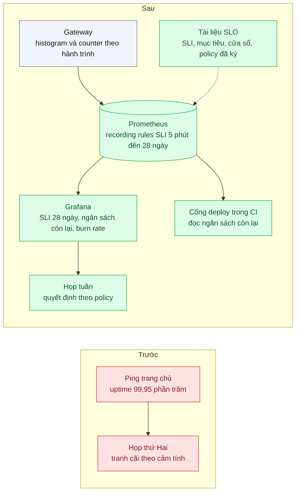
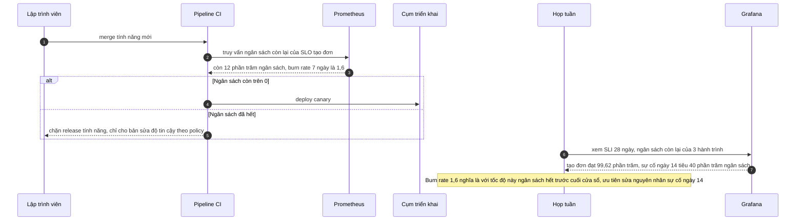

# SLI / SLO / Error Budget — "Hệ thống ổn chưa?" không ai trả lời được bằng số

| Scope | Mức độ | Trạng thái | Pattern gốc | Cập nhật |
|---|---|---|---|---|
| 23 · backend / monitoring benchmark | 🟡 Trung bình | 📋 Kế hoạch | SLI / SLO / Error Budget — Google SRE Book ch.4 (2016); SRE Workbook ch.2 (2018) | 2026-10-06 |

> **Một câu tóm tắt:** Thống nhất cho mỗi hành trình quan trọng một chỉ số đo từ góc nhìn khách (SLI), một mục tiêu trên cửa sổ 28 ngày (SLO) và một chính sách dùng phần "được phép hỏng" (error budget) để quyết định ra tính năng hay dồn sức cho độ tin cậy — biến câu hỏi "ổn chưa?" thành một con số mọi phòng ban cùng đọc.

## 1. Bài toán thực tế (What)

**Bối cảnh** *(doanh nghiệp giả định, số liệu minh họa)*
SaaS B2B cung cấp phần mềm bán hàng (máy POS tại quầy và đơn online) cho khoảng 2.000 cửa hàng. Mỗi sáng thứ Hai, kinh doanh mang tới danh sách khách phàn nàn, kỹ thuật trình "uptime 99,95%" từ công cụ ping trang chủ, sản phẩm muốn ra tính năng mới, vận hành muốn đóng băng release sau hai sự cố liên tiếp.

**Triệu chứng người kinh doanh nhìn thấy**
- Cuộc họp lặp lại cùng một tranh cãi; quyết định release hay đóng băng dựa vào ai nói to hơn.
- Một chuỗi cửa hàng lớn đòi cam kết SLA trong hợp đồng; không ai dám ký con số vì không biết hệ thống đang đạt bao nhiêu.
- Trong tuần đồng bộ đơn online lỗi nhiều nhất, uptime ping vẫn là 100%.

**Nguyên nhân kỹ thuật**
Chỉ số duy nhất đang có (ping trang chủ) không đo trải nghiệm của hành trình mà khách trả tiền để dùng: tạo đơn ở quầy, đồng bộ đơn online, xem báo cáo cuối ngày. Không có mục tiêu thống nhất nên không biết "đủ ổn" là bao nhiêu, và không có quy tắc nối mức độ tin cậy với tốc độ phát triển, nên mỗi sự cố lại mở lại cuộc tranh luận từ đầu.

**Ràng buộc**
- Bắt đầu nhỏ: tối đa 3 hành trình trong quý đầu.
- Dùng Prometheus và Grafana sẵn có.
- Mục tiêu phải được sản phẩm, kỹ thuật và kinh doanh cùng ký, không do một đội tự đặt.

## 2. Vì sao dùng pattern này (Why)

**Nguyên nhân gốc mà pattern nhắm vào:** không có định nghĩa chung, đo được, về mức độ tin cậy đủ cho khách — và không có quy tắc dùng định nghĩa đó để ra quyết định.

**Pattern giải quyết thế nào:** SRE Book ch.4 tách ba khái niệm. *SLI* là một tỷ lệ: số sự kiện tốt chia số sự kiện hợp lệ, đo càng gần khách càng tốt — ví dụ "request tạo đơn trả về thành công trong dưới 1 giây". *SLO* là mục tiêu cho SLI trên một cửa sổ, ví dụ 99,5% trong 28 ngày trượt. *SLA* là cam kết hợp đồng, thường lỏng hơn SLO. *Error budget* là 1 − SLO: với 99,5% và khoảng 10 triệu request tạo đơn mỗi 28 ngày, ngân sách là 50.000 request xấu (tính theo thời gian, khoảng 3,4 giờ). SRE Workbook ch.2 hướng dẫn chọn SLI cho từng loại hành trình, đặt mục tiêu từ dữ liệu quá khứ, và viết *error budget policy*: còn ngân sách thì release bình thường; hết ngân sách thì tạm dừng release tính năng, ưu tiên sửa độ tin cậy. 100% không bao giờ là mục tiêu đúng — nó không đạt được và chặn mọi thay đổi.

**Lựa chọn khác đã cân nhắc**

| Lựa chọn | Giải quyết được gì | Vì sao không chọn (ở bài này) |
|---|---|---|
| Giữ nguyên + tối ưu nhỏ (ping thêm vài endpoint, báo cáo uptime theo tháng) | Có thêm số liệu | Vẫn đo "máy có sống không", không đo hành trình của khách; không có quy tắc ra quyết định |
| Đếm số sự cố mỗi tháng | Dễ hiểu | Sự cố 5 phút và 5 giờ tính như nhau; không phản ánh bao nhiêu khách bị ảnh hưởng |
| Đặt SLA hợp đồng trước, đo sau | Đáp ứng nhanh yêu cầu khách | Ký con số chưa đo là đánh bạc; SLA nên suy ra từ SLO đã đạt ổn định |
| SLI/SLO/error budget cho 3 hành trình (chọn) | Ngôn ngữ chung; quyết định release dựa trên số | Cần thời gian thống nhất định nghĩa; phải giữ kỷ luật thực hiện policy |

## 3. Thiết kế hệ thống (How)

### 3.1 Kiến trúc trước và sau



Ba SLO khởi đầu (minh họa, sẽ chỉnh theo dữ liệu đo được):

| Hành trình | SLI | SLO 28 ngày |
|---|---|---|
| Tạo đơn tại quầy | Request `POST /orders` không lỗi 5xx và dưới 1 giây / mọi request hợp lệ | 99,5% |
| Đồng bộ đơn online | Đơn được đồng bộ trong 2 phút / mọi đơn | 99% |
| Báo cáo cuối ngày | Request báo cáo thành công dưới 5 giây / mọi request | 99% |

### 3.2 Luồng chính



### 3.3 Thành phần và trách nhiệm

| Thành phần | Trách nhiệm | Quyết định thiết kế đáng chú ý |
|---|---|---|
| Tài liệu SLO | Định nghĩa SLI chính xác, mục tiêu, cửa sổ, người chịu trách nhiệm, policy | Nằm trong Git, thay đổi qua review có chữ ký của sản phẩm và kỹ thuật |
| Đo SLI ở gateway | Counter sự kiện tốt và tổng theo hành trình | Loại health check và bot khỏi mẫu số; đo ở biên gần khách nhất có thể |
| Recording rules | Tỷ lệ SLI theo cửa sổ 5 phút, 1 giờ, 6 giờ, 28 ngày | Tính sẵn để dashboard và alert (bài 06) không truy vấn dữ liệu thô 28 ngày |
| Dashboard SLO | SLI hiện tại, ngân sách còn lại, burn rate, sự cố tiêu ngân sách | Một trang cho cả ba phòng ban |
| Cổng deploy | Đọc ngân sách qua HTTP API của Prometheus | Chỉ chặn release tính năng; bản vá luôn được đi |
| Error budget policy | Quy tắc khi ngân sách hết hoặc một sự cố tiêu quá nhiều | Được ký trước khi cần dùng, không thương lượng giữa sự cố |

### 3.4 Điểm dễ sai khi triển khai
- **Đặt 99,99% vì nghe chuyên nghiệp**: ngân sách vài phút mỗi tháng, mọi deploy đều là vi phạm, SLO bị phớt lờ.
- **SLI đo ở server, bỏ qua lỗi trước khi tới server** (DNS, load balancer): bổ sung synthetic monitoring (bài 09).
- **Mẫu số chứa health check và bot**: SLI đẹp giả.
- **SLO độ trễ dùng trung bình**: dùng tỷ lệ request dưới ngưỡng từ histogram (bài 04).
- **Có SLO nhưng không có policy đã ký**: con số thành trang trí, cuộc tranh cãi cũ quay lại.
- **Hành trình ít request**: vài lỗi đã cạn ngân sách; cần cửa sổ dài hơn hoặc gộp hành trình.

## 4. Tech stack và tác động (Impact techstack)

| Lớp | Công nghệ chọn | Vì sao chọn | Thay thế tương đương |
|---|---|---|---|
| Đo SLI | Counter và histogram ở gateway (OpenTelemetry hoặc `prom-client`) | Gần khách nhất trong phạm vi kiểm soát | Log của load balancer |
| Tính SLI và ngân sách | Prometheus recording rules | Tính sẵn nhiều cửa sổ, truy vấn rẻ | Sloth hoặc Pyrra sinh rule từ đặc tả SLO (định dạng cần xác minh) |
| Hiển thị | Grafana | Dashboard chung cho ba phòng ban | — |
| Cổng deploy | Bước CI gọi HTTP API của Prometheus | Đơn giản, không cần công cụ mới | Phân tích canary của Argo Rollouts (scope 16 bài 06) |
| Tạo tải, tiêm lỗi | k6 + mock lỗi có tỷ lệ cấu hình được | Diễn tập tiêu ngân sách có kiểm soát | — |

**Thay đổi so với hệ thống hiện tại:** thêm tài liệu SLO, recording rules, dashboard SLO, một bước kiểm ngân sách trong CI, và cuộc họp tuần theo dashboard. Ba phòng ban học đọc "ngân sách còn lại" và "burn rate".

## 5. Kết quả đầu ra và cách đo (Output impact)

| Chỉ số | Trước (minh họa) | Mục tiêu khi thực hành | Cách đo |
|---|---|---|---|
| Trả lời "hệ thống ổn chưa?" | Không có số | SLI 28 ngày và ngân sách còn lại cho 3 hành trình | Dashboard SLO |
| Hành trình có SLO đã ký | 0 | 3 | Tài liệu SLO trong Git có phê duyệt |
| SLI phản ánh sự cố mà ping bỏ sót | Ping vẫn 100% | SLI tạo đơn giảm tương ứng lượng lỗi tiêm vào | Tiêm 3% lỗi vào `POST /orders` trong 2 giờ bằng mock; so ping với SLI và với số lỗi k6 ghi nhận |
| Release tính năng đi qua cổng ngân sách | 0% | 100% | Log của pipeline CI |
| Thời gian lập báo cáo độ tin cậy hằng tháng | ~1 ngày gom tay | Tự động | Bấm giờ trước và sau |

> Số "trước" là minh họa để hình dung bài toán. Số "mục tiêu" chỉ được coi là đạt khi có số đo thật
> ở mục 8 kèm môi trường đo.

**Tác động nghiệp vụ mong đợi:** quyết định release dựa trên số đã thống nhất thay vì cảm tính; công ty có cơ sở để ký SLA với khách lớn ở mức thấp hơn SLO đã đạt ổn định.

## 6. Đánh đổi và khi KHÔNG nên dùng

**Đánh đổi**
- Tốn thời gian của sản phẩm và kinh doanh để thống nhất định nghĩa; nếu chỉ kỹ thuật làm, policy sẽ không được tôn trọng.
- Chặn release khi hết ngân sách là quyết định khó chịu; phải được ủng hộ từ cấp quản lý.
- SLI chỉ tốt bằng chỗ đo; lỗi ngoài tầm đo vẫn có thể không hiện.

**Không nên dùng khi**
- Sản phẩm giai đoạn rất sớm, ít người dùng, thay đổi hằng ngày: theo dõi RED (bài 01) và lắng nghe khách trực tiếp có lợi hơn.
- Không ai có quyền quyết định theo policy: SLO không có hệ quả thì chỉ là thêm một dashboard.

**Liên quan**
- [Bài 04 — Percentiles & Histograms](../04-percentiles-p99-trung-binh-200ms-nhung-khach-than-cham/) — cách đo SLI độ trễ.
- [Bài 06 — Alerting on Symptoms](../06-alerting-symptom-not-cause-50-alert-moi-dem-khong-ai-doc/) — cảnh báo theo burn rate của ngân sách.
- [Bài 09 — Synthetic Monitoring](../09-synthetic-monitoring-health-check-khach-bao-loi-truoc-khi-doi-ky-thuat-biet/) — đo những gì gateway không thấy.
- [Scope 16 bài 06 — Canary / Blue-Green](../../16-backend-k8s/06-canary-blue-green-argo-rollouts-release-loi-anh-huong-100-phan-tram/) — dùng SLI để tự động dừng canary.

## 7. Cơ sở tham khảo

- Google, *Site Reliability Engineering* (2016), ch.4 "Service Level Objectives" — https://sre.google/sre-book/service-level-objectives/ — định nghĩa SLI, SLO, SLA, vì sao không đặt 100%, chọn chỉ số từ góc nhìn người dùng.
- Google, *The Site Reliability Workbook* (2018), ch.2 "Implementing SLOs" — https://sre.google/workbook/implementing-slos/ — các bước chọn SLI, đặt mục tiêu từ dữ liệu, error budget policy và ví dụ tài liệu SLO.
- Prometheus docs, "Recording rules" — https://prometheus.io/docs/prometheus/latest/configuration/recording_rules/ — tính sẵn tỷ lệ SLI theo nhiều cửa sổ.
- Pyrra — https://github.com/pyrra-dev/pyrra (cần xác minh định dạng đặc tả) — công cụ sinh recording rule và alert từ đặc tả SLO cho Prometheus, phương án thay thế ở mục 4.

## 8. Kế hoạch thực hành

- [ ] Bước 1: dựng gateway + 2 service mẫu (orders, reports) + Prometheus + Grafana; mock lỗi có tỷ lệ cấu hình được; một job ping trang chủ để so sánh.
- [ ] Bước 2: đo "trước": chạy k6 với 3% lỗi trong 2 giờ, ghi uptime ping và cho thấy không có số nào phản ánh sự cố.
- [ ] Bước 3: áp dụng pattern: viết tài liệu SLO cho 3 hành trình, counter SLI ở gateway, recording rules, dashboard, bước CI kiểm ngân sách.
- [ ] Bước 4: đo "sau" cùng kịch bản; ghi SLI, ngân sách tiêu, hành vi cổng deploy và môi trường vào mục 5.
- [ ] Bước 5: test: recording rule tính đúng tỷ lệ trên dữ liệu mẫu (`promtool test rules`); health check không vào mẫu số; cổng CI chặn release tính năng khi ngân sách âm và cho bản vá đi qua.

**Cấu trúc code dự kiến**
```text
slo/
  orders-create.slo.md             # SLI, mục tiêu, cửa sổ, policy, chữ ký
  sync-online.slo.md
  daily-report.slo.md
src/gateway/sli-counters.ts        # [PATTERN] sự kiện tốt và tổng theo hành trình
infra/
  rules/slo.rules.yml              # [PATTERN] SLI nhiều cửa sổ, ngân sách còn lại
  rules/slo.rules.test.yml         # promtool test rules
  grafana/slo-dashboard.json
ci/check-error-budget.ts           # cổng deploy đọc HTTP API Prometheus
bench/inject-errors.k6.js
docker-compose.yml
```

**Cách chạy** *(điền khi bắt đầu code)*
```bash
docker compose up -d
pnpm install && pnpm test
```
