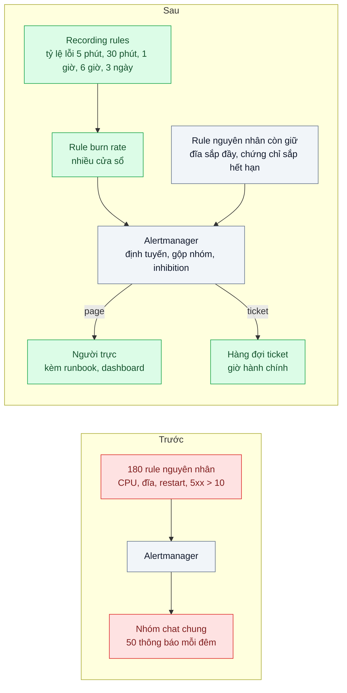
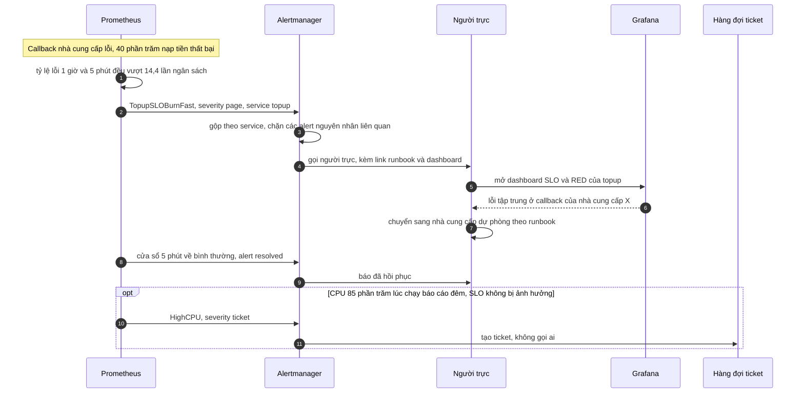

# Alerting on Symptoms (alert fatigue) — 50 alert mỗi đêm, không ai đọc nữa

| Scope | Mức độ | Trạng thái | Pattern gốc | Cập nhật |
|---|---|---|---|---|
| 23 · backend / monitoring benchmark | 🟡 Trung bình | 📋 Kế hoạch | Alerting on Symptoms & SLO burn rate — Rob Ewaschuk, "My Philosophy on Alerting"; SRE Book ch.6; SRE Workbook ch.5 "Alerting on SLOs" | 2026-10-06 |

> **Một câu tóm tắt:** Chỉ gọi người trực khi khách đang chịu ảnh hưởng — đo bằng tốc độ tiêu ngân sách lỗi của SLO trên hai cửa sổ thời gian — còn các cảnh báo về nguyên nhân (CPU, đĩa, pod khởi động lại) chuyển thành ticket hoặc dashboard, để mỗi lần điện thoại reo đều đáng dậy.

## 1. Bài toán thực tế (What)

**Bối cảnh** *(doanh nghiệp giả định, số liệu minh họa)*
Ví điện tử có khoảng 180 rule cảnh báo trong Prometheus, gần như toàn bộ theo nguyên nhân: CPU trên 80%, bộ nhớ trên 85%, đĩa trên 70%, pod khởi động lại, hàng đợi trên 1.000 message, hơn 10 lỗi 5xx trong 5 phút. Tất cả đổ vào một nhóm chat chung "ALERT-PROD", trung bình khoảng 50 thông báo mỗi đêm.

**Triệu chứng người kinh doanh nhìn thấy**
- Callback từ một nhà cung cấp thanh toán lỗi, khoảng 40% giao dịch nạp tiền thất bại trong 50 phút. Cảnh báo "5xx > 10" có bắn ra, nằm giữa 30 thông báo khác; không ai để ý. Khách báo qua fanpage trước.
- Kỹ sư trực tắt thông báo nhóm chat vì không ngủ được; hai người xin rời lịch trực.
- Ban điều hành hỏi "có hệ thống cảnh báo mà sao khách biết trước?".

**Nguyên nhân kỹ thuật**
Cảnh báo được đặt theo *nguyên nhân có thể xảy ra* thay vì *triệu chứng khách gặp*: CPU 85% lúc chạy báo cáo đêm không làm ai khổ nhưng vẫn reo. Ngưỡng tĩnh không gắn với mức độ ảnh hưởng: "hơn 10 lỗi 5xx" vừa reo vô cớ lúc lưu lượng cao, vừa không phân biệt 11 lỗi với 40% giao dịch hỏng. Không phân cấp mức độ, không gộp nhóm, không có runbook — mọi thứ đều "khẩn" như nhau, nên không gì còn khẩn.

**Ràng buộc**
- Không được bỏ sót sự cố làm khách mất tiền hoặc không giao dịch được.
- Đội trực 5 người luân phiên; mục tiêu không quá vài lần bị gọi mỗi ca.
- Giữ Prometheus và Alertmanager sẵn có.

## 2. Vì sao dùng pattern này (Why)

**Nguyên nhân gốc mà pattern nhắm vào:** cảnh báo đo nguyên nhân thay vì ảnh hưởng tới khách, và không được phân loại theo mức khẩn cấp.

**Pattern giải quyết thế nào:** Rob Ewaschuk — tài liệu nền của SRE Book ch.6 — đặt ra nguyên tắc: một page phải *khẩn cấp*, *hành động được* và *khách đang cảm nhận được*; cảnh báo theo triệu chứng ("người dùng thấy lỗi") bắt được cả những nguyên nhân chưa ai nghĩ tới, còn cảnh báo theo nguyên nhân thì vừa ồn vừa bỏ sót. SRE Workbook ch.5 biến triệu chứng thành công thức: cảnh báo theo *burn rate* — tốc độ tiêu ngân sách lỗi so với tốc độ "vừa hết đúng cuối cửa sổ". Với SLO 99,9% trên 30 ngày, burn rate 14,4 kéo dài 1 giờ tiêu 2% ngân sách. Workbook khuyến nghị *nhiều cửa sổ, nhiều mức burn rate*: page khi cả cửa sổ dài (1 giờ) và cửa sổ ngắn (5 phút) đều vượt 14,4; page khi cả 6 giờ và 30 phút vượt 6; ticket khi cả 3 ngày và 6 giờ vượt 1 (các con số theo bảng trong Workbook, cần xác minh trước khi cấu hình). Cửa sổ ngắn giúp cảnh báo tự tắt nhanh khi đã hồi phục. Alertmanager lo phần còn lại: định tuyến theo mức độ, gộp nhóm, chặn cảnh báo con khi cảnh báo cha đang bắn.

**Lựa chọn khác đã cân nhắc**

| Lựa chọn | Giải quyết được gì | Vì sao không chọn (ở bài này) |
|---|---|---|
| Giữ nguyên + tối ưu nhỏ (nâng ngưỡng, thêm `for: 10m`) | Bớt ồn | Vẫn đo nguyên nhân; nâng ngưỡng cũng làm chậm phát hiện sự cố thật |
| Ngưỡng tỷ lệ lỗi tĩnh (ví dụ lỗi trên 1% trong 5 phút) | Gần triệu chứng hơn | Một cửa sổ: hoặc ồn với đột biến ngắn, hoặc chậm với lỗi rỉ rả kéo dài |
| Phát hiện bất thường tự động bằng học máy | Không phải chọn ngưỡng | Khó giải thích vì sao reo; không gắn với cam kết với khách |
| Burn rate nhiều cửa sổ + định tuyến theo mức độ (chọn) | Gắn với SLO; nhanh với sự cố lớn, vẫn bắt lỗi rỉ rả; ít ồn | Cần SLO đúng trước (bài 05); thêm recording rule cho nhiều cửa sổ |

## 3. Thiết kế hệ thống (How)

### 3.1 Kiến trúc trước và sau



### 3.2 Luồng chính



### 3.3 Thành phần và trách nhiệm

| Thành phần | Trách nhiệm | Quyết định thiết kế đáng chú ý |
|---|---|---|
| Recording rules tỷ lệ lỗi | Tính tỷ lệ lỗi SLI theo 5 cửa sổ | Dùng chung định nghĩa SLI của bài 05, không định nghĩa lại |
| Rule burn rate | Page nhanh, page chậm, ticket theo bảng nhiều cửa sổ | Mỗi rule kèm `runbook_url` và link dashboard trong annotations |
| Rule nguyên nhân còn giữ | Chỉ những nguyên nhân dự đoán trước được sẽ gây sự cố: đĩa đầy trong vài giờ, chứng chỉ sắp hết hạn | Mức ticket, trừ khi chắc chắn gây sự cố trong ca trực |
| Alertmanager | Định tuyến `page` và `ticket`, gộp nhóm theo service, inhibition, silence khi bảo trì | Page tới một người trực cụ thể có xác nhận, không tới nhóm chat chung |
| Runbook | Các bước chẩn đoán và giảm thiểu cho từng alert page | Alert page không có runbook không được merge |
| Buổi review tuần | Xem lại mọi page: có hành động không, giữ, chỉnh hay xóa | Đo tỷ lệ page hành động được |

### 3.4 Điểm dễ sai khi triển khai
- **Chuyển sang burn rate khi SLO còn sai**: SLO quá chặt thì vẫn ồn, quá lỏng thì bỏ sót. Làm bài 05 trước.
- **Chỉ một cửa sổ dài**: alert tắt chậm, còn reo sau khi đã hồi phục. **Chỉ cửa sổ ngắn**: ồn với đột biến vài giây.
- **Thêm `for:` dài vào rule burn rate**: làm chậm phát hiện; cặp cửa sổ đã lọc nhiễu.
- **Xóa sạch alert nguyên nhân**: mất cảnh báo cho những thứ dự đoán được như đĩa đầy; giữ ở mức ticket.
- **Dịch vụ ít request**: vài lỗi làm burn rate nhảy vọt; đặt số request tối thiểu trong điều kiện.
- **Page vào nhóm chat chung**: không ai chịu trách nhiệm; page phải có người nhận và xác nhận.

## 4. Tech stack và tác động (Impact techstack)

| Lớp | Công nghệ chọn | Vì sao chọn | Thay thế tương đương |
|---|---|---|---|
| Đánh giá rule | Prometheus recording và alerting rules | Sẵn có; tính được tỷ lệ lỗi nhiều cửa sổ | Sloth hoặc Pyrra sinh rule burn rate từ đặc tả SLO |
| Định tuyến | Alertmanager | Route theo label `severity`, gộp nhóm, inhibition, silence | Grafana Alerting |
| Kênh page | Công cụ gọi người trực có lịch trực và xác nhận (tùy chọn của đội) | Page cần người nhận cụ thể | Bot gọi điện tự viết qua webhook của Alertmanager |
| Test rule | `promtool test rules` trong CI | Kiểm alert bắn đúng với chuỗi dữ liệu giả lập | — |
| Diễn tập | k6 + mock lỗi, công cụ đốt CPU | Game day: sự cố thật phải page, CPU cao không được page | — |

**Thay đổi so với hệ thống hiện tại:** thay phần lớn 180 rule bằng vài rule burn rate cho mỗi SLO; số rule nguyên nhân còn lại hạ xuống mức ticket; Alertmanager có cây định tuyến mới; mỗi page có runbook. Đội trực học đọc burn rate và duy trì buổi review tuần.

## 5. Kết quả đầu ra và cách đo (Output impact)

| Chỉ số | Trước (minh họa) | Mục tiêu khi thực hành | Cách đo |
|---|---|---|---|
| Số thông báo mỗi đêm | ~50 | ≤ 2 page mỗi ca trực | Đếm thông báo theo receiver từ metric của Alertmanager (tên metric cần xác minh) |
| Tỷ lệ page dẫn tới hành động | ~5% | ≥ 80% | Gắn nhãn từng page trong buổi review tuần |
| Thời gian phát hiện sự cố tiêu ngân sách nhanh | 50 phút, khách báo trước | ≤ 5 phút | Game day: mock làm 40% nạp tiền lỗi, đo từ lúc tiêm tới lúc page |
| Sự cố thật bị bỏ lỡ | 1 trong quý | 0 | Đối chiếu danh sách sự cố với danh sách page |
| Page vô cớ khi chỉ CPU cao | Có | 0 | Game day: đốt CPU 90% mà SLO không đổi, kiểm chỉ có ticket |
| Rule page có test tự động | 0% | 100% | `promtool test rules` chạy trong CI |

> Số "trước" là minh họa để hình dung bài toán. Số "mục tiêu" chỉ được coi là đạt khi có số đo thật
> ở mục 8 kèm môi trường đo.

**Tác động nghiệp vụ mong đợi:** sự cố làm khách mất giao dịch được phát hiện trong vài phút, trước khi khách lên mạng phàn nàn; kỹ sư trực ngủ được và giữ được lịch trực lâu dài.

## 6. Đánh đổi và khi KHÔNG nên dùng

**Đánh đổi**
- Phụ thuộc chất lượng SLO; SLO sai thì alert sai theo.
- Một số vấn đề không bao giờ thành triệu chứng cho tới khi quá muộn (đĩa đầy): vẫn cần một ít cảnh báo nguyên nhân có chọn lọc.
- Thêm recording rule cho nhiều cửa sổ, tốn thêm tài nguyên Prometheus.

**Không nên dùng khi**
- Chưa có SLO hay số đo theo request: bắt đầu bằng RED (bài 01) và SLO (bài 05) trước.
- Hệ thống xử lý theo lô, không có luồng request liên tục: cảnh báo theo độ trễ hoàn thành job và độ tươi dữ liệu phù hợp hơn burn rate.

**Liên quan**
- [Bài 05 — SLI / SLO / Error Budget](../05-slo-error-budget-he-thong-on-chua-khong-co-so/) — nền của mọi rule burn rate.
- [Bài 01 — Four Golden Signals / RED / USE](../01-four-golden-signals-red-method-khong-biet-service-nao-cham/) — dashboard người trực mở sau khi bị gọi.
- [Bài 09 — Synthetic Monitoring](../09-synthetic-monitoring-health-check-khach-bao-loi-truoc-khi-doi-ky-thuat-biet/) — triệu chứng nhìn từ bên ngoài, bắt lỗi khi không có lưu lượng thật.
- [Scope 07 bài 03 — Circuit Breaker](../../07-backend-microservices/03-circuit-breaker-service-khuyen-mai-cham-lam-sap-checkout/) — cầu dao mở lâu là một triệu chứng đáng cảnh báo.

## 7. Cơ sở tham khảo

- Rob Ewaschuk, "My Philosophy on Alerting" — https://docs.google.com/document/d/199PqyG3UsyXlwieHaqbGiWVa8eMWi8zzAn0YfcApr8Q — page phải khẩn cấp, hành động được, người dùng cảm nhận được; cảnh báo theo triệu chứng thay vì nguyên nhân.
- Google, *Site Reliability Engineering* (2016), ch.6 "Monitoring Distributed Systems" — https://sre.google/sre-book/monitoring-distributed-systems/ — triệu chứng và nguyên nhân, giữ hệ thống cảnh báo đơn giản.
- Google, *The Site Reliability Workbook* (2018), ch.5 "Alerting on SLOs" — https://sre.google/workbook/alerting-on-slos/ — so sánh các cách cảnh báo, burn rate, bảng nhiều cửa sổ nhiều mức burn rate.
- Prometheus docs, "Alertmanager" — https://prometheus.io/docs/alerting/latest/alertmanager/ — gộp nhóm, inhibition, silence, định tuyến.
- Prometheus docs, "Unit testing for rules" — https://prometheus.io/docs/prometheus/latest/configuration/unit_testing_rules/ — `promtool test rules` dùng để kiểm rule trong CI.

## 8. Kế hoạch thực hành

- [ ] Bước 1: dựng service topup mẫu + mock nhà cung cấp thanh toán có tỷ lệ lỗi cấu hình được + Prometheus + Alertmanager + một receiver webhook ghi lại thông báo; nạp bộ rule nguyên nhân kiểu cũ.
- [ ] Bước 2: đo "trước": chạy một đêm giả lập (k6 + báo cáo đêm đốt CPU + 40% lỗi trong 50 phút), đếm thông báo và xem sự cố có nổi bật không.
- [ ] Bước 3: áp dụng pattern: recording rules nhiều cửa sổ, rule burn rate theo bảng, hạ rule nguyên nhân xuống ticket, cây định tuyến Alertmanager, runbook.
- [ ] Bước 4: đo "sau" cùng kịch bản; ghi số thông báo, thời gian phát hiện và môi trường vào mục 5.
- [ ] Bước 5: test với `promtool test rules`: 40% lỗi page trong 5 phút; lỗi 0,2% kéo dài tạo ticket; CPU cao không page; alert tự resolved sau khi lỗi dừng.

**Cấu trúc code dự kiến**
```text
infra/
  rules/sli-error-ratio.rules.yml   # tỷ lệ lỗi 5 phút đến 3 ngày
  rules/burn-rate.alerts.yml        # [PATTERN] page nhanh, page chậm, ticket
  rules/burn-rate.alerts.test.yml   # promtool test rules
  rules/cause.alerts.yml            # nguyên nhân còn giữ, mức ticket
  alertmanager.yml                  # [PATTERN] route theo severity, inhibition
runbooks/topup-slo-burn.md
services/topup/                     # service mẫu
mocks/payment-provider/             # tỷ lệ lỗi cấu hình được
tools/webhook-recorder.ts           # ghi lại thông báo để đếm
bench/night-simulation.k6.js
docker-compose.yml
```

**Cách chạy** *(điền khi bắt đầu code)*
```bash
docker compose up -d
pnpm install && pnpm test
```
