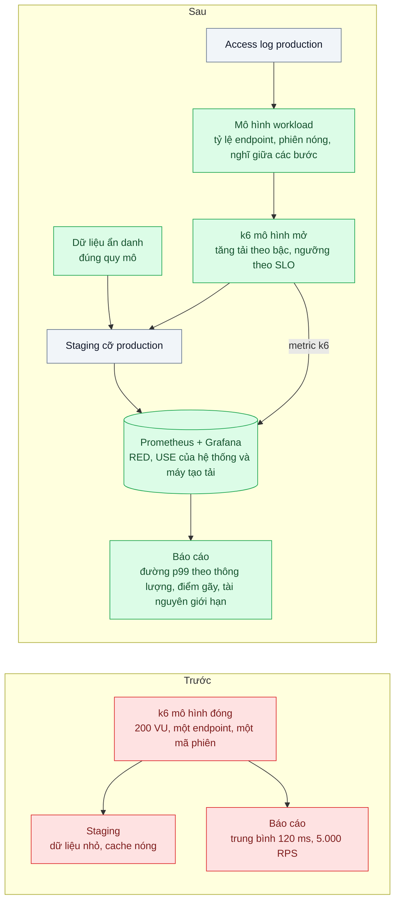
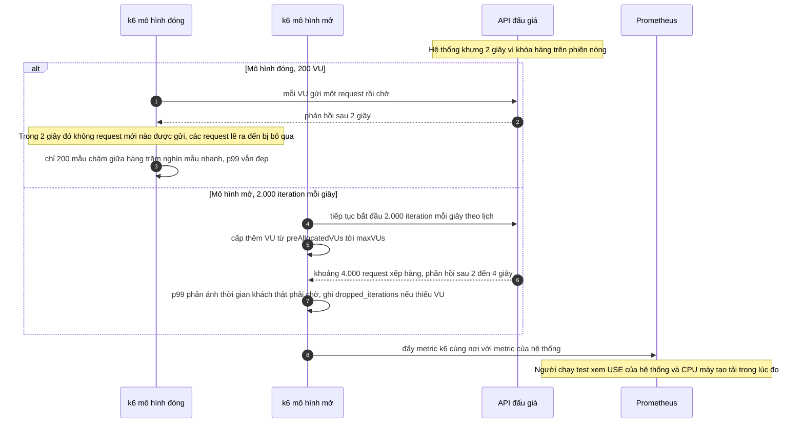

# Load Testing Methodology (k6, coordinated omission) — Benchmark nói chịu được 5k RPS, production sập ở 2k

| Scope | Mức độ | Trạng thái | Pattern gốc | Cập nhật |
|---|---|---|---|---|
| 23 · backend / monitoring benchmark | 🔴 Nâng cao | 📋 Kế hoạch | Load Testing Methodology — Gil Tene, coordinated omission (2015); k6 open vs closed model; Gregg, *Systems Performance* ch.12 (2020) | 2026-10-06 |

> **Một câu tóm tắt:** Đo tải bằng mô hình mở (request đến theo lịch như khách thật, không chờ hệ thống trả lời), với workload dựng từ log production, dữ liệu đúng quy mô, tăng tải theo bậc để tìm điểm gãy và quan sát hệ thống ngay trong lúc đo — để con số "chịu được bao nhiêu" không còn là con số tự lừa mình.

## 1. Bài toán thực tế (What)

**Bối cảnh** *(doanh nghiệp giả định, số liệu minh họa)*
Sàn đấu giá trực tuyến chuẩn bị phiên "giờ vàng" 20h. Trước sự kiện, đội chạy k6 với 200 virtual user trong 5 phút vào staging (dữ liệu bằng một phần tư production, cache đã nóng), chỉ gọi endpoint xem phiên với cùng một mã phiên, từ một máy trong cùng mạng nội bộ. Kết quả báo cáo: "5.000 RPS, thời gian phản hồi trung bình 120 ms".

**Triệu chứng người kinh doanh nhìn thấy**
- Tối sự kiện, ở khoảng 2.000 RPS lưu lượng thật, p99 lên 12 giây, API đặt giá timeout, pool kết nối DB cạn. Phiên đấu giá phải gia hạn, người thắng bị tranh chấp.
- Ban điều hành đã duyệt ngân sách hạ tầng dựa trên con số 5.000 RPS.
- Sau sự cố không ai biết con số thật là bao nhiêu và nên tin báo cáo benchmark nào nữa.

**Nguyên nhân kỹ thuật**
Mô hình *đóng*: mỗi virtual user gửi một request rồi *chờ* phản hồi mới gửi tiếp. Khi hệ thống chậm lại, máy tạo tải tự động gửi ít đi — nó "phối hợp" với hệ thống bị đo và bỏ qua đúng những request lẽ ra đến trong lúc hệ thống khựng. Gil Tene gọi đây là *coordinated omission*: độ trễ đo được đẹp hơn thực tế rất nhiều. Thêm vào đó, workload không giống thật: một endpoint, một mã phiên nên trúng cache 100%, không có tranh chấp ghi trên phiên "nóng", dữ liệu nhỏ, và báo cáo chỉ có trung bình.

**Ràng buộc**
- Có một staging cỡ bằng production trong 2 ngày trước mỗi sự kiện lớn; còn lại chỉ có môi trường local.
- Không được đặt tải lên cổng thanh toán thật hay hệ thống của đối tác.
- Kết quả phải đủ tin để quyết định ngân sách hạ tầng.

## 2. Vì sao dùng pattern này (Why)

**Nguyên nhân gốc mà pattern nhắm vào:** cách đo làm sai lệch thứ được đo, và workload đo không đại diện cho lưu lượng thật.

**Pattern giải quyết thế nào:** k6 docs phân biệt *mô hình đóng* (số user cố định, vòng lặp chờ phản hồi) và *mô hình mở* (tốc độ đến cố định, mỗi iteration bắt đầu theo lịch bất kể iteration trước xong chưa). Khách trên web công khai đến độc lập với việc hệ thống nhanh hay chậm, nên mô hình mở mới mô phỏng đúng; executor `constant-arrival-rate` và `ramping-arrival-rate` cấp thêm virtual user khi cần, và báo `dropped_iterations` khi không đủ để giữ lịch. Gil Tene chỉ ra rằng chỉ khi tải không "chờ" hệ thống, phân vị cao mới phản ánh thời gian khách thật phải đợi. Brendan Gregg (*Systems Performance* ch.12) nhấn mạnh *active benchmarking*: trong lúc đo phải quan sát hệ thống để biết tài nguyên nào giới hạn, và kiểm chắc máy tạo tải không phải nút thắt. Định luật Little (L = λW) cho biết cần bao nhiêu virtual user: số request đồng thời bằng tốc độ đến nhân thời gian phản hồi. Cuối cùng, thay vì một con số "RPS tối đa", tăng tải theo bậc và vẽ p99 theo thông lượng để tìm *điểm gãy*; năng lực là bậc cao nhất còn đạt SLO, trừ biên an toàn.

**Lựa chọn khác đã cân nhắc**

| Lựa chọn | Giải quyết được gì | Vì sao không chọn (ở bài này) |
|---|---|---|
| Giữ nguyên + tối ưu nhỏ (tăng lên 1.000 virtual user, chạy lâu hơn) | Tải lớn hơn | Vẫn là mô hình đóng: hệ thống chậm thì tải tự giảm, coordinated omission vẫn còn |
| Chỉ dùng số đo production sau sự kiện | Số thật | Biết sau khi đã sập; không thử được trước các kịch bản tải lớn hơn |
| wrk2 (tốc độ cố định, hiệu chỉnh coordinated omission) | Đo độ trễ đúng ở tốc độ cố định | Khó mô phỏng hành trình nhiều bước và workload trộn; k6 viết kịch bản bằng JavaScript |
| Phương pháp đầy đủ với k6 mô hình mở (chọn) | Độ trễ đúng; workload thật; tìm được điểm gãy và tài nguyên giới hạn | Tốn công dựng dữ liệu và workload; cần staging đúng cỡ để ra số năng lực tin được |

## 3. Thiết kế hệ thống (How)

### 3.1 Kiến trúc trước và sau



### 3.2 Luồng chính



### 3.3 Thành phần và trách nhiệm

| Thành phần | Trách nhiệm | Quyết định thiết kế đáng chú ý |
|---|---|---|
| Mô hình workload | Tỷ lệ endpoint, phân bố phiên nóng, thời gian nghĩ, tốc độ đến theo giờ | Lấy từ access log production, không đoán; ghi rõ nguồn và ngày lấy |
| Dữ liệu thử | Bản sao ẩn danh đúng quy mô production | Không có dữ liệu đúng cỡ thì không có số năng lực, chỉ có số tương đối |
| Kịch bản k6 | `ramping-arrival-rate` theo bậc, mỗi bậc đủ lâu; một kịch bản soak dài | `maxVUs` tính bằng định luật Little cộng biên; bậc nào có `dropped_iterations` thì loại |
| Ngưỡng pass/fail | `thresholds` cho p99 và tỷ lệ lỗi theo SLO | Lỗi 503 nhanh không được làm đẹp số RPS |
| Quan sát trong lúc đo | Dashboard RED/USE của hệ thống, CPU và mạng của máy tạo tải | Máy tạo tải trên 70% CPU thì kết quả không hợp lệ |
| Báo cáo | Môi trường, phiên bản, 3 lần chạy, đường p99 theo thông lượng, tài nguyên giới hạn | Mẫu báo cáo cố định để so sánh giữa các lần |

### 3.4 Điểm dễ sai khi triển khai
- **Dùng mô hình đóng cho web công khai**: coordinated omission. Mô hình đóng chỉ hợp với tải có số client cố định thật sự (ví dụ một pool worker nội bộ).
- **`maxVUs` quá thấp**: k6 không giữ được tốc độ đến, `dropped_iterations` tăng — tải thật thấp hơn tải khai báo.
- **Máy tạo tải bão hòa**: độ trễ đo được gồm cả thời gian máy tạo tải xử lý chậm.
- **Cùng một mã, cùng một tham số**: trúng cache 100%, không có tranh chấp khóa.
- **Bỏ qua lỗi**: hệ thống trả 503 rất nhanh khiến RPS trông cao hơn.
- **Một lần chạy duy nhất**, hoặc so hai lần chạy khác phiên bản, khác môi trường như thể so cùng điều kiện.
- **Gọi thẳng cổng thanh toán hay API đối tác** trong lúc đo: dùng mock hoặc sandbox có giới hạn.

## 4. Tech stack và tác động (Impact techstack)

| Lớp | Công nghệ chọn | Vì sao chọn | Thay thế tương đương |
|---|---|---|---|
| Tạo tải | k6 (`constant-arrival-rate`, `ramping-arrival-rate`, `thresholds`) | Mô hình mở có sẵn, kịch bản JavaScript, phân vị và `dropped_iterations` | Gatling; wrk2 cho đo tốc độ cố định đơn giản |
| Xuất metric k6 | Output Prometheus remote write của k6 (tên output cần xác minh theo phiên bản) | Đặt metric tải cạnh metric hệ thống trên cùng dashboard | Xuất JSON/CSV rồi phân tích sau |
| Quan sát | Prometheus + Grafana, `node_exporter` trên máy tạo tải | Active benchmarking: thấy tài nguyên giới hạn trong lúc đo | — |
| Dữ liệu | PostgreSQL 16, script ẩn danh và nhân bản dữ liệu | Đúng quy mô, đúng phân bố phiên nóng | — |
| Hạ tầng | Docker Compose cho local; staging cỡ production cho số năng lực | Local đủ để học phương pháp và so tương đối; không dùng số local để duyệt ngân sách | — |

**Thay đổi so với hệ thống hiện tại:** thêm quy trình dựng workload từ log, script dữ liệu, kịch bản k6 mô hình mở, mẫu báo cáo; benchmark trước mỗi sự kiện lớn đi kèm dashboard quan sát. Đội học đọc đường p99 theo thông lượng thay vì một con số RPS.

## 5. Kết quả đầu ra và cách đo (Output impact)

| Chỉ số | Trước (minh họa) | Mục tiêu khi thực hành | Cách đo |
|---|---|---|---|
| Chênh lệch năng lực benchmark so với thực tế | 5.000 so với 2.000 RPS, gấp 2,5 lần | Trong khoảng ±20% | So điểm gãy của k6 với RPS tại lúc p99 vượt SLO khi phát lại log production lên staging |
| p99 đo bằng mô hình đóng và mô hình mở ở cùng mức tải | Chỉ có trung bình 120 ms | Ghi lại cả hai, báo cáo chính dùng mô hình mở | Hai kịch bản k6 cùng mức tải, cùng lúc tiêm khựng 2 giây |
| `dropped_iterations` ở mức tải được báo cáo | Không theo dõi | 0 | Metric của k6 |
| CPU máy tạo tải | Không theo dõi | ≤ 70% | `node_exporter` trên máy tạo tải |
| Độ lặp lại giữa 3 lần chạy | 1 lần | p99 lệch ≤ 10% | 3 lần chạy cùng cấu hình, cùng dữ liệu |
| Tài nguyên giới hạn được gọi tên | Không | Có, kèm bằng chứng | Dashboard USE/RED trong lúc đo (ví dụ pool DB, khóa hàng trên phiên nóng) |

> Số "trước" là minh họa để hình dung bài toán. Số "mục tiêu" chỉ được coi là đạt khi có số đo thật
> ở mục 8 kèm môi trường đo.

**Tác động nghiệp vụ mong đợi:** ngân sách hạ tầng cho sự kiện lớn dựa trên con số tin được; biết trước tài nguyên nào sẽ gãy đầu tiên để sửa trước giờ vàng.

## 6. Đánh đổi và khi KHÔNG nên dùng

**Đánh đổi**
- Tốn công dựng dữ liệu và workload; mỗi khi hành vi người dùng đổi phải lấy lại từ log.
- Staging cỡ production tốn tiền; chỉ bật khi cần.
- Mô hình mở dễ đẩy hệ thống tới sập thật; cần quy trình dừng và không chạy chung hạ tầng với production.

**Không nên dùng khi**
- Chỉ cần so sánh tương đối hai cách cài đặt một hàm (micro-benchmark): dùng công cụ benchmark trong tiến trình, không cần cả phương pháp này.
- Client thật sự là một pool cố định (worker nội bộ kéo việc từ hàng đợi): mô hình đóng phản ánh đúng hơn.

**Liên quan**
- [Bài 04 — Percentiles & Histograms](../04-percentiles-p99-trung-binh-200ms-nhung-khach-than-cham/) — cách đọc phân vị mà bài này đo.
- [Bài 08 — Continuous Profiling](../08-continuous-profiling-cpu-80-phan-tram-khong-biet-ham-nao/) — khi tài nguyên giới hạn là CPU, tìm hàm gây ra.
- [Scope 18 bài 07 — Capacity Planning](../../18-backend-scale/07-capacity-planning-use-method-mua-may-bao-nhieu-cho-tet/) — dùng điểm gãy để tính số máy.
- [Scope 03 bài 05 — Hot Key & Multi-tier Cache](../../03-backend-cache/05-hot-key-mot-san-pham-viral-dap-mot-node-redis/) — phiên "nóng" là một hot key.

## 7. Cơ sở tham khảo

- Gil Tene, "How NOT to Measure Latency", bài nói tại Strange Loop, 2015 — định nghĩa coordinated omission, vì sao máy tạo tải chờ phản hồi làm sai phân vị cao.
- Grafana k6 docs, "Open and closed models" và "Scenarios / Executors" — https://grafana.com/docs/k6/ — `constant-arrival-rate`, `ramping-arrival-rate`, `preAllocatedVUs`, `maxVUs`, `dropped_iterations`, `thresholds`.
- Brendan Gregg, *Systems Performance*, 2nd ed., Addison-Wesley, 2020, ch.12 "Benchmarking" — active benchmarking, các lỗi benchmark phổ biến, kiểm nút thắt ở máy tạo tải.
- J. D. C. Little, "A Proof for the Queuing Formula: L = λW", *Operations Research*, 1961 — tính số virtual user cần cho một tốc độ đến và độ trễ.
- wrk2 — https://github.com/giltene/wrk2 — công cụ của Gil Tene tạo tải tốc độ cố định có hiệu chỉnh coordinated omission, phương án thay thế ở mục 4.

## 8. Kế hoạch thực hành

- [ ] Bước 1: dựng API đấu giá mẫu (xem phiên, đặt giá với khóa hàng trên phiên) + PostgreSQL + Redis + Prometheus + Grafana; script sinh dữ liệu theo phân bố có phiên nóng; access log mẫu để dựng workload.
- [ ] Bước 2: đo "trước": kịch bản mô hình đóng 200 VU một endpoint, ghi trung bình và "RPS tối đa" như báo cáo cũ.
- [ ] Bước 3: áp dụng phương pháp: workload từ log, kịch bản mô hình mở tăng theo bậc, `maxVUs` theo định luật Little, ngưỡng theo SLO, dashboard quan sát hệ thống và máy tạo tải.
- [ ] Bước 4: đo "sau": 3 lần chạy, so mô hình đóng và mở khi tiêm khựng 2 giây, tìm điểm gãy và tài nguyên giới hạn; ghi số và môi trường vào mục 5.
- [ ] Bước 5: kiểm tra tự động: kịch bản fail khi p99 hoặc tỷ lệ lỗi vượt ngưỡng; báo cáo bị đánh dấu không hợp lệ khi `dropped_iterations` khác 0 hoặc máy tạo tải trên 70% CPU.

**Cấu trúc code dự kiến**
```text
src/auction-api/                  # API mẫu: xem phiên, đặt giá
tools/
  seed-auctions.ts                # dữ liệu đúng phân bố phiên nóng
  workload-from-logs.ts           # [PATTERN] tỷ lệ endpoint, tốc độ đến từ access log
bench/
  closed-model.k6.js              # tái hiện cách đo cũ
  open-model-steps.k6.js          # [PATTERN] ramping-arrival-rate theo bậc, thresholds
  soak.k6.js
  report-template.md              # môi trường, 3 lần chạy, điểm gãy
infra/grafana/load-test-dashboard.json
test/report-validity.test.ts      # kiểm dropped_iterations và CPU máy tạo tải
docker-compose.yml
```

**Cách chạy** *(điền khi bắt đầu code)*
```bash
docker compose up -d
pnpm install && pnpm test
```
