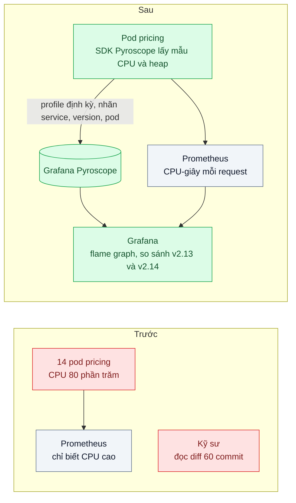
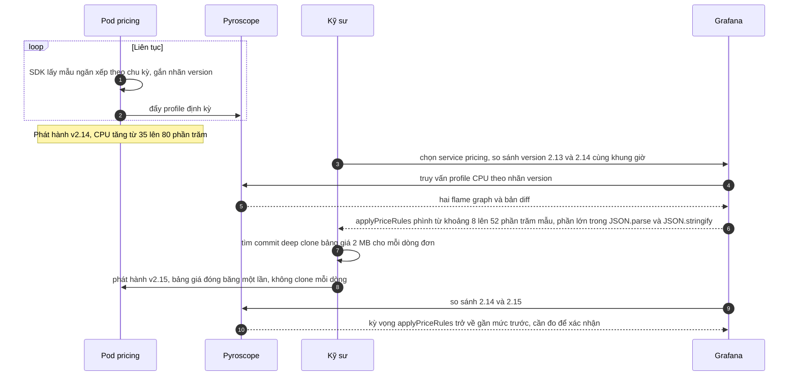

# Continuous Profiling — CPU 80% nhưng không biết hàm nào ăn

| Scope | Mức độ | Trạng thái | Pattern gốc | Cập nhật |
|---|---|---|---|---|
| 23 · backend / monitoring benchmark | 🔴 Nâng cao | 📋 Kế hoạch | Continuous Profiling & Flame Graph — Brendan Gregg, "The Flame Graph" (CACM, 2016); Grafana Pyroscope / Parca | 2026-10-06 |

> **Một câu tóm tắt:** Chạy một profiler lấy mẫu, overhead thấp, thường trực trên mọi instance production, gắn nhãn theo service và phiên bản, lưu tập trung và xem bằng flame graph — để khi CPU tăng sau một lần release, so hai flame graph là thấy ngay hàm nào phình ra.

## 1. Bài toán thực tế (What)

**Bối cảnh** *(doanh nghiệp giả định, số liệu minh họa)*
SaaS B2B quản lý khách hàng (CRM) có service `pricing` viết bằng Node.js, tính báo giá cho đơn hàng doanh nghiệp nhiều dòng sản phẩm. Sau bản phát hành v2.14 gồm khoảng 60 commit, CPU trung bình của service tăng từ 35% lên 80%.

**Triệu chứng người kinh doanh nhìn thấy**
- HPA tăng số pod từ 6 lên 14; hóa đơn cloud tháng đó tăng khoảng 40%.
- p99 tạo báo giá tăng gấp đôi; nhân viên kinh doanh than "bấm báo giá phải chờ".
- Ba ngày, hai kỹ sư đọc lại diff 60 commit mà chưa tìm ra; staging với dữ liệu nhỏ không tái hiện được.

**Nguyên nhân kỹ thuật**
Metrics trả lời được *có* vấn đề và *ở service nào* (bài 01), trace cho thấy span `buildQuote` chậm nhưng không gọi đi đâu (bài 03) — thời gian nằm trong CPU, bên trong code. Muốn biết hàm nào cần profile, nhưng profile ở máy local không có hình dạng dữ liệu của production, còn bật profiler thủ công trên production thì rủi ro và không ai dám làm vào giờ cao điểm.

**Ràng buộc**
- Overhead của profiler trên production phải thấp, đo được, và tắt được nhanh.
- Không thay đổi code nghiệp vụ để thêm profiling.
- Kết quả phải so sánh được giữa hai phiên bản.

## 2. Vì sao dùng pattern này (Why)

**Nguyên nhân gốc mà pattern nhắm vào:** không có dữ liệu "CPU đang được tiêu vào hàm nào" từ chính môi trường production, tại đúng thời điểm có vấn đề.

**Pattern giải quyết thế nào:** profiler *lấy mẫu* chụp ngăn xếp lời gọi của tiến trình theo chu kỳ đều đặn; hàm xuất hiện trong nhiều mẫu là hàm tiêu nhiều CPU. Vì chỉ lấy mẫu, overhead đủ thấp để chạy thường trực — *continuous profiling*. Mỗi instance gửi profile định kỳ về kho tập trung, kèm nhãn `service`, `version`, `pod`; người dùng truy vấn theo khoảng thời gian và nhãn. Brendan Gregg đề xuất *flame graph* để đọc hàng nghìn ngăn xếp cùng lúc: mỗi ô là một hàm, chiều rộng tỷ lệ với số mẫu chứa hàm đó, trục dọc là độ sâu ngăn xếp, trục ngang *không* phải thời gian mà được sắp theo tên để gộp các ngăn xếp giống nhau. So sánh flame graph của v2.13 và v2.14 (diff) làm nổi bật phần phình ra. Grafana Pyroscope và Parca là hai hệ thống mã nguồn mở cho mô hình này; Node.js cung cấp profiler V8 mà SDK dựa vào.

**Lựa chọn khác đã cân nhắc**

| Lựa chọn | Giải quyết được gì | Vì sao không chọn (ở bài này) |
|---|---|---|
| Giữ nguyên + tối ưu nhỏ (đọc diff, thêm log thời gian quanh hàm nghi ngờ) | Không cần công cụ mới | Phải đoán đúng hàm trước khi đo; đã tốn 3 ngày |
| Profile thủ công khi có sự cố (`--cpu-prof`, Chrome DevTools) | Flame graph chính xác | Phải khởi động lại tiến trình với cờ, chạy trên một pod, đúng lúc; không có dữ liệu "trước" để so |
| Tăng tài nguyên, chấp nhận chi phí | Hết chậm ngay | Trả tiền mãi cho một lỗi code; lần sau lặp lại |
| Profiling liên tục với Pyroscope (chọn) | Luôn có dữ liệu production, so được giữa phiên bản, không khởi động lại | Thêm một hệ thống lưu trữ; có overhead nhỏ phải đo |

## 3. Thiết kế hệ thống (How)

### 3.1 Kiến trúc trước và sau



### 3.2 Luồng chính



### 3.3 Thành phần và trách nhiệm

| Thành phần | Trách nhiệm | Quyết định thiết kế đáng chú ý |
|---|---|---|
| SDK profiling trong thư viện observability chung | Khởi tạo profiler CPU và heap, gắn nhãn `service_name`, `version`, `pod` | Bật/tắt bằng biến môi trường để rút lui nhanh nếu overhead vượt ngân sách |
| Grafana Pyroscope | Nhận, nén, lưu profile; truy vấn theo nhãn và thời gian | Giữ dữ liệu đủ dài để so trước và sau mỗi lần phát hành |
| Grafana | Flame graph, so sánh hai khoảng hoặc hai nhãn | Liên kết từ dashboard CPU sang flame graph cùng khung giờ |
| Nhãn version | Gắn phiên bản build vào mọi profile | Không có nhãn version thì không so được trước/sau release |
| Runbook "CPU tăng sau release" | So flame graph theo version trước khi tăng tài nguyên | Đưa vào quy trình xử lý sự cố của đội |
| Đo overhead | k6 tải cố định, so CPU và p99 khi bật và tắt SDK | Ngân sách overhead ghi rõ trong runbook |

### 3.4 Điểm dễ sai khi triển khai
- **Tin overhead "không đáng kể" mà không đo**: đo bằng tải cố định, so CPU-giây mỗi request khi bật và tắt.
- **Nhãn có nhiều giá trị** (user id, request id): kho profile phình và truy vấn chậm.
- **Code bị minify khi bundle**: tên hàm mất, flame graph toàn ký hiệu vô nghĩa. Không minify code chạy server, đặt tên cho hàm quan trọng.
- **Đọc trục ngang như trục thời gian**: tháp rộng nhất là tháp chiếm nhiều mẫu nhất, không phải chạy trước.
- **Dùng profile CPU cho vấn đề chờ I/O**: request chậm vì chờ DB không hiện trên profile CPU — đó là việc của tracing (bài 03).
- **Bỏ qua heap profile**: nhiều CPU nằm ở garbage collector; nguyên nhân thật là chỗ cấp phát nhiều, nhìn thấy ở heap/allocation profile.

## 4. Tech stack và tác động (Impact techstack)

| Lớp | Công nghệ chọn | Vì sao chọn | Thay thế tương đương |
|---|---|---|---|
| Kho profile | Grafana Pyroscope | Mã nguồn mở, truy vấn theo nhãn, cùng Grafana với metrics/log/trace | Parca |
| SDK Node.js | `@pyroscope/nodejs` (API và loại profile hỗ trợ cần xác minh theo phiên bản) | Dựa trên profiler V8, không cần khởi động lại với cờ đặc biệt | Agent eBPF của Parca (khả năng giải ký hiệu cho mã JIT của V8 cần xác minh) |
| Hiển thị | Grafana flame graph | So sánh hai khoảng thời gian hoặc hai nhãn | Giao diện của Pyroscope |
| Kiểm chứng local | Node `--cpu-prof` + Chrome DevTools, 0x | Xác nhận phát hiện trên máy dev với dữ liệu tái hiện | — |
| Tạo tải, đo | k6, Prometheus | Tải cố định để đo overhead và CPU-giây mỗi request | — |

**Thay đổi so với hệ thống hiện tại:** thêm Pyroscope và vài dòng khởi tạo SDK trong thư viện chung; build gắn nhãn version; runbook xử lý "CPU tăng sau release" bắt đầu bằng so flame graph. Đội học đọc flame graph và bản diff.

## 5. Kết quả đầu ra và cách đo (Output impact)

| Chỉ số | Trước (minh họa) | Mục tiêu khi thực hành | Cách đo |
|---|---|---|---|
| Thời gian tìm ra hàm gây tăng CPU | 3 ngày đọc diff | ≤ 30 phút | Game day: phát hành bản có deep clone mỗi dòng, bấm giờ tìm bằng flame graph diff |
| Overhead của profiler | Chưa đo | CPU-giây mỗi request tăng ≤ 3%, p99 tăng ≤ 3% | k6 tải cố định 300 request/giây, bật và tắt SDK, so `process_cpu_seconds_total` |
| CPU-giây mỗi request | Gấp khoảng 2,3 lần so với trước release | Về mức trước release ±10% sau khi sửa | PromQL `rate(process_cpu_seconds_total[5m]) / rate(http_server_request_duration_seconds_count[5m])` |
| Số pod cần ở tải cao điểm | 14 | ≤ 7 | Tính từ CPU-giây mỗi request × RPS cao điểm, đối chiếu với HPA trong môi trường thử |
| Dung lượng lưu profile mỗi ngày | — | Đo và ghi lại để lập ngân sách | Metric dung lượng của Pyroscope |

> Số "trước" là minh họa để hình dung bài toán. Số "mục tiêu" chỉ được coi là đạt khi có số đo thật
> ở mục 8 kèm môi trường đo.

**Tác động nghiệp vụ mong đợi:** lỗi hiệu năng do code được tìm ra trong một buổi thay vì trả tiền hạ tầng hàng tháng; mỗi lần release có "ảnh chụp" CPU để so sánh.

## 6. Đánh đổi và khi KHÔNG nên dùng

**Đánh đổi**
- Thêm một hệ thống lưu trữ và chi phí lưu profile.
- Overhead nhỏ nhưng có thật, nhân trên mọi pod.
- Profile chỉ cho biết *ở đâu* tốn CPU; *vì sao* code viết như vậy vẫn cần đọc và hiểu nghiệp vụ.

**Không nên dùng khi**
- Service chủ yếu chờ I/O, CPU thấp: tracing (bài 03) cho nhiều thông tin hơn.
- Chỉ cần tối ưu một hàm đã biết: micro-benchmark và profile local là đủ.
- Tiến trình sống rất ngắn (vài giây, như function serverless): profiler lấy mẫu không kịp thu đủ mẫu; cần cách đo khác.

**Liên quan**
- [Bài 03 — Distributed Tracing](../03-distributed-tracing-otel-request-qua-6-service-cham-o-dau/) — chỉ ra span chậm; profiling chỉ ra hàm bên trong span.
- [Bài 07 — Load Testing Methodology](../07-load-testing-k6-coordinated-omission-benchmark-tu-danh-lua/) — tạo tải cố định để đo overhead và so trước/sau.
- [Scope 16 bài 03 — Resource Requests/Limits & HPA](../../16-backend-k8s/03-requests-limits-hpa-9h-sang-traffic-gap-5/) — vì sao CPU tăng kéo theo số pod và hóa đơn.
- [Scope 18 bài 07 — Capacity Planning](../../18-backend-scale/07-capacity-planning-use-method-mua-may-bao-nhieu-cho-tet/) — CPU-giây mỗi request là đầu vào của bài toán năng lực.

## 7. Cơ sở tham khảo

- Brendan Gregg, "The Flame Graph", *Communications of the ACM* 59(6), 2016 — https://queue.acm.org/detail.cfm?id=2927301 — cách dựng và đọc flame graph, ý nghĩa trục ngang và chiều rộng, các biến thể như diff.
- Grafana Pyroscope docs — https://grafana.com/docs/pyroscope/ — kiến trúc continuous profiling, SDK cho Node.js, nhãn và truy vấn.
- Parca docs — https://www.parca.dev/docs/ — phương án mã nguồn mở thay thế, profiling dựa trên eBPF.
- Node.js docs, phần diagnostics (`--cpu-prof`, flame graph) — https://nodejs.org/docs/ (đường dẫn trang con cần xác minh) — profiler V8 và cách profile thủ công để kiểm chứng.
- Brendan Gregg, *Systems Performance*, 2nd ed., Addison-Wesley, 2020 — phương pháp phân tích CPU và vai trò của flame graph trong quy trình.

## 8. Kế hoạch thực hành

- [ ] Bước 1: dựng service `pricing` mẫu + Pyroscope + Prometheus + Grafana bằng Docker Compose; hai bản build v2.13 (bình thường) và v2.14 (deep clone bảng giá 2 MB mỗi dòng đơn).
- [ ] Bước 2: đo "trước": k6 tải cố định trên v2.13 rồi v2.14, ghi CPU-giây mỗi request và p99; bấm giờ tìm nguyên nhân chỉ với metrics.
- [ ] Bước 3: áp dụng pattern: SDK Pyroscope trong thư viện chung với nhãn version, dashboard liên kết CPU sang flame graph, runbook.
- [ ] Bước 4: đo "sau": thời gian tìm nguyên nhân bằng diff, overhead bật/tắt SDK, CPU-giây mỗi request sau khi sửa ở v2.15; ghi số và môi trường vào mục 5.
- [ ] Bước 5: test: profile có đủ nhãn `service_name` và `version`; tắt SDK bằng biến môi trường thì không còn gửi profile; v2.15 đạt CPU-giây mỗi request trong ±10% của v2.13 ở cùng tải.

**Cấu trúc code dự kiến**
```text
packages/observability/src/init-profiling.ts   # [PATTERN] Pyroscope, nhãn service và version, cờ tắt
services/pricing/src/
  apply-price-rules.v213.ts       # bản bình thường
  apply-price-rules.v214.ts       # bản deep clone mỗi dòng, tái hiện sự cố
  apply-price-rules.v215.ts       # bảng giá đóng băng một lần
infra/
  pyroscope.yaml
  grafana/cpu-to-flamegraph.json
runbooks/cpu-up-after-release.md
test/profiling-labels.test.ts
bench/pricing-fixed-load.k6.js
docker-compose.yml
```

**Cách chạy** *(điền khi bắt đầu code)*
```bash
docker compose up -d
pnpm install && pnpm test
```
