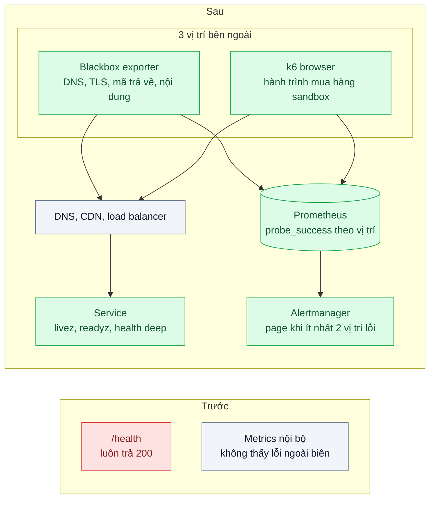
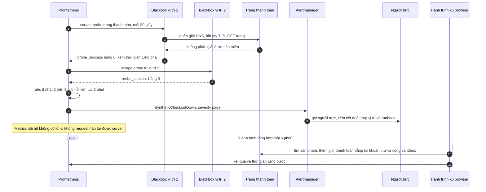

# Synthetic Monitoring & Health Endpoints — Khách báo lỗi trước khi đội kỹ thuật biết

| Scope | Mức độ | Trạng thái | Pattern gốc | Cập nhật |
|---|---|---|---|---|
| 23 · backend / monitoring benchmark | 🟢 Cơ bản | 📋 Kế hoạch | Health Endpoint Monitoring — Azure Architecture Center; black-box monitoring — Google SRE Book ch.6 (2016) | 2026-10-06 |

> **Một câu tóm tắt:** Cho mỗi service endpoint sức khỏe có phân cấp (sống, sẵn sàng, kiểm sâu) và chạy các đầu dò tổng hợp từ nhiều vị trí bên ngoài — kiểm DNS, TLS, nội dung trang và cả hành trình mua hàng với tài khoản thử — để biết hệ thống hỏng *từ góc nhìn của khách* ngay cả khi không request thật nào tới được server.

## 1. Bài toán thực tế (What)

**Bối cảnh** *(doanh nghiệp giả định, số liệu minh họa)*
Sàn thương mại điện tử đã có metrics RED và log tập trung (bài 01, bài 02), tất cả đo từ bên trong. Endpoint `/health` của mọi service luôn trả `200 OK` tĩnh. Bảy giờ sáng Chủ nhật, trong lúc chuyển CDN, bản ghi DNS của tên miền thanh toán bị trỏ sai.

**Triệu chứng người kinh doanh nhìn thấy**
- Khách không mở được trang thanh toán trong khoảng 45 phút; tín hiệu đầu tiên là bài phàn nàn trên fanpage, chăm sóc khách hàng gọi điện cho kỹ sư.
- Mọi dashboard đều xanh: không request nào tới được server nên không có lỗi nào được ghi.
- Tuần trước, một pod mất kết nối DB nhưng `/health` vẫn trả 200, load balancer tiếp tục gửi khách vào pod đó.

**Nguyên nhân kỹ thuật**
Giám sát chỉ có *white-box* — số đo từ bên trong hệ thống. Những lỗi xảy ra trước khi request chạm tới server (DNS, CDN, chứng chỉ TLS, script bên thứ ba ở trình duyệt) hoặc lúc vắng khách thì không có dữ liệu để báo. Health endpoint tĩnh không kiểm gì, nên vừa không giúp load balancer loại pod hỏng, vừa không giúp công cụ giám sát.

**Ràng buộc**
- Đầu dò không được tạo đơn hàng thật, không trừ tiền thật, không gửi email cho khách thật.
- Không báo động giả vì một vị trí đo bị lỗi mạng.
- Health endpoint không được lộ thông tin nội bộ ra Internet.

## 2. Vì sao dùng pattern này (Why)

**Nguyên nhân gốc mà pattern nhắm vào:** không có ai thường xuyên "đóng vai khách" từ bên ngoài, và endpoint sức khỏe không phản ánh khả năng phục vụ thật.

**Pattern giải quyết thế nào:** SRE Book ch.6 phân biệt *white-box* (số đo nội bộ, thấy nguyên nhân) và *black-box* (kiểm hành vi nhìn từ bên ngoài, thấy triệu chứng đang xảy ra) — hai loại bổ sung nhau. *Health Endpoint Monitoring* (Azure Architecture Center) mô tả việc ứng dụng phơi endpoint thực hiện kiểm tra chức năng, để công cụ bên ngoài gọi định kỳ và kiểm mã trả về, nội dung, thời gian phản hồi; tài liệu cũng lưu ý bảo vệ endpoint và tránh kiểm tra quá nặng. Thiết kế tách ba cấp: *liveness* (tiến trình còn chạy, không kiểm phụ thuộc), *readiness* (đủ điều kiện nhận request: DB, cache kết nối được), *deep* (kiểm cả phụ thuộc phụ, chỉ cho giám sát nội bộ). *Synthetic monitoring* chạy đầu dò từ ít nhất 3 vị trí ngoài hạ tầng: kiểm DNS, TLS, mã trả về và nội dung trang mỗi 30 giây, và chạy hành trình "tìm → thêm giỏ → thanh toán sandbox" mỗi 5 phút. Cảnh báo chỉ khi ít nhất 2 vị trí cùng thất bại, để lỗi mạng của một vị trí đo không đánh thức ai.

**Lựa chọn khác đã cân nhắc**

| Lựa chọn | Giải quyết được gì | Vì sao không chọn (ở bài này) |
|---|---|---|
| Giữ nguyên + tối ưu nhỏ (cảnh báo khi lưu lượng tụt bất thường) | Bắt được một phần sự cố ngoài biên | Ban đêm và sáng sớm lưu lượng vốn thấp; khó đặt ngưỡng, phát hiện chậm |
| Ping trang chủ từ một vị trí | Rẻ, đơn giản | Trang chủ sống không có nghĩa thanh toán sống; một vị trí thì dễ báo giả |
| Real User Monitoring (đo từ trình duyệt khách) | Số đo thật từ khách | Chỉ có dữ liệu khi khách đã tới được trang; không giúp khi DNS sai hoặc vắng khách |
| Health endpoint phân cấp + đầu dò đa vị trí + hành trình tổng hợp (chọn) | Thấy lỗi ngoài biên, kiểm chức năng thật, chạy cả lúc vắng khách | Phải duy trì kịch bản hành trình, tài khoản thử và sandbox |

## 3. Thiết kế hệ thống (How)

### 3.1 Kiến trúc trước và sau



### 3.2 Luồng chính



### 3.3 Thành phần và trách nhiệm

| Thành phần | Trách nhiệm | Quyết định thiết kế đáng chú ý |
|---|---|---|
| `/livez` | Tiến trình còn phản hồi | Không kiểm DB hay dịch vụ khác — tránh khởi động lại hàng loạt khi DB chập chờn |
| `/readyz` | Đủ điều kiện nhận request: DB, Redis kết nối được | Load balancer và Kubernetes dùng để loại pod hỏng; timeout ngắn cho từng kiểm tra |
| `/health/deep` | Kiểm cả phụ thuộc phụ và cấu hình | Chỉ mạng nội bộ hoặc cần token; kết quả cache vài giây để không tự tạo tải |
| Blackbox exporter ở 3 vị trí | Kiểm DNS, TLS, mã trả về, nội dung trang, hạn chứng chỉ | Kiểm chuỗi nội dung có trên trang thật, không chỉ mã 200 |
| Hành trình k6 browser | Đi hết luồng mua hàng bằng tài khoản thử | Header đánh dấu lưu lượng tổng hợp; đơn thử loại khỏi báo cáo doanh thu và được dọn định kỳ |
| Rule cảnh báo | Page khi ít nhất 2 vị trí lỗi; ticket khi chứng chỉ còn dưới 14 ngày | Một vị trí lỗi chỉ ghi nhận, không page |

### 3.4 Điểm dễ sai khi triển khai
- **Liveness kiểm DB**: DB chập chờn làm mọi pod bị khởi động lại cùng lúc, biến sự cố nhỏ thành sập toàn bộ.
- **Health endpoint kiểm mọi thứ, mỗi giây, từ mọi nơi**: tự tạo tải lên DB; cache kết quả và giới hạn tần suất. Endpoint deep để công khai thì lộ phiên bản, tên máy DB, danh sách phụ thuộc.
- **Đầu dò chạy trong cùng cluster**: không thấy lỗi DNS, CDN, chứng chỉ — đúng loại lỗi cần bắt.
- **Chỉ kiểm mã 200**: trang lỗi "Đã có lỗi xảy ra" vẫn trả 200.
- **Hành trình tạo đơn thật hoặc lẫn vào số liệu kinh doanh**: dùng tài khoản thử, cổng sandbox, gắn cờ và dọn dữ liệu.
- **Kịch bản giòn** bám vào selector CSS hay đổi: báo động giả mỗi lần frontend sửa giao diện; dùng thuộc tính `data-testid` ổn định.

## 4. Tech stack và tác động (Impact techstack)

| Lớp | Công nghệ chọn | Vì sao chọn | Thay thế tương đương |
|---|---|---|---|
| Health endpoint | NestJS Terminus (`@nestjs/terminus`) | Có sẵn bộ kiểm DB, Redis, HTTP với timeout | Endpoint tự viết |
| Đầu dò kỹ thuật | Prometheus Blackbox Exporter | Kiểm HTTP, TLS, DNS; xuất `probe_success` và hạn chứng chỉ dạng metric | Grafana Synthetic Monitoring (dịch vụ quản lý) |
| Hành trình tổng hợp | k6 browser module | Cùng công cụ với load test (bài 07), xuất metric về Prometheus | Playwright chạy định kỳ |
| Cảnh báo | Prometheus + Alertmanager | Rule "ít nhất 2 vị trí" bằng PromQL, dùng chung định tuyến với bài 06 | — |
| Vị trí đo | 3 máy nhỏ ở 3 vùng hoặc nhà cung cấp khác nhau; local giả lập bằng 3 container | Tách khỏi hạ tầng chính để thấy lỗi ngoài biên | — |
| Diễn tập | Docker network, Toxiproxy | Giả lập DNS sai, mất mạng một vị trí, DB mất kết nối | — |

**Thay đổi so với hệ thống hiện tại:** thay `/health` tĩnh bằng ba cấp endpoint; thêm Blackbox Exporter ở 3 vị trí, kịch bản hành trình, tài khoản thử và cấu hình sandbox thanh toán; thêm rule cảnh báo. Đội frontend giữ `data-testid` ổn định cho các bước của hành trình.

## 5. Kết quả đầu ra và cách đo (Output impact)

| Chỉ số | Trước (minh họa) | Mục tiêu khi thực hành | Cách đo |
|---|---|---|---|
| Thời gian từ sự cố ngoài biên tới khi đội kỹ thuật biết | ~45 phút, khách báo trước | ≤ 3 phút | Game day: trỏ DNS giả lập sai, đo từ lúc đổi tới lúc page |
| Sự cố được phát hiện trước khi khách báo | ~20% | ≥ 90% | Đối chiếu nhật ký sự cố hằng quý |
| Cảnh báo giả mỗi tuần từ đầu dò | Chưa có | ≤ 1 | Đếm alert được đánh dấu báo giả trong buổi review |
| Báo trước khi chứng chỉ hết hạn | 0 ngày, hết hạn mới biết | ≥ 14 ngày | Chứng chỉ thử hạn ngắn, kiểm alert từ `probe_ssl_earliest_cert_expiry` |
| Pod mất DB bị loại khỏi load balancer | Không, `/health` vẫn 200 | `/readyz` trả 503 trong ≤ 10 giây | Test dừng container PostgreSQL, đo thời gian `/readyz` đổi trạng thái |
| Hành trình quan trọng có đầu dò | 0 / 4 | 4 / 4 | Danh sách hành trình trong cấu hình đầu dò |

> Số "trước" là minh họa để hình dung bài toán. Số "mục tiêu" chỉ được coi là đạt khi có số đo thật
> ở mục 8 kèm môi trường đo.

**Tác động nghiệp vụ mong đợi:** đội kỹ thuật biết trước khách; sự cố ngoài biên như DNS, chứng chỉ, CDN — loại sự cố làm mất toàn bộ doanh thu — được phát hiện trong vài phút.

## 6. Đánh đổi và khi KHÔNG nên dùng

**Đánh đổi**
- Kịch bản hành trình phải bảo trì theo giao diện; tài khoản thử và sandbox là thêm thứ phải giữ hoạt động.
- Đầu dò chỉ kiểm những gì được viết kịch bản; không thay được metrics và phản hồi từ khách thật.
- Thêm chi phí cho vị trí đo bên ngoài.

**Không nên dùng khi**
- Hệ thống nội bộ không có người dùng ngoài Internet: health endpoint vẫn cần, nhưng đầu dò đa vị trí là thừa.
- Không có môi trường sandbox cho bước thanh toán: chỉ dò tới bước trước thanh toán, đừng chạy hành trình trên cổng thật.

**Liên quan**
- [Scope 16 bài 01 — Health Probes & Rolling Update](../../16-backend-k8s/01-probes-rolling-update-deploy-moi-nhan-traffic-khi-chua-san-sang/) — liveness và readiness trong Kubernetes.
- [Scope 16 bài 05 — Ingress & Automated TLS](../../16-backend-k8s/05-ingress-tls-cert-manager-chung-chi-het-han-luc-nua-dem/) — tự gia hạn chứng chỉ; đầu dò là lưới an toàn.
- [Bài 06 — Alerting on Symptoms](../06-alerting-symptom-not-cause-50-alert-moi-dem-khong-ai-doc/) — đầu dò là một nguồn triệu chứng cho cảnh báo; cũng đo phần SLI mà gateway không thấy ([bài 05](../05-slo-error-budget-he-thong-on-chua-khong-co-so/)).

## 7. Cơ sở tham khảo

- Microsoft Azure Architecture Center, "Health Endpoint Monitoring pattern" — https://learn.microsoft.com/azure/architecture/patterns/health-endpoint-monitoring — kiểm tra chức năng qua endpoint, vị trí đặt đầu dò, bảo vệ endpoint, cache kết quả.
- Google, *Site Reliability Engineering* (2016), ch.6 "Monitoring Distributed Systems" — https://sre.google/sre-book/monitoring-distributed-systems/ — black-box và white-box monitoring, vì sao cần cả hai.
- Prometheus Blackbox Exporter — https://github.com/prometheus/blackbox_exporter — module HTTP, TLS, DNS, metric `probe_success` và hạn chứng chỉ.
- Grafana k6 docs, browser module — https://grafana.com/docs/k6/ — viết hành trình trình duyệt tổng hợp dùng ở mục 4.
- NestJS docs, "Health checks (Terminus)" — https://docs.nestjs.com/recipes/terminus — bộ kiểm DB, Redis, HTTP cho endpoint sức khỏe.

## 8. Kế hoạch thực hành

- [ ] Bước 1: dựng web bán hàng mẫu (trang sản phẩm, giỏ, thanh toán sandbox) + PostgreSQL + Redis + CoreDNS giả lập tên miền + 3 container đóng vai 3 vị trí đo; `/health` tĩnh kiểu cũ.
- [ ] Bước 2: đo "trước": game day trỏ DNS sai và dừng DB của một pod, ghi lại không có cảnh báo nào và pod hỏng vẫn nhận request.
- [ ] Bước 3: áp dụng pattern: `/livez`, `/readyz`, `/health/deep` bằng Terminus; Blackbox Exporter ở 3 vị trí; hành trình k6 browser; rule "ít nhất 2 vị trí" và rule hạn chứng chỉ.
- [ ] Bước 4: đo "sau" cùng kịch bản, thêm kịch bản mất mạng một vị trí để kiểm không báo giả; ghi số và môi trường vào mục 5.
- [ ] Bước 5: test: `/livez` vẫn 200 khi DB chết; `/readyz` 503 khi DB chết; `/health/deep` từ chối khi không có token; một vị trí lỗi không page, hai vị trí lỗi thì page; đơn thử có cờ tổng hợp.

**Cấu trúc code dự kiến**
```text
src/shop/health/
  health.controller.ts           # [PATTERN] livez, readyz, health deep
  deep-check.guard.ts            # chỉ nội bộ hoặc có token
probes/
  blackbox.yml                   # module http có kiểm nội dung, tls, dns
  checkout-journey.k6.js         # [PATTERN] hành trình sandbox, header tổng hợp
infra/
  prometheus.yml                 # scrape 3 vị trí
  rules/synthetic.alerts.yml     # ít nhất 2 vị trí lỗi; chứng chỉ còn dưới 14 ngày
  coredns/                       # giả lập DNS để diễn tập
test/
  health-levels.test.ts
  multi-location-alert.test.yml  # promtool test rules
docker-compose.yml
```

**Cách chạy** *(điền khi bắt đầu code)*
```bash
docker compose up -d
pnpm install && pnpm test
```
