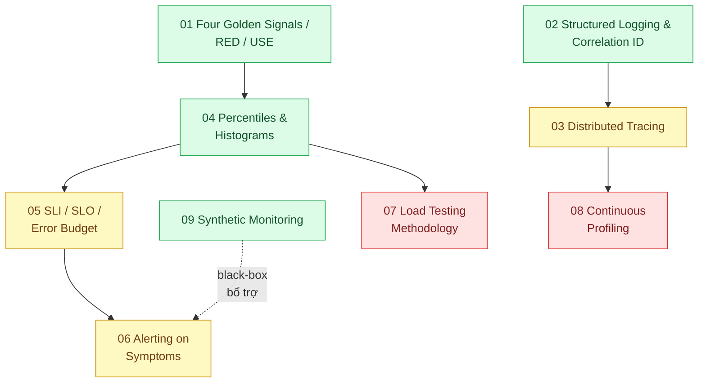

# 23 · Giám sát và benchmark (`backend / monitoring benchmark`)

> **Phạm vi:** Biết hệ thống đang thế nào bằng số: chỉ số nào, log và truy vết ra sao, percentiles,
> SLO và ngân sách lỗi, cảnh báo không mỏi mệt, đo tải đúng cách, profiling, giám sát tổng hợp.
> Giám sát riêng cho tính năng AI thuộc scope 24.
>
> **Câu hỏi trung tâm:** Biết hệ thống đang ổn hay không bằng số, tìm ra chỗ chậm, và benchmark
> không tự lừa mình?

## Bản đồ pattern trong scope

## Danh sách bài toán

| # | Bài toán (pattern — triệu chứng) | Mức | Pattern gốc / nguồn | Trạng thái |
|---|---|---|---|---|
| 01 | [Four Golden Signals / RED / USE — Khách than chậm, không biết service nào chậm](./01-four-golden-signals-red-method-khong-biet-service-nao-cham/) | 🟢 | Google SRE Book ch.6 "Monitoring Distributed Systems"; Tom Wilkie, "The RED Method" (2018); Brendan Gregg, "The USE Method" | ✅ |
| 02 | [Structured Logging & Correlation ID — Grep log của 6 service để tìm một request của khách](./02-structured-logging-correlation-id-grep-log-6-service-tim-mot-request/) | 🟢 | OpenTelemetry docs "Logs"; 12factor "Logs"; W3C Trace Context | ✅ |
| 03 | [Distributed Tracing (OpenTelemetry) — Request đi qua 6 service, chậm ở đâu?](./03-distributed-tracing-otel-request-qua-6-service-cham-o-dau/) | 🟡 | Sigelman et al., "Dapper" (Google, 2010); OpenTelemetry docs "Traces"; W3C Trace Context | 📋 |
| 04 | [Percentiles & Histograms — Trung bình 200 ms nhưng khách than chậm: p99 là 4 giây](./04-percentiles-p99-trung-binh-200ms-nhung-khach-than-cham/) | 🟢 | Gil Tene, "How NOT to Measure Latency" (2015); Prometheus docs "Histograms and summaries"; SRE Book ch.6 | 📋 |
| 05 | [SLI / SLO / Error Budget — "Hệ thống ổn chưa?" không ai trả lời được bằng số](./05-slo-error-budget-he-thong-on-chua-khong-co-so/) | 🟡 | Google SRE Book ch.4 "Service Level Objectives"; SRE Workbook ch.2 "Implementing SLOs" | 📋 |
| 06 | [Alerting on Symptoms (alert fatigue) — 50 alert mỗi đêm, không ai đọc nữa](./06-alerting-symptom-not-cause-50-alert-moi-dem-khong-ai-doc/) | 🟡 | Rob Ewaschuk, "My Philosophy on Alerting"; SRE Book ch.6; SRE Workbook ch.5 "Alerting on SLOs" | 📋 |
| 07 | [Load Testing Methodology (k6, coordinated omission) — Benchmark nói chịu được 5k RPS, production sập ở 2k](./07-load-testing-k6-coordinated-omission-benchmark-tu-danh-lua/) | 🔴 | Gil Tene (coordinated omission); k6 docs (open vs closed model); Brendan Gregg, *Systems Performance* ch.12 "Benchmarking" | 📋 |
| 08 | [Continuous Profiling — CPU 80% nhưng không biết hàm nào ăn](./08-continuous-profiling-cpu-80-phan-tram-khong-biet-ham-nao/) | 🔴 | Brendan Gregg, "The Flame Graph" (CACM 2016); Grafana Pyroscope / Parca docs; Node.js diagnostics docs | 📋 |
| 09 | [Synthetic Monitoring & Health Endpoints — Khách báo lỗi trước khi đội kỹ thuật biết](./09-synthetic-monitoring-health-check-khach-bao-loi-truoc-khi-doi-ky-thuat-biet/) | 🟢 | Azure "Health Endpoint Monitoring"; SRE Book ch.6 (black-box vs white-box) | 📋 |

## Lộ trình đề xuất trong scope

1. **Golden signals → Percentiles → Structured logging → Synthetic** — bốn bài 🟢 dựng được trong
   một tuần với Prometheus + Grafana + OpenTelemetry Collector.
2. **Tracing** — khi có hơn một service.
3. **SLO → Alerting** — biến số đo thành cam kết và cảnh báo có ý nghĩa.
4. **Load testing → Profiling** — đo giới hạn và tìm nguyên nhân.

## Kiến thức nền cần có trước

- Prometheus data model (counter, gauge, histogram); PromQL cơ bản.
- Docker Compose để dựng stack giám sát local.
- Khái niệm percentile.

## Liên kết với scope khác

- Mọi scope dùng bài 04 (percentiles) và 07 (load testing) để đo "trước/sau".
- `18-backend-scale` — capacity planning dựa trên số đo ở đây.
- `16-backend-k8s` — metric cho HPA; canary analysis.
- `24-backend-ai-monitoring` — mở rộng tracing/metrics cho LLM.

## Nguồn tổng quan cho scope

- Google, *Site Reliability Engineering* (2016), ch.4 và ch.6 — https://sre.google/sre-book/table-of-contents/
- OpenTelemetry docs — https://opentelemetry.io/docs/
- Brendan Gregg, *Systems Performance* (2nd ed., 2020).
