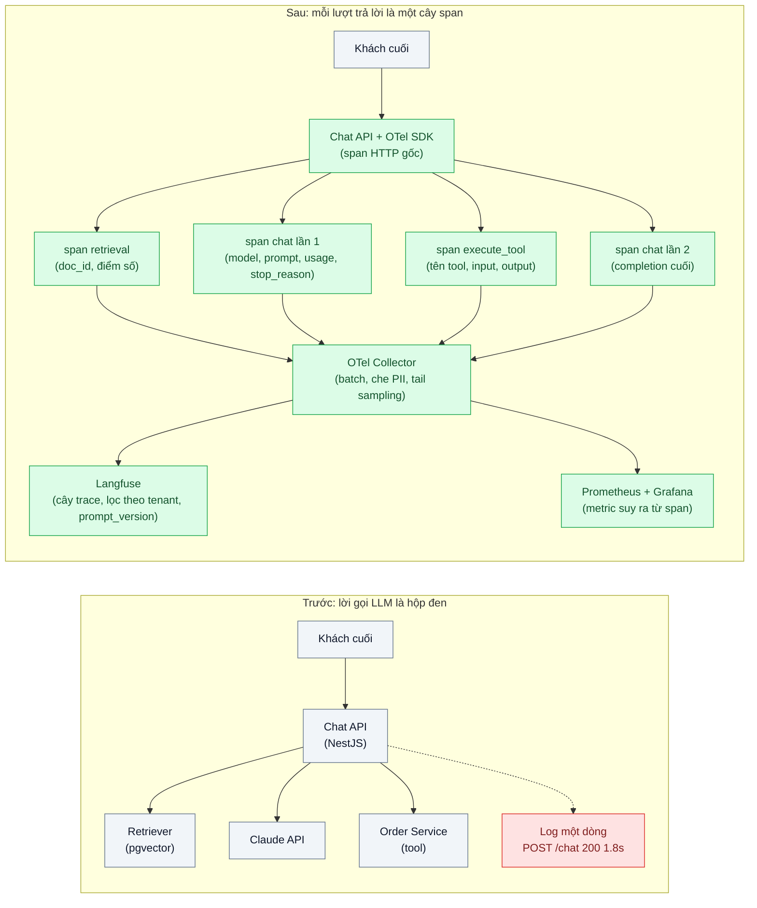
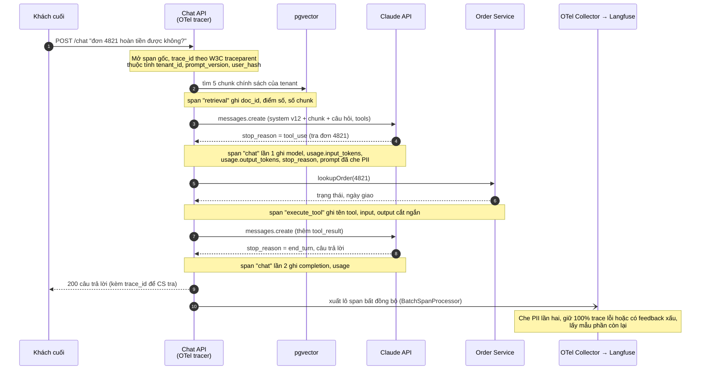

# LLM Tracing (prompt / completion / tool spans) — Chatbot trả lời sai, không biết prompt, context, tool nào gây ra

| Scope | Mức độ | Trạng thái | Pattern gốc | Cập nhật |
|---|---|---|---|---|
| 24 · backend / AI monitoring | 🟢 Cơ bản | 📋 Kế hoạch | LLM Tracing — OpenTelemetry GenAI semantic conventions | 2026-10-06 |

> **Một câu tóm tắt:** Biến mỗi lượt trả lời của chatbot thành một cây span (HTTP → truy hồi → gọi model → tool → gọi model) có ghi prompt, context, kết quả tool và `usage`, để khi khách báo "trả lời sai" ta mở đúng trace và nhìn thấy bước nào gây ra thay vì đoán.

## 1. Bài toán thực tế (What)

**Bối cảnh** *(doanh nghiệp giả định, số liệu minh họa)*
Một SaaS B2B làm helpdesk cho khoảng 300 doanh nghiệp thuê (tenant). Tính năng "trợ lý trả lời ticket" nhận câu hỏi của khách cuối, truy hồi tài liệu chính sách riêng của từng tenant (RAG), gọi `claude-opus-5-5` kèm hai tool (tra trạng thái đơn hàng, tra chính sách hoàn tiền) rồi hậu xử lý câu trả lời. Khoảng 40.000 lượt trả lời mỗi ngày. Log hiện tại chỉ có một dòng cho mỗi request: `POST /chat 200 1.8s`.

**Triệu chứng người kinh doanh nhìn thấy**
- Khách của một tenant phản ánh chatbot "nói hoàn tiền trong 7 ngày" trong khi chính sách của họ là 3 ngày; đội CS mất 2 ngày tái hiện mà vẫn không chắc nguyên nhân.
- Mỗi khiếu nại là một lần kỹ sư "đoán": do prompt phiên bản mới, do tài liệu cũ còn trong index, do tool trả dữ liệu sai, hay do model. Trung bình 3 lần deploy thử-sai cho một lỗi.
- Tỷ lệ ticket phải chuyển người (escalation) 25%, một nửa trong đó là "chatbot trả lời sai" nhưng không ai thống kê được sai kiểu gì, ở tenant nào, từ khi nào.

**Nguyên nhân kỹ thuật**
Lời gọi LLM là hộp đen trong hệ thống quan sát hiện có. Prompt cuối cùng được ghép từ nhiều nguồn (system prompt phiên bản 12, năm chunk tài liệu, lịch sử hội thoại, kết quả tool) nhưng không nguồn nào được ghi lại cùng request. Vòng lặp tool use gồm 2–4 lần gọi API nối tiếp; log phẳng không thể hiện thứ tự và quan hệ cha-con. Trường `usage` và `stop_reason` trong phản hồi bị bỏ qua, nên không phân biệt được "model dừng vì chạm `max_tokens`" với "trả lời xong" (`end_turn`). Không có `trace_id` nối lời gọi LLM với request HTTP và truy vấn PostgreSQL cùng lượt.

**Ràng buộc**
- Prompt chứa dữ liệu cá nhân của khách cuối (tên, email, mã đơn) → phải che (mask) trước khi lưu; mỗi tenant chỉ được xem trace của mình.
- Không được làm tăng độ trễ cảm nhận: xuất trace phải bất đồng bộ, theo lô.
- Chi phí lưu trữ: 40.000 trace/ngày với prompt 10–20k token → cần chính sách cắt ngắn, lấy mẫu và thời hạn lưu.
- Hệ thống đã có tracing HTTP/DB theo OpenTelemetry (scope 23) — không dựng một hệ truy vết thứ hai riêng cho AI.

## 2. Vì sao dùng pattern này (Why)

**Nguyên nhân gốc mà pattern nhắm vào:** câu trả lời của LLM là *hàm của toàn bộ ngữ cảnh* (prompt, chunk, tool result, tham số model), nhưng hệ thống chỉ lưu đầu ra cuối cùng; không tái dựng được ngữ cảnh thì không quy được lỗi về bước nào.

**Pattern giải quyết thế nào:** mỗi request là một trace; mỗi bước có ý nghĩa là một span con — span truy hồi (ghi danh sách `doc_id`/điểm số), span gọi model (ghi model, tham số, `usage`, `stop_reason`, prompt và completion đã che PII), span thực thi tool (tên tool, input, output). Thuộc tính đặt theo *Semantic conventions for generative AI* của OpenTelemetry để backend nào hiểu chuẩn này cũng vẽ được cây và tính được chi phí. `trace_id` lan truyền theo W3C Trace Context nên span LLM nằm cùng cây với span HTTP và PostgreSQL đã có từ scope 23. Khi khách báo lỗi, CS lấy `trace_id` từ mã ticket, mở Langfuse, nhìn cây span là thấy: chunk nào được đưa vào, tool trả gì, model nhận prompt nào.

**Lựa chọn khác đã cân nhắc**

| Lựa chọn | Giải quyết được gì | Vì sao không chọn (ở bài này) |
|---|---|---|
| Giữ nguyên + tối ưu nhỏ: in thêm prompt/completion ra log | Thấy được prompt khi cần | Log phẳng, không có quan hệ cha-con giữa 3–4 lần gọi API của một lượt; không nối với trace HTTP; PII lộ ra log chung; tìm theo tenant/prompt_version rất khó |
| Tự tạo bảng `llm_calls` trong PostgreSQL | Lưu được usage, model, prompt; truy vấn SQL quen tay | Lặp lại cái tracing đã làm (scope 23) bằng một hệ thứ hai; không có cây span, không có sampling/propagation; không dùng được công cụ hiển thị sẵn có |
| Dùng callback/tracer gắn sẵn của một framework LLM | Có trace nhanh, ít code | Khóa vào framework; phần ngoài LLM (HTTP, DB, tool nội bộ) vẫn nằm ngoài cây; đổi framework là mất công cụ |
| Gửi thẳng vào một APM thương mại có GenAI | Dashboard sẵn | Chi phí theo span cao với 40.000 trace/ngày; prompt khách cuối rời khỏi hạ tầng của mình; vẫn nên đi qua OTel Collector để sau này đổi backend |

## 3. Thiết kế hệ thống (How)

### 3.1 Kiến trúc trước và sau



### 3.2 Luồng chính



### 3.3 Thành phần và trách nhiệm

| Thành phần | Trách nhiệm | Quyết định thiết kế đáng chú ý |
|---|---|---|
| Interceptor HTTP + OTel SDK (NestJS) | Mở span gốc, gắn `tenant_id`, `prompt_version`, `user_hash`; lan truyền context qua async | Khởi tạo SDK trước khi import app để auto-instrumentation HTTP/pg bắt được; dùng context manager dựa trên `AsyncLocalStorage` |
| Helper `withGenAiSpan()` bọc Anthropic SDK | Mở span cho mỗi lần `messages.create`/`stream`, ghi model, tham số, `usage`, `stop_reason`, nội dung | Mỗi lần gọi API là một span riêng (không gộp cả vòng lặp tool use); với streaming, kết thúc span ở `message_stop`, không phải khi trả header |
| Chính sách ghi nội dung (`content-capture`) | Quyết định ghi prompt/completion hay chỉ metadata; che PII; cắt ngắn | Bật/tắt bằng cấu hình theo môi trường và theo tenant; cắt ở N ký tự và ghi độ dài gốc |
| Span tool | Ghi tên tool, input JSON, output cắt ngắn, lỗi | Ghi `is_error` và thời gian để tách "tool chậm" khỏi "model chậm" |
| OTel Collector | Nhận OTLP, batch, che PII lần hai, tail sampling, fan-out | Giữ 100% trace có lỗi hoặc có `stop_reason` bất thường; lấy mẫu trace thành công theo tỷ lệ |
| Langfuse (self-host) | Hiển thị cây trace, lọc theo tenant/prompt_version, nền cho bài 03/04/09 | Nhận qua OTLP endpoint để không khóa vào SDK riêng; Arize Phoenix là lựa chọn thay thế cùng cách nối |
| Prometheus + Grafana | Số lượt gọi, lỗi, độ trễ theo model/feature suy ra từ span | Không đưa `tenant_id` vào label (cardinality) — tenant tra trong Langfuse |

### 3.4 Điểm dễ sai khi triển khai
- **Nhồi cả prompt 20k token vào một attribute của span.** Exporter/backend có giới hạn kích thước, chi phí lưu trữ tăng vọt. Cách tránh: ghi nội dung qua cơ chế event/content của semconv gen_ai (bật-tắt được), cắt ngắn, lưu độ dài gốc; prompt đầy đủ chỉ giữ cho mẫu được chọn.
- **Span LLM lạc khỏi trace HTTP.** Quên lan truyền context qua `await`/queue nên span gọi model thành trace mồ côi. Kiểm tra bằng test: mọi span `chat` phải có parent là span HTTP.
- **Gộp vòng lặp tool use thành một span.** Mất khả năng thấy "lần gọi thứ 2 mới sai". Mỗi lần gọi API là một span, span tool nằm giữa.
- **Streaming kết thúc span quá sớm.** Với `client.messages.stream()`, `usage.output_tokens` chỉ đầy đủ ở sự kiện `message_delta`; đóng span sau `finalMessage()` hoặc ở `message_stop`.
- **Không ghi `stop_reason`.** Không phân biệt được `end_turn`, `max_tokens`, `tool_use`, `refusal` — bài 06 và 07 cần trường này.
- **Che PII sau khi đã xuất.** Che phải xảy ra trong tiến trình app (trước khi rời bộ nhớ) và lặp lại ở Collector như lớp phòng thủ thứ hai.
- **Head sampling 10% ngay từ app.** Trace lỗi bị bỏ ngẫu nhiên. Dùng tail sampling ở Collector dựa trên lỗi/feedback; giữ 100% khi dev.
- **Không ghi `prompt_version`.** Không so sánh được trước/sau khi đổi prompt (scope 20 bài 02 quản lý phiên bản prompt).

## 4. Tech stack và tác động (Impact techstack)

| Lớp | Công nghệ chọn | Vì sao chọn | Thay thế tương đương |
|---|---|---|---|
| Runtime / ngôn ngữ | TypeScript strict, Node 20+ | Trùng stack sản phẩm; `AsyncLocalStorage` hỗ trợ context propagation | Python + OTel Python SDK |
| HTTP | NestJS (Fastify adapter) | Interceptor đặt span gốc và metadata tenant một chỗ | Fastify thuần, Express |
| Gọi model | Anthropic SDK TypeScript, `claude-opus-5-5` | Phản hồi có `usage` (input/output/cache tokens) và `stop_reason` để ghi vào span; hỗ trợ streaming | Gateway trừu tượng hóa (scope 20 bài 01) |
| Tracing SDK | `@opentelemetry/sdk-node`, `@opentelemetry/api`, exporter OTLP/HTTP | Chuẩn mở, cùng cây với trace HTTP/DB của scope 23; thuộc tính theo semconv gen_ai | OpenInference (Phoenix) trên nền OTel |
| Pipeline | OpenTelemetry Collector (contrib) | Batch, che PII, tail sampling, fan-out nhiều backend mà không sửa app | Gửi thẳng OTLP vào Langfuse (bớt một thành phần, mất sampling/redaction tập trung) |
| Trace UI | Langfuse self-host (Docker Compose) | Cây trace, lọc theo metadata, nền cho Scores/Datasets ở bài 03, 04, 09 | Arize Phoenix; Grafana Tempo (chỉ trace, không có khái niệm generation/score) |
| Metrics | Prometheus + Grafana | Số lượt gọi, lỗi, độ trễ theo model/feature; alert | VictoriaMetrics |
| Dữ liệu | PostgreSQL 16 + pgvector | DB ứng dụng và vector store cho RAG trong bài thực hành | Qdrant cho vector |
| Test / hạ tầng | Vitest, Docker Compose | `InMemorySpanExporter` để kiểm tra cây span trong test | Jest |

**Thay đổi so với hệ thống hiện tại:** thêm Collector và Langfuse vào Docker Compose; thêm lớp helper bọc Anthropic SDK và interceptor NestJS; tool và retriever được bọc span. Đội vận hành học cách đọc cây trace trong Langfuse, cấu hình tail sampling và quy tắc che PII ở Collector; CS được quy trình "lấy `trace_id` từ ticket → mở trace".

## 5. Kết quả đầu ra và cách đo (Output impact)

| Chỉ số | Trước (minh họa) | Mục tiêu khi thực hành | Cách đo |
|---|---|---|---|
| Thời gian từ ticket "trả lời sai" đến xác định bước gây lỗi | ~2 ngày | ≤ 30 phút | Tái hiện 10 lỗi cố ý (chunk sai, tool trả sai, prompt sai) trong môi trường thực hành; đo thời gian người đọc trace tìm đúng nguyên nhân |
| Tỷ lệ lời gọi model có span `chat` nằm trong trace HTTP | 0% | 100% | Truy vấn Langfuse: số generation có parent HTTP so với tổng; test tự động với `InMemorySpanExporter` |
| Overhead độ trễ p95 do tracing | — | ≤ 5 ms | k6 chạy cùng kịch bản trước/sau khi bật SDK (exporter batch, bất đồng bộ) |
| Span chứa PII lộ | không đo | 0 | Script quét export OTLP bằng bộ regex email/số điện thoại/mã đơn trên 1.000 trace mẫu |
| Dung lượng lưu trữ cho 1.000 trace | — | ghi nhận để lập chính sách retention | Đo kích thước bảng/bucket của Langfuse sau khi nạp 1.000 trace có cắt ngắn |

> Số "trước" là minh họa để hình dung bài toán. Số "mục tiêu" chỉ được coi là đạt khi có số đo thật
> ở mục 8 kèm môi trường đo.

**Tác động nghiệp vụ mong đợi:** mỗi khiếu nại được trả lời "sai ở đâu" trong một phiên hỗ trợ thay vì vài ngày thử-sai; đội sản phẩm có dữ liệu để biết lỗi tập trung ở prompt, tài liệu hay tool — nền cho mọi bài còn lại của scope.

## 6. Đánh đổi và khi KHÔNG nên dùng

**Đánh đổi**
- Prompt của khách cuối tập trung một chỗ → tài sản nhạy cảm mới: cần phân quyền theo tenant, thời hạn lưu, che PII hai lớp.
- Thêm ba thành phần vận hành (Collector, Langfuse với ClickHouse/Redis/object storage ở bản self-host hiện tại, Prometheus) — xem docs self-hosting của Langfuse trước khi chọn.
- Semconv gen_ai còn ở trạng thái phát triển: tên thuộc tính có thể đổi giữa các phiên bản; cô lập việc đặt tên vào một module để đổi một chỗ.
- Ghi nội dung làm tăng kích thước span nhiều lần so với trace HTTP thường; phải chấp nhận sampling cho trace thành công.

**Không nên dùng khi**
- Tính năng chỉ có một lời gọi model, không RAG, không tool, lưu lượng thấp: log có cấu trúc kèm `usage` và `stop_reason` là đủ.
- Chính sách dữ liệu cấm lưu nội dung prompt: vẫn trace nhưng tắt content capture — khi đó bài này chỉ còn metadata và nên gộp với scope 23 bài 03.
- Đã có APM hỗ trợ GenAI và chấp nhận chi phí/khóa nhà cung cấp: chỉ cần ánh xạ thuộc tính theo semconv, không dựng Langfuse.

**Liên quan**
- Nền tảng tracing phân tán: `../../23-backend-monitoring-benchmark/03-distributed-tracing-otel-request-qua-6-service-cham-o-dau/`
- Correlation ID và log có cấu trúc: `../../23-backend-monitoring-benchmark/02-structured-logging-correlation-id-grep-log-6-service-tim-mot-request/`
- Quản lý phiên bản prompt để gắn vào span: `../../20-backend-ai-framework-system-design/02-prompt-as-code-prompt-nam-rai-trong-string-khong-version/`
- Bài tiếp theo dùng span này: `../02-token-cost-per-feature-tenant-hoa-don-tang-3-lan-khong-biet-vi-sao/`, `../07-latency-ttft-tokens-per-second-chat-cham-nhung-p50-binh-thuong/`

## 7. Cơ sở tham khảo

- OpenTelemetry, "Semantic conventions for generative AI systems" — https://opentelemetry.io/docs/specs/semconv/gen-ai/ — định nghĩa span cho lời gọi model và thực thi tool, thuộc tính model/usage, metric token và thời lượng; cách ghi nội dung prompt/completion có kiểm soát.
- OpenTelemetry docs, "Traces" và "JavaScript SDK" — https://opentelemetry.io/docs/ — khái niệm span/context propagation, `BatchSpanProcessor`, Collector và các processor (batch, tail sampling, redaction).
- W3C, *Trace Context* — https://www.w3.org/TR/trace-context/ — header `traceparent` nối span LLM với span HTTP/DB cùng lượt.
- Langfuse docs — https://langfuse.com/docs — mô hình trace/observation, nhận trace qua OpenTelemetry, self-hosting; nền cho Scores/Datasets ở các bài sau.
- Arize Phoenix docs — https://docs.arize.com/phoenix — backend thay thế, cùng nhận OTLP (quy ước OpenInference).
- Anthropic docs, Messages API (`usage`, `stop_reason`) và "Streaming" — https://platform.claude.com/docs/en/ — các trường cần ghi vào span và thời điểm có đủ `usage` khi stream.
- Sigelman et al., "Dapper, a Large-Scale Distributed Systems Tracing Infrastructure", Google, 2010 — nguồn gốc mô hình trace/span và lý do phải lấy mẫu.
- Cindy Sridharan, *Distributed Systems Observability*, O'Reilly, 2018 — vị trí của trace so với log và metric; khi nào cần cái nào.

## 8. Kế hoạch thực hành

- [ ] Bước 1: dựng `docker-compose.yml` (PostgreSQL + pgvector, OTel Collector, Langfuse self-host, Prometheus, Grafana); viết chatbot NestJS tối giản có RAG và hai tool, chưa tracing; tiêm ba lỗi cố ý (chunk lỗi thời, tool trả sai, prompt thiếu điều kiện) để tái hiện triệu chứng.
- [ ] Bước 2: đo "trước": cho một người chưa biết lỗi dùng log hiện có để tìm nguyên nhân 10 ca; ghi thời gian; chạy k6 lấy p95 độ trễ nền.
- [ ] Bước 3: áp dụng pattern: khởi tạo OTel SDK, interceptor span gốc, helper `withGenAiSpan()` bọc Anthropic SDK (cả `create` và `stream`), span tool/retrieval, che PII, cấu hình Collector (batch, redaction, tail sampling) xuất sang Langfuse và Prometheus.
- [ ] Bước 4: đo "sau": lặp lại 10 ca với Langfuse; k6 lại để lấy overhead; quét PII trên export; ghi số đo và môi trường vào mục 5.
- [ ] Bước 5: test Vitest với `InMemorySpanExporter`: mọi span `chat` có parent HTTP, mỗi lần gọi API một span, span tool có `is_error` khi tool lỗi, nội dung được che và cắt ngắn, span streaming đóng sau `message_stop`.

**Cấu trúc code dự kiến**
```text
src/
  main.ts                     # khởi tạo OTel SDK trước khi import AppModule
  tracing/otel.ts             # NodeSDK, resource, exporter OTLP, BatchSpanProcessor
  tracing/gen-ai-span.ts      # withGenAiSpan(): mở span chat/execute_tool, ghi thuộc tính gen_ai
  tracing/content-capture.ts  # che PII, cắt ngắn, bật/tắt theo môi trường và tenant
  tracing/trace.interceptor.ts# span gốc HTTP + tenant_id, prompt_version, user_hash
  chat/chat.service.ts        # vòng lặp tool use với Anthropic SDK (create và stream)
  chat/tools/order-lookup.tool.ts
  chat/tools/refund-policy.tool.ts
  rag/retriever.ts            # truy hồi pgvector, span retrieval
test/
  gen-ai-span.test.ts         # cây span, thuộc tính, một span mỗi lần gọi API
  content-capture.test.ts     # PII bị che, độ dài cắt ngắn
  streaming-span.test.ts      # span đóng sau message_stop, usage đầy đủ
docker-compose.yml            # postgres (pgvector), otel-collector, langfuse (+ phụ thuộc), prometheus, grafana
otel-collector.yaml           # receivers otlp, processors batch/redaction/tail_sampling, exporters
.env.example                  # ANTHROPIC_API_KEY, LANGFUSE_*, OTEL_EXPORTER_OTLP_ENDPOINT
```

**Cách chạy** *(điền khi bắt đầu code)*
```bash
docker compose up -d
pnpm install && pnpm test
# chạy chatbot và mở Langfuse tại http://localhost:3000 để xem cây trace
```
