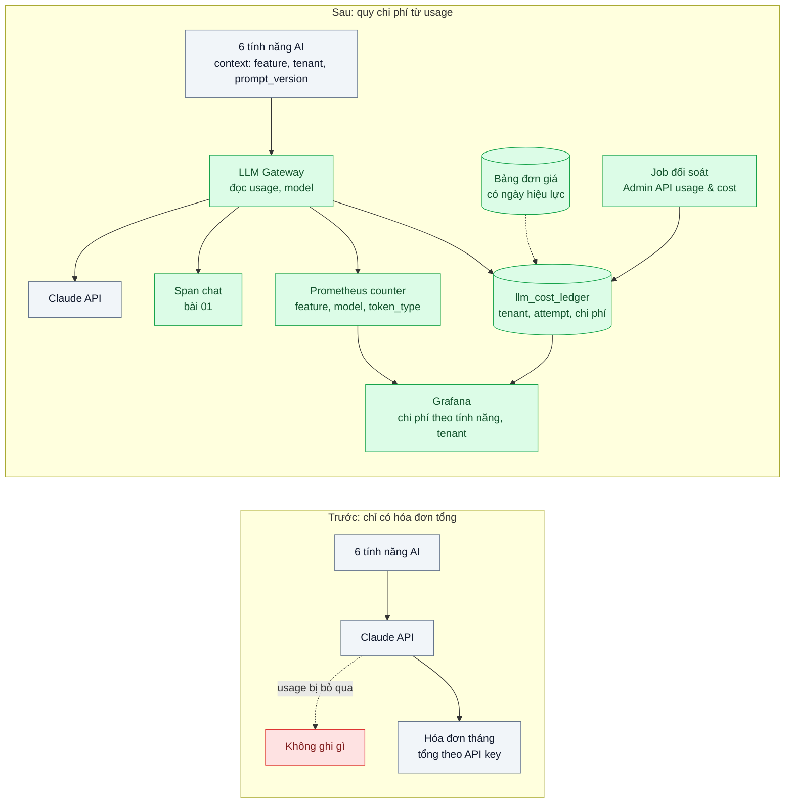
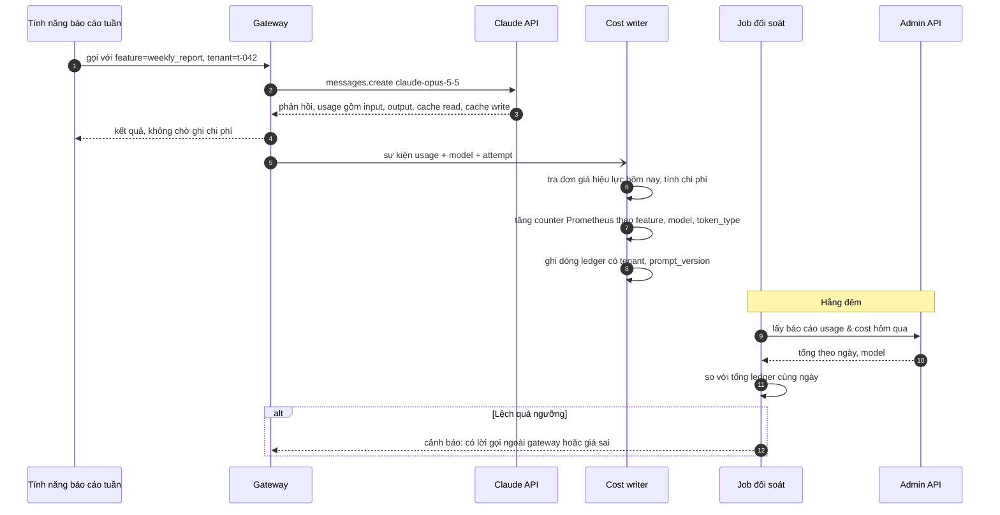

# Token & Cost Attribution — Hóa đơn tăng 3 lần, không biết tính năng nào hay tenant nào gây ra

| Scope | Mức độ | Trạng thái | Pattern gốc | Cập nhật |
|---|---|---|---|---|
| 24 · backend / AI monitoring | 🟢 Cơ bản | 📋 Kế hoạch | Cost attribution — Anthropic docs (`usage` trong response; Admin API usage & cost); OpenTelemetry GenAI metrics | 2026-10-06 |

> **Một câu tóm tắt:** Ghi `usage` của mọi lời gọi model kèm nhãn tính năng, tenant, model và phiên bản prompt; quy ra tiền bằng bảng đơn giá có ngày hiệu lực; tổng hợp theo tính năng trong Prometheus và theo tenant trong sổ chi phí (ledger), rồi đối soát hằng ngày với báo cáo usage & cost của Admin API — để câu hỏi "vì sao hóa đơn tăng" có câu trả lời trong vài phút.

## 1. Bài toán thực tế (What)

**Bối cảnh** *(doanh nghiệp giả định, số liệu minh họa)*
Một SaaS B2B làm helpdesk cho khoảng 300 tenant có 6 tính năng AI: trợ lý trả lời ticket, tóm tắt hội thoại, gợi ý macro, phân loại ticket, dịch, và báo cáo tuần. Đã có tracing theo bài 01. Tất cả dùng chung một tổ chức Anthropic; gói dịch vụ bán cho tenant theo số ghế, không theo lượng dùng AI.

**Triệu chứng người kinh doanh nhìn thấy**
- Hóa đơn AI tháng này gấp ba tháng trước; biên lợi nhuận gói Pro âm.
- Ba giả thuyết cùng lúc mà không ai kiểm chứng được: một tenant lớn mới ký, tính năng báo cáo tuần mới ra mắt, hay prompt mới dài hơn.
- Đội kinh doanh muốn thêm hạn mức AI theo gói nhưng không biết tenant trung bình tốn bao nhiêu.

**Nguyên nhân kỹ thuật**
Phản hồi của API có trường `usage` (`input_tokens`, `output_tokens`, `cache_creation_input_tokens`, `cache_read_input_tokens`) nhưng ứng dụng bỏ qua. Console của nhà cung cấp cho thấy tổng theo ngày và theo API key, không biết tính năng hay tenant. Không có bảng đơn giá trong hệ thống, nên kể cả có token cũng không quy ra tiền, nhất là khi token cache có giá khác token thường và có lời gọi retry/fallback sang model khác.

**Ràng buộc**
- Không thêm độ trễ vào request: ghi nhận phải bất đồng bộ.
- Prometheus không chịu được nhãn có cardinality cao như `tenant_id` × `prompt_version`.
- Số liệu nội bộ phải khớp hóa đơn trong sai số nhỏ để tài chính tin dùng.

## 2. Vì sao dùng pattern này (Why)

**Nguyên nhân gốc mà pattern nhắm vào:** chi phí được đo ở mức tổ chức/API key trong khi quyết định kinh doanh cần ở mức tính năng và tenant.

**Pattern giải quyết thế nào:**
1. **Gắn ngữ cảnh tại điểm gọi**: gateway (scope 20 bài 01) nhận `feature`, `tenant_id`, `prompt_version` từ request context; sau mỗi lời gọi đọc `usage` và `model` từ phản hồi.
2. **Hai đường lưu**: (a) thuộc tính trên span `chat` của bài 01 và counter Prometheus chỉ với nhãn cardinality thấp (`feature`, `model`, `token_type`); (b) một dòng vào bảng `llm_cost_ledger` trong PostgreSQL với đầy đủ tenant, prompt_version, attempt (để thấy chi phí retry/fallback).
3. **Bảng đơn giá có hiệu lực theo ngày**: mỗi model × loại token (vào, ra, ghi cache, đọc cache) một đơn giá; chi phí tính lúc ghi và có thể tính lại khi giá đổi.
4. **Đối soát hằng ngày**: job gọi báo cáo usage & cost của Admin API, so tổng ledger với số nhà cung cấp; lệch quá ngưỡng thì cảnh báo (có lời gọi không đi qua gateway hoặc bảng giá sai).
5. **Đơn vị kinh doanh**: chi phí trên mỗi ticket được giải quyết, mỗi tenant mỗi tháng — số mà đội kinh doanh dùng để định giá.

**Lựa chọn khác đã cân nhắc**

| Lựa chọn | Giải quyết được gì | Vì sao không chọn (ở bài này) |
|---|---|---|
| Giữ nguyên + tối ưu nhỏ: xem báo cáo trong Console theo ngày | Có tổng chi phí chính xác | Không biết tính năng, tenant; phát hiện chậm |
| Mỗi tính năng một API key/workspace riêng | Quy được theo tính năng từ phía nhà cung cấp | Không quy được theo tenant; vẫn hữu ích như lớp đối soát bổ sung |
| Ước lượng token từ độ dài văn bản | Không cần sửa gateway | Sai số lớn, bỏ sót token cache và token tool, không khớp hóa đơn |
| Đưa `tenant_id` làm nhãn Prometheus | Một chỗ cho mọi thứ | Bùng nổ cardinality, Prometheus chậm và tốn bộ nhớ |

## 3. Thiết kế hệ thống (How)

### 3.1 Kiến trúc trước và sau



### 3.2 Luồng chính



### 3.3 Thành phần và trách nhiệm

| Thành phần | Trách nhiệm | Quyết định thiết kế đáng chú ý |
|---|---|---|
| Request context | Mang `feature`, `tenant_id`, `prompt_version` tới gateway | `AsyncLocalStorage` trong NestJS; lời gọi thiếu `feature` bị từ chối ở môi trường dev để không có chi phí "vô chủ" |
| Cost writer | Tính chi phí từ `usage`, ghi counter và ledger | Bất đồng bộ qua hàng đợi nội bộ; ghi cả `attempt` và cờ fallback |
| Bảng đơn giá | Đơn giá theo model × loại token, có ngày hiệu lực | Cập nhật khi trang Pricing đổi; lưu cả giá cũ để tính lại lịch sử |
| Prometheus counter | Token và chi phí theo tính năng, model, loại token | Không có `tenant_id`; semconv gen_ai của OpenTelemetry có metric token usage để tham khảo cách đặt tên |
| Ledger PostgreSQL | Chi phí chi tiết theo tenant, prompt_version | Partition theo tháng; truy vấn top tenant/top tính năng |
| Job đối soát | So ledger với Admin API usage & cost | Báo cáo usage & cost gọi bằng HTTP với Admin API key, không có trong SDK |

### 3.4 Điểm dễ sai khi triển khai
- **Tính mọi token đầu vào cùng một giá.** Token ghi cache và đọc cache có đơn giá khác; bỏ qua làm số lệch hóa đơn.
- **Chỉ ghi lần gọi thành công.** Retry và fallback cũng tốn tiền; ghi mọi `attempt`.
- **Quên token của tool và phần thinking.** Định nghĩa tool và token suy luận đều nằm trong `usage`; dùng số của phản hồi, không tự ước lượng.
- **Bỏ qua lời gọi streaming.** Với stream, `usage` đầy đủ chỉ có ở cuối luồng; ghi sau khi stream kết thúc.

## 4. Tech stack và tác động (Impact techstack)

| Lớp | Công nghệ chọn | Vì sao chọn | Thay thế tương đương |
|---|---|---|---|
| Gọi model | `@anthropic-ai/sdk`, `claude-opus-5-5`; `claude-sonnet-5-5`, `claude-haiku-4-5` cho một số tính năng | Trường `usage` trong mọi phản hồi, kể cả stream | Gateway LiteLLM (scope 21 bài 02) cũng ghi chi phí |
| Ứng dụng | TypeScript strict, Node 20+, NestJS | Interceptor gắn context một chỗ | Fastify |
| Metric | Prometheus + Grafana | Counter theo tính năng/model, alert tăng đột biến | OpenTelemetry metrics qua Collector |
| Ledger | PostgreSQL 16 (partition theo tháng) | Truy vấn theo tenant, nối với dữ liệu gói dịch vụ | ClickHouse khi khối lượng rất lớn |
| Đối soát | Script TypeScript gọi Admin API usage & cost bằng HTTP | Nguồn sự thật từ nhà cung cấp | Xuất báo cáo thủ công |

Giá tại thời điểm viết (kiểm tra lại trang Pricing): `claude-opus-5-5` $4/$20 mỗi triệu token vào/ra; `claude-sonnet-5-5` $2/$10; `claude-haiku-4-5` $1/$5. Đơn giá token cache theo trang Pricing.

**Thay đổi so với hệ thống hiện tại:** gateway bắt buộc context `feature`/`tenant`; thêm cost writer, bảng đơn giá, ledger, job đối soát, dashboard. Tài chính và kinh doanh có báo cáo chi phí theo tính năng/tenant hằng ngày.

## 5. Kết quả đầu ra và cách đo (Output impact)

| Chỉ số | Trước (minh họa) | Mục tiêu khi thực hành | Cách đo |
|---|---|---|---|
| Tỷ lệ chi phí quy được về tính năng và tenant | 0% | ≥ 98% | Tổng ledger / tổng báo cáo Admin API usage & cost cùng ngày |
| Sai lệch ledger so với nhà cung cấp | không đo | dưới 2% | Job đối soát ghi chênh lệch theo ngày |
| Thời gian trả lời "vì sao chi phí tăng" | vài ngày | dưới 15 phút | Kịch bản: bơm tải giả lập cho một tenant và một tính năng, đo thời gian tìm ra bằng dashboard |
| Số chuỗi metric Prometheus cho phần chi phí | — | dưới 500 | PromQL `count({__name__=~"llm_.*"})` |
| Overhead độ trễ do ghi chi phí | — | không đo được khác biệt | k6 trước/sau khi bật cost writer |

> Số "trước" là minh họa để hình dung bài toán. Số "mục tiêu" chỉ được coi là đạt khi có số đo thật
> ở mục 8 kèm môi trường đo.

**Tác động nghiệp vụ mong đợi:** đội kinh doanh định giá gói và đặt hạn mức AI dựa trên chi phí thật theo tenant; đội kỹ thuật thấy ngay tính năng hay prompt nào làm chi phí tăng.

## 6. Đánh đổi và khi KHÔNG nên dùng

**Đánh đổi**
- Ledger tăng nhanh (một dòng mỗi lời gọi); cần partition và chính sách lưu trữ.
- Bảng đơn giá là dữ liệu phải có người chịu trách nhiệm cập nhật.

**Không nên dùng khi**
- Một tính năng, không có khái niệm tenant: báo cáo usage & cost của Admin API theo API key là đủ.
- Lưu lượng rất thấp: chi phí AI nhỏ hơn công sức dựng ledger.

**Liên quan**
- [LLM Tracing](../01-llm-tracing-chatbot-tra-loi-sai-khong-biet-prompt-nao/) — span `chat` mang `usage`.
- [LLM Gateway (scope 21)](../../21-backend-ai-infrastructure/02-llm-gateway-5-team-chung-mot-api-key-khong-biet-ai-ton-tien/) — quy chi phí theo team ở tầng hạ tầng.
- [Prompt Caching (scope 22)](../../22-backend-ai-optimizer/01-prompt-caching-system-prompt-20k-token-tra-tien-moi-request/) và [Model Routing / Cascade (scope 22)](../../22-backend-ai-optimizer/03-model-routing-cascade-80-phan-tram-cau-don-gian-vao-model-dat/) — tối ưu dựa trên số đo ở đây.

## 7. Cơ sở tham khảo

- Anthropic docs, Messages API — https://platform.claude.com/docs/en/ — trường `usage` (`input_tokens`, `output_tokens`, `cache_creation_input_tokens`, `cache_read_input_tokens`) trong mọi phản hồi.
- Anthropic docs, "Admin API" — https://platform.claude.com/docs/en/api/admin — báo cáo usage & cost theo tổ chức để đối soát.
- Anthropic docs, "Pricing" và "Prompt caching" — https://platform.claude.com/docs/en/about-claude/pricing — đơn giá theo model và loại token.
- OpenTelemetry, "Semantic conventions for generative AI systems" — https://opentelemetry.io/docs/specs/semconv/gen-ai/ — metric token usage và thuộc tính model để đặt tên nhất quán.
- Prometheus docs, "Metric and label naming" — https://prometheus.io/docs/practices/naming/ — tránh nhãn cardinality cao.

## 8. Kế hoạch thực hành

- [ ] Bước 1: dựng 6 "tính năng" giả lập gọi máy chủ giả lập Anthropic trả `usage` có đủ loại token; seed 300 tenant với phân phối dùng lệch (vài tenant lớn).
- [ ] Bước 2: đo "trước": chỉ có tổng từ máy chủ giả lập; thử trả lời "tenant nào gây tăng" khi bơm tải bất thường.
- [ ] Bước 3: áp dụng pattern: context bắt buộc, cost writer, bảng đơn giá, counter Prometheus, ledger, job đối soát, dashboard.
- [ ] Bước 4: đo "sau": tỷ lệ quy chi phí, sai lệch, thời gian tìm nguyên nhân, cardinality; ghi vào mục 5.
- [ ] Bước 5: test Vitest: (a) chi phí tính đúng cho từng loại token, (b) retry/fallback được ghi với `attempt`, (c) stream ghi `usage` sau khi kết thúc, (d) đổi đơn giá có ngày hiệu lực không làm sai số lịch sử.

**Cấu trúc code dự kiến**
```text
src/
  cost/request-context.ts      # feature, tenant_id, prompt_version qua AsyncLocalStorage
  cost/cost-writer.ts          # usage → chi phí → counter + ledger
  cost/price-table.ts          # đơn giá có ngày hiệu lực
  cost/reconcile-job.ts        # so ledger với Admin API usage & cost
  llm/gateway.ts               # đọc usage sau mỗi lời gọi (create và stream)
test/
  cost-writer.test.ts
tools/fake-anthropic-server.ts
docker-compose.yml             # postgres, prometheus, grafana
```

**Cách chạy** *(điền khi bắt đầu code)*
```bash
docker compose up -d
pnpm install && pnpm test
```
