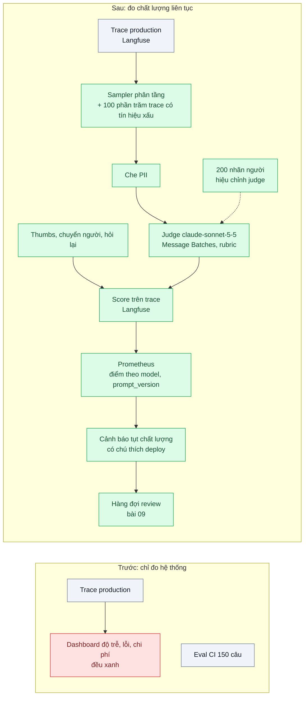
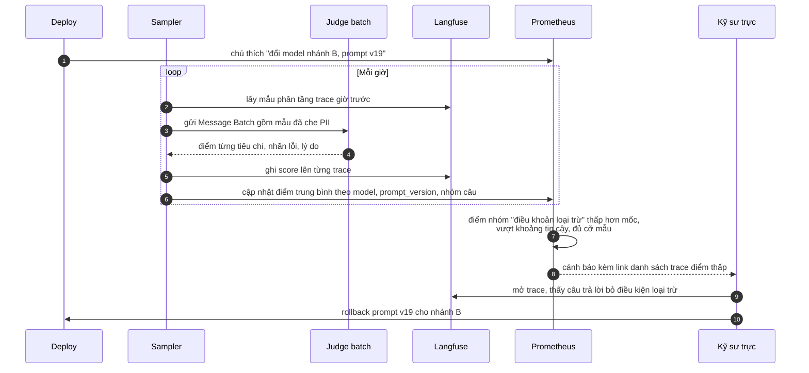

# Online Quality Monitoring (sampled LLM-as-judge + user feedback) — Chất lượng tụt dần sau khi đổi model, 2 tuần sau mới biết

| Scope | Mức độ | Trạng thái | Pattern gốc | Cập nhật |
|---|---|---|---|---|
| 24 · backend / AI monitoring | 🟡 Trung bình | 📋 Kế hoạch | LLM-as-a-Judge — Zheng et al. (NeurIPS 2023); Evals — Hamel Husain (2024); Collect user feedback — Eugene Yan (2023) | 2026-10-06 |

> **Một câu tóm tắt:** Lấy mẫu có phân tầng một phần trace production, cho model judge chấm theo rubric đã hiệu chỉnh với nhãn người, kết hợp tín hiệu từ người dùng (thumbs, chuyển người, hỏi lại), đẩy điểm thành metric theo model và phiên bản prompt — để chất lượng tụt sau một lần đổi model được phát hiện trong vài giờ chứ không phải hai tuần.

## 1. Bài toán thực tế (What)

**Bối cảnh** *(doanh nghiệp giả định, số liệu minh họa)*
Một công ty bảo hiểm có trợ lý trả lời câu hỏi về quyền lợi hợp đồng cho khách (khoảng 15.000 lượt/ngày), dùng RAG trên điều khoản hợp đồng. Đã có tracing (bài 01) và eval trong CI trên 150 câu (scope 20 bài 06). Để giảm chi phí, team chuyển một nhánh câu hỏi sang model rẻ hơn và rút gọn prompt; eval CI vẫn qua.

**Triệu chứng người kinh doanh nhìn thấy**
- Hai tuần sau, CSKH báo khiếu nại "trợ lý nói sai mức chi trả" tăng; khi điều tra mới thấy liên quan tới lần đổi model.
- Trong hai tuần đó không có dashboard nào đổi màu: độ trễ, tỷ lệ lỗi, chi phí đều "đẹp hơn".
- Tỷ lệ khách bấm 👎 thấp (dưới 1% số lượt) nên không ai coi là tín hiệu.

**Nguyên nhân kỹ thuật**
Giám sát hiện có chỉ đo *hệ thống* (độ trễ, lỗi, chi phí), không đo *chất lượng câu trả lời*. Eval CI dùng bộ câu cố định không phủ phân phối câu hỏi thật, nên thay đổi làm tụt chất lượng ở nhóm câu "điều khoản loại trừ" không bị bắt. Phản hồi người dùng thưa và lệch (người bực mới bấm). Không có điểm chất lượng gắn với `model` và `prompt_version` để so trước/sau một thay đổi.

**Ràng buộc**
- Chấm 100% lượt bằng model judge quá đắt; cần lấy mẫu mà vẫn đủ thống kê.
- Nội dung có dữ liệu khách: judge chạy trên dữ liệu đã che PII, trong cùng ranh giới dữ liệu với hệ thống chính.
- Cảnh báo phải ít báo động giả, nếu không sẽ bị tắt như mọi alert ồn ào khác.

## 2. Vì sao dùng pattern này (Why)

**Nguyên nhân gốc mà pattern nhắm vào:** chất lượng là thuộc tính quan trọng nhất của tính năng LLM nhưng là thứ duy nhất không được đo liên tục trong production.

**Pattern giải quyết thế nào:**
1. **Lấy mẫu phân tầng**: chọn N% trace mỗi giờ theo tính năng, nhóm câu hỏi, model, `prompt_version` (để nhóm nhỏ vẫn đủ mẫu), cộng 100% trace có 👎, có chuyển người, hoặc `stop_reason` bất thường.
2. **Judge theo rubric**: `claude-sonnet-5-5` chấm từng câu trả lời với tiêu chí cụ thể (đúng điều khoản trong ngữ cảnh truy hồi, không bịa con số, trả lời đúng câu hỏi, có hướng dẫn tiếp), trả kết quả có cấu trúc qua `output_config.format`: điểm từng tiêu chí, nhãn lỗi, lý do ngắn. Chạy qua Message Batches vì không cần ngay.
3. **Hiệu chỉnh judge**: 200 mẫu được chuyên viên gán nhãn; đo mức đồng ý judge–người trước khi tin điểm; tránh các thiên lệch đã biết của judge (ưu ái câu dài, ưu ái câu trả lời của chính model cùng họ, thứ tự khi so cặp).
4. **Tín hiệu người dùng**: thumbs, tỷ lệ chuyển người, tỷ lệ hỏi lại cùng ý trong 2 phút — ghi thành score trên trace.
5. **Metric và cảnh báo**: điểm trung bình theo `model` × `prompt_version` × nhóm câu vào Prometheus; cảnh báo khi điểm cửa sổ hiện tại thấp hơn mốc trước thay đổi vượt khoảng tin cậy với cỡ mẫu tối thiểu; mỗi lần deploy prompt/model là một "chú thích" trên dashboard.

**Lựa chọn khác đã cân nhắc**

| Lựa chọn | Giải quyết được gì | Vì sao không chọn (ở bài này) |
|---|---|---|
| Giữ nguyên + tối ưu nhỏ: chỉ theo dõi tỷ lệ 👎 | Rẻ, không thêm hạ tầng | Thưa, lệch, chậm; không biết lỗi kiểu gì |
| Review tay ngẫu nhiên 50 lượt mỗi tuần | Nhãn chất lượng cao | Quá ít mẫu, phát hiện chậm cả tuần; vẫn dùng để hiệu chỉnh judge |
| Chấm 100% lượt bằng judge | Đầy đủ nhất | Chi phí judge có thể ngang chi phí tính năng; không cần để phát hiện xu hướng |
| Chỉ dựa vào eval CI | Chặn lỗi trước khi deploy | Không phủ phân phối thật và không thấy trôi theo thời gian |

## 3. Thiết kế hệ thống (How)

### 3.1 Kiến trúc trước và sau



### 3.2 Luồng chính



### 3.3 Thành phần và trách nhiệm

| Thành phần | Trách nhiệm | Quyết định thiết kế đáng chú ý |
|---|---|---|
| Sampler | Chọn mẫu theo tầng và theo tín hiệu xấu | Tỷ lệ mẫu theo tầng để nhóm nhỏ đủ mẫu; trọng số khi tính trung bình toàn cục |
| Rubric | Tiêu chí chấm cụ thể theo nghiệp vụ bảo hiểm | Viết cùng chuyên viên; mỗi tiêu chí có ví dụ đạt/không đạt; có phiên bản |
| Judge | Chấm bằng `claude-sonnet-5-5`, đầu ra có cấu trúc | Judge khác model đang chấm khi có thể; chấm từng câu (pointwise) thay vì so cặp để tránh thiên lệch vị trí |
| Hiệu chỉnh | Đo đồng ý judge–người, cập nhật rubric | Chạy lại mỗi khi đổi rubric hoặc model judge |
| Score trong Langfuse | Gắn điểm và nhãn lỗi vào trace | Điều tra từ dashboard xuống từng trace |
| Cảnh báo | So cửa sổ hiện tại với mốc trước thay đổi | Cỡ mẫu tối thiểu, khoảng tin cậy; tránh báo động vì vài mẫu |

### 3.4 Điểm dễ sai khi triển khai
- **Tin điểm judge khi chưa hiệu chỉnh.** Judge có thể chấm "đẹp" mọi thứ; đo đồng ý với người trước.
- **Rubric chung chung ("câu trả lời có hữu ích không").** Không bắt được lỗi nghiệp vụ; tiêu chí phải gắn với điều khoản và con số.
- **Lấy mẫu đều toàn bộ.** Nhóm câu hiếm nhưng rủi ro cao (điều khoản loại trừ) không đủ mẫu để thấy tụt; phân tầng.
- **Không gắn `prompt_version` và `model` vào trace.** Không so được trước/sau thay đổi.
- **Alert theo ngưỡng tuyệt đối.** Điểm dao động tự nhiên giữa các giờ; dùng so sánh với mốc và cỡ mẫu tối thiểu.

## 4. Tech stack và tác động (Impact techstack)

| Lớp | Công nghệ chọn | Vì sao chọn | Thay thế tương đương |
|---|---|---|---|
| Trace + score | Langfuse self-host (Scores) | Gắn điểm vào trace, lọc theo metadata | Arize Phoenix (evals) |
| Judge | `claude-sonnet-5-5` + `output_config.format`, qua Message Batches | Chấm có cấu trúc, chi phí thấp hơn gọi thường | `claude-haiku-4-5` cho tiêu chí đơn giản; `claude-opus-5-5` cho tiêu chí khó |
| Điều phối | Job TypeScript chạy theo giờ (BullMQ repeatable) | Đơn giản, đủ cho lấy mẫu định kỳ | Temporal schedule |
| Metric / cảnh báo | Prometheus + Grafana (annotation deploy) | Cảnh báo cùng hệ thống với metric khác | OpenTelemetry metrics |
| Hiệu chỉnh | Notebook/script tính mức đồng ý trên 200 nhãn | Lặp lại được khi đổi rubric | Annotation trong Langfuse |

Giá tại thời điểm viết (kiểm tra lại trang Pricing): `claude-opus-5-5` $4/$20 mỗi triệu token vào/ra; `claude-sonnet-5-5` $2/$10; `claude-haiku-4-5` $1/$5.

**Thay đổi so với hệ thống hiện tại:** thêm sampler, judge batch, score vào Langfuse, metric chất lượng và cảnh báo; quy trình deploy gắn chú thích. Chuyên viên nghiệp vụ tham gia viết rubric và gán nhãn hiệu chỉnh định kỳ.

## 5. Kết quả đầu ra và cách đo (Output impact)

| Chỉ số | Trước (minh họa) | Mục tiêu khi thực hành | Cách đo |
|---|---|---|---|
| Thời gian từ thay đổi gây tụt chất lượng tới cảnh báo | ~2 tuần | dưới 6 giờ | Tái hiện: deploy cố ý prompt bỏ điều kiện loại trừ trên luồng replay, đo tới lúc alert |
| Mức đồng ý judge–người | chưa đo | ≥ 85% trên tiêu chí chính | 200 mẫu gán nhãn bởi chuyên viên, tính tỷ lệ đồng ý và Cohen's kappa |
| Chi phí judge mỗi ngày | — | dưới 5% chi phí tính năng | Tổng `usage` của batch judge × đơn giá, so ledger bài 02 |
| Báo động giả mỗi tuần | — | ≤ 1 | Chạy cảnh báo trên một tuần replay không có thay đổi |
| Tỷ lệ trace được chấm | 0% | 5% mẫu + 100% trace có tín hiệu xấu | Truy vấn số trace có score trong Langfuse |

> Số "trước" là minh họa để hình dung bài toán. Số "mục tiêu" chỉ được coi là đạt khi có số đo thật
> ở mục 8 kèm môi trường đo.

**Tác động nghiệp vụ mong đợi:** thay đổi để tiết kiệm chi phí không còn âm thầm làm khách nhận thông tin sai về quyền lợi; đội sản phẩm dám tối ưu vì có lưới an toàn đo được.

## 6. Đánh đổi và khi KHÔNG nên dùng

**Đánh đổi**
- Judge là một model khác có thể sai; điểm judge là ước lượng, cần hiệu chỉnh định kỳ.
- Lấy mẫu nghĩa là lỗi hiếm có thể lọt; bù bằng 100% trace có tín hiệu xấu.

**Không nên dùng khi**
- Đầu ra kiểm được bằng quy tắc (JSON đúng schema, phân loại có nhãn thật về sau): đo trực tiếp bằng quy tắc hoặc nhãn thật, không cần judge.
- Lưu lượng quá thấp để có ý nghĩa thống kê: review tay toàn bộ.

**Liên quan**
- [Eval Pipeline & LLM-as-Judge (scope 20)](../../20-backend-ai-framework-system-design/06-llm-as-judge-eval-pipeline-trong-ci-sua-prompt-khong-biet-tot-hon-hay-te-hon/) — cùng judge, chạy trước deploy.
- [LLM Tracing](../01-llm-tracing-chatbot-tra-loi-sai-khong-biet-prompt-nao/) — nguồn trace.
- [Golden Dataset from Production Traces](../04-golden-dataset-tu-production-regression-test-prompt/) và [Feedback Loop](../09-feedback-loop-thumbs-down-thanh-eval-case/) — trace điểm thấp thành test case.
- [Input Drift Detection](../08-drift-detection-phan-phoi-cau-hoi-doi-sau-chien-dich-marketing/) — khi phân phối câu hỏi đổi.

## 7. Cơ sở tham khảo

- Zheng et al., "Judging LLM-as-a-Judge with MT-Bench and Chatbot Arena", NeurIPS 2023 — dùng LLM làm người chấm, thiên lệch vị trí/độ dài/tự ưu ái và cách giảm.
- Hamel Husain, "Your AI Product Needs Evals" (2024) — https://hamel.dev/blog/posts/evals/ — đánh giá nhiều tầng, hiệu chỉnh judge với người, xem dữ liệu thật.
- Eugene Yan, "Patterns for Building LLM-based Systems & Products" (2023) — https://eugeneyan.com/writing/llm-patterns/ — evals và thu thập phản hồi người dùng (tường minh và ngầm).
- Langfuse docs, "Scores" — https://langfuse.com/docs — gắn điểm judge và phản hồi vào trace.
- Anthropic docs, "Structured outputs" và "Batch processing" — https://platform.claude.com/docs/en/build-with-claude/structured-outputs — đầu ra judge có cấu trúc, chạy judge theo lô.
- Google, *The Site Reliability Workbook* (2018), ch.5 "Alerting on SLOs" — https://sre.google/workbook/table-of-contents/ — thiết kế cảnh báo ít báo động giả.

## 8. Kế hoạch thực hành

- [ ] Bước 1: dựng trợ lý RAG giả lập trên điều khoản mẫu; tạo luồng replay 20.000 câu hỏi có phân phối nhóm; viết rubric và gán nhãn 200 mẫu.
- [ ] Bước 2: đo "trước": deploy cố ý prompt kém, xác nhận dashboard hiện có không phát hiện.
- [ ] Bước 3: áp dụng pattern: sampler phân tầng, che PII, judge qua Message Batches, score vào Langfuse, metric và cảnh báo có chú thích deploy; hiệu chỉnh judge.
- [ ] Bước 4: đo "sau": thời gian phát hiện, đồng ý judge–người, chi phí judge, báo động giả; ghi vào mục 5.
- [ ] Bước 5: test Vitest: (a) sampler luôn chọn 100% trace có 👎, (b) nhóm nhỏ đạt cỡ mẫu tối thiểu, (c) đầu ra judge parse đúng schema, (d) cảnh báo không kích hoạt khi dưới cỡ mẫu tối thiểu.

**Cấu trúc code dự kiến**
```text
src/
  quality/sampler.ts           # phân tầng + tín hiệu xấu
  quality/rubric.ts            # tiêu chí có phiên bản
  quality/judge-batch.ts       # Message Batches, output_config.format
  quality/drop-detector.ts     # so mốc, khoảng tin cậy, cỡ mẫu tối thiểu
eval/calibration/              # 200 nhãn người, script tính đồng ý
test/
  sampler.test.ts
  drop-detector.test.ts
docker-compose.yml             # langfuse, redis, prometheus, grafana
```

**Cách chạy** *(điền khi bắt đầu code)*
```bash
docker compose up -d
pnpm install && pnpm test
```
