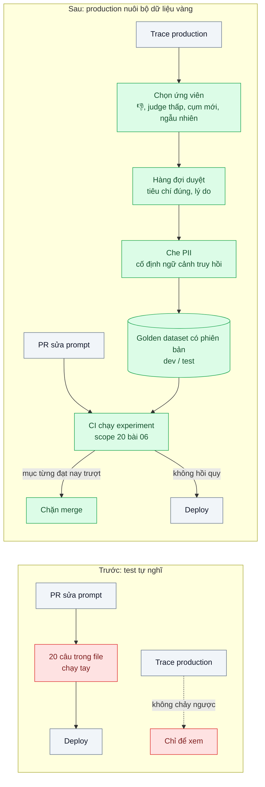
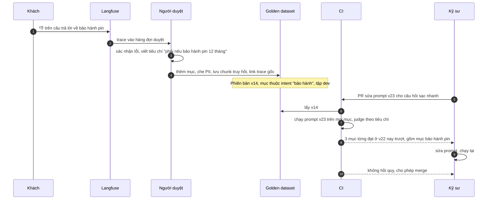

# Golden Dataset from Production Traces — Mỗi lần sửa prompt không có bộ test hồi quy

| Scope | Mức độ | Trạng thái | Pattern gốc | Cập nhật |
|---|---|---|---|---|
| 24 · backend / AI monitoring | 🟡 Trung bình | 📋 Kế hoạch | Evals & error analysis — Hamel Husain, "Your AI Product Needs Evals" (2024); Langfuse docs "Datasets" | 2026-10-06 |

> **Một câu tóm tắt:** Biến trace production đáng chú ý (bị chê, điểm judge thấp, thuộc nhóm câu hiếm) thành các mục trong một bộ dữ liệu vàng có phiên bản — đã che PII, có tiêu chí đúng do người duyệt — và chạy bộ đó mỗi khi sửa prompt, để lỗi đã sửa không quay lại và lỗi mới không lọt ra khách.

## 1. Bài toán thực tế (What)

**Bối cảnh** *(doanh nghiệp giả định, số liệu minh họa)*
Một sàn thương mại điện tử đồ điện tử có trợ lý tư vấn sản phẩm (so sánh cấu hình, tương thích phụ kiện, chính sách bảo hành), khoảng 30.000 lượt/ngày. Prompt được sửa trung bình hai lần mỗi tuần. "Bộ test" hiện tại là 20 câu do kỹ sư tự nghĩ trong một file, chạy tay trước khi deploy.

**Triệu chứng người kinh doanh nhìn thấy**
- Sửa lỗi "tư vấn sai sạc nhanh cho điện thoại hãng A" xong thì một tuần sau trợ lý bắt đầu nói sai bảo hành pin — lỗi cũ đã từng sửa.
- Mỗi lần deploy prompt là một lần "cầu may"; trưởng nhóm sản phẩm yêu cầu đóng băng prompt trong mùa sale.
- Câu hỏi thật của khách (viết tắt, sai chính tả, hỏi ghép nhiều ý) khác xa 20 câu test gọn gàng.

**Nguyên nhân kỹ thuật**
Không có bộ test hồi quy đại diện cho phân phối câu hỏi thật. Các lỗi đã từng xảy ra trong production không được biến thành test case, nên không có gì ngăn chúng quay lại. Đã có trace (bài 01) và điểm judge (bài 03) nhưng chúng chỉ dùng để xem, không chảy ngược về quy trình phát triển. Bộ test nằm trong file không có phiên bản, không biết câu nào thêm vì lỗi nào.

**Ràng buộc**
- Dữ liệu trace có PII và thông tin đơn hàng: phải che trước khi đưa vào bộ dữ liệu dùng trong CI.
- Thông tin sản phẩm và chính sách thay đổi: mục dữ liệu phải có ngày hiệu lực và được rà soát.
- Chạy bộ dữ liệu trong CI phải xong trong vài phút và chi phí chấp nhận được.

## 2. Vì sao dùng pattern này (Why)

**Nguyên nhân gốc mà pattern nhắm vào:** vòng phản hồi giữa production và phát triển bị đứt: lỗi thật không trở thành test, test không giống dữ liệu thật.

**Pattern giải quyết thế nào:**
1. **Nguồn ứng viên**: trace có 👎 (bài 09), điểm judge thấp (bài 03), thuộc cụm câu hỏi mới (bài 08), cộng một phần lấy mẫu ngẫu nhiên phân tầng theo ý định (intent) để giữ phân phối.
2. **Duyệt và gán nhãn**: người duyệt xem trace, viết *tiêu chí đúng* (không nhất thiết là câu trả lời mẫu): "phải nêu bảo hành pin 12 tháng", "không được khẳng định tương thích nếu tài liệu không nói". Ghi lý do đưa vào và lỗi gốc.
3. **Che PII và cố định ngữ cảnh**: thay định danh; lưu cả các chunk đã truy hồi để test được phần sinh độc lập với phần truy hồi.
4. **Phiên bản hóa**: bộ dữ liệu trong Langfuse Datasets (hoặc file JSONL trong repo) có phiên bản; mỗi mục liên kết về trace gốc; tách tập dev (dùng khi sửa prompt) và tập test giữ riêng để tránh "học tủ".
5. **Chạy trong CI**: pipeline của scope 20 bài 06 chạy bộ dữ liệu cho mỗi PR sửa prompt, so từng mục với baseline; chặn merge nếu mục từng đạt nay trượt.
6. **Rà soát định kỳ**: loại mục lỗi thời khi chính sách đổi, cân lại tỷ lệ theo intent.

**Lựa chọn khác đã cân nhắc**

| Lựa chọn | Giải quyết được gì | Vì sao không chọn (ở bài này) |
|---|---|---|
| Giữ nguyên + tối ưu nhỏ: thêm câu vào file test mỗi khi gặp lỗi | Có hồi quy cho lỗi đã biết | Không che PII, không phiên bản, không phủ phân phối; phụ thuộc trí nhớ kỹ sư |
| Bộ dữ liệu tổng hợp do LLM sinh | Nhanh, nhiều | Câu "quá sạch", lệch phân phối thật; dùng bổ sung cho nhóm hiếm, không thay thế |
| Benchmark công khai | Có sẵn | Không liên quan sản phẩm và chính sách của sàn |
| Chỉ dựa vào giám sát online (bài 03) | Thấy lỗi sau deploy | Phát hiện sau khi khách đã gặp; cần chặn trước deploy |

## 3. Thiết kế hệ thống (How)

### 3.1 Kiến trúc trước và sau



### 3.2 Luồng chính



### 3.3 Thành phần và trách nhiệm

| Thành phần | Trách nhiệm | Quyết định thiết kế đáng chú ý |
|---|---|---|
| Bộ chọn ứng viên | Đưa trace đáng chú ý vào hàng đợi | Giới hạn số lượng mỗi ngày; ưu tiên intent đang thiếu mục |
| Hàng đợi duyệt | Người xác nhận lỗi, viết tiêu chí đúng | Tiêu chí kiểm được thay vì câu trả lời mẫu dài; hai người duyệt cho mục rủi ro cao |
| Che PII | Thay định danh trước khi lưu vào bộ dữ liệu | Giữ đủ ngữ cảnh để câu hỏi còn nghĩa |
| Golden dataset | Lưu mục có phiên bản, metadata intent, nguồn, ngày hiệu lực | Langfuse Datasets cho UI và liên kết trace; xuất JSONL vào repo để CI chạy được không cần mạng nội bộ |
| Experiment runner | Chạy prompt mới trên bộ dữ liệu, so baseline | So từng mục, không chỉ trung bình: một mục quan trọng trượt là đủ để chặn |
| Rà soát định kỳ | Loại mục lỗi thời, cân lại phân phối | Gắn với lịch thay đổi chính sách sản phẩm |

### 3.4 Điểm dễ sai khi triển khai
- **Chỉ thêm lỗi, không thêm câu bình thường.** Bộ dữ liệu toàn ca khó làm prompt bị tối ưu lệch; giữ một phần mẫu ngẫu nhiên.
- **Sửa prompt nhìn thẳng vào tập test.** Prompt "học tủ" tập test; chỉ dùng tập dev khi sửa, tập test để quyết định.
- **Tiêu chí mơ hồ.** "Trả lời tốt" không chấm được nhất quán; viết tiêu chí kiểm được.
- **Không lưu ngữ cảnh truy hồi.** Khi index đổi, mục test thay đổi theo và không còn tái lập được lỗi gốc.
- **Mục lỗi thời.** Chính sách bảo hành đổi mà mục cũ còn đó, CI chặn nhầm prompt đúng.

## 4. Tech stack và tác động (Impact techstack)

| Lớp | Công nghệ chọn | Vì sao chọn | Thay thế tương đương |
|---|---|---|---|
| Trace + dataset | Langfuse self-host (Datasets, liên kết trace) | Từ trace thêm thẳng vào dataset, có UI duyệt | Arize Phoenix datasets; bảng PostgreSQL + JSONL |
| Lưu trữ cho CI | JSONL có phiên bản trong repo (xuất từ Langfuse) | CI chạy độc lập, diff được trong PR | Git LFS khi lớn |
| Chấm | Judge `claude-sonnet-5-5` + `output_config.format` theo tiêu chí từng mục | Kiểm tiêu chí có cấu trúc | Kiểm tra quy tắc cho tiêu chí đơn giản |
| Model được test | `claude-opus-5-5` với prompt theo phiên bản (scope 20 bài 02) | Đúng cấu hình production | — |
| CI | GitHub Actions + Vitest runner | Chặn merge khi hồi quy | GitLab CI |

Giá tại thời điểm viết (kiểm tra lại trang Pricing): `claude-opus-5-5` $4/$20 mỗi triệu token vào/ra; `claude-sonnet-5-5` $2/$10; `claude-haiku-4-5` $1/$5.

**Thay đổi so với hệ thống hiện tại:** thêm hàng đợi duyệt, bộ dữ liệu có phiên bản, bước CI chạy experiment; quy trình sửa prompt bắt buộc qua CI. Đội CSKH/nghiệp vụ dành thời gian duyệt hằng tuần.

## 5. Kết quả đầu ra và cách đo (Output impact)

| Chỉ số | Trước (minh họa) | Mục tiêu khi thực hành | Cách đo |
|---|---|---|---|
| Số mục trong bộ dữ liệu và độ phủ intent | 20 câu, 4 intent | ≥ 300 mục, mọi intent có ≥ 10 mục | Truy vấn Langfuse Datasets / đếm JSONL theo metadata intent |
| Lỗi đã sửa quay lại production | thường xuyên | 0 trong giai đoạn thử | Mô phỏng 5 lỗi đã biết; kiểm tra CI chặn khi prompt mới tái phạm |
| Thời gian từ 👎 tới mục trong bộ dữ liệu | — | trung vị dưới 3 ngày | Chênh lệch thời điểm feedback và thời điểm tạo mục (link trace) |
| Đồng ý giữa hai người duyệt | — | ≥ 85% | 50 mục được hai người duyệt độc lập |
| Thời gian và chi phí chạy CI | chạy tay | dưới 10 phút, chi phí ghi nhận | Thời gian job CI; tổng `usage` × đơn giá mỗi lần chạy |

> Số "trước" là minh họa để hình dung bài toán. Số "mục tiêu" chỉ được coi là đạt khi có số đo thật
> ở mục 8 kèm môi trường đo.

**Tác động nghiệp vụ mong đợi:** sửa prompt trở thành việc thường ngày thay vì rủi ro; không phải đóng băng prompt mùa sale; khách không gặp lại lỗi đã từng được báo.

## 6. Đánh đổi và khi KHÔNG nên dùng

**Đánh đổi**
- Duyệt tay là chi phí thường xuyên; không duyệt thì bộ dữ liệu đầy nhãn sai.
- Bộ dữ liệu là tài sản phải bảo trì; mục lỗi thời gây chặn nhầm.

**Không nên dùng khi**
- Tính năng mới chưa có lưu lượng production: bắt đầu bằng bộ dữ liệu tổng hợp và error analysis thủ công.
- Đầu ra có nhãn thật tự động về sau (ví dụ phân loại được người xác nhận): dùng nhãn thật thay vì duyệt riêng.

**Liên quan**
- [Eval Pipeline & LLM-as-Judge (scope 20)](../../20-backend-ai-framework-system-design/06-llm-as-judge-eval-pipeline-trong-ci-sua-prompt-khong-biet-tot-hon-hay-te-hon/) — nơi bộ dữ liệu được chạy.
- [Prompt as Code (scope 20)](../../20-backend-ai-framework-system-design/02-prompt-as-code-prompt-nam-rai-trong-string-khong-version/) — phiên bản prompt để so baseline.
- [Online Quality Monitoring](../03-quality-monitoring-llm-judge-sampling-chat-luong-tut-dan-khong-ai-thay/), [Feedback Loop](../09-feedback-loop-thumbs-down-thanh-eval-case/), [Input Drift Detection](../08-drift-detection-phan-phoi-cau-hoi-doi-sau-chien-dich-marketing/) — nguồn ứng viên.
- [RAG Evaluation (scope 10)](../../10-backend-ai-rag/06-rag-evaluation-ragas-khong-biet-tra-loi-dung-bao-nhieu-phan-tram/) — đánh giá riêng phần truy hồi.

## 7. Cơ sở tham khảo

- Hamel Husain, "Your AI Product Needs Evals" (2024) — https://hamel.dev/blog/posts/evals/ — error analysis, xem dữ liệu thật, biến lỗi thành test, các tầng eval.
- Langfuse docs, "Datasets" — https://langfuse.com/docs — tạo dataset từ trace, phiên bản, chạy experiment và so sánh.
- Anthropic docs về xây dựng eval và tiêu chí thành công — https://platform.claude.com/docs/en/ (cần xác minh đường dẫn trang) — cách viết tiêu chí kiểm được và chọn phương pháp chấm.
- Chip Huyen, *AI Engineering*, O'Reilly, 2025 — các chương đánh giá: thiết kế bộ dữ liệu đánh giá, tránh rò rỉ dữ liệu test.
- Eugene Yan, "Patterns for Building LLM-based Systems & Products" (2023) — https://eugeneyan.com/writing/llm-patterns/ — evals như nền tảng của sản phẩm LLM.

## 8. Kế hoạch thực hành

- [ ] Bước 1: dựng trợ lý giả lập + Langfuse; tạo luồng replay 10.000 câu hỏi có lỗi cố ý ở vài intent; mô phỏng 👎 và điểm judge.
- [ ] Bước 2: đo "trước": với 20 câu tự nghĩ, đếm bao nhiêu lỗi cố ý bị bắt khi sửa prompt.
- [ ] Bước 3: áp dụng pattern: bộ chọn ứng viên, hàng đợi duyệt (UI của Langfuse), che PII, xuất JSONL có phiên bản, CI runner so baseline từng mục.
- [ ] Bước 4: đo "sau": độ phủ intent, số lỗi bị chặn, thời gian CI, chi phí; ghi vào mục 5.
- [ ] Bước 5: test Vitest: (a) mục không chứa PII sau khi che, (b) runner phát hiện mục từng đạt nay trượt, (c) tách dev/test không chồng lấn, (d) mục hết hiệu lực bị bỏ qua.

**Cấu trúc code dự kiến**
```text
src/
  golden/candidate-selector.ts   # 👎, judge thấp, cụm mới, mẫu ngẫu nhiên
  golden/pii-masker.ts
  golden/dataset-export.ts       # Langfuse Datasets → JSONL có phiên bản
  golden/experiment-runner.ts    # chạy prompt, judge theo tiêu chí, so baseline
datasets/golden/v14.jsonl
test/
  experiment-runner.test.ts
.github/workflows/prompt-eval.yml
docker-compose.yml               # langfuse + phụ thuộc
```

**Cách chạy** *(điền khi bắt đầu code)*
```bash
docker compose up -d
pnpm install && pnpm test
```
