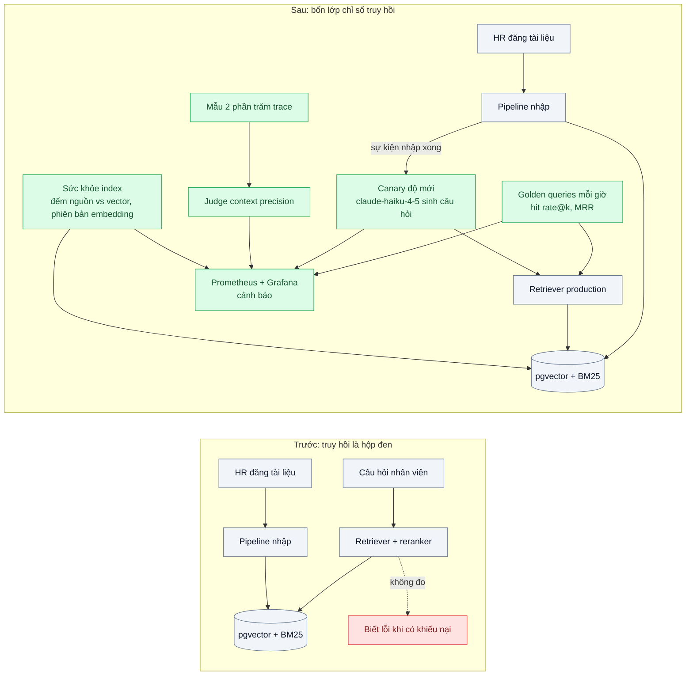
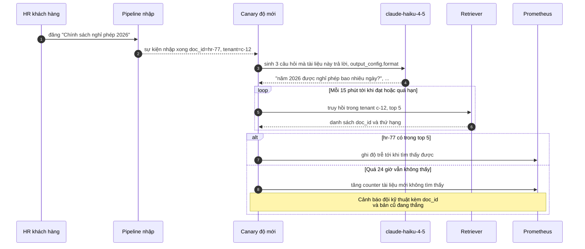

# Retrieval Quality Monitoring (hit rate, MRR, context precision) — Tài liệu mới thêm không bao giờ được tìm thấy

| Scope | Mức độ | Trạng thái | Pattern gốc | Cập nhật |
|---|---|---|---|---|
| 24 · backend / AI monitoring | 🟡 Trung bình | 📋 Kế hoạch | IR evaluation (precision@k, MRR) — Manning et al., *IIR* ch.8 (2008); RAGAS — Es et al. (2023) | 2026-10-06 |

> **Một câu tóm tắt:** Giám sát riêng tầng truy hồi của RAG trong production — câu hỏi canary có đáp án chạy định kỳ để đo hit rate và MRR, canary độ mới cho mỗi tài liệu vừa đăng, context precision chấm trên mẫu trace, và chỉ số sức khỏe index — để biết "tìm sai" trước khi người dùng phát hiện "trả lời sai".

## 1. Bài toán thực tế (What)

**Bối cảnh** *(doanh nghiệp giả định, số liệu minh họa)*
Một SaaS quản trị nhân sự có chatbot trả lời nhân viên của các công ty khách hàng về chính sách nội bộ (nghỉ phép, công tác phí, bảo hiểm). Tài liệu do HR mỗi công ty đăng lên, được chunk và embed vào pgvector, truy hồi hybrid (BM25 + vector) rồi rerank. Khoảng 8.000 câu hỏi/ngày trên 400 công ty.

**Triệu chứng người kinh doanh nhìn thấy**
- HR một khách hàng đăng chính sách nghỉ phép 2026; hai tuần sau chatbot vẫn trả lời theo bản 2024. Khách hàng gọi lên phàn nàn "đăng rồi mà như không".
- Đội kỹ thuật chỉ biết khi có khiếu nại; mỗi lần điều tra mất cả ngày để xác định do index chưa cập nhật, do chunk lỗi hay do xếp hạng.
- Điểm chất lượng câu trả lời (bài 03) giảm nhẹ nhưng không chỉ ra lỗi nằm ở truy hồi hay ở phần sinh.

**Nguyên nhân kỹ thuật**
Truy hồi có nhiều điểm hỏng âm thầm: pipeline nhập (scope 21 bài 05) lỗi với một định dạng file; tài liệu mới được embed bằng phiên bản model khác; tài liệu mới ít từ khóa trùng câu hỏi nên BM25 xếp thấp; bản cũ và bản mới cùng tồn tại và bản cũ thắng vì có nhiều chunk hơn. Không có chỉ số nào cho tầng truy hồi trong production: RAG evaluation chỉ chạy offline một lần khi ra mắt (scope 10 bài 06).

**Ràng buộc**
- Không có nhãn "tài liệu đúng" cho câu hỏi thật của người dùng.
- Mỗi công ty là một tenant: canary phải chạy trong phạm vi tenant, không lộ dữ liệu chéo.
- Chi phí chấm bằng LLM phải nhỏ so với chi phí chatbot.

## 2. Vì sao dùng pattern này (Why)

**Nguyên nhân gốc mà pattern nhắm vào:** chất lượng truy hồi chỉ được đo một lần offline, trong khi index thay đổi hằng ngày; lỗi truy hồi bị trộn lẫn vào lỗi câu trả lời.

**Pattern giải quyết thế nào:** bốn lớp chỉ số cho tầng truy hồi:
1. **Golden queries định kỳ**: bộ câu hỏi có tài liệu kỳ vọng (từ bài 04 và do HR mẫu cung cấp) chạy mỗi giờ qua đúng pipeline truy hồi production; tính **hit rate@k** (tỷ lệ câu có ít nhất một tài liệu đúng trong top k) và **MRR** (trung bình nghịch đảo thứ hạng của tài liệu đúng đầu tiên).
2. **Canary độ mới**: khi một tài liệu được đăng/sửa, `claude-haiku-4-5` sinh 3 câu hỏi mà tài liệu đó trả lời; sau khi pipeline báo nhập xong, chạy truy hồi và kiểm tra tài liệu có nằm trong top k không; đo **độ trễ tới khi tìm thấy được** và tỷ lệ tài liệu mới "không bao giờ được tìm thấy".
3. **Context precision trên mẫu trace**: lấy mẫu 2% trace thật, judge chấm từng chunk được đưa vào prompt có liên quan câu hỏi không (theo tinh thần RAGAS); kèm tỷ lệ câu trả lời trích dẫn tài liệu đã hết hiệu lực.
4. **Sức khỏe index**: số tài liệu nguồn so với số tài liệu có vector, số chunk sai phiên bản embedding, phân phối điểm tương đồng top-1, tỷ lệ truy vấn không có kết quả vượt ngưỡng.
Mọi chỉ số thành metric theo tenant-tier (không theo từng tenant trong Prometheus) và chi tiết theo tenant trong Langfuse/PostgreSQL.

**Lựa chọn khác đã cân nhắc**

| Lựa chọn | Giải quyết được gì | Vì sao không chọn (ở bài này) |
|---|---|---|
| Giữ nguyên + tối ưu nhỏ: chỉ theo dõi điểm chất lượng câu trả lời (bài 03) | Một chỉ số tổng | Không phân biệt lỗi truy hồi và lỗi sinh; không bắt được tài liệu mới vắng mặt |
| RAGAS offline định kỳ trên bộ cố định (scope 10 bài 06) | Đo kỹ khi đổi chunking/model | Không thấy index trôi giữa các lần chạy; không kiểm tài liệu mới |
| Chờ phản hồi người dùng | Không tốn gì | Chậm hàng tuần, đúng triệu chứng đang gặp |
| Chấm context precision 100% trace | Đầy đủ | Đắt; lấy mẫu đủ để thấy xu hướng |

## 3. Thiết kế hệ thống (How)

### 3.1 Kiến trúc trước và sau



### 3.2 Luồng chính



### 3.3 Thành phần và trách nhiệm

| Thành phần | Trách nhiệm | Quyết định thiết kế đáng chú ý |
|---|---|---|
| Golden queries | Câu hỏi có tài liệu kỳ vọng, chạy định kỳ qua pipeline thật | Chạy đúng cấu hình production (hybrid + rerank); kết quả theo phiên bản index |
| Canary độ mới | Sinh câu hỏi cho tài liệu mới, kiểm tra truy hồi được | Câu hỏi sinh ra lưu lại để chạy tiếp như golden query cho tenant đó |
| Judge context precision | Chấm độ liên quan từng chunk trong mẫu trace | `claude-haiku-4-5` cho chi phí thấp; hiệu chỉnh với nhãn người trên 100 mẫu |
| Sức khỏe index | So số tài liệu nguồn và số có vector, phiên bản embedding | Truy vấn SQL định kỳ; cột `embedding_model` theo scope 12 bài 05 |
| Metric và cảnh báo | Hit rate, MRR, độ trễ độ mới, context precision, sức khỏe index | Nhãn theo tầng tenant; chi tiết từng tenant ở PostgreSQL/Langfuse |

### 3.4 Điểm dễ sai khi triển khai
- **Golden queries chạy đường khác production.** Gọi thẳng vector search, bỏ qua BM25/rerank/filter tenant: chỉ số đẹp mà vô nghĩa.
- **Câu hỏi canary chép nguyên văn tài liệu.** Truy hồi tìm thấy dễ dàng nhờ trùng từ; yêu cầu model diễn đạt như nhân viên hỏi, không chép câu.
- **Không xử lý bản cũ cùng tồn tại.** Tài liệu mới được tìm thấy nhưng bản cũ xếp trên; kiểm cả việc bản hết hiệu lực có bị loại không.
- **Canary chạy chéo tenant.** Phải truy hồi trong đúng phạm vi tenant như người dùng thật.

## 4. Tech stack và tác động (Impact techstack)

| Lớp | Công nghệ chọn | Vì sao chọn | Thay thế tương đương |
|---|---|---|---|
| Retriever | PostgreSQL 16 + pgvector + full-text search, reranker hiện có | Đúng pipeline production cần giám sát | Qdrant, Elasticsearch |
| Sinh câu hỏi / judge | `claude-haiku-4-5` + `output_config.format` | Rẻ, đầu ra có cấu trúc | `claude-sonnet-5-5` cho judge khi cần chính xác hơn |
| Điều phối | Job TypeScript (BullMQ repeatable) nghe sự kiện nhập | Chạy định kỳ và theo sự kiện | Temporal schedule |
| Trace | Langfuse (bài 01) — span retrieval có `doc_id`, điểm | Lấy mẫu trace cho context precision | Arize Phoenix |
| Metric | Prometheus + Grafana | Cảnh báo cùng hệ thống | — |

Giá tại thời điểm viết (kiểm tra lại trang Pricing): `claude-opus-5-5` $4/$20 mỗi triệu token vào/ra; `claude-sonnet-5-5` $2/$10; `claude-haiku-4-5` $1/$5.

**Thay đổi so với hệ thống hiện tại:** pipeline nhập phát sự kiện "nhập xong"; thêm job golden queries, canary độ mới, judge context precision, truy vấn sức khỏe index và dashboard. Đội kỹ thuật có cảnh báo "tài liệu mới không tìm thấy" kèm `doc_id` để xử lý trước khi khách gọi.

## 5. Kết quả đầu ra và cách đo (Output impact)

| Chỉ số | Trước (minh họa) | Mục tiêu khi thực hành | Cách đo |
|---|---|---|---|
| Hit rate@5 trên golden queries | không đo | ≥ 0,9, có cảnh báo khi tụt | Script chạy golden set qua retriever production, tính hit rate@5 |
| MRR@10 trên golden queries | không đo | ghi nhận mốc, cảnh báo khi tụt | Cùng script, tính MRR@10 |
| Độ trễ từ đăng tài liệu tới tìm thấy được | ~2 tuần (phát hiện qua khiếu nại) | p95 dưới 1 giờ | Canary độ mới: chênh lệch thời điểm đăng và lần đầu xuất hiện trong top 5 |
| Tài liệu mới không bao giờ được tìm thấy | không biết | phát hiện 100% trong 24 giờ | Tiêm 20 lỗi cố ý (file lỗi định dạng, sai phiên bản embedding, bản cũ thắng), đếm số được cảnh báo |
| Context precision trên mẫu trace | không đo | ghi nhận mốc | Judge trên mẫu 2% trace mỗi ngày, hiệu chỉnh với 100 nhãn người |

> Số "trước" là minh họa để hình dung bài toán. Số "mục tiêu" chỉ được coi là đạt khi có số đo thật
> ở mục 8 kèm môi trường đo.

**Tác động nghiệp vụ mong đợi:** HR khách hàng đăng chính sách mới là chatbot dùng được trong vài giờ, có cảnh báo khi không; đội kỹ thuật biết lỗi nằm ở truy hồi hay ở sinh câu trả lời.

## 6. Đánh đổi và khi KHÔNG nên dùng

**Đánh đổi**
- Golden queries và canary là tải thêm lên retriever; chạy ngoài giờ cao điểm hoặc giới hạn tần suất.
- Câu hỏi do LLM sinh có thể dễ hơn câu hỏi thật; chỉ số canary là cận trên, không phải chất lượng thật.
- Judge context precision là ước lượng, cần hiệu chỉnh định kỳ.

**Không nên dùng khi**
- Kho tài liệu nhỏ, gần như không đổi: RAG evaluation offline khi thay đổi là đủ.
- Không dùng RAG (chỉ prompt + model): bài này không áp dụng.

**Liên quan**
- [RAG Evaluation (scope 10)](../../10-backend-ai-rag/06-rag-evaluation-ragas-khong-biet-tra-loi-dung-bao-nhieu-phan-tram/) — bản offline của bài này.
- [Hybrid Search (scope 10)](../../10-backend-ai-rag/03-hybrid-search-rrf-ma-san-pham-tim-vector-khong-ra/) và [Reranking (scope 10)](../../10-backend-ai-rag/04-reranking-top-20-dung-nhung-top-5-sai/) — các tầng được giám sát.
- [Embedding Ingestion Pipeline (scope 21)](../../21-backend-ai-infrastructure/05-embedding-pipeline-nhap-10-trieu-tai-lieu-idempotent/) và [Embedding Model Versioning (scope 12)](../../12-backend-database-vector/05-embedding-versioning-doi-model-embedding-phai-re-embed-tat-ca/).
- [Online Quality Monitoring](../03-quality-monitoring-llm-judge-sampling-chat-luong-tut-dan-khong-ai-thay/) — chất lượng câu trả lời tổng thể.

## 7. Cơ sở tham khảo

- Manning, Raghavan, Schütze, *Introduction to Information Retrieval*, ch.8 "Evaluation in information retrieval" (2008) — https://nlp.stanford.edu/IR-book/ — precision@k, MRR và cách đánh giá truy hồi có thứ hạng.
- Es et al., "RAGAS: Automated Evaluation of Retrieval Augmented Generation" (2023) — context precision, đánh giá từng thành phần RAG bằng LLM.
- Langfuse docs — https://langfuse.com/docs — span retrieval, scores trên trace, datasets cho golden queries.
- pgvector — https://github.com/pgvector/pgvector — truy vấn vector, lọc theo tenant.
- Anthropic docs, "Structured outputs" — https://platform.claude.com/docs/en/build-with-claude/structured-outputs — đầu ra có cấu trúc cho bước sinh câu hỏi và judge.

## 8. Kế hoạch thực hành

- [ ] Bước 1: dựng RAG giả lập (pgvector + full-text + rerank) với 3 tenant, 2.000 tài liệu chính sách; bộ 200 golden queries có tài liệu kỳ vọng; cơ chế tiêm lỗi pipeline nhập.
- [ ] Bước 2: đo "trước": tiêm 20 lỗi, xác nhận không chỉ số hiện có nào báo.
- [ ] Bước 3: áp dụng pattern: golden queries mỗi giờ, canary độ mới theo sự kiện nhập, judge context precision trên mẫu, truy vấn sức khỏe index, dashboard và cảnh báo.
- [ ] Bước 4: đo "sau": hit rate@5, MRR@10, độ trễ độ mới, số lỗi tiêm được phát hiện; ghi vào mục 5.
- [ ] Bước 5: test Vitest: (a) hàm tính hit rate@k và MRR đúng trên ví dụ tay, (b) canary truy hồi đúng phạm vi tenant, (c) câu hỏi sinh ra không chép nguyên câu từ tài liệu, (d) sức khỏe index phát hiện chunk sai phiên bản embedding.

**Cấu trúc code dự kiến**
```text
src/
  retrieval-monitor/metrics.ts          # hit rate@k, MRR
  retrieval-monitor/golden-queries.job.ts
  retrieval-monitor/freshness-canary.ts # nghe sự kiện nhập, sinh câu hỏi, kiểm tra top k
  retrieval-monitor/context-precision.ts
  retrieval-monitor/index-health.sql
test/
  metrics.test.ts
  freshness-canary.test.ts
docker-compose.yml                      # postgres+pgvector, redis, langfuse, prometheus, grafana
```

**Cách chạy** *(điền khi bắt đầu code)*
```bash
docker compose up -d
pnpm install && pnpm test
```
