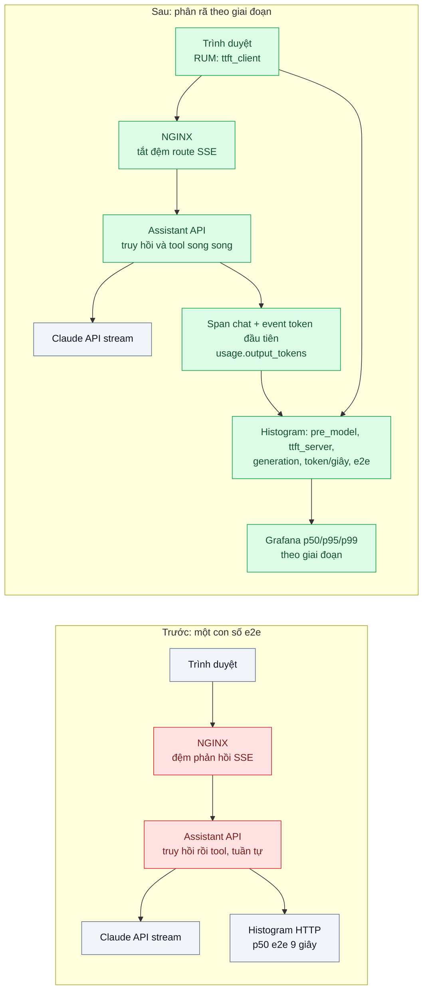
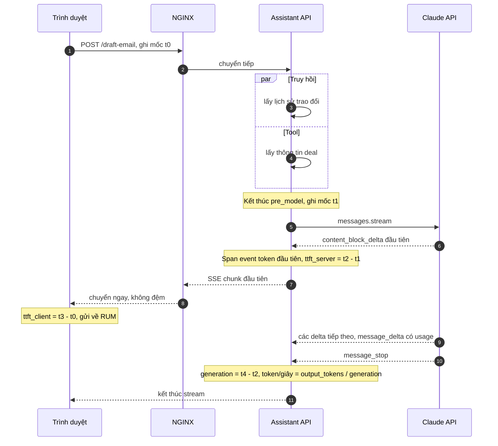

# LLM Latency Breakdown (TTFT, tokens/s, end-to-end) — Chat "cảm giác chậm" nhưng p50 end-to-end bình thường

| Scope | Mức độ | Trạng thái | Pattern gốc | Cập nhật |
|---|---|---|---|---|
| 24 · backend / AI monitoring | 🟡 Trung bình | 📋 Kế hoạch | LLM latency metrics (TTFT, time per output token) — vLLM docs; OpenTelemetry GenAI metrics; Anthropic docs "Streaming" | 2026-10-06 |

> **Một câu tóm tắt:** Tách độ trễ một lượt chat thành các giai đoạn người dùng cảm nhận được — chờ trước khi gọi model (truy hồi, tool), thời gian tới token đầu tiên (TTFT) đo cả ở server lẫn trình duyệt, tốc độ sinh (token/giây) và tổng thời gian — đo bằng histogram theo phân vị, để biết chính xác "chậm" nằm ở đâu thay vì nhìn một con số p50 end-to-end.

## 1. Bài toán thực tế (What)

**Bối cảnh** *(doanh nghiệp giả định, số liệu minh họa)*
Một CRM cho đội bán hàng có trợ lý soạn email: nhân viên mô tả ý, trợ lý truy hồi lịch sử trao đổi với khách, gọi tool lấy thông tin deal rồi stream bản nháp email dài 300–600 từ bằng `claude-opus-5-5`. Khoảng 20.000 lượt/ngày. Dashboard HTTP hiện có cho thấy p50 thời gian request khoảng 9 giây, được coi là "bình thường với AI".

**Triệu chứng người kinh doanh nhìn thấy**
- Khảo sát nội bộ: nhân viên than trợ lý "đơ" — bấm xong nhìn màn hình trống rất lâu rồi chữ mới hiện.
- Một số người bấm lại nhiều lần vì tưởng lỗi, tạo request trùng và tốn tiền.
- Đội kỹ thuật đưa ra số p50 để phản bác, hai bên không cùng ngôn ngữ.

**Nguyên nhân kỹ thuật**
Thời gian người dùng *cảm nhận* là thời gian tới chữ đầu tiên hiện trên màn hình, không phải tổng thời gian. Trong 9 giây, khoảng 4 giây là truy hồi và tool chạy tuần tự trước khi gọi model; reverse proxy đệm (buffer) phản hồi SSE nên token đến trình duyệt thành từng cục; email dài làm thời gian sinh lớn. Không có metric nào cho TTFT, cho tốc độ sinh, hay cho từng giai đoạn; trace (bài 01) có span nhưng không có mốc "token đầu tiên".

**Ràng buộc**
- Không đổi model (chất lượng email đã được duyệt).
- Đo phải bao gồm phía trình duyệt, vì đệm ở proxy chỉ thấy được từ phía client.
- Chi phí đo thấp: không ghi từng token, chỉ ghi mốc.

## 2. Vì sao dùng pattern này (Why)

**Nguyên nhân gốc mà pattern nhắm vào:** chỉ số độ trễ đang dùng (end-to-end p50) không phản ánh trải nghiệm của giao diện streaming, và không phân rã được thành nguyên nhân.

**Pattern giải quyết thế nào:**
1. **Định nghĩa giai đoạn**: `pre_model` (từ nhận request tới gửi lời gọi model: truy hồi, tool, guardrail), `ttft_server` (từ gửi lời gọi tới sự kiện stream đầu tiên có nội dung), `generation` (từ token đầu tới `message_stop`), `ttft_client` (từ bấm nút tới chữ đầu tiên hiện trên màn hình), `e2e`.
2. **Mốc trong trace**: span `chat` (bài 01) thêm span event "token đầu tiên" khi nhận sự kiện `content_block_delta` đầu tiên; kết thúc span ở `message_stop`; ghi `usage.output_tokens` để tính token/giây = output tokens / thời gian `generation`.
3. **Histogram Prometheus** cho từng giai đoạn, nhãn `feature`, `model`; xem p50/p95/p99, không xem trung bình. OpenTelemetry semconv gen_ai có metric cho thời lượng thao tác và thời gian tới token đầu tiên — dùng làm chuẩn đặt tên (tra spec, không tự chế).
4. **Đo phía trình duyệt (RUM)**: frontend ghi `ttft_client` và gửi về; hiệu số `ttft_client - ttft_server - pre_model` lớn là dấu hiệu đệm ở proxy/CDN.
5. **Sửa theo số đo**: tắt đệm cho route SSE (NGINX `proxy_buffering off` hoặc header `X-Accel-Buffering: no`), chạy truy hồi và tool song song, hiển thị trạng thái ("đang đọc lịch sử...") trong `pre_model`, giới hạn độ dài đầu ra (scope 22 bài 10).

**Lựa chọn khác đã cân nhắc**

| Lựa chọn | Giải quyết được gì | Vì sao không chọn (ở bài này) |
|---|---|---|
| Giữ nguyên + tối ưu nhỏ: theo dõi thêm p95 end-to-end | Thấy đuôi phân phối | Vẫn trộn mọi giai đoạn; không thấy đệm proxy; không đo cảm nhận người dùng |
| APM HTTP có sẵn | Thời gian request theo route | Thấy request kết thúc, không thấy token đầu tiên của stream |
| Đổi sang model nhỏ hơn cho nhanh | Giảm thời gian sinh | Ràng buộc không đổi model; chưa biết thời gian nằm ở đâu |

## 3. Thiết kế hệ thống (How)

### 3.1 Kiến trúc trước và sau



### 3.2 Luồng chính



### 3.3 Thành phần và trách nhiệm

| Thành phần | Trách nhiệm | Quyết định thiết kế đáng chú ý |
|---|---|---|
| Đo mốc phía server | Ghi t1 (gửi model), t2 (token đầu), t4 (`message_stop`) | Token đầu tính ở delta có nội dung đầu tiên; với adaptive thinking, ghi riêng mốc nội dung hiển thị được |
| Histogram Prometheus | Phân phối từng giai đoạn theo `feature`, `model` | Bucket chọn theo dải thật (vài trăm ms tới vài chục giây); không dùng summary để còn gộp được |
| RUM frontend | Ghi `ttft_client`, `e2e_client`, gửi theo lô | Dùng `performance.now()`; lấy mẫu nếu lưu lượng lớn |
| Cấu hình proxy | Không đệm route SSE | Kiểm tra cả CDN/load balancer phía trước NGINX |

### 3.4 Điểm dễ sai khi triển khai
- **Đo TTFT là thời điểm nhận HTTP header.** Header về trước token đầu tiên; phải đo ở sự kiện delta có nội dung.
- **Đo trung bình.** Trung bình che đuôi; dùng phân vị từ histogram (scope 23 bài 04).
- **Bỏ qua đệm ở proxy/CDN.** Server thấy TTFT tốt nhưng người dùng vẫn chờ; luôn so với số đo phía trình duyệt.
- **Benchmark có coordinated omission.** Công cụ đo chờ request trước xong mới gửi request sau, che mất độ trễ thật dưới tải; dùng mô hình tải mở (k6 arrival-rate).

## 4. Tech stack và tác động (Impact techstack)

| Lớp | Công nghệ chọn | Vì sao chọn | Thay thế tương đương |
|---|---|---|---|
| Gọi model | `@anthropic-ai/sdk` `messages.stream`, `claude-opus-5-5` | Sự kiện stream rõ ràng để đặt mốc; `usage` ở cuối luồng | Gateway scope 20 bài 01 |
| Ứng dụng | NestJS (Fastify adapter), SSE | Trùng stack | Fastify thuần |
| Metric | Prometheus histogram + Grafana | Phân vị theo giai đoạn | OpenTelemetry metrics qua Collector |
| RUM | Script frontend gửi mốc về endpoint thu thập | Thấy đệm và mạng thật | Thư viện RUM có sẵn (cần xác minh) |
| Proxy | NGINX `proxy_buffering off` cho route SSE | Token đi thẳng tới trình duyệt | Envoy |
| Đo tải | k6 (arrival-rate) + script streaming đo TTFT | Tải mở, tránh coordinated omission | — |

Giá tại thời điểm viết (kiểm tra lại trang Pricing): `claude-opus-5-5` $4/$20 mỗi triệu token vào/ra; `claude-sonnet-5-5` $2/$10; `claude-haiku-4-5` $1/$5.

**Thay đổi so với hệ thống hiện tại:** thêm đo mốc phía server và trình duyệt, histogram theo giai đoạn, dashboard mới; sửa cấu hình proxy và song song hóa truy hồi/tool. Đội sản phẩm và kỹ thuật dùng chung con số "TTFT phía người dùng".

## 5. Kết quả đầu ra và cách đo (Output impact)

| Chỉ số | Trước (minh họa) | Mục tiêu khi thực hành | Cách đo |
|---|---|---|---|
| TTFT phía trình duyệt p95 | ~6 giây (ước lượng) | dưới 2 giây | RUM gửi `ttft_client`; script streaming bằng trình duyệt headless |
| Thời gian `pre_model` p95 | ~4 giây | dưới 1,5 giây | Histogram `pre_model` sau khi song song hóa |
| Chênh lệch TTFT client và server | không đo | dưới 200 ms | `ttft_client - (pre_model + ttft_server)` theo phân vị |
| Token/giây giai đoạn sinh | không đo | ghi nhận theo model | `usage.output_tokens` / thời gian `generation` |
| Tỷ lệ bấm lại trong 10 giây | không đo | giảm so với mốc | Đếm request trùng cùng người dùng, cùng nội dung trong 10 giây |

> Số "trước" là minh họa để hình dung bài toán. Số "mục tiêu" chỉ được coi là đạt khi có số đo thật
> ở mục 8 kèm môi trường đo.

**Tác động nghiệp vụ mong đợi:** nhân viên thấy chữ xuất hiện nhanh và tiến độ rõ ràng, bớt bấm lại; đội kỹ thuật và sản phẩm thảo luận bằng cùng một chỉ số phản ánh trải nghiệm.

## 6. Đánh đổi và khi KHÔNG nên dùng

**Đánh đổi**
- Thêm mã đo ở cả frontend và backend; RUM cần chính sách quyền riêng tư và lấy mẫu.
- Tắt đệm proxy có thể ảnh hưởng hiệu năng route khác nếu cấu hình quá rộng; chỉ áp cho route SSE.

**Không nên dùng khi**
- Tác vụ nền không có người chờ (batch, phân loại): chỉ cần thông lượng và thời gian hoàn thành.
- Phản hồi ngắn, không streaming: p95 end-to-end là đủ.

**Liên quan**
- [Streaming for Perceived Latency (scope 22)](../../22-backend-ai-optimizer/07-streaming-ttft-khach-nhin-man-hinh-trang-8-giay/) — tối ưu dựa trên số đo ở đây.
- [Percentiles & Histograms (scope 23)](../../23-backend-monitoring-benchmark/04-percentiles-p99-trung-binh-200ms-nhung-khach-than-cham/) và [Load Testing Methodology (scope 23)](../../23-backend-monitoring-benchmark/07-load-testing-k6-coordinated-omission-benchmark-tu-danh-lua/).
- [Model Serving vLLM (scope 21)](../../21-backend-ai-infrastructure/03-vllm-serving-continuous-batching-tu-host-50-req-s/) — TTFT và TPOT ở phía tự host.

## 7. Cơ sở tham khảo

- Anthropic docs, "Streaming" — https://platform.claude.com/docs/en/build-with-claude/streaming — các sự kiện `message_start`, `content_block_delta`, `message_delta`, `message_stop` để đặt mốc.
- vLLM docs, metrics — https://docs.vllm.ai/ — định nghĩa TTFT, time per output token ở tầng serving.
- OpenTelemetry, "Semantic conventions for generative AI systems" — https://opentelemetry.io/docs/specs/semconv/gen-ai/ — metric thời lượng thao tác và thời gian tới token đầu tiên.
- Gil Tene, "How NOT to Measure Latency" (2015) — coordinated omission, vì sao phải dùng phân vị và tải mở.
- Jakob Nielsen, "Response Times: The 3 Important Limits" (1993) — https://www.nngroup.com/articles/response-times-3-important-limits/ — ngưỡng 0,1 / 1 / 10 giây của cảm nhận người dùng.

## 8. Kế hoạch thực hành

- [ ] Bước 1: dựng trợ lý soạn email giả lập (truy hồi và tool có độ trễ cấu hình được) sau NGINX mặc định; frontend tối giản hiển thị stream.
- [ ] Bước 2: đo "trước": TTFT client bằng trình duyệt headless, histogram e2e, k6 arrival-rate.
- [ ] Bước 3: áp dụng pattern: mốc server và span event, histogram từng giai đoạn, RUM, tắt đệm route SSE, song song hóa `pre_model`.
- [ ] Bước 4: đo "sau" cùng kịch bản; ghi vào mục 5 kèm cấu hình máy, mạng, model.
- [ ] Bước 5: test Vitest: (a) mốc token đầu chỉ ghi ở delta có nội dung, (b) token/giây tính trên `generation`, (c) span kết thúc sau `message_stop`, (d) route SSE trả header tắt đệm.

**Cấu trúc code dự kiến**
```text
src/
  latency/stream-timer.ts        # mốc t1, t2, t4 quanh messages.stream
  latency/latency-metrics.ts     # histogram theo giai đoạn
  draft/draft-email.service.ts   # truy hồi + tool song song, stream SSE
web/rum.ts                       # ghi ttft_client bằng performance.now()
bench/
  ttft-browser-probe.ts          # trình duyệt headless đo TTFT client
  load.k6.js                     # arrival-rate
test/stream-timer.test.ts
nginx/sse.conf                   # proxy_buffering off cho route SSE
docker-compose.yml               # nginx, prometheus, grafana, langfuse
```

**Cách chạy** *(điền khi bắt đầu code)*
```bash
docker compose up -d
pnpm install && pnpm test
```
