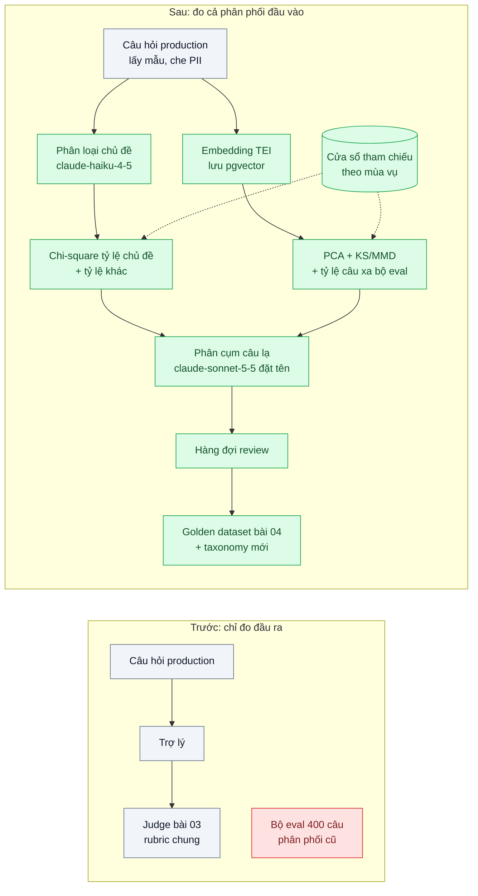
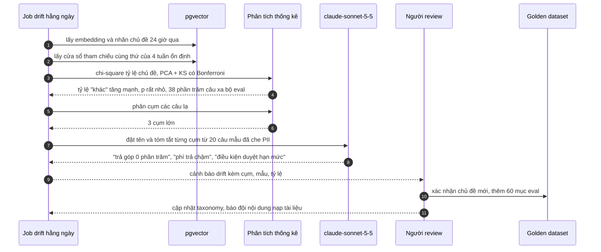

# Input Drift Detection — Sau chiến dịch marketing, 40% câu hỏi thuộc chủ đề chưa từng có trong eval

| Scope | Mức độ | Trạng thái | Pattern gốc | Cập nhật |
|---|---|---|---|---|
| 24 · backend / AI monitoring | 🔴 Nâng cao | 📋 Kế hoạch | Data distribution shift — Chip Huyen, *Designing Machine Learning Systems* (2022) ch.8; Rabanser et al., "Failing Loudly" (NeurIPS 2019) | 2026-10-06 |

> **Một câu tóm tắt:** So sánh phân phối câu hỏi production hằng ngày với phân phối tham chiếu (bộ eval và các tuần ổn định) bằng hai góc nhìn — tỷ lệ theo chủ đề từ một bộ phân loại cố định và kiểm định hai mẫu trên embedding đã giảm chiều — rồi phân cụm phần "lạ" thành chủ đề mới để người xem và đưa vào bộ eval, trước khi chất lượng tụt ở nhóm câu hỏi chưa ai kiểm.

## 1. Bài toán thực tế (What)

**Bối cảnh** *(doanh nghiệp giả định, số liệu minh họa)*
Một ví điện tử có trợ lý trả lời khách (khoảng 80.000 câu/ngày) với bộ eval 400 câu và giám sát chất lượng online (bài 03). Đội marketing chạy chiến dịch "mua trước trả sau, trả góp 0%" trên mạng xã hội mà không báo đội AI.

**Triệu chứng người kinh doanh nhìn thấy**
- Trong tuần chiến dịch, khoảng 40% câu hỏi là về trả góp, phí phạt trả chậm, điều kiện duyệt hạn mức — chủ đề gần như không có trong bộ eval.
- Trợ lý trả lời sai lãi suất và điều kiện vì tài liệu về sản phẩm mới chưa được nạp đủ; khiếu nại tăng, đội pháp chế lo ngại thông tin tài chính sai.
- Điểm chất lượng trung bình (bài 03) chỉ giảm nhẹ vì rubric chung chấm "lịch sự, có trả lời" vẫn đạt; hai tuần sau mới có người nhận ra.

**Nguyên nhân kỹ thuật**
Hệ thống được kiểm tra trên phân phối đầu vào cũ. Khi phân phối đổi (một dạng *data distribution shift*), các bảo đảm từ eval không còn đúng, nhưng không có gì đo bản thân phân phối đầu vào. Giám sát chất lượng đo *đầu ra* và trễ: phải chờ đủ câu trả lời sai mới thấy. Câu hỏi thuộc chủ đề mới không có tài liệu, không có test, không có rubric chuyên biệt.

**Ràng buộc**
- Không có nhãn chủ đề cho câu hỏi production; phải tự suy ra.
- Dao động tự nhiên theo ngày trong tuần và theo đầu tháng (lương về) không được báo động.
- Câu hỏi chứa dữ liệu khách: embedding và phân tích chạy trong hạ tầng, mẫu đưa người xem phải che PII.

## 2. Vì sao dùng pattern này (Why)

**Nguyên nhân gốc mà pattern nhắm vào:** chỉ giám sát đầu ra nên thay đổi ở đầu vào chỉ được phát hiện khi đã gây hậu quả; bộ eval không biết mình đã lỗi thời.

**Pattern giải quyết thế nào:** phát hiện thay đổi phân phối đầu vào bằng hai góc nhìn bổ sung nhau, theo hướng của "Failing Loudly" (giảm chiều biểu diễn rồi kiểm định hai mẫu):
1. **Theo chủ đề (dễ giải thích)**: bộ phân loại cố định `claude-haiku-4-5` gán mỗi câu (lấy mẫu) vào taxonomy chủ đề có sẵn + nhãn "khác", đầu ra có cấu trúc qua `output_config.format`. So tỷ lệ chủ đề của ngày hiện tại với cửa sổ tham chiếu bằng kiểm định chi-square; theo dõi riêng tỷ lệ "khác". Đây là dạng dùng đầu ra của bộ phân loại làm biểu diễn giảm chiều.
2. **Theo embedding (bắt cái taxonomy không biết)**: embedding câu hỏi bằng TEI, giảm chiều (PCA), kiểm định hai mẫu từng chiều (Kolmogorov–Smirnov với hiệu chỉnh Bonferroni) hoặc MMD giữa cửa sổ hiện tại và tham chiếu; thêm tỷ lệ câu "xa" mọi câu trong bộ eval (khoảng cách tới láng giềng gần nhất vượt ngưỡng).
3. **Tham chiếu theo mùa vụ**: so với cùng thứ trong tuần của các tuần ổn định, không chỉ hôm qua, để giảm báo động giả.
4. **Từ cảnh báo tới hành động**: phân cụm các câu "xa" và "khác", `claude-sonnet-5-5` đặt tên và tóm tắt từng cụm, gửi mẫu đã che PII vào hàng đợi review; cụm được xác nhận thành chủ đề mới trong taxonomy, mục mới trong golden dataset (bài 04), và tín hiệu cho đội nội dung nạp tài liệu.

**Lựa chọn khác đã cân nhắc**

| Lựa chọn | Giải quyết được gì | Vì sao không chọn (ở bài này) |
|---|---|---|
| Giữ nguyên + tối ưu nhỏ: chỉ dựa vào điểm chất lượng online (bài 03) | Không thêm hệ thống | Trễ; rubric chung không bắt được lỗi miền mới |
| Đếm từ khóa thủ công ("trả góp", "BNPL") | Đơn giản, dễ hiểu | Chỉ bắt được chủ đề đã đoán trước; không phát hiện cái chưa biết |
| Review tay ngẫu nhiên hằng tuần | Hiểu sâu | Chậm cả tuần, mẫu nhỏ |
| Chỉ dùng kiểm định embedding | Bắt mọi thay đổi | Khó giải thích cho người kinh doanh; cần lớp chủ đề để hành động |

## 3. Thiết kế hệ thống (How)

### 3.1 Kiến trúc trước và sau



### 3.2 Luồng chính



### 3.3 Thành phần và trách nhiệm

| Thành phần | Trách nhiệm | Quyết định thiết kế đáng chú ý |
|---|---|---|
| Lấy mẫu + che PII | Lấy N câu mỗi giờ, che định danh | Đủ mẫu cho kiểm định, chi phí phân loại thấp |
| Phân loại chủ đề | Gán chủ đề theo taxonomy cố định + "khác" | Taxonomy có phiên bản; đổi taxonomy là đổi mốc tham chiếu |
| Embedding + lưu trữ | Vector câu hỏi trong pgvector, có ngày | Cùng model embedding cho cả tham chiếu và hiện tại |
| Phân tích thống kê | Chi-square, PCA + KS/MMD, tỷ lệ câu xa bộ eval | Viết bằng Python vì thư viện thống kê và giảm chiều sẵn có; gọi như job riêng |
| Tham chiếu theo mùa vụ | Cửa sổ so sánh cùng thứ trong tuần, loại tuần bất thường | Giảm báo động giả do chu kỳ tự nhiên |
| Phân cụm + đặt tên | Gom câu lạ, tóm tắt cho người đọc | Người xác nhận trước khi đổi taxonomy |

### 3.4 Điểm dễ sai khi triển khai
- **So với hôm qua.** Thứ Hai khác Chủ nhật, đầu tháng khác giữa tháng; dùng tham chiếu theo mùa vụ.
- **Cỡ mẫu quá lớn cho kiểm định.** Với hàng chục nghìn câu, mọi khác biệt nhỏ đều "có ý nghĩa thống kê"; kết hợp p-value với ngưỡng độ lớn hiệu ứng (tỷ lệ thay đổi).
- **Đổi model embedding hoặc taxonomy giữa chừng.** So sánh mất ý nghĩa; tính lại tham chiếu khi đổi.
- **Cảnh báo không kèm hành động.** "Phân phối đã đổi" mà không nói đổi thế nào thì không ai làm gì; luôn kèm cụm, tên, mẫu.
- **Gửi câu chưa che cho bước đặt tên cụm.** Che PII trước mọi bước rời khỏi pipeline chính.

## 4. Tech stack và tác động (Impact techstack)

| Lớp | Công nghệ chọn | Vì sao chọn | Thay thế tương đương |
|---|---|---|---|
| Embedding | Hugging Face Text Embeddings Inference (TEI) | Tự host, dữ liệu không rời hạ tầng | Model embedding qua API được phép |
| Lưu trữ | PostgreSQL 16 + pgvector | Truy vấn láng giềng gần nhất tới bộ eval, lọc theo ngày | Qdrant |
| Phân loại / đặt tên cụm | `claude-haiku-4-5` (phân loại, `output_config.format`), `claude-sonnet-5-5` (tóm tắt cụm) | Rẻ cho khối lượng lớn; mạnh hơn cho tóm tắt | Bộ phân loại nhỏ tự huấn luyện khi taxonomy ổn định |
| Thống kê | Python: scipy (chi-square, KS), scikit-learn (PCA, phân cụm như HDBSCAN — cần xác minh phiên bản) | Thư viện chuẩn; ngoại lệ có lý do so với stack TypeScript | Thư viện thống kê TypeScript (ít lựa chọn) |
| Điều phối | Temporal schedule hoặc cron gọi job Python, kết quả ghi PostgreSQL | Chạy hằng ngày, retry khi lỗi | Airflow |
| Metric / cảnh báo | Prometheus + Grafana | Tỷ lệ "khác", tỷ lệ câu xa, p-value theo ngày | — |
| Review / dataset | Langfuse (Datasets, annotation) | Nối với bài 04 | Bảng PostgreSQL |

Giá tại thời điểm viết (kiểm tra lại trang Pricing): `claude-opus-5-5` $4/$20 mỗi triệu token vào/ra; `claude-sonnet-5-5` $2/$10; `claude-haiku-4-5` $1/$5.

**Thay đổi so với hệ thống hiện tại:** thêm pipeline embedding câu hỏi, bộ phân loại chủ đề, job thống kê Python, quy trình review cụm mới. Đội marketing được đề nghị báo lịch chiến dịch; đội AI có cảnh báo dù không được báo.

## 5. Kết quả đầu ra và cách đo (Output impact)

| Chỉ số | Trước (minh họa) | Mục tiêu khi thực hành | Cách đo |
|---|---|---|---|
| Thời gian phát hiện chủ đề mới | ~2 tuần | dưới 24 giờ | Replay lịch sử ổn định rồi bơm 40% câu chủ đề mới từ một thời điểm; đo tới lúc cảnh báo |
| Báo động giả mỗi tháng | — | ≤ 1 | Chạy job trên 3 tháng lịch sử replay không có thay đổi lớn |
| Độ phủ chủ đề của bộ eval | không đo | mọi chủ đề chiếm trên 2% lưu lượng có ≥ 10 mục | So tỷ lệ chủ đề production với số mục golden dataset theo chủ đề |
| Độ đúng của tên cụm | — | ≥ 80% được người review chấp nhận | Tỷ lệ cụm được xác nhận không sửa tên |
| Chi phí phân tích mỗi ngày | — | ghi nhận | `usage` của phân loại và đặt tên × đơn giá + GPU-giờ TEI |

> Số "trước" là minh họa để hình dung bài toán. Số "mục tiêu" chỉ được coi là đạt khi có số đo thật
> ở mục 8 kèm môi trường đo.

**Tác động nghiệp vụ mong đợi:** đội AI biết về chủ đề mới trong ngày đầu chiến dịch, kịp nạp tài liệu và thêm eval trước khi khách nhận thông tin tài chính sai.

## 6. Đánh đổi và khi KHÔNG nên dùng

**Đánh đổi**
- Thêm một job Python ngoài stack chính và một pipeline embedding phải vận hành.
- Kiểm định thống kê cần hiệu chỉnh ngưỡng; quá nhạy thì ồn, quá lỳ thì vô dụng.
- Taxonomy chủ đề phải được bảo trì; đổi taxonomy làm gián đoạn chuỗi so sánh.

**Không nên dùng khi**
- Lưu lượng thấp, chưa đủ lịch sử ổn định để làm tham chiếu (cần vài tuần dữ liệu).
- Phạm vi câu hỏi rất hẹp và cố định (ví dụ form có lựa chọn sẵn): thay đổi phân phối hiếm và dễ thấy bằng thống kê đơn giản.

**Liên quan**
- [Online Quality Monitoring](../03-quality-monitoring-llm-judge-sampling-chat-luong-tut-dan-khong-ai-thay/) — đo đầu ra; bài này đo đầu vào.
- [Golden Dataset from Production Traces](../04-golden-dataset-tu-production-regression-test-prompt/) và [Feedback Loop](../09-feedback-loop-thumbs-down-thanh-eval-case/) — đích đến của cụm mới.
- [Eval Pipeline & LLM-as-Judge (scope 20)](../../20-backend-ai-framework-system-design/06-llm-as-judge-eval-pipeline-trong-ci-sua-prompt-khong-biet-tot-hon-hay-te-hon/) — chạy bộ eval đã bổ sung.
- [Embedding Ingestion Pipeline (scope 21)](../../21-backend-ai-infrastructure/05-embedding-pipeline-nhap-10-trieu-tai-lieu-idempotent/) — TEI và lưu vector.

## 7. Cơ sở tham khảo

- Chip Huyen, *Designing Machine Learning Systems*, O'Reilly, 2022, ch.8 "Data Distribution Shifts and Monitoring" — các loại dịch chuyển phân phối, cửa sổ thời gian, phát hiện bằng kiểm định thống kê.
- Rabanser, Günnemann, Lipton, "Failing Loudly: An Empirical Study of Methods for Detecting Dataset Shift", NeurIPS 2019 — giảm chiều (kể cả dùng đầu ra bộ phân loại) rồi kiểm định hai mẫu (KS có Bonferroni, MMD, chi-square).
- Hugging Face Text Embeddings Inference docs — https://huggingface.co/docs/text-embeddings-inference — embedding câu hỏi trong hạ tầng.
- pgvector — https://github.com/pgvector/pgvector — truy vấn láng giềng gần nhất tới bộ eval.
- Hamel Husain, "Your AI Product Needs Evals" (2024) — https://hamel.dev/blog/posts/evals/ — xem dữ liệu thật, cập nhật eval theo lỗi mới.
- Anthropic docs, "Structured outputs" — https://platform.claude.com/docs/en/build-with-claude/structured-outputs — đầu ra cố định cho bộ phân loại chủ đề.

## 8. Kế hoạch thực hành

- [ ] Bước 1: tạo bộ câu hỏi giả lập 3 tháng với chu kỳ tuần/tháng, một "chiến dịch" bơm chủ đề mới từ một ngày; bộ eval 400 câu; taxonomy 15 chủ đề.
- [ ] Bước 2: đo "trước": chạy giám sát chất lượng hiện có trên replay, ghi thời điểm (nếu có) phát hiện.
- [ ] Bước 3: áp dụng pattern: lấy mẫu + che PII, phân loại chủ đề, embedding TEI, job Python (chi-square, PCA + KS, tỷ lệ câu xa), tham chiếu theo mùa vụ, phân cụm + đặt tên, hàng đợi review.
- [ ] Bước 4: đo "sau": thời gian phát hiện, báo động giả trên 3 tháng ổn định, độ đúng tên cụm, chi phí; ghi vào mục 5.
- [ ] Bước 5: test: (a) pytest — kiểm định không báo trên hai mẫu cùng phân phối với seed cố định, báo khi bơm 20% câu mới, (b) Vitest — bộ phân loại trả đúng schema, câu gửi đặt tên cụm đã che PII.

**Cấu trúc code dự kiến**
```text
src/
  drift/sampler.ts                 # lấy mẫu, che PII
  drift/topic-classifier.ts        # claude-haiku-4-5 + output_config.format
  drift/cluster-namer.ts           # claude-sonnet-5-5 tóm tắt cụm
analysis/                          # Python dùng snake_case để import được (ngoại lệ quy ước kebab-case)
  drift_tests.py                   # chi-square, PCA + KS (Bonferroni), MMD
  novelty_clusters.py              # tỷ lệ câu xa bộ eval, phân cụm
  test_drift_tests.py              # pytest
test/topic-classifier.test.ts
docker-compose.yml                 # postgres+pgvector, tei, prometheus, grafana
```

**Cách chạy** *(điền khi bắt đầu code)*
```bash
docker compose up -d
pnpm install && pnpm test
```
