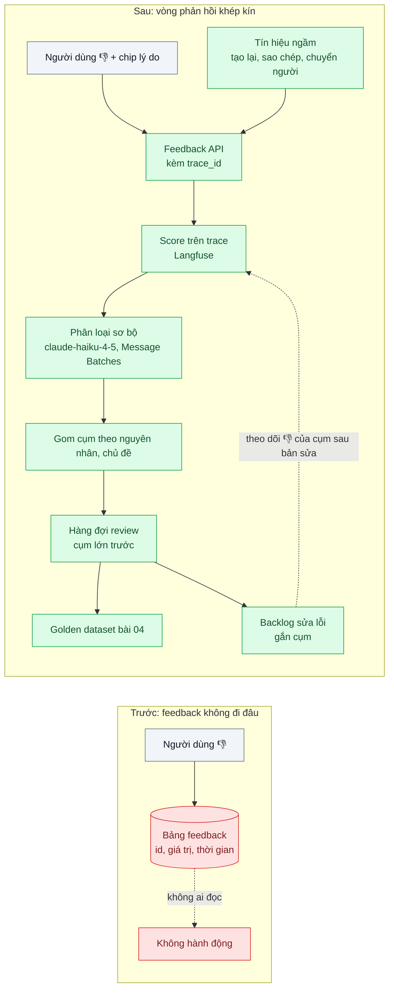
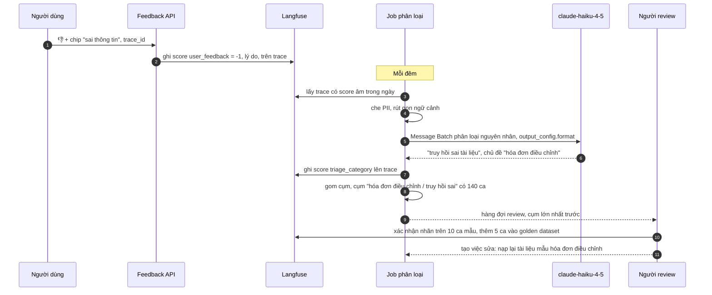

# Feedback Loop (thumbs → triage → eval case) — 2.000 lượt "không hữu ích" mỗi tuần không ai đọc

| Scope | Mức độ | Trạng thái | Pattern gốc | Cập nhật |
|---|---|---|---|---|
| 24 · backend / AI monitoring | 🟡 Trung bình | 📋 Kế hoạch | Collect user feedback — Eugene Yan, LLM patterns (2023); Error analysis — Hamel Husain (2024); Langfuse docs "Scores" | 2026-10-06 |

> **Một câu tóm tắt:** Gắn mỗi lượt 👎 vào đúng trace của nó, thu thêm lý do nhanh và tín hiệu ngầm, để một model nhỏ phân loại sơ bộ nguyên nhân, gom thành cụm cho người xác nhận, rồi biến ca đã xác nhận thành eval case và việc cần sửa — khép vòng từ phàn nàn của người dùng tới bộ test hồi quy.

## 1. Bài toán thực tế (What)

**Bối cảnh** *(doanh nghiệp giả định, số liệu minh họa)*
Một SaaS kế toán cho doanh nghiệp nhỏ có trợ lý hỏi đáp nghiệp vụ (hạch toán, hóa đơn điện tử, thuế) khoảng 50.000 lượt/tuần. Giao diện có nút 👍/👎; dữ liệu đổ vào bảng `feedback` (id tin nhắn, giá trị, thời gian). Đã có tracing (bài 01).

**Triệu chứng người kinh doanh nhìn thấy**
- Khoảng 2.000 lượt 👎 mỗi tuần nằm trong bảng; không ai đọc vì không biết bắt đầu từ đâu.
- Trưởng sản phẩm hỏi "khách chê vì điều gì nhiều nhất?" — câu trả lời là phỏng đoán.
- Cùng một lỗi (hướng dẫn sai mẫu hóa đơn điều chỉnh) bị chê hàng trăm lần trong một tháng trước khi có người phát hiện qua kênh CSKH.

**Nguyên nhân kỹ thuật**
Feedback bị tách khỏi ngữ cảnh: bảng `feedback` chỉ có id tin nhắn, không nối với trace nên muốn xem prompt, tài liệu truy hồi, kết quả tool phải tra tay. 👎 không có lý do nên không phân biệt "sai thông tin" với "quá dài". Không có quy trình phân loại hay người chịu trách nhiệm; không có đường đi từ feedback sang bộ eval (bài 04) hay backlog.

**Ràng buộc**
- Không làm phiền người dùng: thu thêm lý do phải nhanh, tùy chọn.
- Đội review chỉ có vài giờ mỗi tuần: tự động phải làm phần lớn việc phân loại.
- Nội dung có dữ liệu tài chính của doanh nghiệp khách: che PII trước khi đưa vào eval và hàng đợi review.

## 2. Vì sao dùng pattern này (Why)

**Nguyên nhân gốc mà pattern nhắm vào:** feedback được thu nhưng không được nối với ngữ cảnh, không được phân loại và không có đích đến, nên không bao giờ biến thành cải tiến.

**Pattern giải quyết thế nào:**
1. **Gắn vào trace**: frontend gửi `trace_id` cùng feedback; backend ghi thành score trên trace trong Langfuse — mở một 👎 là thấy ngay toàn bộ ngữ cảnh.
2. **Lý do nhanh + tín hiệu ngầm**: sau 👎 hiện 4–5 chip chọn nhanh (sai thông tin, không trả lời đúng câu hỏi, quá dài, khó hiểu, khác) và ô ghi chú tùy chọn; thêm tín hiệu ngầm theo Eugene Yan: bấm tạo lại, sao chép câu trả lời, chuyển sang chat với người.
3. **Phân loại sơ bộ tự động**: job theo lô dùng `claude-haiku-4-5` đọc trace đã che PII và gán nguyên nhân kỹ thuật (truy hồi thiếu/sai tài liệu, bịa thông tin, lỗi tool, ngoài phạm vi, vấn đề trình bày, người dùng hiểu nhầm) qua `output_config.format`, chạy bằng Message Batches.
4. **Gom cụm và hàng đợi review**: gom theo nguyên nhân + chủ đề; người review xem cụm lớn nhất trước, xác nhận hoặc sửa nhãn (đây là error analysis theo Hamel Husain: đọc dữ liệu thật, đếm loại lỗi).
5. **Đích đến**: ca xác nhận thành mục golden dataset (bài 04) với tiêu chí đúng, và thành việc trong backlog gắn với cụm; khi bản sửa ra mắt, theo dõi tỷ lệ 👎 của cụm đó giảm.

**Lựa chọn khác đã cân nhắc**

| Lựa chọn | Giải quyết được gì | Vì sao không chọn (ở bài này) |
|---|---|---|
| Giữ nguyên + tối ưu nhỏ: xuất CSV hằng tháng để đọc | Không thêm hạ tầng | Không có ngữ cảnh trace; đọc 8.000 dòng không khả thi; chậm cả tháng |
| Chỉ theo dõi tỷ lệ 👎 làm KPI | Một con số dễ báo cáo | Không biết vì sao; có thể giảm vì người dùng thôi bấm |
| Đọc tay 100% feedback | Chính xác nhất | Không đủ người; vẫn dùng cho mẫu hiệu chỉnh bộ phân loại |
| Khảo sát người dùng định kỳ | Hiểu cảm nhận chung | Không chỉ ra câu trả lời cụ thể nào sai |

## 3. Thiết kế hệ thống (How)

### 3.1 Kiến trúc trước và sau



### 3.2 Luồng chính



### 3.3 Thành phần và trách nhiệm

| Thành phần | Trách nhiệm | Quyết định thiết kế đáng chú ý |
|---|---|---|
| Widget feedback | 👍/👎, chip lý do, ghi chú tùy chọn | Một chạm cho chip; không bắt buộc; gửi `trace_id` từ phản hồi chat |
| Thu tín hiệu ngầm | Tạo lại, sao chép, chuyển người trong N phút | Ghi thành score riêng, không trộn với 👎 tường minh |
| Feedback API | Ghi score lên trace | Idempotent theo `trace_id + user` để bấm nhiều lần không nhân bản |
| Job phân loại | Gán nguyên nhân và chủ đề theo lô | Danh sách nguyên nhân đóng, có phiên bản; hiệu chỉnh với 200 nhãn người |
| Gom cụm + hàng đợi | Ưu tiên cụm lớn, nhiều 👎 gần đây | Người review xác nhận trên mẫu của cụm, không phải từng ca |
| Đích đến | Golden dataset, backlog | Mỗi việc trong backlog link về cụm để đo hiệu quả sau khi sửa |

### 3.4 Điểm dễ sai khi triển khai
- **Không gửi `trace_id` từ frontend.** Feedback lại mồ côi; trả `trace_id` trong phản hồi chat và gửi kèm khi bấm.
- **Bắt người dùng điền form dài.** Tỷ lệ feedback giảm mạnh; chip một chạm, ghi chú tùy chọn.
- **Tin nhãn tự động không hiệu chỉnh.** Đo đồng ý với người trên mẫu trước khi dùng cụm để ưu tiên.
- **Không đo sau khi sửa.** Không biết bản sửa có giảm 👎 của cụm đó hay không; theo dõi theo cụm.
- **Coi tỷ lệ 👎 giảm là tốt.** Có thể do widget bị ẩn hoặc người dùng chán bấm; theo dõi kèm tỷ lệ có phản hồi.

## 4. Tech stack và tác động (Impact techstack)

| Lớp | Công nghệ chọn | Vì sao chọn | Thay thế tương đương |
|---|---|---|---|
| Trace + score | Langfuse self-host (Scores; hàng đợi annotation — cần xác minh tên tính năng theo phiên bản) | Feedback gắn trace, người review làm việc trên cùng giao diện | Arize Phoenix; bảng PostgreSQL + giao diện nội bộ |
| Phân loại | `claude-haiku-4-5` + `output_config.format`, chạy qua Message Batches | Rẻ, đầu ra có cấu trúc, không cần realtime | `claude-sonnet-5-5` cho nguyên nhân khó phân biệt |
| API | NestJS endpoint feedback | Trùng stack | Fastify |
| Điều phối | BullMQ repeatable job hằng đêm | Đơn giản | Temporal schedule |
| Metric | Prometheus + Grafana: tỷ lệ phản hồi, tỷ lệ 👎 theo cụm | Theo dõi trước/sau bản sửa | — |

Giá tại thời điểm viết (kiểm tra lại trang Pricing): `claude-opus-5-5` $4/$20 mỗi triệu token vào/ra; `claude-sonnet-5-5` $2/$10; `claude-haiku-4-5` $1/$5.

**Thay đổi so với hệ thống hiện tại:** frontend gửi `trace_id` và chip lý do; thêm Feedback API ghi score, job phân loại, gom cụm, hàng đợi review, liên kết sang golden dataset và backlog. Trưởng sản phẩm có báo cáo tuần "top cụm lỗi" thay vì phỏng đoán.

## 5. Kết quả đầu ra và cách đo (Output impact)

| Chỉ số | Trước (minh họa) | Mục tiêu khi thực hành | Cách đo |
|---|---|---|---|
| Tỷ lệ 👎 được phân loại trong 24 giờ | 0% | ≥ 95% | Truy vấn Langfuse: trace có score âm và có `triage_category` / tổng trace có score âm |
| Thời gian trung vị từ 👎 tới eval case | không có | dưới 7 ngày | Chênh lệch thời điểm score feedback và thời điểm tạo mục dataset có link trace |
| Đồng ý phân loại tự động với người | chưa đo | ≥ 80% | 200 ca do người gán nhãn độc lập, so với nhãn của job |
| Thời gian phát hiện một lỗi lặp lại | ~1 tháng | dưới 1 tuần | Tiêm một lỗi cố ý vào luồng replay có 👎 mô phỏng, đo tới khi cụm xuất hiện đầu hàng đợi |
| Tỷ lệ lượt có phản hồi (👍 hoặc 👎) | ghi nhận | không giảm sau khi thêm chip | Số lượt có feedback / tổng lượt, trước và sau |

> Số "trước" là minh họa để hình dung bài toán. Số "mục tiêu" chỉ được coi là đạt khi có số đo thật
> ở mục 8 kèm môi trường đo.

**Tác động nghiệp vụ mong đợi:** lỗi lặp lại được sửa trong tuần thay vì trong tháng; ưu tiên cải tiến dựa trên số ca khách gặp thật; mỗi lỗi đã sửa có test giữ nó không quay lại.

## 6. Đánh đổi và khi KHÔNG nên dùng

**Đánh đổi**
- Feedback thưa và lệch về phía người bực bội; không đại diện cho toàn bộ chất lượng — kết hợp với bài 03.
- Thêm việc review định kỳ phải có người chịu trách nhiệm, nếu không hàng đợi lại thành "bảng không ai đọc".
- Nhãn tự động có thể sai; quyết định ưu tiên dựa trên cụm cần người xác nhận.

**Không nên dùng khi**
- Lưu lượng nhỏ (vài chục 👎 mỗi tuần): đọc tay toàn bộ trên trace là đủ.
- Sản phẩm chưa có tracing: làm bài 01 trước, không có ngữ cảnh thì feedback không phân tích được.

**Liên quan**
- [Golden Dataset from Production Traces](../04-golden-dataset-tu-production-regression-test-prompt/) — đích đến của ca đã xác nhận.
- [Online Quality Monitoring](../03-quality-monitoring-llm-judge-sampling-chat-luong-tut-dan-khong-ai-thay/) — tín hiệu chất lượng đầy đủ hơn feedback thưa.
- [LLM Tracing](../01-llm-tracing-chatbot-tra-loi-sai-khong-biet-prompt-nao/) — ngữ cảnh cho mỗi feedback.
- [Eval Pipeline & LLM-as-Judge (scope 20)](../../20-backend-ai-framework-system-design/06-llm-as-judge-eval-pipeline-trong-ci-sua-prompt-khong-biet-tot-hon-hay-te-hon/) — nơi eval case được chạy.

## 7. Cơ sở tham khảo

- Eugene Yan, "Patterns for Building LLM-based Systems & Products" (2023) — https://eugeneyan.com/writing/llm-patterns/ — mục "Collect user feedback": phản hồi tường minh và ngầm, thiết kế để người dùng dễ phản hồi.
- Hamel Husain, "Your AI Product Needs Evals" (2024) — https://hamel.dev/blog/posts/evals/ — error analysis: đọc dữ liệu thật, phân loại lỗi, biến lỗi thành test.
- Langfuse docs, "Scores" và user feedback — https://langfuse.com/docs — ghi feedback và điểm phân loại lên trace.
- Anthropic docs, "Structured outputs" và "Batch processing" — https://platform.claude.com/docs/en/build-with-claude/batch-processing — phân loại theo lô với đầu ra có cấu trúc.
- Chip Huyen, *AI Engineering*, O'Reilly, 2025 — chương về phản hồi người dùng trong sản phẩm AI.

## 8. Kế hoạch thực hành

- [ ] Bước 1: dựng trợ lý giả lập có tracing; luồng replay 50.000 lượt với 👎 mô phỏng, trong đó tiêm 3 lỗi lặp lại cố ý ở các chủ đề khác nhau.
- [ ] Bước 2: đo "trước": từ bảng `feedback` hiện có, thử xác định top lỗi; ghi thời gian và kết quả.
- [ ] Bước 3: áp dụng pattern: widget chip lý do + `trace_id`, Feedback API ghi score, tín hiệu ngầm, job phân loại qua Message Batches, gom cụm, hàng đợi review, liên kết golden dataset/backlog.
- [ ] Bước 4: đo "sau": tỷ lệ được phân loại, thời gian phát hiện lỗi tiêm, đồng ý với người, tỷ lệ có phản hồi; ghi vào mục 5.
- [ ] Bước 5: test Vitest: (a) feedback trùng không nhân bản score, (b) job chỉ gửi nội dung đã che PII, (c) đầu ra phân loại đúng schema và thuộc danh sách đóng, (d) gom cụm xếp cụm lớn nhất lên đầu.

**Cấu trúc code dự kiến**
```text
src/
  feedback/feedback.controller.ts   # ghi score lên trace, idempotent
  feedback/implicit-signals.ts      # tạo lại, sao chép, chuyển người
  feedback/triage-batch.job.ts      # Message Batches, claude-haiku-4-5
  feedback/clusterer.ts             # gom theo nguyên nhân + chủ đề
web/feedback-widget.tsx
test/
  feedback.controller.test.ts
  clusterer.test.ts
docker-compose.yml                  # langfuse + phụ thuộc, redis, prometheus, grafana
```

**Cách chạy** *(điền khi bắt đầu code)*
```bash
docker compose up -d
pnpm install && pnpm test
```
