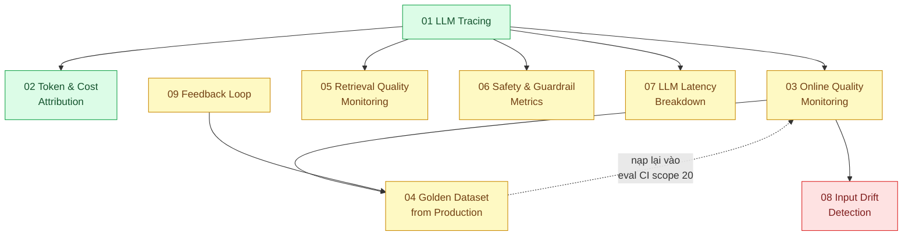

# 24 · Giám sát AI (`backend / AI monitoring`)

> **Phạm vi:** Quan sát tính năng LLM trong production: truy vết prompt/completion/tool call, quy
> chi phí theo tính năng và tenant, chất lượng online, bộ dữ liệu vàng từ production, chất lượng truy
> hồi, chỉ số an toàn, độ trễ đặc thù LLM, trôi phân phối đầu vào, vòng phản hồi người dùng. Giám
> sát hệ thống chung thuộc scope 23; eval trong CI thuộc scope 20.
>
> **Câu hỏi trung tâm:** Theo dõi chất lượng, chi phí, độ trễ và an toàn của tính năng AI trong
> production?

## Bản đồ pattern trong scope

## Danh sách bài toán

| # | Bài toán (pattern — triệu chứng) | Mức | Pattern gốc / nguồn | Trạng thái |
|---|---|---|---|---|
| 01 | [LLM Tracing (prompt / completion / tool spans) — Chatbot trả lời sai, không biết prompt, context, tool nào gây ra](./01-llm-tracing-chatbot-tra-loi-sai-khong-biet-prompt-nao/) | 🟢 | OpenTelemetry "Semantic conventions for generative AI" (`gen_ai`); Langfuse docs; Arize Phoenix docs | 📋 |
| 02 | [Token & Cost Attribution — Hóa đơn tăng 3 lần, không biết tính năng nào hay tenant nào gây ra](./02-token-cost-per-feature-tenant-hoa-don-tang-3-lan-khong-biet-vi-sao/) | 🟢 | Anthropic docs (`usage` trong response; Admin API usage & cost); OpenTelemetry gen_ai metrics | 📋 |
| 03 | [Online Quality Monitoring (sampled LLM-as-judge + user feedback) — Chất lượng tụt dần sau khi đổi model, 2 tuần sau mới biết](./03-quality-monitoring-llm-judge-sampling-chat-luong-tut-dan-khong-ai-thay/) | 🟡 | Zheng et al., LLM-as-a-judge (2023); Eugene Yan, LLM patterns (feedback); Hamel Husain, evals (2024) | 📋 |
| 04 | [Golden Dataset from Production Traces — Mỗi lần sửa prompt không có bộ test hồi quy](./04-golden-dataset-tu-production-regression-test-prompt/) | 🟡 | Hamel Husain, "Your AI Product Needs Evals" (2024); Langfuse docs "Datasets"; Anthropic docs (evals) | 📋 |
| 05 | [Retrieval Quality Monitoring (hit rate, MRR, context precision) — Tài liệu mới thêm không bao giờ được tìm thấy](./05-rag-retrieval-metrics-hit-rate-mrr-tai-lieu-moi-khong-duoc-tim-thay/) | 🟡 | Es et al., RAGAS (2023); IIR ch.8 "Evaluation in information retrieval" (MRR, precision@k) | 📋 |
| 06 | [Safety & Guardrail Metrics — Không biết có bao nhiêu lần bị thử prompt injection mỗi ngày](./06-guardrail-metrics-injection-attempts-refusal-rate/) | 🟡 | OWASP Top 10 for LLM Applications (2025); Anthropic docs (`stop_reason: refusal`, `stop_details`) | 📋 |
| 07 | [LLM Latency Breakdown (TTFT, tokens/s, end-to-end) — Chat "cảm giác chậm" nhưng p50 end-to-end bình thường](./07-latency-ttft-tokens-per-second-chat-cham-nhung-p50-binh-thuong/) | 🟡 | vLLM docs (metrics TTFT / TPOT); OpenTelemetry gen_ai metrics; Anthropic docs "Streaming" | 📋 |
| 08 | [Input Drift Detection — Sau chiến dịch marketing, 40% câu hỏi thuộc chủ đề chưa từng có trong eval](./08-drift-detection-phan-phoi-cau-hoi-doi-sau-chien-dich-marketing/) | 🔴 | Chip Huyen, *Designing Machine Learning Systems* (2022) ch.8; Rabanser et al., "Failing Loudly" (NeurIPS 2019) | 📋 |
| 09 | [Feedback Loop (thumbs → triage → eval case) — 2.000 lượt "không hữu ích" mỗi tuần không ai đọc](./09-feedback-loop-thumbs-down-thanh-eval-case/) | 🟡 | Eugene Yan, LLM patterns (Collect user feedback); Hamel Husain (error analysis); Langfuse docs "Scores" | 📋 |

## Lộ trình đề xuất trong scope

1. **Tracing → Cost attribution** — hai bài nền; không có trace thì mọi bài sau không có dữ liệu.
2. **Latency breakdown** — đo TTFT riêng vì cảm nhận người dùng phụ thuộc vào nó.
3. **Online quality → Feedback loop → Golden dataset** — vòng khép kín: production → eval → CI.
4. **Retrieval metrics, Safety metrics** — chuyên biệt cho RAG và agent.
5. **Drift detection** — nâng cao; cần lịch sử đủ dài.

## Kiến thức nền cần có trước

- Scope 23 bài 01–04 (metrics, logging, tracing, percentiles).
- Scope 20 bài 06 (eval pipeline) — golden dataset nạp vào đó.
- Cấu trúc `usage` trong phản hồi API (đọc docs chính thức).

## Liên kết với scope khác

- `23-backend-monitoring-benchmark` — nền tảng observability.
- `20-backend-ai-framework-system-design` bài 06 — eval CI nhận dữ liệu từ bài 04 ở đây.
- `22-backend-ai-optimizer` — mọi tối ưu cần số đo từ bài 02 và 07.
- `10-backend-ai-rag` bài 06 — RAG evaluation offline; bài 05 ở đây là bản online.

## Nguồn tổng quan cho scope

- OpenTelemetry, "Semantic conventions for generative AI systems" — https://opentelemetry.io/docs/specs/semconv/gen-ai/
- Hamel Husain, "Your AI Product Needs Evals" (2024) — https://hamel.dev/blog/posts/evals/
- Eugene Yan, "Patterns for Building LLM-based Systems & Products" (2023).
