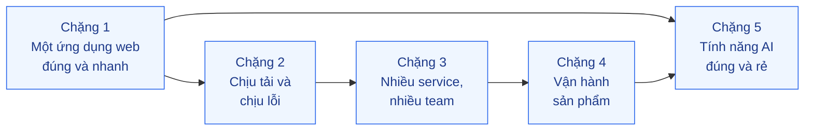

# Lộ trình học xuyên scope

Lộ trình gợi ý cho người muốn đi từ nền tới nâng cao mà không phải đọc 24 scope theo số thứ tự.
Mỗi chặng là một câu hỏi kinh doanh; các bài trong chặng trả lời câu hỏi đó từ nhiều lớp.
Trong mỗi scope, thứ tự bài đã sắp từ 🟢 tới 🔴.

## Chặng 1 — Một ứng dụng web đúng và nhanh (1 monolith, 1 DB)

Câu hỏi: *"Trang chậm, dữ liệu sai lệch, deploy là lỗi — sửa từ đâu?"*

1. `02-backend-database` — N+1 & index → Optimistic lock → Connection pool → Audit log
2. `08-backend-monolith` — Layered architecture → Background jobs
3. `03-backend-cache` — Cache-Aside → TTL & invalidation
4. `04-frontend-cache` — HTTP caching → Cache busting → Stale-while-revalidate
5. `01-frontend-backend-transporter` — Contract-first → Cursor pagination → Idempotency key
6. `19-backend-frontend-authenticate` — Password hashing → Session vs JWT
7. `17-backend-docker` — Multi-stage build → Layer cache → Compose dev/prod parity
8. `23-backend-monitoring-benchmark` — Four golden signals → Structured logging → Percentiles

## Chặng 2 — Chịu tải và chịu lỗi

Câu hỏi: *"Flash sale / mùa Tết: hệ thống sống sót thế nào?"*

1. `18-backend-scale` — Stateless → Scale up vs out → Load balancing → Queue-based load leveling
2. `03-backend-cache` — Cache stampede → Write-through/behind → Hot key
3. `14-backend-queueing` — Work queue → Chọn broker → Outbox → Idempotent consumer → DLQ
4. `02-backend-database` — Read replica → Expand/Contract → Partitioning
5. `16-backend-k8s` — Probes & rolling update → Graceful shutdown → Requests/limits & HPA
6. `15-backend-storage` — Object storage → Presigned URL → Multipart upload
7. `05-backend-search` — Full-text vs LIKE → Vietnamese analyzer → Autocomplete → Facets

## Chặng 3 — Nhiều service, nhiều team

Câu hỏi: *"Tách hệ thống và tách team mà quy trình nghiệp vụ vẫn đúng?"*

1. `08-backend-monolith` — Modular monolith → Hexagonal → Feature toggle → Strangler fig
2. `09-backend-monorepo` — Workspaces → Affected graph → Module boundaries → Trunk-based
3. `07-backend-microservices` — Bounded context → DB per service → Circuit breaker → Retry/backoff → Saga
4. `13-backend-transporter` — REST vs gRPC → Schema evolution → Rate limiting → Webhooks → Async request-reply
5. `06-frontend-backend-realtime` — SSE/WebSocket → Pub/Sub fan-out → Reconnect & resume → Presence
6. `19-backend-frontend-authenticate` — OAuth2 + PKCE → Refresh rotation → BFF token handler → RBAC/ABAC/ReBAC → SSO
7. `14-backend-queueing` — Ordering → Delayed messages → Claim check → Consumer autoscaling

## Chặng 4 — Vận hành sản phẩm

Câu hỏi: *"Biết hệ thống ổn bằng số, release không sợ, chi phí kiểm soát?"*

1. `23-backend-monitoring-benchmark` — Tracing → SLO/error budget → Alerting → Load testing → Profiling
2. `16-backend-k8s` — Secrets → Ingress/TLS → Canary/Blue-green → PDB → GitOps → KEDA
3. `17-backend-docker` — PID 1 & signals → Non-root/distroless → Tagging/SBOM
4. `15-backend-storage` — Signed CDN URL → Lifecycle tiers → Backup & PITR → Upload hardening
5. `18-backend-scale` — Load shedding → Sharding → Capacity planning → Autoscaling policies

## Chặng 5 — Tính năng AI đúng và rẻ

Câu hỏi: *"Đưa LLM vào sản phẩm: trả lời đúng, không bị lừa, không phá ngân sách?"*

1. `20-backend-ai-framework-system-design` — Model gateway → Prompt as code → Structured output → Workflow patterns → Resilience → Eval in CI
2. `10-backend-ai-rag` — Naive RAG → Chunking → Hybrid search → Reranking → RAG evaluation → Access control → Citations
3. `12-backend-database-vector` — pgvector vs dedicated → HNSW/IVF → Filtered search → Quantization
4. `11-backend-ai-agent` — Workflow vs agent → Tool use → Routing → Human-in-the-loop → Prompt injection → MCP
5. `22-backend-ai-optimizer` — Prompt caching → Batch → Routing/cascade → Effort tuning → Semantic cache
6. `24-backend-ai-monitoring` — LLM tracing → Cost attribution → Online quality → Golden dataset → Retrieval metrics
7. `21-backend-ai-infrastructure` — API vs self-host → LLM gateway → vLLM serving → GPU on k8s
8. Nâng cao: `20` Context engineering, Durable execution, Tool design · `11` Memory, Orchestrator-workers, Agent eval · `10` Agentic RAG · `22` Distillation, Quantization

## Cách dùng lộ trình

- Mỗi bài 🟢 cỡ một buổi; 🟡 một–hai ngày; 🔴 có thể một tuần kèm đọc nguồn.
- Không cần làm hết một chặng mới sang chặng sau; chọn bài theo vấn đề đang gặp trong công việc.
- Khi làm xong một bài, ghi "Bài học sau khi làm" — đó là phần có giá trị nhất của repo về lâu dài.
